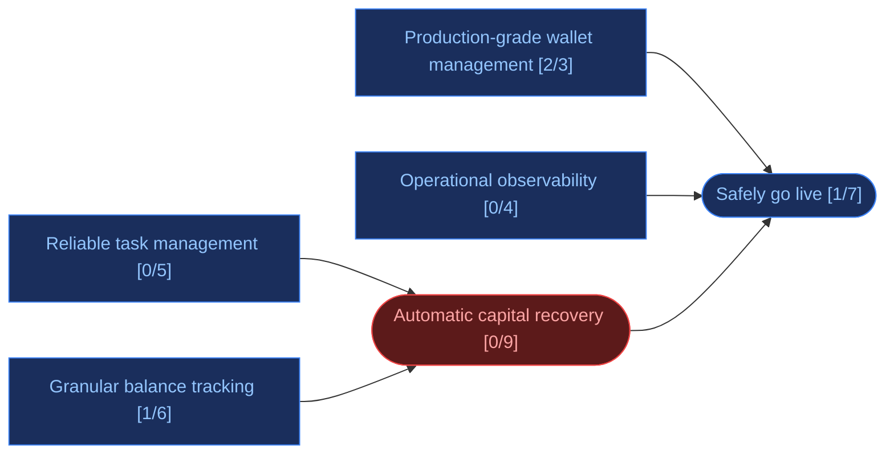
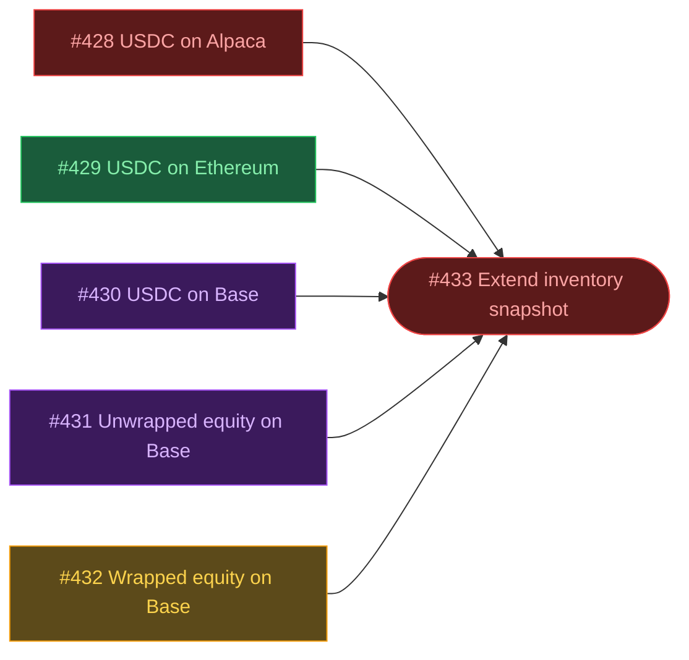
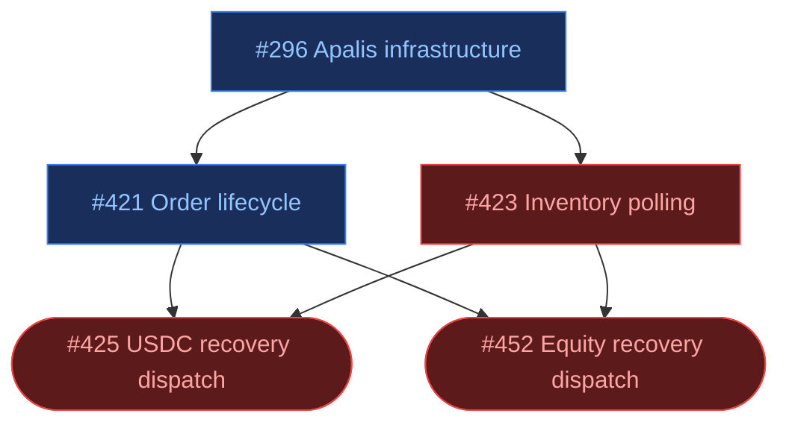
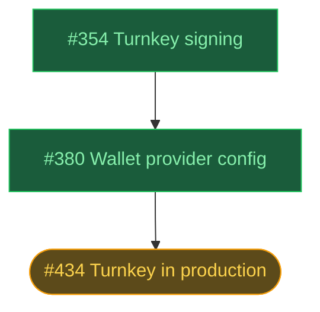
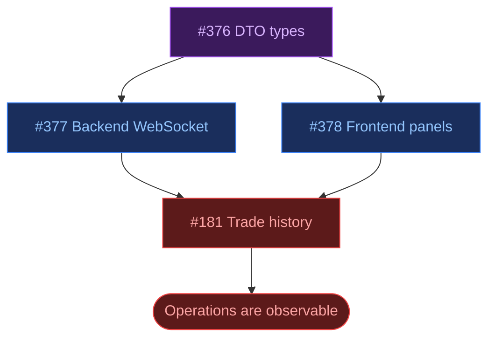
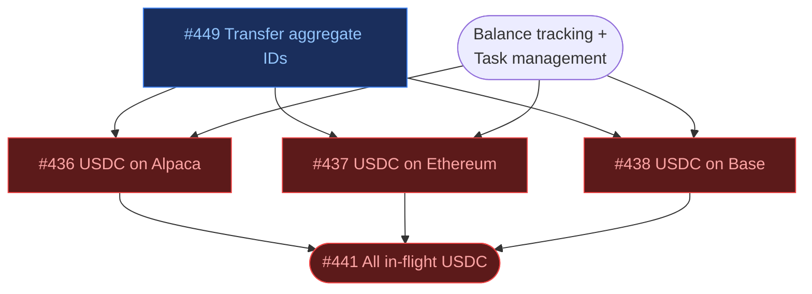
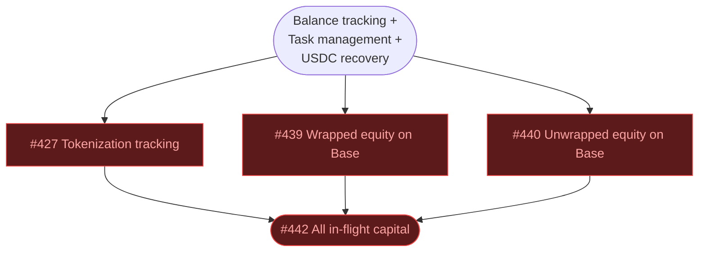
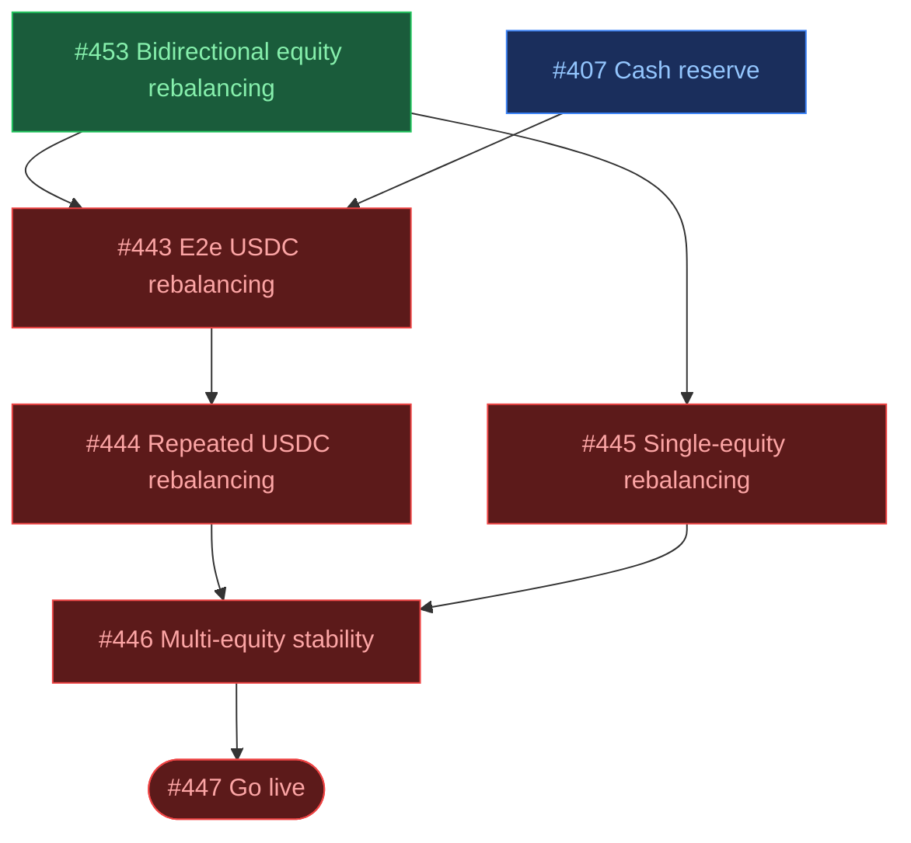

# Roadmap

This document tracks the current goal, upcoming milestones, and backlog. The current focus section has full task
breakdown with dependency graphs. Next milestones are goals we know are coming but haven't fully planned. Backlog is
grouped by system aspect.

---

## Current focus: Go to prod with auto-rebalancing

Manual rebalancing cannot keep up with liquidity demand. Auto-rebalancing is essential, but it already stalls after a
few cycles in testing - capital gets stuck mid-flight and requires manual recovery. Going live requires granular balance
tracking across venues, crash-safe task management, automatic capital recovery, operational observability, and
production-grade wallet signing. The subsections below break each area down.

### Current focus

| Priority | Issue                                 | PR     | Why                                        |
| -------- | ------------------------------------- | ------ | ------------------------------------------ |
| 1        | [#407] Untouchable cash reserve       | [#458] | Prerequisite for USDC rebalancing in prod  |
| 2        | [#449] Transfer aggregate ID tracking | [#457] | Recovery needs to resume stalled transfers |
| 3        | [#421] Order lifecycle -> apalis jobs | [#454] | Crash-safe order polling                   |

#### Ready to pick up

- [#432]: In-flight balance polling (wtSTOCKs on Base) — last unstarted balance check
- [#427]: Track tokenization requests and set in-flight balance
- [#434]: Use Turnkey for all onchain operations — unblocked now that [#380] landed

 

> 🔵 in progress | 🟣 in review | 🔴 blocked | 🟡 ready to start | 🟢 done
>
> Rectangles are issues. Rounded boxes are prerequisites from other tracks or goals that completing the issues achieves.

 

### Granular balance tracking

Add balance checks for every in-flight location, then wire them into the snapshot polling loop. [#429] is done, [#430]
and [#431] are in review, [#432] is ready to start. [#428] is blocked — `AlpacaWalletService` lacks a crypto
position/balance query and needs a new Alpaca API integration first.

- [ ] [#428 Check USDC balance in Alpaca crypto wallet](https://github.com/ST0x-Technology/st0x.liquidity/issues/428)
- [x] [#429 Ethereum USDC balance polling](https://github.com/ST0x-Technology/st0x.liquidity/issues/429)
  - PR:
    [#459 Poll Ethereum wallet USDC balance in inventory service](https://github.com/ST0x-Technology/st0x.liquidity/pull/459)
- [ ] [#430 Base USDC balance polling (outside Raindex)](https://github.com/ST0x-Technology/st0x.liquidity/issues/430)
  - PR:
    [#460 Poll Base wallet USDC balance in inventory service](https://github.com/ST0x-Technology/st0x.liquidity/pull/460)
- [ ] [#431 Base unwrapped equity token balance polling](https://github.com/ST0x-Technology/st0x.liquidity/issues/431)
  - PR: [#461 Add Base wallet equity token balance polling](https://github.com/ST0x-Technology/st0x.liquidity/pull/461)
- [ ] [#432 Base wrapped equity token balance polling](https://github.com/ST0x-Technology/st0x.liquidity/issues/432)
- [ ] [#433 Extend inventory snapshot to include in-flight balances](https://github.com/ST0x-Technology/st0x.liquidity/issues/433)

 

### Reliable task management

Migrate to apalis, convert the two essential job families (order lifecycle and inventory/rebalancing), then unify
recovery dispatch so recovery jobs use the same pipeline as standard transfers. Position checker and startup/maintenance
conversions are deferred to the monitoring and optimization epic -- they self-heal on the next poll cycle and aren't
blocking go-live.

- [ ] [#296 Set up apalis + task-supervisor infrastructure and convert event processing pipeline](https://github.com/ST0x-Technology/st0x.liquidity/issues/296)
  - PR: [#414 upgrade orchestration](https://github.com/ST0x-Technology/st0x.liquidity/pull/414)
- [ ] [#421 Convert order lifecycle to apalis jobs](https://github.com/ST0x-Technology/st0x.liquidity/issues/421)
  - PR: [#454 supervised order polling](https://github.com/ST0x-Technology/st0x.liquidity/pull/454)
- [ ] [#423 Convert inventory polling and rebalancing to apalis jobs](https://github.com/ST0x-Technology/st0x.liquidity/issues/423)
- [ ] [#425 Unify USDC recovery dispatch with standard transfer lifecycle](https://github.com/ST0x-Technology/st0x.liquidity/issues/425)
- [ ] [#452 Unify equity recovery dispatch with standard transfer lifecycle](https://github.com/ST0x-Technology/st0x.liquidity/issues/452)

 

### Production-grade wallet management

Replace Fireblocks with Turnkey and make wallet provider configurable.

- [x] [#354 Replace Fireblocks with Turnkey for onchain transaction signing](https://github.com/ST0x-Technology/st0x.liquidity/issues/354)
  - PR: [#390 add turnkey support to st0x-evm](https://github.com/ST0x-Technology/st0x.liquidity/pull/390)
- [x] [#380 Configure wallet provider selection (Turnkey vs Fireblocks) in main crate](https://github.com/ST0x-Technology/st0x.liquidity/issues/380)
  - PR: [#394 Wallet selection on hedge bot](https://github.com/ST0x-Technology/st0x.liquidity/pull/394)
- [ ] [#434 Use Turnkey for all onchain operations](https://github.com/ST0x-Technology/st0x.liquidity/issues/434)

 

### Operational observability

Build out dashboard panels until the system is observable end-to-end. Backend and frontend are parallel after DTOs.

- [ ] [#376 Review and update DTO types for inventory snapshots and transfer status](https://github.com/ST0x-Technology/st0x.liquidity/issues/376)
  - PR:
    [#382 update DTO types for inventory snapshots and transfer status](https://github.com/ST0x-Technology/st0x.liquidity/pull/382)
- [ ] [#377 Dashboard backend: serve inventory history and transfer status via WebSocket](https://github.com/ST0x-Technology/st0x.liquidity/issues/377)
  - PR: [#393 dashboard backend](https://github.com/ST0x-Technology/st0x.liquidity/pull/393)
- [ ] [#378 Dashboard frontend: inventory and transfer status panels](https://github.com/ST0x-Technology/st0x.liquidity/issues/378)
  - PR: [#392 inventory frontend](https://github.com/ST0x-Technology/st0x.liquidity/pull/392)
- [ ] [#181 Dashboard: Trade History Panel](https://github.com/ST0x-Technology/st0x.liquidity/issues/181)

 

### Automatic capital recovery

Recovery needs to know where capital is stuck (from detection) and how to resume stalled transfers (from tracking). Two
shared prerequisites feed both USDC and equity streams:

- **[#449]** stores aggregate IDs alongside inflight balances so recovery can `Store::load(id)` and resume. **In
  progress (PR [#457]).**
- **[#433]** (from detection) extends the inventory snapshot so recovery knows _where_ capital is stuck.

Each stream then has its own dispatch and per-venue recovery. [#442] converges everything.

- [ ] [#449 Track active transfer aggregate IDs in inventory view](https://github.com/ST0x-Technology/st0x.liquidity/issues/449)
  - PR: [#457 track active transfer aggregate IDs](https://github.com/ST0x-Technology/st0x.liquidity/pull/457)

#### USDC recovery

Three venues hold USDC in flight: Alpaca crypto wallet, Ethereum, and Base. Each gets a parallel recovery
implementation. [#425] (from crash-safe) provides the dispatch mechanism. [#441] gates go-live.

- [ ] [#436 Recover from detected USDC on Alpaca](https://github.com/ST0x-Technology/st0x.liquidity/issues/436)
- [ ] [#437 Recover from detected USDC on Ethereum](https://github.com/ST0x-Technology/st0x.liquidity/issues/437)
- [ ] [#438 Recover from detected USDC on Base](https://github.com/ST0x-Technology/st0x.liquidity/issues/438)
- [ ] [#441 Recover from all detected in-flight USDC](https://github.com/ST0x-Technology/st0x.liquidity/issues/441)

#### Equity recovery

Equity recovery additionally needs [#427] (tokenization tracking) and [#452] (equity dispatch from crash-safe). Two
venues: wrapped and unwrapped tokens on Base. [#442] converges USDC and equity recovery.

- [ ] [#427 Track tokenization requests and set in-flight balance accordingly](https://github.com/ST0x-Technology/st0x.liquidity/issues/427)
- [ ] [#439 Recover from detected wrapped equity tokens on Base](https://github.com/ST0x-Technology/st0x.liquidity/issues/439)
- [ ] [#440 Recover from detected unwrapped equity tokens on Base](https://github.com/ST0x-Technology/st0x.liquidity/issues/440)
- [ ] [#442 Recover from any detected in-flight capital](https://github.com/ST0x-Technology/st0x.liquidity/issues/442)

 

### Safely go live

Each step verifies a larger slice of the system works. USDC rebalancing and single-equity rebalancing can be tested in
parallel. Both must be stable before multi-equity stability testing, then go live.

- [x] [#453 Live bidirectional equity auto-rebalancing](https://github.com/ST0x-Technology/st0x.liquidity/issues/453)
- [ ] [#407 Untouchable cash reserve for rebalancing](https://github.com/ST0x-Technology/st0x.liquidity/issues/407)
  - PR: [#458 untouchable cash reserve](https://github.com/ST0x-Technology/st0x.liquidity/pull/458)
- [ ] [#443 See end-to-end USDC auto rebalancing in both directions](https://github.com/ST0x-Technology/st0x.liquidity/issues/443)
- [ ] [#444 See repeated USDC auto rebalancing](https://github.com/ST0x-Technology/st0x.liquidity/issues/444)
- [ ] [#445 See repeated single-equity auto rebalancing with counter trading](https://github.com/ST0x-Technology/st0x.liquidity/issues/445)
- [ ] [#446 Get a day of stable multi-equity auto rebalancing with counter trading](https://github.com/ST0x-Technology/st0x.liquidity/issues/446)
- [ ] [#447 Safely go live with production counter trading and auto-rebalancing](https://github.com/ST0x-Technology/st0x.liquidity/issues/447)

 

---

 

## Next milestones

### Harden production

Once auto-rebalancing is live, priority shifts to making the deployment robust and observable. The system runs on a
remote server handling real capital -- securing access, encrypting traffic, and having visibility into what's happening
are prerequisites for operating with confidence. The quant researcher also needs execution data and monitoring tools to
analyze and optimize trading parameters.

#### Infrastructure security

- [ ] [#286 No TLS configured for dashboard and WebSocket traffic](https://github.com/ST0x-Technology/st0x.liquidity/issues/286)
- [ ] [#293 Granular SSH access control: limit root access and per-user deploy keys](https://github.com/ST0x-Technology/st0x.liquidity/issues/293)
- [ ] [#294 Document secret management setup and opsec](https://github.com/ST0x-Technology/st0x.liquidity/issues/294)

#### Reliability

- [ ] [#263 Check offchain inventory before placing counter trades](https://github.com/ST0x-Technology/st0x.liquidity/issues/263)
- [ ] [#277 No automatic retry after offchain order failure](https://github.com/ST0x-Technology/st0x.liquidity/issues/277)
- [ ] [#240 Conversion slippage not tracked, causing inventory drift](https://github.com/ST0x-Technology/st0x.liquidity/issues/240)
- [ ] [#469 Verify all onchain operations await required confirmations](https://github.com/ST0x-Technology/st0x.liquidity/issues/469)
- [ ] [#16 Handle reorgs](https://github.com/ST0x-Technology/st0x.liquidity/issues/16)

#### Remaining job conversions

De-scoped from go-live because they self-heal on the next cycle. Converting to apalis improves reliability and gives
better observability into job health.

- [ ] [#422 Convert position checker to apalis job](https://github.com/ST0x-Technology/st0x.liquidity/issues/422)
- [ ] [#424 Convert startup operations and executor maintenance to apalis jobs and supervised tasks](https://github.com/ST0x-Technology/st0x.liquidity/issues/424)

#### Quant research data

Ensure the event store captures all data needed for quantitative research -- execution timing, market conditions, and
operational metrics.

- [ ] [#303 Audit external integrations: record start/end timestamps for all calls in event store](https://github.com/ST0x-Technology/st0x.liquidity/issues/303)

#### Dashboard

- [ ] [#399 Dashboard: surface transfer error details and transaction hashes](https://github.com/ST0x-Technology/st0x.liquidity/issues/399)

### Request for liquidity flow

(Future -- no issues yet)

### Improve capital efficiency

(Future -- no issues yet)

---

## Backlog

Work that doesn't fit into the current epics. These are organized by area but not yet prioritized as epic goals.

### Event-sorcery framework

- [ ] [#465 Add test utilities to event-sorcery (regression testing, schema version management)](https://github.com/ST0x-Technology/st0x.liquidity/issues/465)
- [ ] [#467 Plan event-sorcery library extraction and backend agnosticism](https://github.com/ST0x-Technology/st0x.liquidity/issues/467)
  - Move corresponding issues to new repo when extracted
  - Make library agnostic to the `cqrs-es` backend
- [ ] [#450 Persisted multi-entity Reactor in event-sorcery](https://github.com/ST0x-Technology/st0x.liquidity/issues/450)
- [ ] [#451 Event replay for in-memory Reactors on startup](https://github.com/ST0x-Technology/st0x.liquidity/issues/451)

### Trading improvements

- [ ] [#413 Add 24/5 limit order support during market close](https://github.com/ST0x-Technology/st0x.liquidity/issues/413)
- [ ] [#322 CLI should not depend on database](https://github.com/ST0x-Technology/st0x.liquidity/issues/322)

### Admin dashboard

#### Design & specification

- [ ] [#470 Explore CLI/dashboard design for improved usability and consistency](https://github.com/ST0x-Technology/st0x.liquidity/issues/470)

#### Core functionality

- [ ] [#400 Dashboard: add Raindex vault links to inventory equity rows](https://github.com/ST0x-Technology/st0x.liquidity/issues/400)
- [ ] [#401 Dashboard: distinguish enabled vs disabled assets with toggle](https://github.com/ST0x-Technology/st0x.liquidity/issues/401)
- [ ] [#405 Dashboard: per-stage transfer balance visibility](https://github.com/ST0x-Technology/st0x.liquidity/issues/405)
- [ ] [#406 Inventory updates require page refresh after rebalancing operations](https://github.com/ST0x-Technology/st0x.liquidity/issues/406)
  - PR:
    [#410 add poll_notify to trigger immediate inventory re-poll](https://github.com/ST0x-Technology/st0x.liquidity/pull/410)
- [ ] [#233 Historical data display on dashboard](https://github.com/ST0x-Technology/st0x.liquidity/issues/233)
  - PR:
    [#396 add ratio/target columns, fix live events, improve styling](https://github.com/ST0x-Technology/st0x.liquidity/pull/396)

#### Advanced features

- [ ] [#472 Integrate Effect library into dashboard for improved UX](https://github.com/ST0x-Technology/st0x.liquidity/issues/472)
- [ ] [#178 Dashboard: Performance Metrics Panel](https://github.com/ST0x-Technology/st0x.liquidity/issues/178)
- [ ] [#180 Dashboard: Spreads Panel](https://github.com/ST0x-Technology/st0x.liquidity/issues/180)
- [ ] [#183 Dashboard: Circuit Breaker](https://github.com/ST0x-Technology/st0x.liquidity/issues/183)
- [ ] [#184 Dashboard: Schwab OAuth Integration](https://github.com/ST0x-Technology/st0x.liquidity/issues/184)
- [ ] [#185 Dashboard: Grafana Embedding](https://github.com/ST0x-Technology/st0x.liquidity/issues/185)
- [ ] [#186 Dashboard: HyperDX Health Status](https://github.com/ST0x-Technology/st0x.liquidity/issues/186)

### Architecture & code quality

Improve type system, naming consistency, mock configurations, and module extraction.

#### Type system & domain modeling

- [ ] [#473 Implement type-level newtype composition (Tagged qualifiers)](https://github.com/ST0x-Technology/st0x.liquidity/issues/473)
- [ ] [#468 Create abstraction for converting between domain types and DTOs](https://github.com/ST0x-Technology/st0x.liquidity/issues/468)

#### Naming & refactoring

- [ ] [#464 Rename `*_cash` fields to `*_usdc` in InventorySnapshot and related types](https://github.com/ST0x-Technology/st0x.liquidity/issues/464)
- [ ] [#466 Fix boolean blindness in `wrapper::mock` and other mock modules](https://github.com/ST0x-Technology/st0x.liquidity/issues/466)

#### Build & dependencies

- [ ] [#471 Remove submodule dependencies and provide ABIs via nix derivations](https://github.com/ST0x-Technology/st0x.liquidity/issues/471)

#### Monolith extraction

Split monolith into focused crates for faster builds, stricter abstraction boundaries, and reduced coupling.

- [ ] [#54 Create BrokerAuthProvider trait to abstract authentication across codebase](https://github.com/ST0x-Technology/st0x.liquidity/issues/54)
- [ ] [#269 Extract st0x-tokenization crate with Tokenizer trait](https://github.com/ST0x-Technology/st0x.liquidity/issues/269)
- [ ] [#270 Extract st0x-vault crate with Vault trait](https://github.com/ST0x-Technology/st0x.liquidity/issues/270)
- [ ] [#271 Extract st0x-rebalance crate](https://github.com/ST0x-Technology/st0x.liquidity/issues/271)
- [ ] [#272 Convert st0x-hedge to library crate and create st0x-server binary](https://github.com/ST0x-Technology/st0x.liquidity/issues/272)

### Black-box e2e testing

- [ ] [#416 E2e tests expose crate internals that should not be public](https://github.com/ST0x-Technology/st0x.liquidity/issues/416)
- [ ] [#417 No chaos/fault injection testing for failure recovery](https://github.com/ST0x-Technology/st0x.liquidity/issues/417)
- [ ] [#418 No invariant monitoring under randomized workloads](https://github.com/ST0x-Technology/st0x.liquidity/issues/418)
- [ ] [#419 No adversarial environment simulation in e2e tests](https://github.com/ST0x-Technology/st0x.liquidity/issues/419)

### Completed: Alpaca / trading fixes

- [x] [#105 Run the Alpaca instance without whole share accumulation](https://github.com/ST0x-Technology/st0x.liquidity/issues/105)
  - Resolved by [#236](https://github.com/ST0x-Technology/st0x.liquidity/pull/236) (dollar-threshold counter trades)
- [x] [#258 BUG: Alpaca Broker API should be expected with rebalancing enabled, not Alpaca Trading API](https://github.com/ST0x-Technology/st0x.liquidity/issues/258)
  - PR: [#257 Fix rebalancing not triggered](https://github.com/ST0x-Technology/st0x.liquidity/pull/257)
- [x] [#282 USDC inventory not updated from Position events (Buy/Sell trades)](https://github.com/ST0x-Technology/st0x.liquidity/issues/282)
  - PR:
    [#336 Track USDC inventory updates alongside equity fills](https://github.com/ST0x-Technology/st0x.liquidity/pull/336)
- [x] [#283 USDC rebalancing trigger doesn't fire after USDC inventory changes](https://github.com/ST0x-Technology/st0x.liquidity/issues/283)
  - PR: [#348 Add USDC rebalancing trigger](https://github.com/ST0x-Technology/st0x.liquidity/pull/348)
- [x] [#284 Equity mint completion trusts Alpaca API without onchain verification](https://github.com/ST0x-Technology/st0x.liquidity/issues/284)
  - PR: [#350 Verify equity mints on-chain](https://github.com/ST0x-Technology/st0x.liquidity/pull/350)

### Completed: CI/CD Improvements

- [x] [#256 Implement CI/CD improvements from infra deployment spec](https://github.com/ST0x-Technology/st0x.liquidity/issues/256)
  - PR:
    [#259 Terraform infra provisioning and Nix-powered secret management and service deployments](https://github.com/ST0x-Technology/st0x.liquidity/pull/259)

### Completed: Production Fixes (Jan 2026)

- [x] [#251 Manual operations on trading venues not detected by inventory tracking](https://github.com/ST0x-Technology/st0x.liquidity/issues/251)
  - PR: [#253 Fix inventory tracking](https://github.com/ST0x-Technology/st0x.liquidity/pull/253)
- [x] [#234 Spec out infrastructure and deployment improvements](https://github.com/ST0x-Technology/st0x.liquidity/issues/234)
  - PR: [#237 Propose better deployment and infra setup](https://github.com/ST0x-Technology/st0x.liquidity/pull/237)
- PR: [#266 Fix cqrs inventory management](https://github.com/ST0x-Technology/st0x.liquidity/pull/266)

### Completed: Alpaca Production Go-Live

- [x] [#223 Auto-rebalancing flow missing USDC/USD conversion step](https://github.com/ST0x-Technology/st0x.liquidity/issues/223)
  - PR: [#227 usdc-usd conversion during auto-rebalancing](https://github.com/ST0x-Technology/st0x.liquidity/pull/227)
- [x] [#228 Set up Alpaca instance for real trading in production](https://github.com/ST0x-Technology/st0x.liquidity/issues/228)
  - PR: [#230 set up alpaca deployment configurations](https://github.com/ST0x-Technology/st0x.liquidity/pull/230)
- [x] [#229 Set up dashboard deployment](https://github.com/ST0x-Technology/st0x.liquidity/issues/229)
  - PR: [#230 set up alpaca deployment configurations](https://github.com/ST0x-Technology/st0x.liquidity/pull/230)
- [x] [#244 Implement dollar-value-based counter trade trigger to use alpaca fractional share trading feature](https://github.com/ST0x-Technology/st0x.liquidity/issues/244)
  - PR:
    [#236 implement dollar-threshold counter trade trigger condition](https://github.com/ST0x-Technology/st0x.liquidity/pull/236)
- [x] [#226 Refactor Alpaca services with Broker API client support](https://github.com/ST0x-Technology/st0x.liquidity/issues/226)
  - PR:
    [#225 refactor Alpaca services with Broker API client support](https://github.com/ST0x-Technology/st0x.liquidity/pull/225)

### Completed: Admin Dashboard Foundation

- [x] [#188 spec out the dashboard](https://github.com/ST0x-Technology/st0x.liquidity/issues/188)
  - PR: [#203 Admin Dashboard specification and roadmap](https://github.com/ST0x-Technology/st0x.liquidity/pull/203)
- [x] [#207 Initialize WS backend for the dashboard](https://github.com/ST0x-Technology/st0x.liquidity/issues/207)
  - PR: [#204 Add dashboard backend API](https://github.com/ST0x-Technology/st0x.liquidity/pull/204)
- [x] [#208 Initialize Svelte frontend with shadcn](https://github.com/ST0x-Technology/st0x.liquidity/issues/208)
  - PR:
    [#221 init dashboard frontend with SvelteKit and shadcn-svelte](https://github.com/ST0x-Technology/st0x.liquidity/pull/221)
- [x] [#209 Add dashboard skeleton and live event tracking](https://github.com/ST0x-Technology/st0x.liquidity/issues/209)
  - PR:
    [#206 Add dashboard skeleton and live event tracking](https://github.com/ST0x-Technology/st0x.liquidity/pull/206)

### Completed: CQRS/ES Migration with Automated Rebalancing

Migrated to event-sourced architecture through 3 phases. Automated rebalancing implemented as first major feature on new
architecture (Alpaca-only, Schwab remains manual).

#### Phase 1: Dual-Write Foundation (Shadow Mode)

- [x] [#124 Add CQRS/ES migration specification to SPEC.md](https://github.com/ST0x-Technology/st0x.liquidity/issues/124)
  - PR: [#145 Phased CQRS/ES migration specification](https://github.com/ST0x-Technology/st0x.liquidity/pull/145)
- [x] [#125 Implement event sourcing infrastructure with SchwabAuth aggregate](https://github.com/ST0x-Technology/st0x.liquidity/issues/125)
  - PR:
    [#146 Event sourcing infrastructure and SchwabAuth aggregate](https://github.com/ST0x-Technology/st0x.liquidity/pull/146)
- [x] [#126 Implement OnChainTrade aggregate](https://github.com/ST0x-Technology/st0x.liquidity/issues/126)
  - PR: [#160 onchain trade aggregate](https://github.com/ST0x-Technology/st0x.liquidity/pull/160)
- [x] [#127 Implement Position aggregate](https://github.com/ST0x-Technology/st0x.liquidity/issues/127)
  - PR: [#148 Position aggregate](https://github.com/ST0x-Technology/st0x.liquidity/pull/148)
- [x] [#128 Implement OffchainOrder aggregate](https://github.com/ST0x-Technology/st0x.liquidity/issues/128)
  - PR: [#149 OffchainOrder aggregate](https://github.com/ST0x-Technology/st0x.liquidity/pull/149)
- [x] [#129 Implement data migration binary for existing CRUD data](https://github.com/ST0x-Technology/st0x.liquidity/issues/129)
  - PR: [#150 Add existing data to the event store](https://github.com/ST0x-Technology/st0x.liquidity/pull/150)
- [x] [#130 Implement dual-write in Conductor](https://github.com/ST0x-Technology/st0x.liquidity/issues/130)
  - PR: [#158 implement dual-write for CQRS/ES aggregates](https://github.com/ST0x-Technology/st0x.liquidity/pull/158)
- [x] [#169 Lifecycle wrapper for event-sourced aggregates](https://github.com/ST0x-Technology/st0x.liquidity/issues/169)
  - PR:
    [#168 Lifecycle wrapper for event-sourced aggregates](https://github.com/ST0x-Technology/st0x.liquidity/pull/168)

#### Phase 2: Automated Rebalancing (Alpaca-Only)

- [x] [#132 Implement Alpaca crypto wallet service](https://github.com/ST0x-Technology/st0x.liquidity/issues/132)
  - PR: [#151 Implement Alpaca crypto wallet service](https://github.com/ST0x-Technology/st0x.liquidity/pull/151)
- [x] [#133 Implement Circle CCTP bridge service](https://github.com/ST0x-Technology/st0x.liquidity/issues/133)
  - PR:
    [#156 Add Circle CCTP bridge service for cross-chain USDC transfers](https://github.com/ST0x-Technology/st0x.liquidity/pull/156)
- [x] [#134 Implement Rain OrderBook vault service](https://github.com/ST0x-Technology/st0x.liquidity/issues/134)
  - PR:
    [#157 Add Rain OrderBook V5 vault service for deposits and withdrawals](https://github.com/ST0x-Technology/st0x.liquidity/pull/157)
- [x] [#135 Implement TokenizedEquityMint and EquityRedemption aggregates](https://github.com/ST0x-Technology/st0x.liquidity/issues/135)
  - PR:
    [#170 Tokenized equity mint and redemption aggregates](https://github.com/ST0x-Technology/st0x.liquidity/pull/170)
- [x] [#136 Implement UsdcRebalance aggregate](https://github.com/ST0x-Technology/st0x.liquidity/issues/136)
  - PR: [#159 UsdcRebalance aggregate](https://github.com/ST0x-Technology/st0x.liquidity/pull/159)
- [x] [#171 Implement Alpaca tokenization API client](https://github.com/ST0x-Technology/st0x.liquidity/issues/171)
  - PR: [#172 Implement Alpaca tokenization API client](https://github.com/ST0x-Technology/st0x.liquidity/pull/172)
- [x] [#137 Implement rebalancing orchestration](https://github.com/ST0x-Technology/st0x.liquidity/issues/137)
  - PR: [#173 Implement rebalancing orchestration managers](https://github.com/ST0x-Technology/st0x.liquidity/pull/173)
- [x] [#138 Implement InventoryView and imbalance detection](https://github.com/ST0x-Technology/st0x.liquidity/issues/138)
  - PR:
    [#174 Implement InventoryView and imbalance detection](https://github.com/ST0x-Technology/st0x.liquidity/pull/174)
- [x] [#139 Wire up rebalancing triggers from inventory events](https://github.com/ST0x-Technology/st0x.liquidity/issues/139)
  - PR: [#175 Wire up rebalancing triggers](https://github.com/ST0x-Technology/st0x.liquidity/pull/175)
- [x] [#120 Migrate to V5 orderbook](https://github.com/ST0x-Technology/st0x.liquidity/issues/120)
  - PR: [#154 Upgrade to V5 orderbook](https://github.com/ST0x-Technology/st0x.liquidity/pull/154)
- [x] [#224 Manual rebalancing CLI commands](https://github.com/ST0x-Technology/st0x.liquidity/issues/224)
  - PR: [#190 manual rebalancing CLI](https://github.com/ST0x-Technology/st0x.liquidity/pull/190)

### Completed: Multi-Crate Architecture Phase 1

- [x] [#199 Proposal: multi-crate architecture for faster builds and stricter boundaries](https://github.com/ST0x-Technology/st0x.liquidity/issues/199)
  - PR:
    [#200 Add multi-crate architecture section to SPEC.md](https://github.com/ST0x-Technology/st0x.liquidity/pull/200)
- [x] [#194 Multi-crate architecture: prerequisite refactors](https://github.com/ST0x-Technology/st0x.liquidity/issues/194)
  - PR:
    [#222 decouple VaultService from Evm, remove signer type parameter](https://github.com/ST0x-Technology/st0x.liquidity/pull/222)
- [x] [#268 Extract st0x-bridge crate with Bridge trait](https://github.com/ST0x-Technology/st0x.liquidity/issues/268)
  - PR: [#193 Pull out bridging logic into st0x-bridge](https://github.com/ST0x-Technology/st0x.liquidity/pull/193)

### Completed: Bug Fixes

- [x] [#261 Fix inventory tracking post-upgrade bugs](https://github.com/ST0x-Technology/st0x.liquidity/issues/261)
  - PR:
    [#262 don't rely on reverse cache lookup of token address](https://github.com/ST0x-Technology/st0x.liquidity/pull/262)
- [x] [#250 Successful fractional Alpaca orders show as errors in logs](https://github.com/ST0x-Technology/st0x.liquidity/issues/250)
  - PR:
    [#252 fix successful orders getting marked as failed](https://github.com/ST0x-Technology/st0x.liquidity/pull/252)
- [x] [#245 Counter trades use whole shares instead of fractional shares](https://github.com/ST0x-Technology/st0x.liquidity/issues/245)
  - PR: [#246 Fix fractional counter trades](https://github.com/ST0x-Technology/st0x.liquidity/pull/246)
- [x] [#243 Intermittent RPC failures with load-balanced providers](https://github.com/ST0x-Technology/st0x.liquidity/issues/243)
  - PR: [#242 improve onchain ops reliability](https://github.com/ST0x-Technology/st0x.liquidity/pull/242)
- [x] [#238 CCTP fee API returns float for minimum_fee, deserialization fails](https://github.com/ST0x-Technology/st0x.liquidity/issues/238)
  - PR: [#239 fix fee/slippage handling during rebalancing](https://github.com/ST0x-Technology/st0x.liquidity/pull/239)
- [x] [#231 Alpaca Broker API market hours check fails with response decoding error](https://github.com/ST0x-Technology/st0x.liquidity/issues/231)
  - PR: [#232 Fix market hours decoding](https://github.com/ST0x-Technology/st0x.liquidity/pull/232)
- [x] [#220 Dual-write consistency bugs in offchain order handling](https://github.com/ST0x-Technology/st0x.liquidity/issues/220)
  - PR:
    [#219 Fix dual-write consistency bugs in offchain order handling](https://github.com/ST0x-Technology/st0x.liquidity/pull/219)
- [x] [#218 contract errors lack human-readable decoding](https://github.com/ST0x-Technology/st0x.liquidity/issues/218)
  - PR:
    [#217 add error decoding, refactor cctp module, fix nonce handling](https://github.com/ST0x-Technology/st0x.liquidity/pull/217)
- [x] [#216 RPC nodes return incomplete data from get_logs](https://github.com/ST0x-Technology/st0x.liquidity/issues/216)
  - PR:
    [#215 Add fallback to tx receipt when get_logs returns incomplete data](https://github.com/ST0x-Technology/st0x.liquidity/pull/215)
- [x] [#214 Fix denormalized net position column](https://github.com/ST0x-Technology/st0x.liquidity/issues/214)
  - PR: [#213 Fix net position tracking](https://github.com/ST0x-Technology/st0x.liquidity/pull/213)
- [x] [#211 Schwab orders stuck in PENDING status](https://github.com/ST0x-Technology/st0x.liquidity/issues/211)
  - PR:
    [#210 Fix legacy table not updating from PENDING to SUBMITTED](https://github.com/ST0x-Technology/st0x.liquidity/pull/210)
- [x] [#167 tSPLG hedging as SPYM](https://github.com/ST0x-Technology/st0x.liquidity/issues/167)
  - PR: [#166 splg symbol](https://github.com/ST0x-Technology/st0x.liquidity/pull/166)
- [x] [#164 Fix take order inputs and outputs](https://github.com/ST0x-Technology/st0x.liquidity/issues/164)
  - PR: [#163 fix take order IO handling](https://github.com/ST0x-Technology/st0x.liquidity/pull/163)
- [x] [#162 Fix rain-math-float deployment bug](https://github.com/ST0x-Technology/st0x.liquidity/issues/162)
  - PR: [#161 fix deployment](https://github.com/ST0x-Technology/st0x.liquidity/pull/161)
- [x] [#119 Bot stuck in infinite retry loop due to stale PENDING execution](https://github.com/ST0x-Technology/st0x.liquidity/issues/119)
  - PR:
    [#118 Fix: Clean up stale PENDING executions to prevent infinite retry loops](https://github.com/ST0x-Technology/st0x.liquidity/pull/118)

### Completed: Multi-Broker Support

- [x] [#60 Create a complete abstraction for Broker](https://github.com/ST0x-Technology/st0x.liquidity/issues/60)
  - PR: [#72 broker trait](https://github.com/ST0x-Technology/st0x.liquidity/pull/72)
- [x] [#76 Integrate Alpaca](https://github.com/ST0x-Technology/st0x.liquidity/issues/76)
  - PR: [#83 Feat/alpaca](https://github.com/ST0x-Technology/st0x.liquidity/pull/83)
- [x] [#192 Add Alpaca Broker API executor](https://github.com/ST0x-Technology/st0x.liquidity/issues/192)
  - PR: [#191 Trading via Alpaca Broker API](https://github.com/ST0x-Technology/st0x.liquidity/pull/191)

### Completed: Performance Monitoring & Profitability Analysis

- [x] [#91 Track onchain Pyth prices](https://github.com/ST0x-Technology/st0x.liquidity/issues/91)
  - PR: [#84 Pyth prices](https://github.com/ST0x-Technology/st0x.liquidity/pull/84)
- [x] [#48 Calculate and save P&L for each Schwab trade](https://github.com/ST0x-Technology/st0x.liquidity/issues/48)
  - PR: [#90 Reporter service with P&L calculations](https://github.com/ST0x-Technology/st0x.liquidity/pull/90)
- [x] [#75 Track onchain gas fees](https://github.com/ST0x-Technology/st0x.liquidity/issues/75)
  - PR: [#82 gas fee tracking](https://github.com/ST0x-Technology/st0x.liquidity/pull/82)
- [x] [#79 track block timestamps](https://github.com/ST0x-Technology/st0x.liquidity/issues/79)
  - PR: [#80 Add block timestamp field](https://github.com/ST0x-Technology/st0x.liquidity/pull/80)
- [x] [#81 Fix block timestamp collection](https://github.com/ST0x-Technology/st0x.liquidity/issues/81)
  - PR: [#100 Fix block timestamp collection](https://github.com/ST0x-Technology/st0x.liquidity/pull/100)
- [x] [#9 Implement performance reporting process](https://github.com/ST0x-Technology/st0x.liquidity/issues/9)
  - PR: [#90 Reporter service with P&L calculations](https://github.com/ST0x-Technology/st0x.liquidity/pull/90)
- [x] [#6 Integrate HyperDX](https://github.com/ST0x-Technology/st0x.liquidity/issues/6)
  - PR: [#101 hyperdx](https://github.com/ST0x-Technology/st0x.liquidity/pull/101)
- [x] [#88 store schwab db tokens in encrypted format](https://github.com/ST0x-Technology/st0x.liquidity/issues/88)
  - PR: [#98 Fix/tokencryption](https://github.com/ST0x-Technology/st0x.liquidity/pull/98)

### Completed: Deployment & Infrastructure

- [x] [#11 Set up automated deployment](https://github.com/ST0x-Technology/st0x.liquidity/issues/11)
  - PR: [#39 CD](https://github.com/ST0x-Technology/st0x.liquidity/pull/39)
- [x] [#106 fix two instance deployment configuration](https://github.com/ST0x-Technology/st0x.liquidity/issues/106)
  - PR: [#102 fix deployment & implement a rollback script](https://github.com/ST0x-Technology/st0x.liquidity/pull/102)
- [x] [#108 fix deployment permissions](https://github.com/ST0x-Technology/st0x.liquidity/issues/108)
  - PR: [#109 simplify permissions](https://github.com/ST0x-Technology/st0x.liquidity/pull/109)
- [x] [#110 fix logging and db env vars in deployment](https://github.com/ST0x-Technology/st0x.liquidity/issues/110)
  - PR: [#111 fix logging and db env vars](https://github.com/ST0x-Technology/st0x.liquidity/pull/111)

### Completed: Code Quality & Documentation

- [x] [#50 Centralize suffix handling logic](https://github.com/ST0x-Technology/st0x.liquidity/issues/50)
- [x] [#68 Refactor visibility levels to improve dead code identification](https://github.com/ST0x-Technology/st0x.liquidity/issues/68)
- [x] [#67 Fix market hours check for weekends/holidays](https://github.com/ST0x-Technology/st0x.liquidity/issues/67)
- [x] [#65 Address the 100% CPU utilization issue](https://github.com/ST0x-Technology/st0x.liquidity/issues/65)
- [x] [#58 Add dry-run mode to the bot](https://github.com/ST0x-Technology/st0x.liquidity/issues/58)
  - PR: [#55 Dry run mode](https://github.com/ST0x-Technology/st0x.liquidity/pull/55)
- [x] [#97 Fix README and generalize AI docs](https://github.com/ST0x-Technology/st0x.liquidity/issues/97)
  - PR: [#93 AGENTS.md and update docs](https://github.com/ST0x-Technology/st0x.liquidity/pull/93)
- [x] [#104 update ai and human docs post broker crate](https://github.com/ST0x-Technology/st0x.liquidity/issues/104)
  - PR:
    [#103 broker crate docs and AGENTS.md downsize to fix Claude Code warning](https://github.com/ST0x-Technology/st0x.liquidity/pull/103)

### Completed: MVP Core Functionality

The core arbitrage bot functionality is now live and operational:

- [x] [#3 Set up trade event stream (Clear and TakeOrder events)](https://github.com/ST0x-Technology/st0x.liquidity/issues/3)
  - PR: [#1 Trade event stream](https://github.com/ST0x-Technology/st0x.liquidity/pull/1)
- [x] [#12 Set up CI checks](https://github.com/ST0x-Technology/st0x.liquidity/issues/12)
  - PR: [#13 Set up the project](https://github.com/ST0x-Technology/st0x.liquidity/pull/13)
- [x] [#14 Set up the crate with bindings and env](https://github.com/ST0x-Technology/st0x.liquidity/issues/14)
  - PR: [#13 Set up the project](https://github.com/ST0x-Technology/st0x.liquidity/pull/13)
- [x] [#4 Set up SQLite and store incoming trades](https://github.com/ST0x-Technology/st0x.liquidity/issues/4)
- [x] [#19 Take the opposite side of the trade on Schwab](https://github.com/ST0x-Technology/st0x.liquidity/issues/19)
  - PR: [#20 Take the opposite side of the trade](https://github.com/ST0x-Technology/st0x.liquidity/pull/20)
- [x] [#22 Create a CLI command for manually placing a Schwab trade](https://github.com/ST0x-Technology/st0x.liquidity/issues/22)
  - PR:
    [#25 Create a CLI command for manually placing a Schwab trade](https://github.com/ST0x-Technology/st0x.liquidity/pull/25)
- [x] [#23 Create a CLI command for manually taking the opposite end of an onchain order](https://github.com/ST0x-Technology/st0x.liquidity/issues/23)
  - PR:
    [#28 Create a CLI command for taking the opposite side of a trade](https://github.com/ST0x-Technology/st0x.liquidity/pull/28)
- [x] [#24 Stop the bot during market close and restart on market open](https://github.com/ST0x-Technology/st0x.liquidity/issues/24)
  - PR: [#53 Only run the bot during market open hours](https://github.com/ST0x-Technology/st0x.liquidity/pull/53)

### [SPEC.md](https://github.com/ST0x-Technology/st0x.liquidity/blob/master/SPEC.md)

See the specification for detailed system behavior documentation.

<!-- Reference link definitions for the "Go to prod" epic -->

[#181]: https://github.com/ST0x-Technology/st0x.liquidity/issues/181
[#296]: https://github.com/ST0x-Technology/st0x.liquidity/issues/296
[#354]: https://github.com/ST0x-Technology/st0x.liquidity/issues/354
[#376]: https://github.com/ST0x-Technology/st0x.liquidity/issues/376
[#377]: https://github.com/ST0x-Technology/st0x.liquidity/issues/377
[#378]: https://github.com/ST0x-Technology/st0x.liquidity/issues/378
[#380]: https://github.com/ST0x-Technology/st0x.liquidity/issues/380
[#407]: https://github.com/ST0x-Technology/st0x.liquidity/issues/407
[#421]: https://github.com/ST0x-Technology/st0x.liquidity/issues/421
[#422]: https://github.com/ST0x-Technology/st0x.liquidity/issues/422
[#423]: https://github.com/ST0x-Technology/st0x.liquidity/issues/423
[#424]: https://github.com/ST0x-Technology/st0x.liquidity/issues/424
[#425]: https://github.com/ST0x-Technology/st0x.liquidity/issues/425
[#427]: https://github.com/ST0x-Technology/st0x.liquidity/issues/427
[#428]: https://github.com/ST0x-Technology/st0x.liquidity/issues/428
[#429]: https://github.com/ST0x-Technology/st0x.liquidity/issues/429
[#430]: https://github.com/ST0x-Technology/st0x.liquidity/issues/430
[#431]: https://github.com/ST0x-Technology/st0x.liquidity/issues/431
[#432]: https://github.com/ST0x-Technology/st0x.liquidity/issues/432
[#433]: https://github.com/ST0x-Technology/st0x.liquidity/issues/433
[#434]: https://github.com/ST0x-Technology/st0x.liquidity/issues/434
[#435]: https://github.com/ST0x-Technology/st0x.liquidity/issues/435
[#436]: https://github.com/ST0x-Technology/st0x.liquidity/issues/436
[#437]: https://github.com/ST0x-Technology/st0x.liquidity/issues/437
[#438]: https://github.com/ST0x-Technology/st0x.liquidity/issues/438
[#439]: https://github.com/ST0x-Technology/st0x.liquidity/issues/439
[#440]: https://github.com/ST0x-Technology/st0x.liquidity/issues/440
[#441]: https://github.com/ST0x-Technology/st0x.liquidity/issues/441
[#442]: https://github.com/ST0x-Technology/st0x.liquidity/issues/442
[#443]: https://github.com/ST0x-Technology/st0x.liquidity/issues/443
[#444]: https://github.com/ST0x-Technology/st0x.liquidity/issues/444
[#445]: https://github.com/ST0x-Technology/st0x.liquidity/issues/445
[#446]: https://github.com/ST0x-Technology/st0x.liquidity/issues/446
[#447]: https://github.com/ST0x-Technology/st0x.liquidity/issues/447
[#449]: https://github.com/ST0x-Technology/st0x.liquidity/issues/449
[#452]: https://github.com/ST0x-Technology/st0x.liquidity/issues/452
[#454]: https://github.com/ST0x-Technology/st0x.liquidity/pull/454
[#457]: https://github.com/ST0x-Technology/st0x.liquidity/pull/457
[#458]: https://github.com/ST0x-Technology/st0x.liquidity/pull/458
