# Roadmap

Each `##` section is an epic -- a goal-oriented group of related issues. Epics
are ordered by priority (highest first).

## Stable auto-rebalancing

Goal: auto-rebalancing runs reliably and we can see that it does -- observe
every transfer stage from the dashboard, detect and recover from stuck
transfers, fix the bugs that prevent triggers from firing.

### Observability

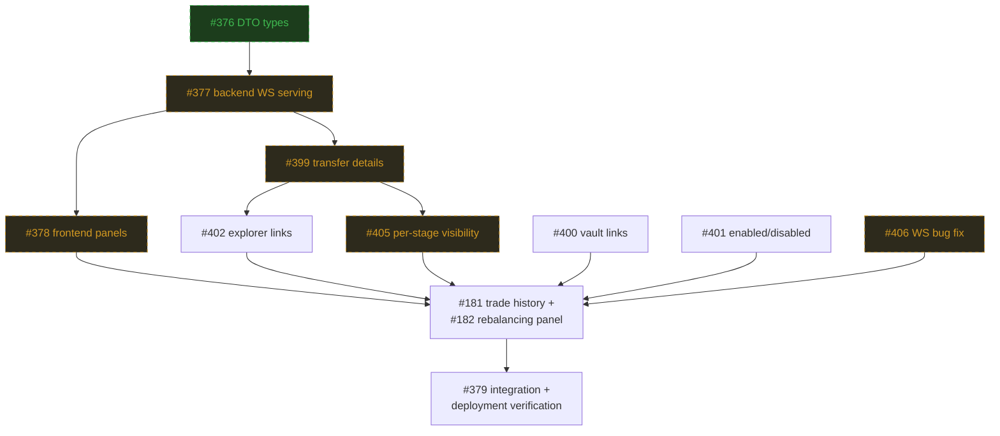

- [ ] [#406 Inventory updates require page refresh after rebalancing operations](https://github.com/ST0x-Technology/st0x.liquidity/issues/406)
  - PR:
    [#410 add poll_notify to trigger immediate inventory re-poll after terminal rebalancing events](https://github.com/ST0x-Technology/st0x.liquidity/pull/410)
- [ ] [#377 Dashboard backend: serve inventory history and transfer status via WebSocket](https://github.com/ST0x-Technology/st0x.liquidity/issues/377)
  - PR:
    [#396 add ratio/target columns, fix live events, improve styling](https://github.com/ST0x-Technology/st0x.liquidity/pull/396)
- [ ] [#378 Dashboard frontend: inventory and transfer status panels](https://github.com/ST0x-Technology/st0x.liquidity/issues/378)
  - PR:
    [#396 add ratio/target columns, fix live events, improve styling](https://github.com/ST0x-Technology/st0x.liquidity/pull/396)
- [ ] [#399 Dashboard: surface transfer error details and transaction hashes](https://github.com/ST0x-Technology/st0x.liquidity/issues/399)
  - PR:
    [#411 surface transfer error details and tx hashes](https://github.com/ST0x-Technology/st0x.liquidity/pull/411)
- [ ] [#402 Dashboard: add block explorer links for bot address and transfers](https://github.com/ST0x-Technology/st0x.liquidity/issues/402)
- [ ] [#400 Dashboard: add Raindex vault links to inventory equity rows](https://github.com/ST0x-Technology/st0x.liquidity/issues/400)
- [ ] [#401 Dashboard: distinguish enabled vs disabled assets with toggle](https://github.com/ST0x-Technology/st0x.liquidity/issues/401)
- [ ] [#405 Dashboard: per-stage transfer balance visibility](https://github.com/ST0x-Technology/st0x.liquidity/issues/405)
  - PR:
    [#412 add per-stage transfer balance visibility](https://github.com/ST0x-Technology/st0x.liquidity/pull/412)
- [ ] [#181 Dashboard: Trade History Panel](https://github.com/ST0x-Technology/st0x.liquidity/issues/181)
- [ ] [#182 Dashboard: Rebalancing Panel](https://github.com/ST0x-Technology/st0x.liquidity/issues/182)
- [ ] [#379 Dashboard integration: verify nix build, deployment, and end-to-end data flow](https://github.com/ST0x-Technology/st0x.liquidity/issues/379)
- [x] [#376 Review and update DTO types for inventory snapshots and transfer status](https://github.com/ST0x-Technology/st0x.liquidity/issues/376)
  - PR:
    [#382 update DTO types for inventory snapshots and transfer status](https://github.com/ST0x-Technology/st0x.liquidity/pull/382)
- [x] [#233 Make the dashboard display historical data](https://github.com/ST0x-Technology/st0x.liquidity/issues/233)
  - PR:
    [#396 add ratio/target columns, fix live events, improve styling](https://github.com/ST0x-Technology/st0x.liquidity/pull/396)

### Reliability

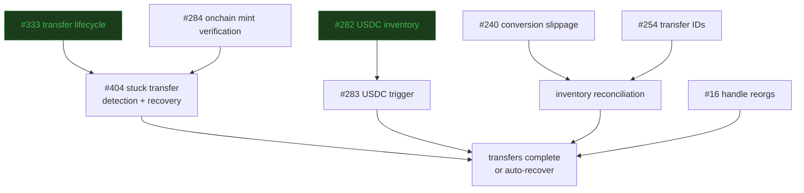

- [ ] [#404 Stuck transfer blocks rebalancing with no timeout or recovery](https://github.com/ST0x-Technology/st0x.liquidity/issues/404)
- [ ] [#283 USDC rebalancing trigger doesn't fire after USDC inventory changes](https://github.com/ST0x-Technology/st0x.liquidity/issues/283)
- [ ] [#284 Equity mint completion trusts Alpaca API without onchain verification](https://github.com/ST0x-Technology/st0x.liquidity/issues/284)
- [ ] [#240 Conversion slippage not tracked, causing inventory drift](https://github.com/ST0x-Technology/st0x.liquidity/issues/240)
- [ ] [#254 Track transfers with unique IDs for accurate inventory reconciliation](https://github.com/ST0x-Technology/st0x.liquidity/issues/254)
- [ ] [#16 Handle reorgs](https://github.com/ST0x-Technology/st0x.liquidity/issues/16)
- [x] [#333 Alpaca transfer shows Processing then disappears from pending list](https://github.com/ST0x-Technology/st0x.liquidity/issues/333)
- [x] [#282 USDC inventory not updated from Position events (Buy/Sell trades)](https://github.com/ST0x-Technology/st0x.liquidity/issues/282)

## Operational configuration

Goal: tune all operational parameters without redeployment -- per-asset toggles,
operational limits, cash reserves, and hot config reloading.

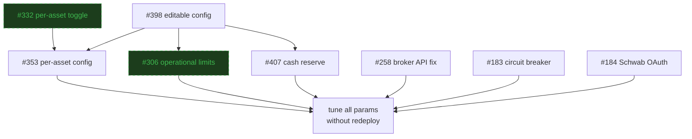

- [ ] [#398 Editable service config without redeploy](https://github.com/ST0x-Technology/st0x.liquidity/issues/398)
  - PR:
    [#397 copy config to /mnt/data for editing without redeploy](https://github.com/ST0x-Technology/st0x.liquidity/pull/397)
- [ ] [#353 Per-asset operations config: independent trading/rebalancing toggles, vault IDs, operational limits](https://github.com/ST0x-Technology/st0x.liquidity/issues/353)
  - PR:
    [#355 per-asset operations config: independent trading/rebalancing toggles](https://github.com/ST0x-Technology/st0x.liquidity/pull/355)
- [ ] [#407 Untouchable cash reserve for rebalancing](https://github.com/ST0x-Technology/st0x.liquidity/issues/407)
- [ ] [#258 BUG: Alpaca Broker API should be expected with rebalancing enabled, not Alpaca Trading API](https://github.com/ST0x-Technology/st0x.liquidity/issues/258)
- [ ] [#183 Dashboard: Circuit Breaker](https://github.com/ST0x-Technology/st0x.liquidity/issues/183)
- [ ] [#184 Dashboard: Schwab OAuth Integration](https://github.com/ST0x-Technology/st0x.liquidity/issues/184)
- [x] [#306 Configurable operational limits for safe deployment rollout](https://github.com/ST0x-Technology/st0x.liquidity/issues/306)
  - PR:
    [#307 feat: configurable operational limits](https://github.com/ST0x-Technology/st0x.liquidity/pull/307)
- [x] [#332 No way to enable/disable individual asset markets](https://github.com/ST0x-Technology/st0x.liquidity/issues/332)
  - PR:
    [#335 add per-asset market enable/disable toggle](https://github.com/ST0x-Technology/st0x.liquidity/pull/335)

## Wallet hardening

Goal: reliable, secure onchain signing with provider flexibility -- eliminate
Fireblocks latency issues and make wallet provider a config choice.

- [ ] [#354 Replace Fireblocks with Turnkey for onchain transaction signing](https://github.com/ST0x-Technology/st0x.liquidity/issues/354)
- [ ] [#380 Configure wallet provider selection (Turnkey vs Fireblocks) in main crate](https://github.com/ST0x-Technology/st0x.liquidity/issues/380)
- [x] [#297 Harden wallet management with Fireblocks contract calls](https://github.com/ST0x-Technology/st0x.liquidity/issues/297)
  - PR:
    [#300 add fireblocks integration](https://github.com/ST0x-Technology/st0x.liquidity/pull/300)
- [x] [#323 Fireblocks integration uses OneTimeAddress instead of whitelisted contract wallets](https://github.com/ST0x-Technology/st0x.liquidity/issues/323)
  - PR:
    [#324 resolve fireblocks contract wallet via API per call](https://github.com/ST0x-Technology/st0x.liquidity/pull/324)
- [x] [#325 upgrade Rain Orderbook bindings from V5 to V6](https://github.com/ST0x-Technology/st0x.liquidity/issues/325)
  - PR:
    [#326 upgrade Rain Orderbook bindings from V5 to V6](https://github.com/ST0x-Technology/st0x.liquidity/pull/326)

## Reliable counter trading

Goal: safe, reliable counter trading at all market hours -- verify inventory
before placing orders, handle failures with retries, support limit orders for
extended hours with lifecycle management.

- [ ] [#263 Check offchain inventory before placing counter trades](https://github.com/ST0x-Technology/st0x.liquidity/issues/263)
- [ ] [#277 No automatic retry after offchain order failure](https://github.com/ST0x-Technology/st0x.liquidity/issues/277)
- [ ] [#413 24/5 limit order support for counter trading outside market hours](https://github.com/ST0x-Technology/st0x.liquidity/issues/413)

## Performance analytics

Goal: real-time profitability dashboard without impacting trading -- a read-only
analytics service consuming the event store, serving rolling metrics to the
dashboard.

Metrics: AUM, P&L (absolute + %), volume, trade count, Sharpe ratio, Sortino
ratio, max drawdown, hedge lag, uptime. Calculated over 1h, 1d, 1w, 1m, and
all-time windows.

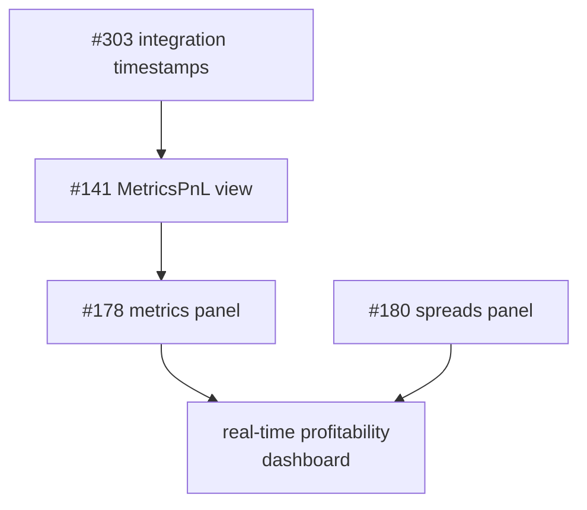

- [ ] [#303 Audit external integrations: record start/end timestamps for all calls in event store](https://github.com/ST0x-Technology/st0x.liquidity/issues/303)
- [ ] [#141 Implement MetricsPnL view](https://github.com/ST0x-Technology/st0x.liquidity/issues/141)
- [ ] [#178 Dashboard: Performance Metrics Panel](https://github.com/ST0x-Technology/st0x.liquidity/issues/178)
- [ ] [#180 Dashboard: Spreads Panel](https://github.com/ST0x-Technology/st0x.liquidity/issues/180)

## Direct taker bot (TBD)

Goal: take profitable orders placed by other users on Raindex, capturing
arbitrage between onchain limit order prices and brokerage prices. Uses
just-in-time minting via the existing tokenization infrastructure.

Spec under review:
[PR #357](https://github.com/ST0x-Technology/st0x.liquidity/pull/357).

## Testing infrastructure

Goal: confidence that the system works correctly under all conditions --
reconciliation testing for financial invariants, deterministic replay of
production event streams, failure injection, and end-to-end black-box tests.

Approaches: reconciliation testing (validate system-wide financial invariants
continuously), deterministic event replay (capture production streams, replay
against the binary, verify invariants), stateful protocol fuzzing (fuzz order
lifecycle sequences), failure injection (kill dependencies, inject latency,
simulate RPC failures), and restart-consistency testing (crash mid-event, verify
state recovery).

- [ ] [#264 Set up end-to-end testing infrastructure](https://github.com/ST0x-Technology/st0x.liquidity/issues/264)
- [x] [#285 Integration test plan](https://github.com/ST0x-Technology/st0x.liquidity/issues/285)
- [x] [#292 Work Plan: E2E Test Infrastructure while liquidity bot stabilizes](https://github.com/ST0x-Technology/st0x.liquidity/issues/292)

## Architecture & code quality

Goal: faster builds, stricter domain boundaries, cleaner abstractions -- replace
the hand-rolled conductor with apalis, migrate from Rocket to Axum to unify the
Tower ecosystem, and split the monolith into focused crates.

### Conductor + framework modernization

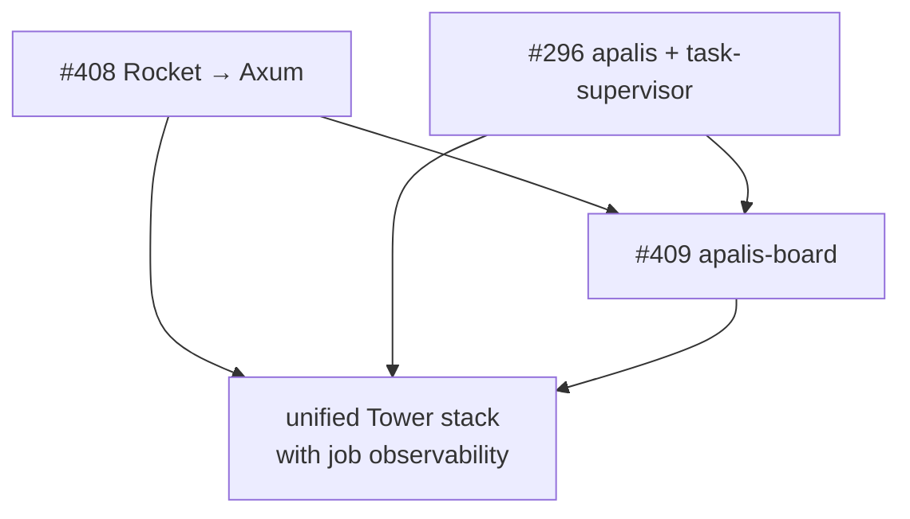

- [ ] [#408 Migrate from Rocket to Axum](https://github.com/ST0x-Technology/st0x.liquidity/issues/408)
- [ ] [#296 Replace hand-rolled conductor with apalis + task-supervisor](https://github.com/ST0x-Technology/st0x.liquidity/issues/296)
- [ ] [#409 Deploy apalis-board for job queue observability](https://github.com/ST0x-Technology/st0x.liquidity/issues/409)

### Crate extraction

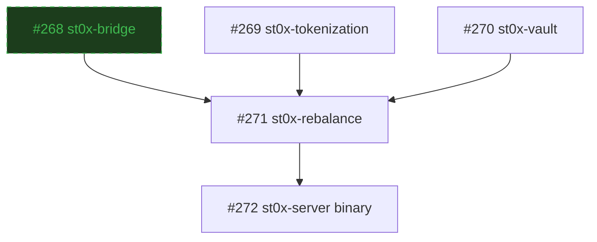

- [x] [#268 Extract st0x-bridge crate with Bridge trait](https://github.com/ST0x-Technology/st0x.liquidity/issues/268)
- [ ] [#269 Extract st0x-tokenization crate with Tokenizer trait](https://github.com/ST0x-Technology/st0x.liquidity/issues/269)
- [ ] [#270 Extract st0x-vault crate with Vault trait](https://github.com/ST0x-Technology/st0x.liquidity/issues/270)
- [ ] [#271 Extract st0x-rebalance crate](https://github.com/ST0x-Technology/st0x.liquidity/issues/271)
- [ ] [#272 Convert st0x-hedge to library crate and create st0x-server binary](https://github.com/ST0x-Technology/st0x.liquidity/issues/272)

### Other

- [ ] [#54 Create BrokerAuthProvider trait to abstract authentication across codebase](https://github.com/ST0x-Technology/st0x.liquidity/issues/54)
- [ ] [#310 StoreBuilder allows omitting projections that entities declare as required](https://github.com/ST0x-Technology/st0x.liquidity/issues/310)
- [ ] [#322 CLI should not depend on database](https://github.com/ST0x-Technology/st0x.liquidity/issues/322)
- [ ] [#73 Stop storing onchain events unrelated to the arbitrageur](https://github.com/ST0x-Technology/st0x.liquidity/issues/73)

## Infrastructure & security

Goal: production-grade deployment, security, and data integrity.

- [ ] [#286 No TLS configured for dashboard and WebSocket traffic](https://github.com/ST0x-Technology/st0x.liquidity/issues/286)
- [ ] [#293 Granular SSH access control: limit root access and per-user deploy keys](https://github.com/ST0x-Technology/st0x.liquidity/issues/293)
- [ ] [#294 Document secret management setup and opsec](https://github.com/ST0x-Technology/st0x.liquidity/issues/294)
- [ ] [#35 Document the bot](https://github.com/ST0x-Technology/st0x.liquidity/issues/35)
- [ ] [#33 Ensure all components have retries/restarts](https://github.com/ST0x-Technology/st0x.liquidity/issues/33)

 

---

 

## Completed: CI/CD Improvements

- [x] [#256 Implement CI/CD improvements from infra deployment spec](https://github.com/ST0x-Technology/st0x.liquidity/issues/256)
  - PR:
    [#259 Terraform infra provisioning and Nix-powered secret management and service deployments](https://github.com/ST0x-Technology/st0x.liquidity/pull/259)

## Completed: Production Fixes (Jan 2026)

- [x] [#251 Manual operations on trading venues not detected by inventory tracking](https://github.com/ST0x-Technology/st0x.liquidity/issues/251)
  - PR:
    [#253 Fix inventory tracking](https://github.com/ST0x-Technology/st0x.liquidity/pull/253)
- [x] [#234 Spec out infrastructure and deployment improvements](https://github.com/ST0x-Technology/st0x.liquidity/issues/234)
  - PR:
    [#237 Propose better deployment and infra setup](https://github.com/ST0x-Technology/st0x.liquidity/pull/237)
- PR:
  [#266 Fix cqrs inventory management](https://github.com/ST0x-Technology/st0x.liquidity/pull/266)

## Completed: Alpaca Production Go-Live

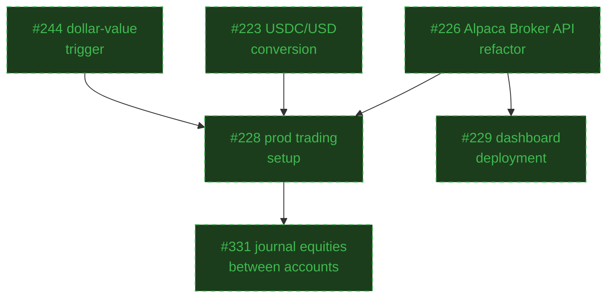

- [x] [#223 Auto-rebalancing flow missing USDC/USD conversion step](https://github.com/ST0x-Technology/st0x.liquidity/issues/223)
  - PR:
    [#227 usdc-usd conversion during auto-rebalancing](https://github.com/ST0x-Technology/st0x.liquidity/pull/227)
- [x] [#228 Set up Alpaca instance for real trading in production](https://github.com/ST0x-Technology/st0x.liquidity/issues/228)
  - PR:
    [#230 set up alpaca deployment configurations](https://github.com/ST0x-Technology/st0x.liquidity/pull/230)
- [x] [#229 Set up dashboard deployment](https://github.com/ST0x-Technology/st0x.liquidity/issues/229)
  - PR:
    [#230 set up alpaca deployment configurations](https://github.com/ST0x-Technology/st0x.liquidity/pull/230)
- [x] [#244 Implement dollar-value-based counter trade trigger to use alpaca fractional share trading feature](https://github.com/ST0x-Technology/st0x.liquidity/issues/244)
  - PR:
    [#236 implement dollar-threshold counter trade trigger condition](https://github.com/ST0x-Technology/st0x.liquidity/pull/236)
- [x] [#226 Refactor Alpaca services with Broker API client support](https://github.com/ST0x-Technology/st0x.liquidity/issues/226)
  - PR:
    [#225 refactor Alpaca services with Broker API client support](https://github.com/ST0x-Technology/st0x.liquidity/pull/225)
- [x] [#331 Add CLI command to journal equities between Alpaca accounts](https://github.com/ST0x-Technology/st0x.liquidity/issues/331)
  - PR:
    [#334 add CLI command to journal equities between Alpaca accounts](https://github.com/ST0x-Technology/st0x.liquidity/pull/334)

## Completed: Admin Dashboard Foundation

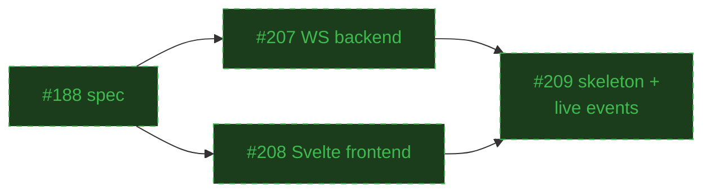

- [x] [#188 spec out the dashboard](https://github.com/ST0x-Technology/st0x.liquidity/issues/188)
  - PR:
    [#203 Admin Dashboard specification and roadmap](https://github.com/ST0x-Technology/st0x.liquidity/pull/203)
- [x] [#207 Initialize WS backend for the dashboard](https://github.com/ST0x-Technology/st0x.liquidity/issues/207)
  - PR:
    [#204 Add dashboard backend API](https://github.com/ST0x-Technology/st0x.liquidity/pull/204)
- [x] [#208 Initialize Svelte frontend with shadcn](https://github.com/ST0x-Technology/st0x.liquidity/issues/208)
  - PR:
    [#221 init dashboard frontend with SvelteKit and shadcn-svelte](https://github.com/ST0x-Technology/st0x.liquidity/pull/221)
- [x] [#209 Add dashboard skeleton and live event tracking](https://github.com/ST0x-Technology/st0x.liquidity/issues/209)
  - PR:
    [#206 Add dashboard skeleton and live event tracking](https://github.com/ST0x-Technology/st0x.liquidity/pull/206)

## Completed: Wrapped Token Handling

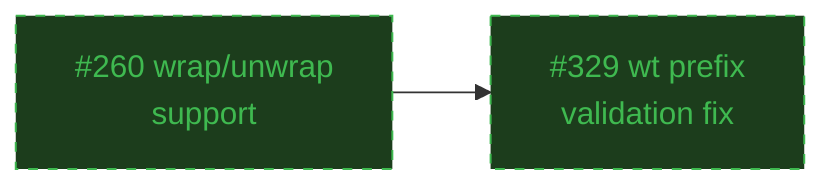

- [x] [#260 Add support for wrapping and unwrapping of the 1-to-1 share equivalent tokens into/from split/dividend compatibility vault](https://github.com/ST0x-Technology/st0x.liquidity/issues/260)
  - PR:
    [#241 Wrapped Token Handling](https://github.com/ST0x-Technology/st0x.liquidity/pull/241)
- [x] [#329 Trade validation rejects wrapped tokenized equity symbols (wt prefix)](https://github.com/ST0x-Technology/st0x.liquidity/issues/329)
  - PR:
    [#330 fix trade validation for wrapped tokenized equity symbols](https://github.com/ST0x-Technology/st0x.liquidity/pull/330)

## Completed: CQRS/ES Migration with Automated Rebalancing

Migrated to event-sourced architecture through 3 phases. Automated rebalancing
implemented as first major feature on new architecture (Alpaca-only, Schwab
remains manual).

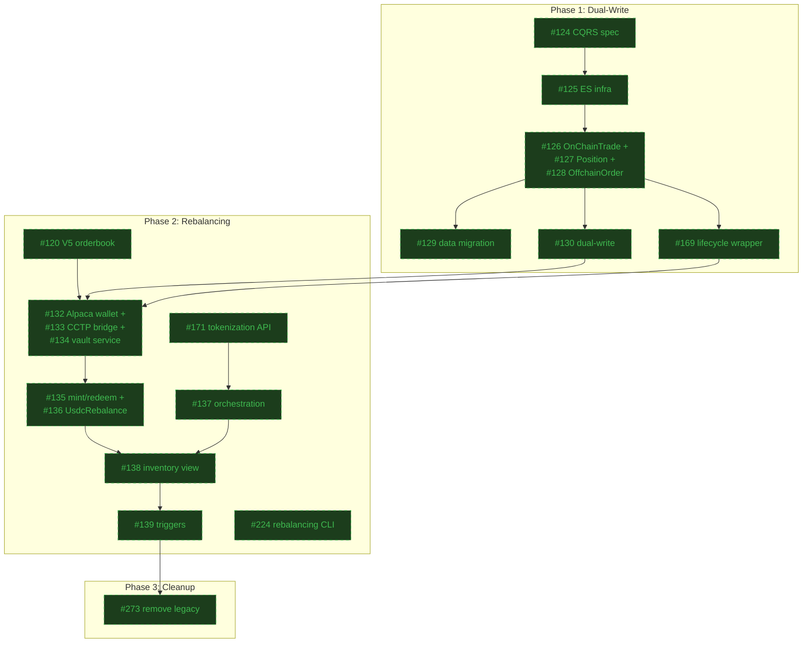

#### Phase 1: Dual-Write Foundation (Shadow Mode)

- [x] [#124 Add CQRS/ES migration specification to SPEC.md](https://github.com/ST0x-Technology/st0x.liquidity/issues/124)
  - PR:
    [#145 Phased CQRS/ES migration specification](https://github.com/ST0x-Technology/st0x.liquidity/pull/145)
- [x] [#125 Implement event sourcing infrastructure with SchwabAuth aggregate](https://github.com/ST0x-Technology/st0x.liquidity/issues/125)
  - PR:
    [#146 Event sourcing infrastructure and SchwabAuth aggregate](https://github.com/ST0x-Technology/st0x.liquidity/pull/146)
- [x] [#126 Implement OnChainTrade aggregate](https://github.com/ST0x-Technology/st0x.liquidity/issues/126)
  - PR:
    [#160 onchain trade aggregate](https://github.com/ST0x-Technology/st0x.liquidity/pull/160)
- [x] [#127 Implement Position aggregate](https://github.com/ST0x-Technology/st0x.liquidity/issues/127)
  - PR:
    [#148 Position aggregate](https://github.com/ST0x-Technology/st0x.liquidity/pull/148)
- [x] [#128 Implement OffchainOrder aggregate](https://github.com/ST0x-Technology/st0x.liquidity/issues/128)
  - PR:
    [#149 OffchainOrder aggregate](https://github.com/ST0x-Technology/st0x.liquidity/pull/149)
- [x] [#129 Implement data migration binary for existing CRUD data](https://github.com/ST0x-Technology/st0x.liquidity/issues/129)
  - PR:
    [#150 Add existing data to the event store](https://github.com/ST0x-Technology/st0x.liquidity/pull/150)
- [x] [#130 Implement dual-write in Conductor](https://github.com/ST0x-Technology/st0x.liquidity/issues/130)
  - PR:
    [#158 implement dual-write for CQRS/ES aggregates](https://github.com/ST0x-Technology/st0x.liquidity/pull/158)
- [x] [#169 Lifecycle wrapper for event-sourced aggregates](https://github.com/ST0x-Technology/st0x.liquidity/issues/169)
  - PR:
    [#168 Lifecycle wrapper for event-sourced aggregates](https://github.com/ST0x-Technology/st0x.liquidity/pull/168)

#### Phase 2: Automated Rebalancing (Alpaca-Only)

- [x] [#132 Implement Alpaca crypto wallet service](https://github.com/ST0x-Technology/st0x.liquidity/issues/132)
  - PR:
    [#151 Implement Alpaca crypto wallet service](https://github.com/ST0x-Technology/st0x.liquidity/pull/151)
- [x] [#133 Implement Circle CCTP bridge service](https://github.com/ST0x-Technology/st0x.liquidity/issues/133)
  - PR:
    [#156 Add Circle CCTP bridge service for cross-chain USDC transfers](https://github.com/ST0x-Technology/st0x.liquidity/pull/156)
- [x] [#134 Implement Rain OrderBook vault service](https://github.com/ST0x-Technology/st0x.liquidity/issues/134)
  - PR:
    [#157 Add Rain OrderBook V5 vault service for deposits and withdrawals](https://github.com/ST0x-Technology/st0x.liquidity/pull/157)
- [x] [#135 Implement TokenizedEquityMint and EquityRedemption aggregates](https://github.com/ST0x-Technology/st0x.liquidity/issues/135)
  - PR:
    [#170 Tokenized equity mint and redemption aggregates](https://github.com/ST0x-Technology/st0x.liquidity/pull/170)
- [x] [#136 Implement UsdcRebalance aggregate](https://github.com/ST0x-Technology/st0x.liquidity/issues/136)
  - PR:
    [#159 UsdcRebalance aggregate](https://github.com/ST0x-Technology/st0x.liquidity/pull/159)
- [x] [#171 Implement Alpaca tokenization API client](https://github.com/ST0x-Technology/st0x.liquidity/issues/171)
  - PR:
    [#172 Implement Alpaca tokenization API client](https://github.com/ST0x-Technology/st0x.liquidity/pull/172)
- [x] [#137 Implement rebalancing orchestration](https://github.com/ST0x-Technology/st0x.liquidity/issues/137)
  - PR:
    [#173 Implement rebalancing orchestration managers](https://github.com/ST0x-Technology/st0x.liquidity/pull/173)
- [x] [#138 Implement InventoryView and imbalance detection](https://github.com/ST0x-Technology/st0x.liquidity/issues/138)
  - PR:
    [#174 Implement InventoryView and imbalance detection](https://github.com/ST0x-Technology/st0x.liquidity/pull/174)
- [x] [#139 Wire up rebalancing triggers from inventory events](https://github.com/ST0x-Technology/st0x.liquidity/issues/139)
  - PR:
    [#175 Wire up rebalancing triggers](https://github.com/ST0x-Technology/st0x.liquidity/pull/175)
- [x] [#120 Migrate to V5 orderbook](https://github.com/ST0x-Technology/st0x.liquidity/issues/120)
  - PR:
    [#154 Upgrade to V5 orderbook](https://github.com/ST0x-Technology/st0x.liquidity/pull/154)
- [x] [#224 Manual rebalancing CLI commands](https://github.com/ST0x-Technology/st0x.liquidity/issues/224)
  - PR:
    [#190 manual rebalancing CLI](https://github.com/ST0x-Technology/st0x.liquidity/pull/190)

#### Phase 3: Legacy Removal

- [x] PR:
      [#273 Remove legacy persistence layer](https://github.com/ST0x-Technology/st0x.liquidity/pull/273)

## Completed: Multi-Crate Architecture Phase 1

- [x] [#199 Proposal: multi-crate architecture for faster builds and stricter boundaries](https://github.com/ST0x-Technology/st0x.liquidity/issues/199)
  - PR:
    [#200 Add multi-crate architecture section to SPEC.md](https://github.com/ST0x-Technology/st0x.liquidity/pull/200)
- [x] [#194 Multi-crate architecture: prerequisite refactors](https://github.com/ST0x-Technology/st0x.liquidity/issues/194)
  - PR:
    [#222 decouple VaultService from Evm, remove signer type parameter](https://github.com/ST0x-Technology/st0x.liquidity/pull/222)
- [x] [#267 Use cqrs-es Services to make OffchainOrder aggregate self-contained](https://github.com/ST0x-Technology/st0x.liquidity/issues/267)
  - PR:
    [#273 Remove legacy persistence layer](https://github.com/ST0x-Technology/st0x.liquidity/pull/273)

## Completed: Bug Fixes

- [x] [#261 Fix inventory tracking post-upgrade bugs](https://github.com/ST0x-Technology/st0x.liquidity/issues/261)
  - PR:
    [#262 don't rely on reverse cache lookup of token address](https://github.com/ST0x-Technology/st0x.liquidity/pull/262)
- [x] [#250 Successful fractional Alpaca orders show as errors in logs](https://github.com/ST0x-Technology/st0x.liquidity/issues/250)
  - PR:
    [#252 fix successful orders getting marked as failed](https://github.com/ST0x-Technology/st0x.liquidity/pull/252)
- [x] [#245 Counter trades use whole shares instead of fractional shares](https://github.com/ST0x-Technology/st0x.liquidity/issues/245)
  - PR:
    [#246 Fix fractional counter trades](https://github.com/ST0x-Technology/st0x.liquidity/pull/246)
- [x] [#243 Intermittent RPC failures with load-balanced providers](https://github.com/ST0x-Technology/st0x.liquidity/issues/243)
  - PR:
    [#242 improve onchain ops reliability](https://github.com/ST0x-Technology/st0x.liquidity/pull/242)
- [x] [#238 CCTP fee API returns float for minimum_fee, deserialization fails](https://github.com/ST0x-Technology/st0x.liquidity/issues/238)
  - PR:
    [#239 fix fee/slippage handling during rebalancing](https://github.com/ST0x-Technology/st0x.liquidity/pull/239)
- [x] [#231 Alpaca Broker API market hours check fails with response decoding error](https://github.com/ST0x-Technology/st0x.liquidity/issues/231)
  - PR:
    [#232 Fix market hours decoding](https://github.com/ST0x-Technology/st0x.liquidity/pull/232)
- [x] [#220 Dual-write consistency bugs in offchain order handling](https://github.com/ST0x-Technology/st0x.liquidity/issues/220)
  - PR:
    [#219 Fix dual-write consistency bugs in offchain order handling](https://github.com/ST0x-Technology/st0x.liquidity/pull/219)
- [x] [#218 contract errors lack human-readable decoding](https://github.com/ST0x-Technology/st0x.liquidity/issues/218)
  - PR:
    [#217 add error decoding, refactor cctp module, fix nonce handling](https://github.com/ST0x-Technology/st0x.liquidity/pull/217)
- [x] [#216 RPC nodes return incomplete data from get_logs](https://github.com/ST0x-Technology/st0x.liquidity/issues/216)
  - PR:
    [#215 Add fallback to tx receipt when get_logs returns incomplete data](https://github.com/ST0x-Technology/st0x.liquidity/pull/215)
- [x] [#214 Fix denormalized net position column](https://github.com/ST0x-Technology/st0x.liquidity/issues/214)
  - PR:
    [#213 Fix net position tracking](https://github.com/ST0x-Technology/st0x.liquidity/pull/213)
- [x] [#211 Schwab orders stuck in PENDING status](https://github.com/ST0x-Technology/st0x.liquidity/issues/211)
  - PR:
    [#210 Fix legacy table not updating from PENDING to SUBMITTED](https://github.com/ST0x-Technology/st0x.liquidity/pull/210)
- [x] [#167 tSPLG hedging as SPYM](https://github.com/ST0x-Technology/st0x.liquidity/issues/167)
  - PR:
    [#166 splg symbol](https://github.com/ST0x-Technology/st0x.liquidity/pull/166)
- [x] [#164 Fix take order inputs and outputs](https://github.com/ST0x-Technology/st0x.liquidity/issues/164)
  - PR:
    [#163 fix take order IO handling](https://github.com/ST0x-Technology/st0x.liquidity/pull/163)
- [x] [#162 Fix rain-math-float deployment bug](https://github.com/ST0x-Technology/st0x.liquidity/issues/162)
  - PR:
    [#161 fix deployment](https://github.com/ST0x-Technology/st0x.liquidity/pull/161)
- [x] [#119 Bot stuck in infinite retry loop due to stale PENDING execution](https://github.com/ST0x-Technology/st0x.liquidity/issues/119)
  - PR:
    [#118 Fix: Clean up stale PENDING executions to prevent infinite retry loops](https://github.com/ST0x-Technology/st0x.liquidity/pull/118)
- [x] [#276 EquityPosition market_value_cents truncates sub-cent precision](https://github.com/ST0x-Technology/st0x.liquidity/issues/276)
  - PR:
    [#279 fixes from live testing](https://github.com/ST0x-Technology/st0x.liquidity/pull/279)

## Completed: Multi-Broker Support

- [x] [#60 Create a complete abstraction for Broker](https://github.com/ST0x-Technology/st0x.liquidity/issues/60)
  - PR:
    [#72 broker trait](https://github.com/ST0x-Technology/st0x.liquidity/pull/72)
- [x] [#76 Integrate Alpaca](https://github.com/ST0x-Technology/st0x.liquidity/issues/76)
  - PR:
    [#83 Feat/alpaca](https://github.com/ST0x-Technology/st0x.liquidity/pull/83)
- [x] [#192 Add Alpaca Broker API executor](https://github.com/ST0x-Technology/st0x.liquidity/issues/192)
  - PR:
    [#191 Trading via Alpaca Broker API](https://github.com/ST0x-Technology/st0x.liquidity/pull/191)
- [x] [#212 Integrate Alpaca list assets endpoint and use it to check that the asset is active before trading](https://github.com/ST0x-Technology/st0x.liquidity/issues/212)
  - PR:
    [#278 check asset status before placing alpaca orders](https://github.com/ST0x-Technology/st0x.liquidity/pull/278)

## Completed: Performance Monitoring & Profitability Analysis

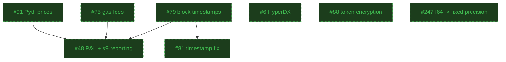

- [x] [#91 Track onchain Pyth prices](https://github.com/ST0x-Technology/st0x.liquidity/issues/91)
  - PR:
    [#84 Pyth prices](https://github.com/ST0x-Technology/st0x.liquidity/pull/84)
- [x] [#48 Calculate and save P&L for each Schwab trade](https://github.com/ST0x-Technology/st0x.liquidity/issues/48)
  - PR:
    [#90 Reporter service with P&L calculations](https://github.com/ST0x-Technology/st0x.liquidity/pull/90)
- [x] [#75 Track onchain gas fees](https://github.com/ST0x-Technology/st0x.liquidity/issues/75)
  - PR:
    [#82 gas fee tracking](https://github.com/ST0x-Technology/st0x.liquidity/pull/82)
- [x] [#79 track block timestamps](https://github.com/ST0x-Technology/st0x.liquidity/issues/79)
  - PR:
    [#80 Add block timestamp field](https://github.com/ST0x-Technology/st0x.liquidity/pull/80)
- [x] [#81 Fix block timestamp collection](https://github.com/ST0x-Technology/st0x.liquidity/issues/81)
  - PR:
    [#100 Fix block timestamp collection](https://github.com/ST0x-Technology/st0x.liquidity/pull/100)
- [x] [#9 Implement performance reporting process](https://github.com/ST0x-Technology/st0x.liquidity/issues/9)
  - PR:
    [#90 Reporter service with P&L calculations](https://github.com/ST0x-Technology/st0x.liquidity/pull/90)
- [x] [#6 Integrate HyperDX](https://github.com/ST0x-Technology/st0x.liquidity/issues/6)
  - PR:
    [#101 hyperdx](https://github.com/ST0x-Technology/st0x.liquidity/pull/101)
- [x] [#88 store schwab db tokens in encrypted format](https://github.com/ST0x-Technology/st0x.liquidity/issues/88)
  - PR:
    [#98 Fix/tokencryption](https://github.com/ST0x-Technology/st0x.liquidity/pull/98)
- [x] [#247 Financial calculations use f64 instead of fixed-precision types](https://github.com/ST0x-Technology/st0x.liquidity/issues/247)
  - PR:
    [#273 Remove legacy persistence layer](https://github.com/ST0x-Technology/st0x.liquidity/pull/273)

## Completed: Deployment & Infrastructure

- [x] [#11 Set up automated deployment](https://github.com/ST0x-Technology/st0x.liquidity/issues/11)
  - PR: [#39 CD](https://github.com/ST0x-Technology/st0x.liquidity/pull/39)
- [x] [#106 fix two instance deployment configuration](https://github.com/ST0x-Technology/st0x.liquidity/issues/106)
  - PR:
    [#102 fix deployment & implement a rollback script](https://github.com/ST0x-Technology/st0x.liquidity/pull/102)
- [x] [#108 fix deployment permissions](https://github.com/ST0x-Technology/st0x.liquidity/issues/108)
  - PR:
    [#109 simplify permissions](https://github.com/ST0x-Technology/st0x.liquidity/pull/109)
- [x] [#110 fix logging and db env vars in deployment](https://github.com/ST0x-Technology/st0x.liquidity/issues/110)
  - PR:
    [#111 fix logging and db env vars](https://github.com/ST0x-Technology/st0x.liquidity/pull/111)

## Completed: Code Quality & Documentation

- [x] [#50 Centralize suffix handling logic](https://github.com/ST0x-Technology/st0x.liquidity/issues/50)
- [x] [#68 Refactor visibility levels to improve dead code identification](https://github.com/ST0x-Technology/st0x.liquidity/issues/68)
- [x] [#67 Fix market hours check for weekends/holidays](https://github.com/ST0x-Technology/st0x.liquidity/issues/67)
- [x] [#65 Address the 100% CPU utilization issue](https://github.com/ST0x-Technology/st0x.liquidity/issues/65)
- [x] [#58 Add dry-run mode to the bot](https://github.com/ST0x-Technology/st0x.liquidity/issues/58)
  - PR:
    [#55 Dry run mode](https://github.com/ST0x-Technology/st0x.liquidity/pull/55)
- [x] [#97 Fix README and generalize AI docs](https://github.com/ST0x-Technology/st0x.liquidity/issues/97)
  - PR:
    [#93 AGENTS.md and update docs](https://github.com/ST0x-Technology/st0x.liquidity/pull/93)
- [x] [#104 update ai and human docs post broker crate](https://github.com/ST0x-Technology/st0x.liquidity/issues/104)
  - PR:
    [#103 broker crate docs and AGENTS.md downsize to fix Claude Code warning](https://github.com/ST0x-Technology/st0x.liquidity/pull/103)

## Completed: MVP Core Functionality

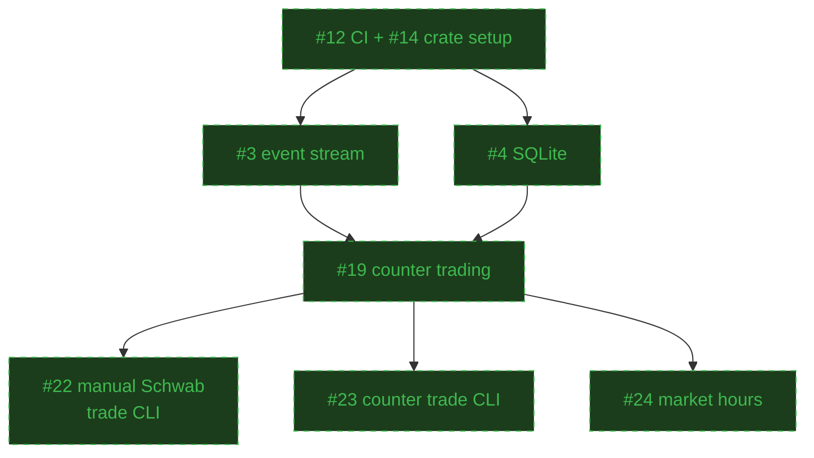

- [x] [#3 Set up trade event stream (Clear and TakeOrder events)](https://github.com/ST0x-Technology/st0x.liquidity/issues/3)
  - PR:
    [#1 Trade event stream](https://github.com/ST0x-Technology/st0x.liquidity/pull/1)
- [x] [#12 Set up CI checks](https://github.com/ST0x-Technology/st0x.liquidity/issues/12)
  - PR:
    [#13 Set up the project](https://github.com/ST0x-Technology/st0x.liquidity/pull/13)
- [x] [#14 Set up the crate with bindings and env](https://github.com/ST0x-Technology/st0x.liquidity/issues/14)
  - PR:
    [#13 Set up the project](https://github.com/ST0x-Technology/st0x.liquidity/pull/13)
- [x] [#4 Set up SQLite and store incoming trades](https://github.com/ST0x-Technology/st0x.liquidity/issues/4)
- [x] [#19 Take the opposite side of the trade on Schwab](https://github.com/ST0x-Technology/st0x.liquidity/issues/19)
  - PR:
    [#20 Take the opposite side of the trade](https://github.com/ST0x-Technology/st0x.liquidity/pull/20)
- [x] [#22 Create a CLI command for manually placing a Schwab trade](https://github.com/ST0x-Technology/st0x.liquidity/issues/22)
  - PR:
    [#25 Create a CLI command for manually placing a Schwab trade](https://github.com/ST0x-Technology/st0x.liquidity/pull/25)
- [x] [#23 Create a CLI command for manually taking the opposite end of an onchain order](https://github.com/ST0x-Technology/st0x.liquidity/issues/23)
  - PR:
    [#28 Create a CLI command for taking the opposite side of a trade](https://github.com/ST0x-Technology/st0x.liquidity/pull/28)
- [x] [#24 Stop the bot during market close and restart on market open](https://github.com/ST0x-Technology/st0x.liquidity/issues/24)
  - PR:
    [#53 Only run the bot during market open hours](https://github.com/ST0x-Technology/st0x.liquidity/pull/53)

### [SPEC.md](https://github.com/ST0x-Technology/st0x.liquidity/blob/master/SPEC.md)

See the specification for detailed system behavior documentation.
