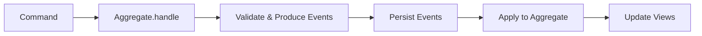
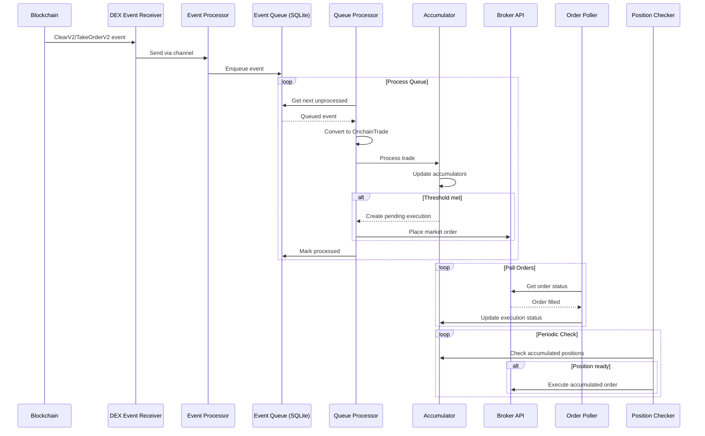
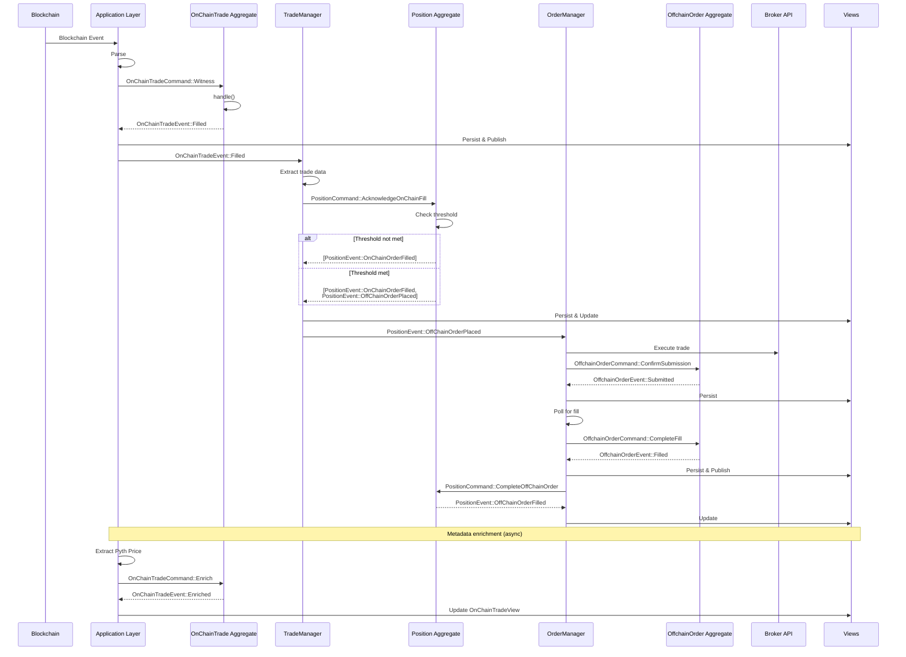

# SPEC.md

System specification for st0x liquidity. Covers architecture, behavior, and
design decisions at a level sufficient to understand the system without
prescribing exact commands or code. For terminology and naming conventions, see
[docs/domain.md](docs/domain.md).

## Background

Early-stage onchain tokenized equity markets typically suffer from poor price
discovery and limited liquidity. Without sufficient market makers, onchain
prices can diverge substantially from traditional equity market prices, creating
a poor user experience and limiting adoption.

## Solution Overview

This specification outlines a minimum viable product (MVP) arbitrage bot that
helps establish price discovery by exploiting discrepancies between onchain
tokenized equities and their traditional market counterparts.

The bot monitors Raindex Orders from a specific owner that continuously offer
tokenized equities at spreads around Pyth oracle prices. When a solver clears
any of these orders, the bot immediately executes an offsetting trade on a
supported brokerage (Charles Schwab or Alpaca Markets), hedging directional
exposure while capturing the spread differential.

The focus is on getting a functional system live quickly. There are known risks
that will be addressed in future iterations as total value locked (TVL) grows
and the system proves market fit.

## Operational Process and Architecture

### System Components

#### Onchain Infrastructure

- Raindex orderbook with deployed Orders from specific owner using Pyth oracle
  feeds
  - Multiple orders continuously offer to buy/sell different tokenized equities
    at Pyth price ± spread
- Order vaults holding stablecoins and tokenized equities

#### Offchain Infrastructure

- Brokerage account with API access (Charles Schwab or Alpaca Markets)
- Arbitrage bot monitoring and execution engine
- Basic terminal/logging interface for system overview

#### Bridge Infrastructure

- st0x bridge for offchain ↔ onchain asset movement

### Operational Flow

#### Normal Operation Cycle

1. Orders continuously offer to buy/sell tokenized equities at Pyth price ±
   spread
2. Bot monitors Raindex for clears involving any orders from the arbitrageur's
   owner address
3. Bot records onchain trades and accumulates net position changes per symbol
4. When accumulated net position reaches an absolute value of >=1.0 share,
   execute offsetting trade for floor(abs(net_position)) shares on the selected
   brokerage, using the sign of the net position to determine side (positive =
   sell to reduce a long, negative = buy to cover a short), and continue
   tracking the remaining fractional share (net_position minus the executed
   floor) with its sign for future batching
5. Bot maintains running inventory of positions across both venues
6. Periodic rebalancing via st0x bridge to normalize inventory levels

#### Note on Fractional Share Handling

- **Charles Schwab**: Does not support fractional shares via their API. Batching
  to whole shares is required (as described above).
- **Alpaca Markets**: Supports fractional share trading (minimum $1 worth). The
  current implementation uses the same batching logic for both brokers, but this
  may be reconfigured to allow immediate fractional execution when using Alpaca,
  reducing unhedged exposure.

Example (Offchain Batching):

- Onchain trades: 0.3 AAPL sold, 0.5 AAPL sold, 0.4 AAPL sold -> net 1.2 AAPL
  sold
- Bot executes: Buy 1 AAPL share on broker (floor of 1.2), continues tracking
  0.2 AAPL net exposure
- Continue accumulating fractional amount until next whole share threshold is
  reached

#### Rebalancing Process

##### Alpaca (Automated)

- **Inventory Monitoring**: InventoryView tracks total inventory across venues
  (onchain tokens + offchain shares, onchain USDC + offchain USDC)
- **Imbalance Detection**: When imbalance ratios exceed thresholds (>60% equity
  imbalance, >70% USDC imbalance), trigger automated rebalancing
- **Equity Rebalancing**:
  - Too many tokens onchain: Redeem tokens -> receive shares at Alpaca
  - Too many shares offchain: Mint tokens from shares -> receive tokens onchain
- **USDC Rebalancing**:
  - Too much USDC onchain: Bridge via Circle CCTP (Base -> Ethereum) -> deposit
    to Alpaca
  - Too much USDC offchain: Withdraw from Alpaca -> bridge via Circle CCTP
    (Ethereum -> Base) -> deposit to orderbook vault
- **Complete Audit Trail**: All rebalancing operations tracked as events
  (TokenizedEquityMint, EquityRedemption, UsdcRebalance aggregates)
- **Integration**: Uses Alpaca for share/USDC management, Circle CCTP for
  cross-chain USDC transfers

##### Schwab (Manual)

- Rebalancing for Schwab-based operations remains manual
- Monitor inventory drift over time
- Execute manual transfers as needed to maintain adequate trading capital
- No automated rebalancing infrastructure for Schwab

## Bot Implementation Specification

The arbitrage bot will be built in Rust to leverage its performance, safety, and
excellent async ecosystem for handling concurrent trading flows.

### Event Monitoring

#### Raindex Event Monitor

- WebSocket or polling connection to Ethereum node
- Filter for events involving any orders from the arbitrageur's owner address
  (Clear and TakeOrder events)
- Parse events to extract: symbol, quantity, price, direction
- Generate unique identifiers using transaction hash and log index for trade
  tracking

#### Event-Driven Async Architecture

- Each blockchain event spawns an independent async execution flow using Rust's
  async/await
- Multiple trade flows run concurrently without blocking each other
- Handles throughput mismatch: fast onchain events vs slower broker
  execution/confirmation
- No artificial concurrency limits - process events as fast as they arrive
- Tokio async runtime manages hundreds of concurrent trades efficiently on
  limited hardware
- Each flow: Parse Event -> Event Queue -> Deduplication Check -> Position
  Accumulation -> Broker Execution (when threshold reached) -> Record Result
- Failed flows retry independently without affecting other trades

### Trade Execution

#### Broker API Integration

The bot supports multiple brokers through a unified trait interface:

##### Charles Schwab

- OAuth 2.0 authentication flow with token refresh
- Connection pooling and retry logic for API calls with exponential backoff
- Rate limiting compliance and queue management
- Market order execution for immediate fills
- Order status tracking and confirmation with polling

##### Alpaca Markets

- API key-based authentication (simpler than OAuth)
- Market order execution through Alpaca Trading API v2
- Order status polling and updates
- Support for both paper trading and live trading environments
- Position querying for inventory management
- Account balance monitoring for available capital

#### Idempotency Controls

- Event queue table to track all events with unique (transaction_hash,
  log_index) keys prevents duplicate processing
- Check event queue before processing any event to prevent duplicates
- Onchain trades are recorded immediately upon event processing
- Position accumulation happens in dedicated accumulators table per symbol
- Broker executions track status ('PENDING', 'SUBMITTED', 'FILLED', 'FAILED')
  with broker type field for multi-broker support
- Complete audit trail maintained linking individual trades to batch executions
- Proper error handling and structured error logging

### Trade Tracking and Reporting

#### SQLite Trade Database

The bot uses a multi-table SQLite database to track trades and manage state. Key
tables include: onchain trade records, broker execution tracking, position
accumulators for batching fractional shares, audit trail linking, OAuth token
storage, and event queue for idempotency. The complete database schema is
defined in `migrations/20250703115746_trades.sql`.

- Store each onchain trade with symbol, amount, direction, and price
- Track broker executions separately with whole share amounts, status, and
  broker type ('schwab', 'alpaca', 'dry_run')
- Accumulate fractional positions per symbol until execution thresholds are
  reached (required for Charles Schwab; used uniformly across all brokers in
  current implementation)
- Maintain complete audit trail linking onchain trades to broker executions
- Handle concurrent database writes safely with per-symbol locking

#### Pyth Price Extraction

- Extracts exact oracle prices used during trade execution from transaction
  traces
- Uses `debug_traceTransaction` RPC method to analyze transaction execution
- Parses Pyth oracle contract calls to retrieve precise price data including
  price value, confidence interval, exponent, and publish timestamp
- Prices are stored in the `onchain_trades` table alongside trade records
- NULL price values indicate extraction failed (e.g., no Pyth call in trace, RPC
  errors)
- CLI command for testing: `cargo run --bin cli get-pyth-price <TX_HASH>`
- Trade processing continues normally even if price extraction fails

#### Reporting and Analysis

- Calculate profit/loss for each trade pair using actual executed amounts
- Generate running totals and performance reports over time
- Track inventory positions across both venues
- Push aggregated metrics to external logging system using structured logging
- Identify unprofitable trades for strategy optimization
- Separate reporting process reads from SQLite database for analysis without
  impacting trading performance

### Health Monitoring and Logging

- System uptime and connectivity status using structured logging
- API rate limiting and error tracking with metrics collection
- Position drift alerts and rebalancing triggers
- Latency monitoring for trade execution timing
- Configuration management with environment variables and config files
- Proper error propagation and custom error types

### Risk Management

- Manual override capabilities for emergency situations with proper
  authentication
- Graceful shutdown handling to complete in-flight trades before stopping

### Infrastructure and Deployment

This section specifies infrastructure, deployment, and secrets management.

Alternative approaches (Ansible, Kamal) were evaluated and documented in commit
`5ede2d47465d3621b351c73c9c1af33d20a7c879`.

#### Tools

- **Terraform**: Provisions DigitalOcean infrastructure (droplet, volume,
  reserved IP). Standard HCL, version pinned via flake.lock. Droplet boots
  Ubuntu; nixos-anywhere converts it to NixOS.

- **nixos-anywhere** + **disko**: One-time bootstrap that installs NixOS on the
  Ubuntu droplet over SSH. Uses kexec to boot a NixOS installer in RAM,
  partitions the disk via disko, and runs nixos-install with the flake's NixOS
  configuration. After bootstrap, deploy-rs manages all updates.

- **deploy-rs**: Deploys to NixOS hosts via SSH. Two activation types:
  `activate.nixos` for full system configuration (SSH, firewall, systemd units,
  Grafana, ragenix), `activate.custom` for standalone service binaries. Includes
  auto-rollback on failed deployments ("magic rollback" reverts if SSH is lost
  during activation).

- (r)**agenix**: Age-encrypted secrets for NixOS, using existing SSH keys. CLI
  encrypts secrets locally into `.age` files you commit to git. NixOS module
  decrypts at activation using the host's SSH key, mounting secrets to
  `/run/agenix/` (tmpfs - cleartext never hits disk or Nix store). No GPG, no
  separate secret distribution - secrets deploy with `nixos-rebuild` like any
  other config. Ragenix is a Rust drop-in for agenix but is less documented, so
  it's best to follow agenix documentation but use ragenix instead.

#### Architecture

Terraform provisions infrastructure (droplet, volume, reserved IP) with an
Ubuntu image. nixos-anywhere bootstraps NixOS on the droplet (one-time).
deploy-rs handles all subsequent system and application deployment over SSH.

_System configuration_ (deploy-rs `activate.nixos`):

- OS essentials: SSH, firewall, users
- Systemd unit definitions for application services (pointing to deploy-rs
  profile paths)
- Grafana as a NixOS native service
- ragenix integration for secret decryption
- Nix configuration (flakes, garbage collection)

_Per-service profiles_ (deploy-rs `activate.custom`, deployed independently):

- `server` - hedging bot binary (serves both Schwab and Alpaca instances)
- `reporter` - position reporter binary (serves both Schwab and Alpaca
  instances)

Each profile is independently deployable and rollback-able without affecting
other profiles. The dashboard is served as static files by nginx (part of the
system configuration).

_Configuration management_:

- Plaintext config per service (`config/*.toml`) baked into Nix closure
- Encrypted secrets per service (`secret/*.toml.age`) decrypted at activation to
  `/run/agenix/`
- Server uses `--config` + `--secrets` flags; reporter uses `--config` only

_Infrastructure_:

- Terraform (standard HCL) provisions droplet with Ubuntu image
- nixos-anywhere converts Ubuntu to NixOS (one-time bootstrap)
- Nix wraps Terraform for reproducible, version-pinned execution
- Terraform state encrypted with age and committed to git

#### Rollback

deploy-rs deploys each service to a nix profile. Each deployment creates a new
profile generation that can be rolled back to. deploy-rs uses legacy
(`nix-env`-style) profiles internally, not the new Nix CLI profiles. Old
generations are cleaned up by the NixOS garbage collector on a configured
schedule.

#### CI/CD Credential Management

| Secret Type | Storage               | When Used           | Example                |
| ----------- | --------------------- | ------------------- | ---------------------- |
| Runtime     | ragenix (.age in git) | Decrypted at deploy | Schwab/Alpaca API keys |
| Build-time  | GitHub Secrets        | CI build/deploy     | DO token, SSH key      |

Use GitHub Actions environment protection (require approval for production,
restrict to master branch).

#### SSH Key Management

All SSH keys centralized in `keys.nix` with role-based access:

- `roles.ssh` — keys authorized for root SSH (operator + CI)
- `roles.infra` — keys that can decrypt terraform state
- `roles.service` — keys that can decrypt service config secrets

`os.nix` imports `roles.ssh` for `authorizedKeys`. CI uses its key (stored as
`SSH_KEY` GitHub secret) for both deployment and terraform state decryption.

## Crate Architecture

The codebase is organized into multiple Rust crates to achieve:

1. **Faster builds** - Cargo parallelizes across crates; unchanged crates skip
   rebuild entirely
2. **Stricter abstraction boundaries** - Crate visibility (`pub(crate)`)
   enforces domain isolation at compile-time
3. **Tighter dependency graph** - Dependencies explicit in Cargo.toml, no cycles
   allowed
4. **Reduced coupling** - Each crate defines a clear public API; internals stay
   hidden

### Core Capabilities

The system provides two top-level capabilities:

1. **Hedging** - Offsetting directional exposure by executing trades on
   brokerages
2. **Maintaining balance invariants** - Keeping inventory balanced across venues
   through transfers (tokenization, bridging, vault operations)

### Architecture Layers

```text
┌───────────────────────────────────────────────────────────────────────┐
│                          INTEGRATIONS                                 │
│                 (external API wrappers, trait + impls)                │
├───────────────────────────────────────────────────────────────────────┤
│                                                                       │
│  st0x-execution      st0x-tokenization  st0x-bridge    st0x-vault     │
│  ├─ Executor trait   ├─ Tokenizer trait ├─ Bridge trait├─ Vault trait │
│  │                   │                  │              │              │
│  │ features:         │ features:        │ features:    │ features:    │
│  │ ├─ schwab         │ └─ alpaca        │ └─ cctp      │ └─ rain      │
│  │ ├─ alpaca-trading │                  │              │              │
│  │ └─ mock           │                  │              │              │
│                                                                       │
└───────┬──────────────────┬──────────────────┬──────────────┬──────────┘
        │                  │                  │              │
        ▼                  ▼                  ▼              ▼
┌───────────────────────────────────────────────────────────────────────┐
│                          DOMAIN LOGIC                                 │
│                    (business rules, uses traits)                      │
├───────────────────────────────────────────────────────────────────────┤
│                                                                       │
│  st0x-hedge                            st0x-rebalance                 │
│  ├─ Conductor                          ├─ Rebalancer                  │
│  ├─ Accumulator                        ├─ Trigger logic               │
│  ├─ Position tracking                  ├─ Mint/Redeem managers        │
│  └─ Queue processing                   └─ CQRS aggregates             │
│                                                                       │
│  depends on: execution                 depends on: tokenization,      │
│                                                    bridge, vault      │
│                                                                       │
└──────────────────────────────────┬────────────────────────────────────┘
                                   │
                                   ▼
┌───────────────────────────────────────────────────────────────────────┐
│                           APPLICATION                                 │
├───────────────────────────────────────────────────────────────────────┤
│                                                                       │
│  st0x-server                           st0x-dashboard                 │
│  ├─ main.rs                            ├─ Websocket events            │
│  ├─ API endpoints                      ├─ Admin UI backend            │
│  ├─ Automated flows                    └─ Manual operations (future)  │
│  │                                                                    │
│  │ features:                                                          │
│  │ ├─ schwab, alpaca-trading, mock                                    │
│  │ ├─ alpaca-tokenization                                             │
│  │ ├─ cctp                                                            │
│  │ └─ rain                                                            │
│                                                                       │
└───────────────────────────────────────────────────────────────────────┘

                · · · · · · · · · · · · · · · · · · · · ·
                ·                                       ·
                ·  st0x-cli (temporary utility)         ·
                ·  ├─ Manual auth flows                 ·
                ·  ├─ Debug commands                    ·
                ·  └─ To be deprecated                  ·
                ·                                       ·
                · · · · · · · · · · · · · · · · · · · · ·
```

### Crate Descriptions

**Integration Layer** (external API wrappers):

| Crate               | Purpose                                              | Feature Flags                      |
| ------------------- | ---------------------------------------------------- | ---------------------------------- |
| `st0x-execution`    | Brokerage API integration for trade execution        | `schwab`, `alpaca-trading`, `mock` |
| `st0x-tokenization` | Tokenization API for minting/redeeming equity tokens | `alpaca`                           |
| `st0x-bridge`       | Cross-chain asset transfers                          | `cctp`                             |
| `st0x-vault`        | Orderbook vault deposit/withdraw operations          | `rain`                             |

Each integration crate defines a trait (e.g., `Executor`, `Tokenizer`, `Bridge`,
`Vault`) with one or more implementations selectable via feature flags. This
allows swapping implementations without changing domain logic.

**Domain Logic Layer** (business rules):

| Crate            | Purpose                                                         | Dependencies                                     |
| ---------------- | --------------------------------------------------------------- | ------------------------------------------------ |
| `st0x-hedge`     | Hedging logic: conductor, accumulator, position tracking, queue | `st0x-execution`                                 |
| `st0x-rebalance` | Balance maintenance: triggers, managers, CQRS aggregates        | `st0x-tokenization`, `st0x-bridge`, `st0x-vault` |

Domain crates depend on integration traits, not concrete implementations. This
enables testing with mocks and future implementation swaps.

**Application Layer** (binaries and wiring):

| Crate            | Purpose                                                        |
| ---------------- | -------------------------------------------------------------- |
| `st0x-server`    | Main bot binary, wires hedging + rebalancing, API endpoints    |
| `st0x-dashboard` | Admin dashboard backend, websocket events, manual operations   |
| `st0x-cli`       | Temporary utility for manual auth and debug (to be deprecated) |

### Feature Flag Strategy

Feature flags control which implementations are compiled:

```toml
# Production equities bot with Schwab
[dependencies]
st0x-server = { features = ["schwab", "alpaca-tokenization", "cctp", "rain"] }

# Dry-run testing
st0x-server = { features = ["mock", "alpaca-tokenization", "cctp", "rain"] }

# Future: crypto + perps fork with different integrations
st0x-server = { features = ["perp-exchange", "other-bridge", "other-vault"] }
```

This enables:

- Compile-time selection of integrations (no unused code in binary)
- Easy addition of new implementations behind new feature flags
- Fork-friendly architecture for different asset classes

### Implementation Phases

The crate extraction is sequenced around the CQRS/ES migration:

### Phase 1: Prerequisite Refactors

Fix coupling issues before extraction:

- Split `Evm` struct: Extract generic `EvmClient<P,S>` (provider + signer) from
  CCTP-specific contracts, so vault doesn't depend on cctp
- Move ID types: `IssuerRequestId`/`TokenizationRequestId` move from aggregate
  to tokenization module, reversing the dependency direction

### Phase 2: Integration Layer Extraction

Extract external API wrappers (no CQRS/ES dependencies):

- `st0x-tokenization`: Alpaca tokenization API, defines `Tokenizer` trait
- `st0x-bridge`: CCTP cross-chain transfers, defines `Bridge` trait
- `st0x-vault`: Rain orderbook vault operations, defines `Vault` trait

### Phase 3: Rebalancing Domain Extraction

Extract rebalancing logic (already clean CQRS, no legacy persistence):

- `st0x-rebalance`: TokenizedEquityMint, EquityRedemption, UsdcRebalance
  aggregates plus orchestration logic

### Phase 4: Hedging Extraction & Application Layer

After CQRS migration Phase 3 completes.

Extract hedging logic and create application binary (must happen atomically):

- `st0x-hedge`: Pure library with conductor, accumulator, position tracking,
  queue
- `st0x-server`: Application binary that wires hedging + rebalancing together
- Dashboard stays as feature-gated module in server
- CLI remains temporary utility
- Depends on OnChainTrade, OffchainOrder, Position migration completing first

## System Risks

The following risks are known for v1 but will not be addressed in the initial
implementation. Solutions will be developed in later iterations.

### Offchain Risks

- **Fractional Share Exposure**: Charles Schwab does not support fractional
  share trading, requiring offchain batching until net positions reach whole
  share amounts. This creates temporary unhedged exposure for fractional amounts
  that haven't reached the execution threshold. Note: Alpaca Markets supports
  fractional share trading (minimum $1 worth of shares), but we currently use
  the same batching logic for both brokers. This may be reconfigured in the
  future to allow immediate fractional execution when using Alpaca.
- **Missed Trade Execution**: The bot fails to execute offsetting trades on the
  selected brokerage when onchain trades occur, creating unhedged exposure. For
  example:
  - Bot downtime while onchain order remains active
  - Bot detects onchain trade but fails to execute offchain trade
  - Broker API failures or rate limiting during critical periods
- **After-Hours Trading Gap**: Pyth oracle may continue operating when
  traditional markets are closed, allowing onchain trades while broker markets
  are unavailable. Creates guaranteed daily exposure windows.

### Onchain Risks

- **Stale Pyth Oracle Data**: If the oracle becomes stale, the order won't trade
  onchain, resulting in missed arbitrage opportunities. However, this is
  preferable to the alternative scenario where trades execute onchain but the
  bot cannot make offsetting offchain trades.
- **Solver fails:** if the solver fails, again onchain trades won't happen but
  as above this is simply opportunity cost.

---

## DDD/CQRS/ES Migration Proposal

### Background

The current implementation provides some auditability through `onchain_trades`,
`schwab_executions`, and `trade_execution_links`. However, these tables are
mutable and don't form a complete event log:

#### Current Limitations

- **Mutable state**: Tables can be updated/deleted, losing history of state
  transitions (e.g., `schwab_executions.status` transitions from PENDING ->
  SUBMITTED -> COMPLETED are lost, we only see final state)
- **Partial audit trail**: Know which trades linked to which executions, but not
  why batching decisions were made or when thresholds were crossed
- **Can't rebuild from history**: If `trade_accumulators.net_position` gets
  corrupted, can't reconstruct it from trades (trades are facts, but the
  accumulation logic isn't captured)
- **Schema evolution requires migrations**: Adding new metrics (e.g., PnL
  tracking, fill quality analysis) requires ALTER TABLE and backfilling
- **State machine in application code**: Position lifecycle rules (when to
  execute, how to batch) are scattered across functions - hard to test in
  isolation

#### Event Sourcing Improvements

Events ARE immutable facts, but the current system only captures some facts
(trades executed, final execution state) while losing others (when thresholds
were crossed, status transitions, why batching decisions occurred). An event
store treats every significant occurrence as a fact:

- **Complete history**: Every state change is a fact with timestamp and sequence
- **Reproducible state**: Replay facts to rebuild any view, fixing corruption
- **Temporal queries**: "What was the position at any point in time?"
- **Zero-downtime projections**: Add new views by replaying existing events
- **Testable business logic**: Given-When-Then tests validate rules without
  database
- **Type-safe state machines**: Invalid transitions become compilation errors

We will migrate st0x.liquidity-a to DDD/CQRS/ES patterns for:

- **Auditability**: Complete audit trail of all system state changes
- **Debuggability**: Time-travel debugging by replaying events
- **Schema Evolution**: Easy to add new projections without migrations
- **Type Safety**: Make invalid states unrepresentable through ADTs
- **Testability**: Given-When-Then testing pattern for business logic
- **Reasoning**: Clear separation between facts (events) and derived data
  (views)

### Migration Strategy Overview

This migration will transform the current database from a CRUD-style schema to
an event-sourced architecture through **three independently deployable phases**.

**Before**: Multiple mutable state tables with potential contradictions

#### After

- **Event Store**: Immutable append-only log (single source of truth)
- **Snapshots**: Performance optimization for aggregate reconstruction
- **Views**: Materialized projections optimized for queries

**Grafana Dashboard Strategy**: The migration aims to minimize changes to
existing Grafana dashboards by using SQLite generated columns to expose the same
column names as current tables. This allows most queries to work with only table
name changes (e.g., `onchain_trades` -> `onchain_trade_view`). Additionally, we
can create specialized views that pre-compute complex metrics, simplifying
queries and improving performance.

#### Phase 1: Dual-Write Foundation (Shadow Mode)

**Goal**: Run CQRS/ES alongside existing system to validate correctness before
cutting over.

##### Implementation

- Implement event sourcing infrastructure (sqlite-es integration)
- Create event store and view tables via migrations
- Implement all aggregates with command/event modeling (OnChainTrade, Position,
  OffchainOrder, SchwabAuth)
- Implement data import binary to convert existing CRUD data to events
- Implement dual-write: Conductor writes to **BOTH** old tables AND event store
- Events persist and update views, but **views are NOT yet used for reads**
- Old tables remain the source of truth for all queries (API, CLI, Grafana)
- Monitoring/logging to compare old table data vs new view data

##### Deployment sequence

1. Deploy schema migrations (creates event store and view tables)
2. Run data import binary once (`migrate_to_events`) to convert all existing
   CRUD data into events
3. Start application with dual-write enabled (reads from old tables, writes to
   both)
4. Verify views match old tables and new events appear in both systems
5. Monitor for errors and performance issues

##### Benefits

- **Low risk**: Old system continues working; new system validates in shadow
  mode
- **Complete data**: Event store contains all data from day one, enabling proper
  validation
- **Real-world validation**: Event sourcing logic tested against actual
  production data
- **Easy rollback**: Stop writing events; old system unaffected
- **Catch discrepancies**: Identify any bugs in event logic before cutover

##### Deployment verification

- After import: Verify view counts and sample records match old tables exactly
- After dual-write starts: Spot check that new events appear in both systems
- Monitor for any errors in event processing
- Confirm no performance degradation

##### Phase complete when

- Dual-write running in production for sufficient validation period
- View data consistently matches old table data
- No event processing errors
- Performance acceptable

#### Phase 2: Rebalancing Feature (New Feature on CQRS/ES)

**Goal**: Implement inventory rebalancing using CQRS/ES architecture from day
one.

##### Why now

- Rebalancing is a business priority
- Building on new architecture proves CQRS/ES works for new features
- Avoids having to migrate rebalancing logic later
- Demonstrates value of event sourcing (complete audit trail for all rebalancing
  operations)

##### Implementation scope

- Three rebalancing aggregates (TokenizedEquityMint, EquityRedemption,
  UsdcRebalance)
- Integration with Alpaca for share/USDC management
- Integration with Circle CCTP bridge (Ethereum mainnet <-> Base for USDC)
- InventoryView for monitoring imbalance ratios
- RebalancingManager for triggering rebalancing operations
- Complete event-sourced audit trail for all rebalancing operations

##### Integration points

- Alpaca for share and USDC management
- Circle's USDC native bridge via CCTP (cross-chain transfers between Ethereum
  mainnet and Base)
- Rain OrderBook (deposit2/withdraw2 for vault operations on Base)
- Position aggregate (provides inventory data to InventoryView)

##### Benefits

- New feature built using the new architecture
- Proves CQRS/ES architecture in production
- Complete audit trail for compliance and debugging
- Easier to reason about rebalancing state transitions

##### Phase complete when

- Rebalancing working in production with Alpaca
- Complete audit trail visible in events
- No issues with CQRS/ES patterns

#### Phase 3: Complete Migration (Cut Over to Views)

**Goal**: Make views the source of truth and remove old tables.

##### Implementation

- Update Conductor to read from views instead of old tables
- Update API/CLI to query views
- Implement remaining managers (TradeManager, OrderManager)
- Add MetricsPnL view for financial analysis
- Stop writing to old tables
- After validation period, drop old tables

##### Cutover approach

- Switch application reads from old tables to views
- Stop dual-write (only write to event store)
- Monitor for issues
- After validation period, drop old tables

##### Benefits

- Old system completely removed
- Full CQRS/ES benefits realized (time-travel debugging, easy projections,
  complete audit trail)
- Cleaner codebase
- Foundation for future features

##### Phase complete when

- All reads happening from views
- No code querying old tables
- Production running successfully on views
- Old tables dropped

#### Phased Migration Benefits

- **Risk mitigation**: Each phase is independently deployable and reversible
- **Incremental validation**: Catch issues early before they compound
- **Business continuity**: System remains operational throughout migration
- **Prove value early**: Rebalancing feature demonstrates CQRS/ES benefits
- **Learn and adapt**: Each phase informs the next

### Core Architecture

#### Event Sourcing Pattern

All state changes are captured as immutable domain events. The event store is
the single source of truth. All other data (views, snapshots) is derived and can
be rebuilt at any time.

##### Key Flow



#### Database Schema

##### Event Store Tables (Single Source of Truth)

```sql
-- Events table: stores all domain events
CREATE TABLE events (
    aggregate_type TEXT NOT NULL,      -- 'OnChainTrade', 'Position', 'OffchainOrder', etc.
    aggregate_id TEXT NOT NULL,        -- Unique identifier for aggregate instance
    sequence BIGINT NOT NULL,          -- Sequence number (starts at 1)
    event_type TEXT NOT NULL,          -- Event name (e.g., 'OnChainOrderFilled')
    event_version TEXT NOT NULL,       -- Event schema version (e.g., '1.0')
    payload JSON NOT NULL,             -- Event data as JSON
    metadata JSON NOT NULL,            -- Correlation IDs, timestamps, etc.
    PRIMARY KEY (aggregate_type, aggregate_id, sequence)
);

CREATE INDEX idx_events_type ON events(aggregate_type);
CREATE INDEX idx_events_aggregate ON events(aggregate_id);

-- Snapshots table: aggregate cache for performance
CREATE TABLE snapshots (
    aggregate_type TEXT NOT NULL,
    aggregate_id TEXT NOT NULL,
    last_sequence BIGINT NOT NULL,    -- Last event sequence in snapshot
    payload JSON NOT NULL,             -- Serialized aggregate state
    timestamp TEXT NOT NULL,
    PRIMARY KEY (aggregate_type, aggregate_id)
);
```

##### View Tables (Derived Read Models)

Views are materialized projections built from events, optimized for specific
query patterns. These views use SQLite generated columns to expose JSON fields
as regular columns, maintaining backward compatibility with existing Grafana
dashboards and queries.

```sql
-- Position view: current position state per symbol
-- Replaces: trade_accumulators table
CREATE TABLE position_view (
    view_id TEXT PRIMARY KEY,         -- symbol
    version BIGINT NOT NULL,          -- Last event sequence applied
    payload JSON NOT NULL,            -- Current position state

    -- Generated columns for backward compatibility with trade_accumulators
    symbol TEXT GENERATED ALWAYS AS (json_extract(payload, '$.symbol')) VIRTUAL,
    net_position REAL GENERATED ALWAYS AS (json_extract(payload, '$.net_position')) VIRTUAL,
    accumulated_long REAL GENERATED ALWAYS AS (json_extract(payload, '$.accumulated_long')) VIRTUAL,
    accumulated_short REAL GENERATED ALWAYS AS (json_extract(payload, '$.accumulated_short')) VIRTUAL,
    pending_execution_id TEXT GENERATED ALWAYS AS (json_extract(payload, '$.pending_execution_id')) VIRTUAL,
    last_updated TEXT GENERATED ALWAYS AS (json_extract(payload, '$.last_updated')) VIRTUAL
);

CREATE INDEX idx_position_view_symbol ON position_view(symbol);
CREATE INDEX idx_position_view_net_position ON position_view(net_position);
CREATE INDEX idx_position_view_last_updated ON position_view(last_updated);

-- Offchain trade view: all broker trade executions
-- Replaces: schwab_executions table
CREATE TABLE offchain_trade_view (
    view_id TEXT PRIMARY KEY,         -- execution_id
    version BIGINT NOT NULL,
    payload JSON NOT NULL,

    -- Generated columns for backward compatibility with schwab_executions
    id INTEGER GENERATED ALWAYS AS (CAST(json_extract(payload, '$.execution_id') AS INTEGER)) VIRTUAL,
    symbol TEXT GENERATED ALWAYS AS (json_extract(payload, '$.symbol')) VIRTUAL,
    shares INTEGER GENERATED ALWAYS AS (json_extract(payload, '$.shares')) VIRTUAL,
    direction TEXT GENERATED ALWAYS AS (json_extract(payload, '$.direction')) VIRTUAL,
    order_id TEXT GENERATED ALWAYS AS (json_extract(payload, '$.broker_order_id')) VIRTUAL,
    price_cents INTEGER GENERATED ALWAYS AS (json_extract(payload, '$.price_cents')) VIRTUAL,
    status TEXT GENERATED ALWAYS AS (json_extract(payload, '$.status')) VIRTUAL,
    executed_at TEXT GENERATED ALWAYS AS (json_extract(payload, '$.completed_at')) VIRTUAL
);

CREATE INDEX idx_offchain_trade_view_symbol ON offchain_trade_view(symbol);
CREATE INDEX idx_offchain_trade_view_status ON offchain_trade_view(status);

-- OnChain trade view: blockchain trade records
-- Replaces: onchain_trades table
CREATE TABLE onchain_trade_view (
    view_id TEXT PRIMARY KEY,         -- tx_hash:log_index
    version BIGINT NOT NULL,
    payload JSON NOT NULL,

    -- Generated columns for backward compatibility with onchain_trades
    id INTEGER GENERATED ALWAYS AS (CAST(json_extract(payload, '$.id') AS INTEGER)) VIRTUAL,
    tx_hash TEXT GENERATED ALWAYS AS (json_extract(payload, '$.tx_hash')) VIRTUAL,
    log_index INTEGER GENERATED ALWAYS AS (json_extract(payload, '$.log_index')) VIRTUAL,
    symbol TEXT GENERATED ALWAYS AS (json_extract(payload, '$.symbol')) VIRTUAL,
    amount REAL GENERATED ALWAYS AS (json_extract(payload, '$.amount')) VIRTUAL,
    direction TEXT GENERATED ALWAYS AS (json_extract(payload, '$.direction')) VIRTUAL,
    price_usdc REAL GENERATED ALWAYS AS (json_extract(payload, '$.price_usdc')) VIRTUAL,
    block_number INTEGER GENERATED ALWAYS AS (json_extract(payload, '$.block_number')) VIRTUAL,
    block_timestamp TEXT GENERATED ALWAYS AS (json_extract(payload, '$.block_timestamp')) VIRTUAL,
    gas_used INTEGER GENERATED ALWAYS AS (json_extract(payload, '$.gas_used')) VIRTUAL,
    pyth_price_value TEXT GENERATED ALWAYS AS (json_extract(payload, '$.pyth_price.value')) VIRTUAL,
    pyth_price_expo INTEGER GENERATED ALWAYS AS (json_extract(payload, '$.pyth_price.expo')) VIRTUAL,
    pyth_price_conf TEXT GENERATED ALWAYS AS (json_extract(payload, '$.pyth_price.conf')) VIRTUAL,
    created_at TEXT GENERATED ALWAYS AS (json_extract(payload, '$.recorded_at')) VIRTUAL
);

CREATE INDEX idx_onchain_trade_view_symbol ON onchain_trade_view(symbol);
CREATE INDEX idx_onchain_trade_view_block_number ON onchain_trade_view(block_number);
CREATE INDEX idx_onchain_trade_view_created_at ON onchain_trade_view(created_at);
CREATE INDEX idx_onchain_trade_view_direction ON onchain_trade_view(direction);

-- PnL metrics view: profit/loss calculations
-- Replaces: metrics_pnl table
CREATE TABLE metrics_pnl_view (
    view_id TEXT PRIMARY KEY,         -- unique metric id
    version BIGINT NOT NULL,
    payload JSON NOT NULL,

    -- Generated columns for backward compatibility with metrics_pnl
    id INTEGER GENERATED ALWAYS AS (CAST(json_extract(payload, '$.id') AS INTEGER)) VIRTUAL,
    symbol TEXT GENERATED ALWAYS AS (json_extract(payload, '$.symbol')) VIRTUAL,
    timestamp TEXT GENERATED ALWAYS AS (json_extract(payload, '$.timestamp')) VIRTUAL,
    trade_type TEXT GENERATED ALWAYS AS (json_extract(payload, '$.trade_type')) VIRTUAL,
    trade_id INTEGER GENERATED ALWAYS AS (json_extract(payload, '$.trade_id')) VIRTUAL,
    trade_direction TEXT GENERATED ALWAYS AS (json_extract(payload, '$.trade_direction')) VIRTUAL,
    quantity REAL GENERATED ALWAYS AS (json_extract(payload, '$.quantity')) VIRTUAL,
    price_per_share REAL GENERATED ALWAYS AS (json_extract(payload, '$.price_per_share')) VIRTUAL,
    realized_pnl REAL GENERATED ALWAYS AS (json_extract(payload, '$.realized_pnl')) VIRTUAL,
    cumulative_pnl REAL GENERATED ALWAYS AS (json_extract(payload, '$.cumulative_pnl')) VIRTUAL,
    net_position_after REAL GENERATED ALWAYS AS (json_extract(payload, '$.net_position_after')) VIRTUAL
);

CREATE INDEX idx_metrics_pnl_view_symbol ON metrics_pnl_view(symbol);
CREATE INDEX idx_metrics_pnl_view_timestamp ON metrics_pnl_view(timestamp);
CREATE INDEX idx_metrics_pnl_view_symbol_timestamp ON metrics_pnl_view(symbol, timestamp);

-- Schwab auth view: OAuth token storage for internal bot use only
-- Replaces: schwab_auth table
CREATE TABLE schwab_auth_view (
    view_id TEXT PRIMARY KEY,         -- Always 'schwab' (singleton)
    version BIGINT NOT NULL,
    payload JSON NOT NULL             -- Encrypted tokens
);
```

##### Grafana Dashboard Migration

Most existing Grafana queries can migrate with only table name changes:

Consider this hypothetical query:

```sql
-- Old query (using onchain_trades table)
SELECT symbol, amount, price_usdc, created_at
FROM onchain_trades
WHERE symbol = 'AAPL' AND created_at > datetime('now', '-7 days');

-- New query (using onchain_trade_view table) - only table name changes
SELECT symbol, amount, price_usdc, created_at
FROM onchain_trade_view
WHERE symbol = 'AAPL' AND created_at > datetime('now', '-7 days');
```

Generated columns are indexed for query performance, ensuring dashboards
maintain their current performance characteristics.

##### Opportunity for Dashboard Simplification

The event-sourced architecture allows us to create specialized views that
pre-compute complex metrics, replacing complex Grafana queries with simple
SELECTs.

For example, a dashboard showing buy and sell prices from both onchain and
offchain trades would need to UNION data from multiple tables and convert price
units:

```sql
-- Before: Complex query UNIONing onchain and offchain trades
SELECT
    created_at,
    direction,
    price,
    'ONCHAIN' as trade_type
FROM (
    -- Onchain trades with price in USDC
    SELECT
        created_at,
        direction,
        price_usdc as price
    FROM onchain_trades
    WHERE symbol = '${Symbol}'

    UNION ALL

    -- Offchain trades with price in cents, converted to dollars
    SELECT
        executed_at as created_at,
        direction,
        CAST(price_cents AS REAL) / 100.0 as price
    FROM schwab_executions
    WHERE symbol = '${Symbol}'
      AND status = 'FILLED'
)
ORDER BY created_at;

-- After: Pre-computed unified view with normalized prices
SELECT created_at, direction, price, trade_type
FROM unified_trade_view
WHERE symbol = '${Symbol}'
ORDER BY created_at;
```

Complex queries can be identified and replaced with optimized views, improving
both dashboard performance and maintainability.

### Architecture Decision: Position as Aggregate

In DDD, entities are objects defined by their identity and continuity rather
than their attributes - they have a lifecycle and change over time while
maintaining the same identity. Aggregates are entities that enforce business
rules and maintain consistency boundaries.

OnChain trades, offchain orders, and positions are all entities with distinct
lifecycles, so we model them as separate aggregates:

- **OnChainTrade**: Lifecycle = blockchain fill -> enriched with metadata.
  Immutable blockchain facts (reorgs not currently handled, see Future
  Consideration section).
- **OffchainOrder**: Lifecycle = placed -> submitted -> filled/failed. Broker
  order tracking.
- **Position**: Lifecycle = accumulates fills -> triggers hedging decisions.
  Uses configurable threshold (shares or dollar value) to determine when to
  place offsetting broker orders. Schwab uses shares threshold (1.0 minimum),
  Alpaca can use dollar threshold ($1.00 minimum).

This means blockchain fills are recorded in both OnChainTradeEvent::Filled
(audit trail) and PositionEvent::OnChainOrderFilled (position tracking), but
they serve different purposes in different bounded contexts.

### Aggregate Design

#### Lifecycle Wrapper Pattern

All event-sourced aggregates use the `Lifecycle<T, E>` wrapper which handles
infrastructure concerns while keeping business logic clean:

```rust
enum Lifecycle<T, E> {
    Uninitialized,     // No events applied yet (default state)
    Live(T),           // Normal operational state
    Failed {           // Error state (no panics in financial apps)
        error: LifecycleError<E>,
        last_valid_state: Option<Box<T>>,
    },
}
```

##### Why This Pattern Exists

- `Aggregate::apply` and `View::update` are infallible (no `Result` return)
- Financial applications cannot panic on arithmetic overflow
- Events might arrive before genesis (replay ordering, bugs)
- Transitions might fail (overflow, invalid state combinations)

##### Usage in `apply()` method

```rust
fn apply(&mut self, event: Self::Event) {
    *self = self
        .clone()
        .transition(&event, MyEntity::apply_transition)
        .or_initialize(&event, MyEntity::from_event);
}
```

- `transition()` applies events to an existing entity
- `or_initialize()` handles genesis events if entity doesn't exist yet
- Failures transition to `Failed` instead of panicking

##### Error Type Parameter

- Use `Never` (uninhabited type) for aggregates with no fallible operations
- Use domain-specific error types (e.g., `ArithmeticError`) when transitions can
  fail

#### OnChainTrade Aggregate

**Purpose**: Represents a single filled order from the blockchain. Decouples
trade recording from position management, allowing metadata enrichment without
affecting position calculations.

**Aggregate ID**: `"{tx_hash}:{log_index}"` (e.g., "0x123...abc:5")

**Type**: `Lifecycle<OnChainTrade, Never>` (transitions never fail)

##### State

```rust
struct OnChainTrade {
    symbol: Symbol,
    amount: Decimal,
    direction: Direction,
    price_usdc: Decimal,
    block_number: u64,
    block_timestamp: DateTime<Utc>,
    filled_at: DateTime<Utc>,
    enrichment: Option<Enrichment>,
}

struct Enrichment {
    gas_used: u64,
    pyth_price: PythPrice,
    enriched_at: DateTime<Utc>,
}
```

##### Commands

```rust
enum OnChainTradeCommand {
    Witness {
        symbol: Symbol,
        amount: Decimal,
        direction: Direction,
        price_usdc: Decimal,
        block_number: u64,
        block_timestamp: DateTime<Utc>,
    },
    Enrich {
        gas_used: u64,
        pyth_price: PythPrice,
    },
}
```

##### Events

```rust
enum OnChainTradeEvent {
    Migrated {
        symbol: Symbol,
        amount: Decimal,
        direction: Direction,
        price_usdc: Decimal,
        block_number: u64,
        block_timestamp: DateTime<Utc>,
        gas_used: Option<u64>,
        pyth_price: Option<PythPrice>,
        migrated_at: DateTime<Utc>,
    },
    Filled {
        symbol: Symbol,
        amount: Decimal,
        direction: Direction,
        price_usdc: Decimal,
        block_number: u64,
        block_timestamp: DateTime<Utc>,
        filled_at: DateTime<Utc>,
    },
    Enriched {
        gas_used: u64,
        pyth_price: PythPrice,
        enriched_at: DateTime<Utc>,
    },
}
```

**Business Rules** (enforced in `handle()`):

- Can only enrich once
- Cannot enrich before fill is witnessed

#### Position Aggregate

**Purpose**: Manages accumulated position for a single symbol, tracking
fractional shares and coordinating offchain hedging when thresholds are reached.

**Aggregate ID**: `symbol` (e.g., "AAPL")

**Type**: `Lifecycle<Position, ArithmeticError>` (arithmetic can overflow)

##### State

```rust
struct Position {
    symbol: Symbol,
    net: FractionalShares,
    accumulated_long: FractionalShares,
    accumulated_short: FractionalShares,
    pending_execution_id: Option<ExecutionId>,
    threshold: ExecutionThreshold,
    last_updated: Option<DateTime<Utc>>,
}

enum ExecutionThreshold {
    Shares(FractionalShares),  // Schwab: 1.0 shares minimum
    DollarValue(Usdc),         // Alpaca: $1.00 minimum trade value
}
```

##### Commands

```rust
// Common types
struct TradeId {
    tx_hash: TxHash,
    log_index: u64,
}

enum PositionCommand {
    AcknowledgeOnChainFill {
        trade_id: TradeId,
        amount: FractionalShares,
        direction: Direction,
        price_usdc: Decimal,
        block_timestamp: DateTime<Utc>,
    },
    PlaceOffChainOrder {
        execution_id: ExecutionId,
        shares: FractionalShares,
        direction: Direction,
        broker: SupportedBroker,
        threshold: ExecutionThreshold,
    },
    CompleteOffChainOrder {
        execution_id: ExecutionId,
        shares_filled: FractionalShares,
        direction: Direction,
        broker_order_id: BrokerOrderId,
        price_cents: PriceCents,
        broker_timestamp: DateTime<Utc>,
    },
    FailOffChainOrder {
        execution_id: ExecutionId,
        error: String,
    },
}
```

##### Events

```rust
enum PositionEvent {
    Migrated {
        symbol: Symbol,
        net_position: FractionalShares,
        accumulated_long: FractionalShares,
        accumulated_short: FractionalShares,
        threshold: ExecutionThreshold,
        migrated_at: DateTime<Utc>,
    },
    OnChainOrderFilled {
        trade_id: TradeId,
        amount: FractionalShares,
        direction: Direction,
        price_usdc: Decimal,
        block_timestamp: DateTime<Utc>,
        seen_at: DateTime<Utc>,
    },
    OffChainOrderPlaced {
        execution_id: ExecutionId,
        shares: FractionalShares,
        direction: Direction,
        broker: SupportedBroker,
        trigger_reason: TriggerReason,
        placed_at: DateTime<Utc>,
    },
    OffChainOrderFilled {
        execution_id: ExecutionId,
        shares_filled: FractionalShares,
        direction: Direction,
        broker_order_id: BrokerOrderId,
        price_cents: PriceCents,
        broker_timestamp: DateTime<Utc>,
    },
    OffChainOrderFailed {
        execution_id: ExecutionId,
        error: String,
        failed_at: DateTime<Utc>,
    },
}

enum TriggerReason {
    SharesThreshold {
        net_position_shares: Decimal,
        threshold_shares: Decimal,
    },
    DollarThreshold {
        net_position_shares: Decimal,
        dollar_value: Decimal,
        price_usdc: Decimal,
        threshold_dollars: Decimal,
    },
}
```

**Business Rules** (enforced in `handle()`):

- `AcknowledgeOnChainFill` serves as the genesis event (initializes the
  aggregate on first fill)
- Can only place offchain order when threshold is met:
  - **Shares threshold**: `|net_position| >= threshold` (e.g., 1.0 shares for
    Schwab)
  - **Dollar threshold**: `|net_position * price_usdc| >= threshold` (e.g.,
    $1.00 for Alpaca)
- Direction of offchain order must be opposite to accumulated position (positive
  net = sell, negative net = buy)
- Cannot have multiple pending executions for same symbol
- OnChain fills are always applied (blockchain facts are immutable)
- Threshold is passed as a parameter to commands that need it

#### OffchainOrder Aggregate

**Purpose**: Manages the lifecycle of a single broker order, tracking
submission, filling, and settlement.

**Aggregate ID**: `execution_id` (integer from schwab_executions table)

**Type**: `Lifecycle<OffchainOrder, Never>` (transitions never fail)

##### States

```rust
enum OffchainOrder {
    Pending {
        symbol: Symbol,
        shares: FractionalShares,
        direction: Direction,
        broker: SupportedBroker,
        placed_at: DateTime<Utc>,
    },
    Submitted {
        symbol: Symbol,
        shares: FractionalShares,
        direction: Direction,
        broker: SupportedBroker,
        broker_order_id: BrokerOrderId,
        placed_at: DateTime<Utc>,
        submitted_at: DateTime<Utc>,
    },
    PartiallyFilled {
        symbol: Symbol,
        shares: FractionalShares,
        shares_filled: FractionalShares,
        direction: Direction,
        broker: SupportedBroker,
        broker_order_id: BrokerOrderId,
        avg_price_cents: PriceCents,
        placed_at: DateTime<Utc>,
        submitted_at: DateTime<Utc>,
        partially_filled_at: DateTime<Utc>,
    },
    Filled {
        symbol: Symbol,
        shares: FractionalShares,
        direction: Direction,
        broker: SupportedBroker,
        broker_order_id: BrokerOrderId,
        price_cents: PriceCents,
        placed_at: DateTime<Utc>,
        submitted_at: DateTime<Utc>,
        filled_at: DateTime<Utc>,
    },
    Failed {
        symbol: Symbol,
        shares: FractionalShares,
        direction: Direction,
        broker: SupportedBroker,
        error: String,
        placed_at: DateTime<Utc>,
        failed_at: DateTime<Utc>,
    },
}
```

##### Commands

```rust
enum OffchainOrderCommand {
    Place {
        symbol: Symbol,
        shares: FractionalShares,
        direction: Direction,
        broker: SupportedBroker,
    },
    ConfirmSubmission {
        broker_order_id: BrokerOrderId,
    },
    UpdatePartialFill {
        shares_filled: FractionalShares,
        avg_price_cents: PriceCents,
    },
    CompleteFill {
        price_cents: PriceCents,
    },
    MarkFailed {
        error: String,
    },
}
```

##### Events

```rust
enum OffchainOrderEvent {
    Migrated {
        symbol: Symbol,
        shares: FractionalShares,
        direction: Direction,
        broker: SupportedBroker,
        status: MigratedOrderStatus,
        broker_order_id: Option<BrokerOrderId>,
        price_cents: Option<PriceCents>,
        executed_at: Option<DateTime<Utc>>,
        migrated_at: DateTime<Utc>,
    },
    Placed {
        symbol: Symbol,
        shares: FractionalShares,
        direction: Direction,
        broker: SupportedBroker,
        placed_at: DateTime<Utc>,
    },
    Submitted {
        broker_order_id: BrokerOrderId,
        submitted_at: DateTime<Utc>,
    },
    PartiallyFilled {
        shares_filled: FractionalShares,
        avg_price_cents: PriceCents,
        partially_filled_at: DateTime<Utc>,
    },
    Filled {
        price_cents: PriceCents,
        filled_at: DateTime<Utc>,
    },
    Failed {
        error: String,
        failed_at: DateTime<Utc>,
    },
}

enum MigratedOrderStatus {
    Pending,
    Submitted,
    Filled,
    Failed { error: String },
}
```

#### SchwabAuth Aggregate

**Purpose**: Manages OAuth tokens for Charles Schwab broker. Alpaca uses simple
API key/secret (configured via environment variables) and doesn't require
database storage.

**Aggregate ID**: `"schwab"` (singleton)

##### States

```rust
enum SchwabAuth {
    NotAuthenticated,
    Authenticated {
        access_token: EncryptedToken,
        access_token_fetched_at: DateTime<Utc>,
        refresh_token: EncryptedToken,
        refresh_token_fetched_at: DateTime<Utc>,
    },
}
```

##### Commands

```rust
enum SchwabAuthCommand {
    StoreTokens {
        access_token: String,
        refresh_token: String,
    },
    RefreshAccessToken {
        new_access_token: String,
    },
}
```

##### Events

```rust
enum SchwabAuthEvent {
    TokensStored {
        access_token: EncryptedToken,
        access_token_fetched_at: DateTime<Utc>,
        refresh_token: EncryptedToken,
        refresh_token_fetched_at: DateTime<Utc>,
    },
    AccessTokenRefreshed {
        access_token: EncryptedToken,
        refreshed_at: DateTime<Utc>,
    },
}
```

### Rebalancing Aggregates

**Note**: Automated rebalancing is **Alpaca-only**. These aggregates are not
used for Schwab-based operations, which rely on manual rebalancing processes.

Rebalancing manages inventory positions across venues (onchain vs offchain) by
coordinating cross-venue asset movements. Three aggregates handle the different
rebalancing flows for Alpaca operations.

#### TokenizedEquityMint Aggregate

**Purpose**: Manages the process of converting offchain shares at Alpaca into
onchain tokens.

**Aggregate ID**: UUID for each mint request

##### States

```rust
enum TokenizedEquityMint {
    NotStarted,
    MintRequested {
        symbol: Symbol,
        quantity: Decimal,
        wallet: Address,
        requested_at: DateTime<Utc>,
    },
    MintAccepted {
        symbol: Symbol,
        quantity: Decimal,
        wallet: Address,
        issuer_request_id: String,
        tokenization_request_id: String,
        requested_at: DateTime<Utc>,
        accepted_at: DateTime<Utc>,
    },
    TokensReceived {
        symbol: Symbol,
        quantity: Decimal,
        wallet: Address,
        issuer_request_id: String,
        tokenization_request_id: String,
        tx_hash: TxHash,
        receipt_id: U256,
        shares_minted: U256,
        requested_at: DateTime<Utc>,
        accepted_at: DateTime<Utc>,
        received_at: DateTime<Utc>,
    },
    Completed {
        symbol: Symbol,
        quantity: Decimal,
        wallet: Address,
        issuer_request_id: String,
        tokenization_request_id: String,
        tx_hash: TxHash,
        receipt_id: U256,
        shares_minted: U256,
        requested_at: DateTime<Utc>,
        completed_at: DateTime<Utc>,
    },
    Failed {
        symbol: Symbol,
        quantity: Decimal,
        reason: String,
        requested_at: DateTime<Utc>,
        failed_at: DateTime<Utc>,
    },
}
```

##### Commands

```rust
enum TokenizedEquityMintCommand {
    RequestMint {
        symbol: Symbol,
        quantity: Decimal,
        wallet: Address,
    },
    AcknowledgeAcceptance {
        issuer_request_id: String,
        tokenization_request_id: String,
    },
    ReceiveTokens {
        tx_hash: TxHash,
        receipt_id: U256,
        shares_minted: U256,
    },
    Finalize,
    Fail {
        reason: String,
    },
}
```

##### Events

```rust
enum TokenizedEquityMintEvent {
    MintRequested {
        symbol: Symbol,
        quantity: Decimal,
        wallet: Address,
        requested_at: DateTime<Utc>,
    },
    MintAccepted {
        issuer_request_id: String,
        tokenization_request_id: String,
        accepted_at: DateTime<Utc>,
    },
    TokensReceived {
        tx_hash: TxHash,
        receipt_id: U256,
        shares_minted: U256,
        received_at: DateTime<Utc>,
    },
    MintCompleted {
        completed_at: DateTime<Utc>,
    },
    MintFailed {
        reason: String,
        failed_at: DateTime<Utc>,
    },
}
```

##### Business Rules

- Can only request mint from NotStarted state
- Mint acceptance requires valid issuer and tokenization request IDs
- Tokens received requires transaction confirmation
- Can mark failed from any non-terminal state

#### EquityRedemption Aggregate

**Purpose**: Manages the process of converting onchain tokens into offchain
shares at Alpaca.

**Aggregate ID**: UUID for each redeem request

##### States

```rust
enum EquityRedemption {
    NotStarted,
    TokensSent {
        symbol: Symbol,
        quantity: Decimal,
        redemption_wallet: Address,
        tx_hash: TxHash,
        sent_at: DateTime<Utc>,
    },
    Pending {
        symbol: Symbol,
        quantity: Decimal,
        tx_hash: TxHash,
        tokenization_request_id: String,
        sent_at: DateTime<Utc>,
        detected_at: DateTime<Utc>,
    },
    Completed {
        symbol: Symbol,
        quantity: Decimal,
        tx_hash: TxHash,
        tokenization_request_id: String,
        completed_at: DateTime<Utc>,
    },
    Failed {
        symbol: Symbol,
        quantity: Decimal,
        tx_hash: Option<TxHash>,
        tokenization_request_id: Option<String>,
        reason: String,
        sent_at: Option<DateTime<Utc>>,
        failed_at: DateTime<Utc>,
    },
}
```

##### Commands

```rust
enum EquityRedemptionCommand {
    SendTokens {
        symbol: Symbol,
        quantity: Decimal,
        redemption_wallet: Address,
    },
    Detect {
        tokenization_request_id: String,
    },
    Complete,
    Fail {
        reason: String,
    },
}
```

##### Events

```rust
enum EquityRedemptionEvent {
    TokensSent {
        symbol: Symbol,
        quantity: Decimal,
        redemption_wallet: Address,
        tx_hash: TxHash,
        sent_at: DateTime<Utc>,
    },
    Detected {
        tokenization_request_id: String,
        detected_at: DateTime<Utc>,
    },
    Completed {
        completed_at: DateTime<Utc>,
    },
    Failed {
        reason: String,
        failed_at: DateTime<Utc>,
    },
}
```

##### Business Rules

- Can only send tokens from NotStarted state
- Redemption transitions to Pending when detected in Alpaca API (via polling GET
  /v2/tokenization/requests)
- API returns status values: "pending", "completed", or "rejected"
- Completed state indicates shares have been journaled to AP's account
- Can mark failed from any non-terminal state (captures both API rejections and
  internal failures)

#### UsdcRebalance Aggregate

**Purpose**: Manages bidirectional USDC movements between Alpaca and Rain
orderbook vaults via Circle CCTP bridge.

**Aggregate ID**: Random UUID generated when rebalancing is initiated

**Lifecycle Pattern**: This aggregate uses the `Lifecycle<T, E>` wrapper pattern
(see `src/lifecycle.rs`). The `Lifecycle` wrapper provides:

- `Uninitialized` - No events applied yet (default state)
- `Live(UsdcRebalance)` - Normal operational state
- `Failed { error, last_valid_state }` - Error state for recovery

The inner `UsdcRebalance` enum contains only business states - the
`Uninitialized` state is provided by the wrapper, not the inner type.

##### Supporting Types

```rust
#[derive(Debug, Clone, Serialize, Deserialize)]
enum RebalanceDirection {
    AlpacaToBase,
    BaseToAlpaca,
}

#[derive(Debug, Clone, Serialize, Deserialize)]
struct AlpacaTransferId(String);

#[derive(Debug, Clone, Serialize, Deserialize)]
enum TransferRef {
    AlpacaId(AlpacaTransferId),
    OnchainTx(TxHash),
}
```

**States** (wrapped by `Lifecycle<UsdcRebalance, Never>`):

```rust
enum UsdcRebalance {
    // Conversion phase (USD/USDC trading on Alpaca)
    Converting {
        direction: RebalanceDirection,
        amount: Usdc,
        order_id: Uuid,
        initiated_at: DateTime<Utc>,
    },
    ConversionComplete {
        direction: RebalanceDirection,
        amount: Usdc,
        initiated_at: DateTime<Utc>,
        converted_at: DateTime<Utc>,
    },
    ConversionFailed {
        direction: RebalanceDirection,
        amount: Usdc,
        order_id: Uuid,
        reason: String,
        initiated_at: DateTime<Utc>,
        failed_at: DateTime<Utc>,
    },

    // Withdrawal phase
    Withdrawing {
        direction: RebalanceDirection,
        amount: Usdc,
        withdrawal_ref: TransferRef,
        initiated_at: DateTime<Utc>,
    },
    WithdrawalComplete {
        direction: RebalanceDirection,
        amount: Usdc,
        initiated_at: DateTime<Utc>,
        confirmed_at: DateTime<Utc>,
    },
    WithdrawalFailed {
        direction: RebalanceDirection,
        amount: Usdc,
        withdrawal_ref: TransferRef,
        reason: String,
        initiated_at: DateTime<Utc>,
        failed_at: DateTime<Utc>,
    },

    // Bridging phase (CCTP cross-chain transfer)
    Bridging {
        direction: RebalanceDirection,
        amount: Usdc,
        burn_tx_hash: TxHash,
        initiated_at: DateTime<Utc>,
        burned_at: DateTime<Utc>,
    },
    Attested {
        direction: RebalanceDirection,
        amount: Usdc,
        burn_tx_hash: TxHash,
        cctp_nonce: u64,
        attestation: Vec<u8>,
        initiated_at: DateTime<Utc>,
        attested_at: DateTime<Utc>,
    },
    Bridged {
        direction: RebalanceDirection,
        amount: Usdc,
        burn_tx_hash: TxHash,
        mint_tx_hash: TxHash,
        initiated_at: DateTime<Utc>,
        minted_at: DateTime<Utc>,
    },
    BridgingFailed {
        direction: RebalanceDirection,
        amount: Usdc,
        burn_tx_hash: Option<TxHash>,
        cctp_nonce: Option<u64>,
        reason: String,
        initiated_at: DateTime<Utc>,
        failed_at: DateTime<Utc>,
    },

    // Deposit phase
    DepositInitiated {
        direction: RebalanceDirection,
        amount: Usdc,
        burn_tx_hash: TxHash,
        mint_tx_hash: TxHash,
        deposit_ref: TransferRef,
        initiated_at: DateTime<Utc>,
        deposit_initiated_at: DateTime<Utc>,
    },
    DepositConfirmed {
        direction: RebalanceDirection,
        amount: Usdc,
        burn_tx_hash: TxHash,
        mint_tx_hash: TxHash,
        initiated_at: DateTime<Utc>,
        deposit_confirmed_at: DateTime<Utc>,
    },
    DepositFailed {
        direction: RebalanceDirection,
        amount: Usdc,
        burn_tx_hash: TxHash,
        mint_tx_hash: TxHash,
        deposit_ref: Option<TransferRef>,
        reason: String,
        initiated_at: DateTime<Utc>,
        failed_at: DateTime<Utc>,
    },
}
```

##### Commands

```rust
enum UsdcRebalanceCommand {
    // Conversion commands (AlpacaToBase: pre-withdrawal, BaseToAlpaca: post-deposit)
    InitiateConversion {
        direction: RebalanceDirection,
        amount: Usdc,
        order_id: Uuid,
    },
    ConfirmConversion,
    FailConversion { reason: String },
    // Post-deposit conversion for BaseToAlpaca direction only
    InitiatePostDepositConversion { order_id: Uuid },

    // Withdrawal commands
    Initiate {
        direction: RebalanceDirection,
        amount: Usdc,
        withdrawal: TransferRef,
    },
    ConfirmWithdrawal,
    FailWithdrawal { reason: String },

    // Bridging commands
    InitiateBridging { burn_tx: TxHash },
    ReceiveAttestation { attestation: Vec<u8>, cctp_nonce: u64 },
    ConfirmBridging { mint_tx: TxHash },
    FailBridging { reason: String },

    // Deposit commands
    InitiateDeposit { deposit: TransferRef },
    ConfirmDeposit,
    FailDeposit { reason: String },
}
```

##### Events

```rust
enum UsdcRebalanceEvent {
    // Conversion events
    ConversionInitiated {
        direction: RebalanceDirection,
        amount: Usdc,
        order_id: Uuid,
        initiated_at: DateTime<Utc>,
    },
    // direction: Required for incremental dispatch terminal detection
    // (cqrs-es Query::dispatch only receives newly committed events)
    ConversionConfirmed { direction: RebalanceDirection, converted_at: DateTime<Utc> },
    ConversionFailed { reason: String, failed_at: DateTime<Utc> },

    // Withdrawal events
    Initiated {
        direction: RebalanceDirection,
        amount: Usdc,
        withdrawal_ref: TransferRef,
        initiated_at: DateTime<Utc>,
    },
    WithdrawalConfirmed { confirmed_at: DateTime<Utc> },
    WithdrawalFailed { reason: String, failed_at: DateTime<Utc> },

    // Bridging events (cctp_nonce comes from attestation, not burn tx)
    BridgingInitiated { burn_tx_hash: TxHash, burned_at: DateTime<Utc> },
    BridgeAttestationReceived {
        attestation: Vec<u8>,
        cctp_nonce: u64,
        attested_at: DateTime<Utc>,
    },
    Bridged {
        mint_tx_hash: TxHash,
        minted_at: DateTime<Utc>,
    },
    BridgingFailed {
        burn_tx_hash: Option<TxHash>,
        cctp_nonce: Option<u64>,
        reason: String,
        failed_at: DateTime<Utc>,
    },
    DepositInitiated {
        deposit_ref: TransferRef,
        deposit_initiated_at: DateTime<Utc>,
    },
    DepositConfirmed {
        deposit_confirmed_at: DateTime<Utc>,
    },
    DepositFailed {
        deposit_ref: Option<TransferRef>,
        reason: String,
        failed_at: DateTime<Utc>,
    },
}
```

##### Business Rules

- Direction determines source and destination (AlpacaToBase: Ethereum mainnet ->
  Base, BaseToAlpaca: Base -> Ethereum mainnet)
- **USDC/USD Conversion**:
  - AlpacaToBase requires USD-to-USDC conversion BEFORE withdrawal (trading uses
    USD buying power, but CCTP bridge operates on USDC in Alpaca's crypto
    wallet)
  - BaseToAlpaca requires USDC-to-USD conversion AFTER deposit (USDC arrives in
    crypto wallet, must convert to USD buying power for trading)
  - Conversion uses USDC/USD crypto trading pair on Alpaca (market orders)
  - Crypto trading is available 24/7 on Alpaca (no market hours restrictions)
  - Market orders are near-instant but NOT guaranteed to fill immediately
  - Slippage: ~17bps observed in live tests (reduces effective USD received)
  - Partial fills: The system polls until the order is fully filled. Market
    orders for USDC/USD are expected to fill completely due to high liquidity.
    If an order enters a terminal failed state before full fill, the conversion
    fails and requires manual intervention.
  - Minimum withdrawal threshold ($51) accounts for slippage to ensure $50
    minimum is met after conversion
  - ConversionFailed is a terminal state (requires manual intervention)
  - ConversionComplete is terminal for BaseToAlpaca direction
- Alpaca withdrawals/deposits are asynchronous: initiate with API call (get
  transfer_id), poll status until COMPLETE
- Onchain transactions are asynchronous: submit tx (get tx_hash), wait for block
  inclusion and confirmation
- Source withdrawal must be confirmed before bridge burn
- Bridge burn transaction must be confirmed to extract CCTP nonce from event
  logs
- Attestation must be retrieved by polling Circle's REST API (~13 sec finality,
  no websocket option available)
- Bridge mint transaction requires valid attestation
- Bridge mint transaction must be confirmed before destination deposit
- Destination deposit must be confirmed to complete rebalancing (for
  AlpacaToBase) or before post-deposit conversion (for BaseToAlpaca)
- Can mark failed from any non-terminal state
- Each rebalancing has unique UUID allowing multiple parallel operations

##### Integration Points

- **Alpaca API**: Withdraw/deposit USDC
- **Circle CCTP (Ethereum mainnet)**: TokenMessenger contract at
  0x28b5a0e9C621a5BadaA536219b3a228C8168cf5d
- **Circle CCTP (Base)**: Same TokenMessenger contract address
- **CCTP Domain IDs**: Ethereum = 0, Base = 6
- **Circle Attestation API**: Poll for attestation using CCTP nonce
- **Rain OrderBook**: deposit2()/withdraw2() for vault operations

##### CCTP Flow (using V2 Fast Transfer)

Alpaca to Base:

1. **Convert USD to USDC**: Place market sell order on USDC/USD pair (buy USDC)
2. Poll Alpaca until conversion order is filled
3. Initiate USDC withdrawal from Alpaca (get transfer_id)
4. Poll Alpaca API until withdrawal status is COMPLETE
5. Query Circle's `/v2/burn/USDC/fees` API for current fast transfer fee
6. Submit depositForBurn() tx on Ethereum TokenMessenger (domain 0 -> domain 6)
   with minFinalityThreshold=1000 and calculated maxFee for fast transfer
7. Wait for burn tx confirmation and extract CCTP nonce from event logs
8. Poll Circle attestation service for signature using CCTP nonce (~20 seconds
   for fast transfer)
9. Submit receiveMessage() tx on Base MessageTransmitter with attestation
10. Wait for mint tx confirmation (~8 seconds on Base)
11. Submit deposit tx to Rain orderbook vault on Base
12. Wait for deposit tx confirmation

Base to Alpaca:

1. Submit withdraw tx from Rain orderbook vault on Base
2. Wait for withdraw tx confirmation
3. Query Circle's `/v2/burn/USDC/fees` API for current fast transfer fee
4. Submit depositForBurn() tx on Base TokenMessenger (domain 6 -> domain 0) with
   minFinalityThreshold=1000 and calculated maxFee for fast transfer
5. Wait for burn tx confirmation and extract CCTP nonce from event logs
6. Poll Circle attestation service for signature using CCTP nonce (~8 seconds
   for fast transfer)
7. Submit receiveMessage() tx on Ethereum MessageTransmitter with attestation
8. Wait for mint tx confirmation (~20 seconds on Ethereum)
9. Initiate USDC deposit to Alpaca (get transfer_id)
10. Poll Alpaca API until deposit status is COMPLETE
11. **Convert USDC to USD**: Place market sell order on USDC/USD pair (sell
    USDC)
12. Poll Alpaca until conversion order is filled

###### Fast Transfer Benefits

- **Timing**: ~20-30 seconds for CCTP bridge portion vs 13-19 minutes standard
  transfer (50-80x faster)
- **Cost**: 1 basis point (0.01%) fee per transfer
- **Total rebalancing time**: Dominated by Alpaca deposit/withdrawal (~minutes)
  rather than bridge time

#### Rebalancing Triggers

##### Inventory Tracking

The system tracks two separate inventory categories:

1. **Per-Symbol Equity Inventory**: Each tokenized equity (AAPL, MSFT, etc.) has
   independent inventory tracked across venues
   - Onchain: Tokens in Rain orderbook vaults (Base)
   - Offchain: Shares in Alpaca account
   - Example: AAPL might be 80% onchain while MSFT is 30% onchain

2. **Global USDC Inventory**: Total USDC across both venues
   - Onchain: USDC in Rain orderbook vaults (Base)
   - Offchain: USDC in Alpaca account
   - Single global ratio (not per-symbol)

##### Imbalance Detection

InventoryView calculates imbalances after each position or rebalancing event by
checking per-symbol equity ratios and global USDC ratio against configured
thresholds. When deviation exceeds the threshold and minimum amounts are met, it
emits imbalance detection events.

**Rebalancing Parameters** (configurable per environment):

- **Equity per symbol**:
  - Target ratio: 0.5 (aim for 50% onchain, 50% offchain)
  - Deviation threshold: 0.2 (trigger when ratio deviates by +/-0.2 from target)
  - Example: Triggers at <0.3 (mint) or >0.7 (redeem)
  - Minimum rebalancing amount: e.g., $1000 equivalent to avoid tiny operations
- **USDC global**:
  - Target ratio: 0.5 (aim for 50% onchain, 50% offchain)
  - Deviation threshold: 0.3 (trigger when ratio deviates by +/-0.3 from target)
  - Example: Triggers at <0.2 (bridge to Base) or >0.8 (bridge to Alpaca)
  - Minimum rebalancing amount: e.g., $5000 to avoid frequent small transfers

##### Trigger Events

When thresholds crossed AND minimum amounts met, InventoryView emits:

- `EquityImbalanceDetected { symbol, direction: Mint/Redeem, quantity,
  estimated_value_usd }`
- `UsdcImbalanceDetected { direction: AlpacaToBase/BaseToAlpaca, amount }`

**Rebalancing Manager** (stateless) listens to these events and executes
appropriate commands on TokenizedEquityMint, EquityRedemption, or UsdcRebalance
aggregates.

##### Example Scenarios

1. **Heavy onchain trading in AAPL**: Sold lots of AAPL tokens onchain, now 85%
   of AAPL inventory is offchain shares
   - Trigger: Mint AAPL (shares -> tokens) to rebalance back toward 50/50

2. **Depleted onchain USDC**: Bought lots of tokens with USDC, now only 15% of
   USDC is onchain
   - Trigger: Bridge USDC from Alpaca to Base to replenish trading capital

3. **Mixed symbol imbalances**: AAPL 80% onchain, MSFT 25% onchain
   - Trigger: Redeem AAPL (tokens -> shares) AND Mint MSFT (shares -> tokens)
   - Each symbol rebalances independently

#### Coordination with Position Aggregate

**Position Aggregate** tracks net exposure from arbitrage trading but does NOT
know about cross-venue inventory.

**InventoryView** listens to:

- `PositionEvent::OnChainOrderFilled` - Updates available balances (trading
  activity)
- `PositionEvent::OffChainOrderFilled` - Updates available balances (trading
  activity)
- `TokenizedEquityMintEvent::MintAccepted` - Moves shares to inflight (leaving
  Alpaca)
- `TokenizedEquityMintEvent::MintCompleted` - Moves from inflight to onchain
  available
- `TokenizedEquityMintEvent::MintFailed` - Reconciles inflight back to offchain
  available
- `EquityRedemptionEvent::TokensSent` - Moves tokens to inflight (sent to
  redemption wallet)
- `EquityRedemptionEvent::Completed` - Moves from inflight to offchain available
- `EquityRedemptionEvent::Failed` - Reconciles inflight back to onchain
  available
- `UsdcRebalanceEvent::WithdrawalConfirmed` - Moves USDC to inflight (leaving
  source)
- `UsdcRebalanceEvent::RebalancingCompleted` - Moves from inflight to
  destination available
- `UsdcRebalanceEvent::RebalancingFailed` - Reconciles inflight back to source
  available
- `InventorySnapshotEvent::OnchainEquity` - Onchain equity balances fetched from
  vaults
- `InventorySnapshotEvent::OnchainCash` - Onchain USDC balance fetched from
  vault
- `InventorySnapshotEvent::OffchainEquity` - Offchain equity positions fetched
  from broker
- `InventorySnapshotEvent::OffchainCash` - Offchain cash balance fetched from
  broker

##### Separation of concerns

- Position: Tracks trading-induced position changes
- TokenizedEquityMint/EquityRedemption: Tracks rebalancing-induced equity
  movements
- UsdcRebalance: Tracks rebalancing-induced USDC movements
- InventoryView: Combines all events to calculate total inventory
- InventorySnapshot: Records fetched balances from onchain vaults and offchain
  broker

##### Inventory Reconciliation

The system's internal accounting is built from events it knows about (trades,
mints, redemptions, USDC rebalances). But inventory can be affected by actions
outside the system - manual deposits, withdrawals, or trades on either venue.
Until those external changes are observed and fed back as events, the internal
accounting drifts from reality.

The reconciliation system closes this gap by periodically fetching actual
balances and emitting them as events the system can react to:

- **VaultRegistry** (CQRS aggregate): Auto-discovers Raindex vaults from
  ClearV3/TakeOrderV3 trade events. Tracks equity vaults (per token address) and
  a single USDC vault per orderbook/owner pair.
- **InventorySnapshot** (CQRS aggregate): Records point-in-time snapshots of
  actual balances fetched from onchain vaults and the offchain broker.
- **InventoryPollingService**: Periodically polls actual balances from both
  venues, emitting InventorySnapshot events. InventoryView reacts to these
  events to update tracked inventory.
- **Polling runs on a 60-second interval** during market hours as a background
  conductor task. Onchain polling uses the `vaultBalance2` contract call;
  offchain polling uses the `Executor::get_inventory()` trait method.

### View Design

#### Position View

**Purpose**: Current position state for all symbols, optimized for querying by
symbol and position status.

##### View State

The position view type is
`Lifecycle<Position, ArithmeticError<FractionalShares>>` -- the aggregate itself
implements `View<Self>`, so the view is the aggregate's current state serialized
to the `position_view` table. This avoids a separate view type and keeps the
read model exactly in sync with the aggregate state.

The view is materialized via a `GenericQuery<SqliteViewRepository<...>>`
registered as a query processor on the `PositionCqrs`. Loading position state
for reads goes through `GenericQuery::load()` rather than replaying events.

**Projection Logic**: Updates on `PositionEvent::*` via `Lifecycle::transition`
and `Lifecycle::or_initialize`.

#### OffchainTradeView

**Purpose**: All broker executions with filtering by status and symbol.

##### View State

```rust
enum OffchainTradeView {
    Unavailable,
    Execution {
        execution_id: ExecutionId,
        symbol: Symbol,
        shares: FractionalShares,
        direction: Direction,
        broker: SupportedBroker,
        status: ExecutionStatus,
        broker_order_id: Option<BrokerOrderId>,
        price_cents: Option<PriceCents>,
        initiated_at: DateTime<Utc>,
        completed_at: Option<DateTime<Utc>>,
    },
}

enum ExecutionStatus {
    Pending,
    Submitted,
    Filled,
    Failed,
}
```

**Projection Logic**: Updates on `OffchainOrderEvent::*`, building view of
filled orders (which become trades)

#### OnChainTradeView

**Purpose**: Immutable record of all blockchain trades.

##### View State

```rust
enum OnChainTradeView {
    Unavailable,
    Trade {
        tx_hash: TxHash,
        log_index: u64,
        symbol: Symbol,
        amount: Decimal,
        direction: Direction,
        price_usdc: Decimal,
        block_number: u64,
        block_timestamp: DateTime<Utc>,
        gas_used: Option<u64>,
        pyth_price: Option<PythPrice>,
        recorded_at: DateTime<Utc>,
    },
}
```

**Projection Logic**: Builds from `OnChainTradeEvent::Filled` and
`OnChainTradeEvent::Enriched`

#### MetricsPnLView

**Purpose**: Profit/loss calculations per symbol over time.

##### View State

```rust
enum MetricsPnLView {
    Unavailable,
    Metrics {
        id: i64,
        symbol: Symbol,
        timestamp: DateTime<Utc>,
        venue: Venue,
        trade_id: i64,
        trade_direction: Direction,
        quantity: Decimal,
        price_per_share: Decimal,
        realized_pnl: Option<Decimal>,
        cumulative_pnl: Decimal,
        net_position_after: Decimal,
    },
}

enum Venue {
    OnChain,
    OffChain { broker: SupportedBroker },
}
```

**Projection Logic**: Calculates from both `OnChainTradeEvent::Filled` and
`PositionEvent::OffChainOrderFilled` events

#### TokenizedEquityMintView

**Purpose**: Tracks all equity mint operations (Alpaca shares to onchain
tokens).

##### View State

```rust
enum TokenizedEquityMintView {
    Unavailable,
    Mint {
        mint_id: Uuid,
        symbol: Symbol,
        quantity: Decimal,
        wallet: Address,
        status: MintStatus,
        issuer_request_id: Option<String>,
        tokenization_request_id: Option<String>,
        tx_hash: Option<TxHash>,
        receipt_id: Option<U256>,
        requested_at: DateTime<Utc>,
        completed_at: Option<DateTime<Utc>>,
    },
}

enum MintStatus {
    Requested,
    Accepted,
    TokensReceived,
    Completed,
    Failed { reason: String },
}
```

**Projection Logic**: Updates on `TokenizedEquityMintEvent::*` events

#### EquityRedemptionView

**Purpose**: Tracks all equity redemption operations (onchain tokens to Alpaca
shares).

##### View State

```rust
enum EquityRedemptionView {
    Unavailable,
    Redeem {
        redeem_id: Uuid,
        symbol: Symbol,
        quantity: Decimal,
        redemption_wallet: Address,
        status: RedeemStatus,
        tokenization_request_id: Option<String>,
        tx_hash: Option<TxHash>,
        sent_at: Option<DateTime<Utc>>,
        completed_at: Option<DateTime<Utc>>,
    },
}

enum RedeemStatus {
    TokensSent,
    Pending,
    Completed,
    Failed { reason: String },
}
```

**Projection Logic**: Updates on `EquityRedemptionEvent::*` events

#### UsdcRebalanceView

**Purpose**: Tracks all USDC rebalancing operations across Alpaca and Base via
Circle CCTP bridge.

##### View State

```rust
enum UsdcRebalanceView {
    Unavailable,
    Rebalancing {
        rebalancing_id: Uuid,
        direction: RebalancingDirection,
        amount: Usdc,
        status: RebalancingStatus,
        burn_tx_hash: Option<TxHash>,
        mint_tx_hash: Option<TxHash>,
        cctp_nonce: Option<u64>,
        initiated_at: DateTime<Utc>,
        completed_at: Option<DateTime<Utc>>,
    },
}

enum RebalancingStatus {
    Initiated,
    SourceWithdrawn,
    BridgeBurned,
    AttestationReceived,
    BridgeMinted,
    DestinationDeposited,
    Completed,
    Failed { reason: String },
}
```

**Projection Logic**: Updates on `UsdcRebalanceEvent::*` events

#### InventoryView

**Purpose**: Aggregates inventory across all venues and detects imbalances that
trigger rebalancing operations. This is the central view that monitors total
system inventory.

##### View State

```rust
struct InventoryView {
    per_symbol: HashMap<Symbol, SymbolInventory>,
    usdc: UsdcInventory,
    last_updated: DateTime<Utc>,
}

struct VenueBalance {
    available: Decimal,
    inflight: Decimal,
}

struct SymbolInventory {
    symbol: Symbol,
    onchain: VenueBalance,
    offchain: VenueBalance,
    last_rebalancing: Option<DateTime<Utc>>,
}

struct UsdcInventory {
    onchain: VenueBalance,
    offchain: VenueBalance,
    last_rebalancing: Option<DateTime<Utc>>,
}
```

**Projection Logic**: Listens to multiple event streams and updates inventory.

**Trading Events**: Update available balances at the venue where trading occurs
(onchain fills affect onchain available, offchain fills affect offchain
available).

**Equity Minting Events** (shares -> tokens):

- When minting is accepted, shares move from offchain available to offchain
  inflight
- When minting completes, shares are removed from offchain inflight and tokens
  are added to onchain available
- When minting fails, shares move from offchain inflight back to offchain
  available

**Equity Redemption Events** (tokens -> shares):

- When tokens are sent to redemption wallet, tokens move from onchain available
  to onchain inflight
- When redemption completes, tokens are removed from onchain inflight and shares
  are added to offchain available
- When redemption fails, tokens move from onchain inflight back to onchain
  available

**USDC Rebalancing Events**: Similar pattern - withdrawal moves assets from
source venue's available to inflight, completion moves from inflight to
destination venue's available, failure reconciles inflight back to source
venue's available.

**Imbalance Detection**: After each update, calculates imbalance ratios using
total inventory (available + inflight). Compares ratios against configured
thresholds and minimum amounts. Only triggers rebalancing when no inflight
operations exist for that symbol/USDC to prevent redundant operations.

For each symbol independently, compares equity ratio against target (e.g., 0.5)
with deviation threshold (e.g., 0.2). Triggers mint when too much offchain,
triggers redeem when too much onchain.

For global USDC, compares USDC ratio against target (e.g., 0.5) with deviation
threshold (e.g., 0.3). Triggers AlpacaToBase when too much offchain, triggers
BaseToAlpaca when too much onchain.

Trigger events are emitted to RebalancingManager for execution.

#### Failure Handling and Reconciliation

**Automatic Reconciliation**: When rebalancing operations fail, the projection
logic automatically reconciles inflight balances back to source venue's
available balance. This ensures InventoryView remains accurate even when
operations fail.

##### Manual Reconciliation Required

Some failure scenarios may leave assets in states requiring manual intervention:

1. **Redemption sent but Alpaca never recognizes**:
   - Tokens successfully sent to redemption wallet (TokensSent)
   - Alpaca API never shows the redemption request
   - Tokens are neither in our orderbook vault nor credited to Alpaca
   - **Resolution**: Contact Alpaca support with tx_hash to manually credit
     shares

2. **CCTP bridge stuck**:
   - USDC burned on source chain (BridgingInitiated)
   - Attestation retrieval fails or mint transaction repeatedly fails
   - USDC is neither on source nor destination chain
   - **Resolution**: Retry attestation fetching or mint transaction with
     extended timeout

3. **Mint accepted but tokens never arrive**:
   - Shares taken from Alpaca (MintAccepted)
   - Issuer/bridge never completes the mint
   - Shares gone but tokens not received
   - **Resolution**: Contact issuer/bridge provider to complete or reverse
     transaction

**Future Enhancement**: Add a `ReconciliationAggregate` to track manual
interventions as first-class events:

```rust
enum ReconciliationCommand {
    ReportStuckRedemption { redeem_id: Uuid, recovery_plan: String },
    ResolveStuckRedemption { redeem_id: Uuid, resolution: Resolution },
    // Similar commands for mint and USDC rebalancing
}

enum Resolution {
    ManuallyCompleted { supporting_evidence: String },
    ManuallyCancelled { refund_tx: Option<TxHash> },
}
```

This would provide complete audit trail for all manual interventions and allow
proper tracking of asset movements that required manual resolution.

### Event Processing Flow

#### OnChain Event Processing

**Current Flow** (Event-driven with Conductor):



**New Flow** (CQRS/ES with Managers):



#### Manager Pattern

Managers coordinate between aggregates by subscribing to events and sending
commands. They can be stateless (simple event->command reactions) or stateful
(long-running processes with state).

**TradeManager**: Stateless - listens to OnChainTradeEvent::Filled and sends
PositionCommand::AcknowledgeOnChainFill

**OrderManager**: Stateful - manages broker order lifecycle:

- Listens to PositionEvent::OffChainOrderPlaced
- Executes broker API calls
- Polls for order completion
- Tracks in-flight orders
- Sends commands to OffchainOrder and Position aggregates

#### Future Consideration: Reorg Handling

**Note**: Reorg handling is not implemented currently, but the event-sourced
architecture will make it significantly easier to add in the future.

Blockchain reorganizations occur before block finalization. When we eventually
implement reorg handling, the event-sourced architecture will make it
significantly easier than the current CRUD approach.

##### CRUD Approach (Current)

Would require orchestrating multiple coordinated steps: identify affected
trades, delete/mark invalid records in `onchain_trades`, update
`trade_accumulators`, check triggered executions, potentially reverse offchain
executions. This would be error-prone and lose audit trail.

##### Event-Sourced Approach (Future)

Simply append a reorg event that reverses the position change. The event would
be: PositionCommand::RecordReorg with tx_hash, log_index, symbol, amount,
direction, reorg_depth. The resulting PositionEvent::Reorged would reverse the
original trade's position impact. Views would update automatically. The
`onchain_trade_view` could mark trades as `reorged: true` without deleting them.

##### Benefits (when implemented)

- Append-only: no cascading updates across tables
- Complete audit trail: preserves both original trade and reorg event
- Testable: Given-When-Then testing for reorg scenarios
- Recoverable: fix bugs and replay events to correct state
- Explicit: reorgs are first-class domain events, not special cases

This demonstrates how the event-sourced architecture provides a cleaner
foundation for future enhancements.

### Data Migration Strategy

**Note**: This data import occurs in **Phase 1** as part of initial deployment,
before dual-write begins. This ensures the event store contains all existing
data, allowing proper validation that views match old tables from day one.

#### Importing Existing Data

Use genesis events as snapshots from the legacy system. Migrated events
initialize aggregates without synthesizing full event histories:

##### Migrated Event Types

Migrated events use proper domain types (FractionalShares, TxHash, etc.)
matching the new system:

```rust
// Migrated events are part of each aggregate's event enum

enum OnChainTradeEvent {
    // Normal events (future system)
    Filled { /* ... */ },
    Enriched { /* ... */ },

    // Migrated event (migration only)
    Migrated {
        symbol: Symbol,
        amount: Decimal,
        direction: Direction,
        price_usdc: Decimal,
        block_number: u64,
        block_timestamp: DateTime<Utc>,
        gas_used: Option<u64>,
        pyth_price: Option<PythPrice>,
        migrated_at: DateTime<Utc>,
    },
}

enum PositionEvent {
    // Normal events (future system)
    OnChainOrderFilled { /* ... */ },
    OffChainOrderPlaced { /* ... */ },
    OffChainOrderFilled { /* ... */ },

    // Migrated event (migration only)
    Migrated {
        symbol: Symbol,
        net_position: FractionalShares,
        accumulated_long: FractionalShares,
        accumulated_short: FractionalShares,
        threshold: ExecutionThreshold,
        migrated_at: DateTime<Utc>,
    },
}

enum OffchainOrderEvent {
    // Normal events (future system)
    Placed { /* ... */ },
    Submitted { /* ... */ },
    Filled { /* ... */ },
    Failed { /* ... */ },

    // Migrated event (migration only)
    Migrated {
        symbol: Symbol,
        shares: FractionalShares,
        direction: Direction,
        broker: SupportedBroker,
        status: MigratedOrderStatus,
        broker_order_id: Option<BrokerOrderId>,
        price_cents: Option<PriceCents>,
        executed_at: Option<DateTime<Utc>>,
        migrated_at: DateTime<Utc>,
    },
}

// Migrated-specific status includes only observable states from legacy system
enum MigratedOrderStatus {
    Pending,
    Submitted,
    Filled,
    Failed { error: String },
}
```

##### Existing Data Import

One-time binary: `src/bin/migrate_to_events.rs`

This binary converts existing CRUD data from old tables into the event store. It
is separate from schema migrations (`sqlx migrate run`), which create tables
automatically on every deployment.

###### Steps

1. Read from `onchain_trades` table, emit OnChainTradeEvent::Migrated for each
   trade
2. Read from `trade_accumulators` table, emit PositionEvent::Migrated for each
   position
3. Read from `schwab_executions` table, emit OffchainOrderEvent::Migrated for
   each execution
4. Read from `schwab_auth` table, emit SchwabAuthEvent::TokensStored
5. Rebuild all views from events
6. Verify counts and sample records match between old tables and new views

##### Migrating OnChain Trades

Query `onchain_trades` ordered by `created_at, tx_hash, log_index`. For each
trade:

- Aggregate ID: `"{tx_hash}:{log_index}"`
- Sequence: 1
- Event: OnChainTradeEvent::Migrated with all fields from legacy table

##### Migrating Positions

Query `trade_accumulators`. For each position:

- Aggregate ID: `symbol`
- Sequence: 1
- Event: PositionEvent::Migrated with all fields including threshold
- Threshold: `ExecutionThreshold::Shares(Decimal::ONE)` (production currently
  only supports whole share thresholds for Schwab compatibility)

##### Migrating OffChain Orders

Query `schwab_executions` ordered by `id`. For each execution:

- Aggregate ID: execution_id as string
- Sequence: 1
- Event: OffchainOrderEvent::Migrated with status mapped from legacy system
- Broker: SupportedBroker::Schwab (legacy system only used Schwab)

##### Migrating Schwab Auth

Query `schwab_auth` table (singleton):

- Aggregate ID: "schwab"
- Sequence: 1
- Event: SchwabAuthEvent::TokensStored

##### Verification Strategy

After migration:

1. Rebuild all views from events
2. Compare record counts: old tables vs new views
3. Verify random sample of records match
4. For positions: verify net_position, accumulated_long, accumulated_short match

### Testing Strategy

#### Aggregate Testing

Use Given-When-Then pattern from `cqrs-es::test::TestFramework`:

```rust
#[test]
fn test_position_accumulates_fills() {
    PositionTestFramework::with(())
        .given(vec![/* previous events */])
        .when(PositionCommand::AcknowledgeOnChainFill { /* ... */ })
        .then_expect_events(vec![PositionEvent::OnChainOrderFilled { /* ... */ }]);
}
```

#### View Testing

```rust
#[test]
fn test_view_updates_from_events() {
    let event = PositionEvent::OnChainOrderFilled { /* ... */ };
    let envelope = EventEnvelope { /* ... */ };

    let mut view = Lifecycle::<Position, ArithmeticError<FractionalShares>>::default();
    view.update(&envelope);

    // Assert view state matches expected
}
```

#### Integration Testing

```rust
#[tokio::test]
async fn test_full_flow_blockchain_to_broker() {
    // Setup test pool and CQRS instances
    // Execute commands across aggregates
    // Verify events persisted and views updated
}
```

### Code Organization

Aggregates use flat file structure by default. Submodules are only introduced
when natural business logic boundaries emerge (e.g., `schwab/auth/` uses CQRS
submodules because auth is a complex domain with distinct commands, events, and
views).

```text
Cargo.toml                        - Workspace definition (st0x-hedge + crates/execution)
src/                              - Main st0x-hedge library crate
  lib.rs                          - Library exports, CQRS setup
  bin/
    server.rs                     - Main arbitrage bot server
    cli.rs                        - CLI for manual operations
    reporter.rs                   - P&L reporter binary
  position.rs                     - Position aggregate (commands, events, state in one file)
  onchain_trade.rs                - OnChainTrade aggregate
  offchain_order.rs               - OffchainOrder aggregate
  shares.rs                       - FractionalShares newtype and arithmetic
  threshold.rs                    - Execution threshold logic
  queue.rs                        - Event queue for idempotent processing
  onchain/                        - Blockchain event processing
  offchain/                       - Off-chain order execution
  conductor/                      - Trade accumulation and execution orchestration
  reporter/                       - FIFO P&L calculation and metrics
  symbol/                         - Token symbol caching and locking
  alpaca_wallet/                  - Alpaca cryptocurrency wallet management
  api.rs                          - REST API endpoints
  env.rs                          - Environment configuration
  cctp.rs                         - Cross-chain token bridge (Circle CCTP)
crates/
  execution/                      - Trade execution library
    src/
      lib.rs                      - Executor trait and shared types
      order/                      - Shared order types
      schwab/
        mod.rs                    - SchwabExecutor, SchwabAuthEnv, SchwabError
        auth/                     - CQRS submodule (cmd.rs, event.rs, view.rs, oauth.rs)
        executor.rs, order.rs, etc. - Private implementation
      alpaca_trading_api/         - Alpaca Trading API implementation
      alpaca_broker_api/          - Alpaca Broker API implementation
      mock.rs                     - Mock implementation for testing
```

### Dependencies

Add to `Cargo.toml`:

```toml
[dependencies]
sqlite-es = "0.1"  # Will be published open source
cqrs-es = "0.4"
```

---

## Admin Dashboard

### Overview

A web-based admin dashboard for monitoring and controlling the liquidity bot
from a single interface. The dashboard consolidates system health, trading
activity, P&L metrics, and operational controls without duplicating
functionality already available in Grafana.

### Technology Stack

- **Framework**: SvelteKit with Svelte 5 (runes, snippets)
- **UI Components**: shadcn-svelte
- **Charts**: TradingView Lightweight Charts for financial visualizations
- **Data Fetching**: TanStack Query v6 (svelte-query with runes support)
- **Grafana**: Embedded iframes for detailed metrics dashboards
- **Build Tool**: Vite
- **Language**: TypeScript

### TypeScript Patterns

#### Tagged Unions for Domain Modeling

Following the same ADT philosophy used in the Rust backend, the dashboard uses
discriminated unions (tagged unions) for type-safe domain modeling:

```typescript
// Domain types
type Position =
  | { status: "empty"; symbol: string }
  | {
    status: "active";
    symbol: string;
    net: number;
    pendingExecutionId?: string;
  };

// API errors
type ApiError =
  | { tag: "network"; message: string }
  | { tag: "unauthorized" }
  | { tag: "not_found"; resource: string }
  | { tag: "server"; status: number; message: string };

// Result type
type Result<T, E> =
  | { ok: true; value: T }
  | { ok: false; error: E };
```

#### Custom FP Helpers Module

A small `lib/fp.ts` module provides utility functions for working with Result
types and tagged unions:

- `ok<T>(value: T)` / `err<E>(error: E)` - Result constructors
- `match(union, handlers)` - Exhaustive pattern matching
- `pipe(value, ...fns)` - Left-to-right function composition
- `map`, `flatMap`, `mapErr` - Result transformations

No external dependencies - keeps bundle small and avoids library lock-in.

#### Alternatives Considered

- **Effect**: Full-featured FP library with structured concurrency, dependency
  injection, and comprehensive error handling. Rejected as overkill for a
  dashboard - adds ~50kb+ and significant conceptual overhead. Would shine for
  complex async orchestration but this is mostly "fetch and display".

- **neverthrow**: Lightweight Result/ResultAsync library (~2kb). Considered for
  typed error handling but adds friction with TanStack Query (expects throwing
  promises). Hand-rolled Result type provides 80% of the benefit with zero
  dependencies.

- **Plain fetch + Svelte stores**: Simplest approach but requires manual
  caching, retry logic, and background refetch. TanStack Query handles this
  better.

#### State Management

- **Server state**: TanStack Query v6 as reactive cache, populated via WebSocket
- **Local UI state**: Svelte 5 `$state` and `$derived` runes

#### WebSocket-First Data Flow

All read data flows through a single WebSocket connection:

1. Client connects to `WS /api/ws`
2. Server sends full initial state as first message (positions, trades, P&L,
   auth status, circuit breaker state)
3. Server streams incremental updates as events occur

##### Benefits

- Single connection to manage
- No race condition between HTTP fetch and WebSocket updates
- Server controls exactly what state the client starts with
- HTTP endpoints only needed for mutations (circuit breaker, auth)

##### Message Types

```typescript
type ServerMessage =
  | { type: "initial"; data: InitialState }
  | { type: "event"; data: EventStoreEntry }
  | { type: "trade:onchain"; data: OnchainTrade }
  | { type: "trade:offchain"; data: OffchainTrade }
  | { type: "position:updated"; data: Position }
  | { type: "inventory:updated"; data: Inventory }
  | { type: "metrics:updated"; data: PerformanceMetrics }
  | { type: "spread:updated"; data: SpreadUpdate }
  | { type: "rebalance:updated"; data: RebalanceOperation }
  | { type: "circuit_breaker:changed"; data: CircuitBreakerStatus }
  | { type: "auth:status"; data: AuthStatus };

type InitialState = {
  recentTrades: Trade[];
  inventory: Inventory;
  metrics: PerformanceMetrics;
  spreads: SpreadSummary[];
  activeRebalances: RebalanceOperation[];
  recentRebalances: RebalanceOperation[];
  authStatus: AuthStatus;
  circuitBreaker: CircuitBreakerStatus;
};

type SpreadSummary = {
  symbol: string;
  lastBuyPrice: number;
  lastSellPrice: number;
  pythPrice: number;
  spreadBps: number;
  updatedAt: Date;
};

type SpreadUpdate = {
  symbol: string;
  timestamp: Date;
  buyPrice?: number;
  sellPrice?: number;
  pythPrice: number;
};

type Timeframe = "1h" | "1d" | "1w" | "1m" | "all";

type PerformanceMetrics = {
  [K in Timeframe]: {
    aum: number;
    pnl: { absolute: number; percent: number };
    volume: number;
    tradeCount: number;
    sharpeRatio: number | null; // null if insufficient data
    sortinoRatio: number | null;
    maxDrawdown: number;
    hedgeLagMs: number | null; // average ms between onchain and offchain execution
    uptimePercent: number;
  };
};

type EventStoreEntry = {
  aggregate_type: string;
  aggregate_id: string;
  sequence: number;
  event_type: string;
  timestamp: string;
  // payload excluded for dashboard display
};

type Inventory = {
  perSymbol: SymbolInventory[];
  usdc: { onchain: number; offchain: number };
};

type RebalanceOperation =
  | { type: "mint"; id: string; symbol: string; amount: number }
    & RebalanceStatus
  | { type: "redeem"; id: string; symbol: string; amount: number }
    & RebalanceStatus
  | {
    type: "usdc";
    id: string;
    direction: "alpaca_to_base" | "base_to_alpaca";
    amount: number;
  } & RebalanceStatus;

type RebalanceStatus =
  | { status: "in_progress"; startedAt: Date }
  | { status: "completed"; startedAt: Date; completedAt: Date }
  | { status: "failed"; startedAt: Date; failedAt: Date; reason: string };
```

##### TanStack Query Integration

WebSocket messages populate the TanStack Query cache:

```typescript
socket.onmessage = (event) => {
  const msg: ServerMessage = JSON.parse(event.data);

  match(msg, {
    "initial": ({ data }) => {
      queryClient.setQueryData(["events"], []); // starts empty, fills with live events
      queryClient.setQueryData(["trades"], data.recentTrades);
      queryClient.setQueryData(["inventory"], data.inventory);
      queryClient.setQueryData(["rebalances", "active"], data.activeRebalances);
      queryClient.setQueryData(["rebalances", "recent"], data.recentRebalances);
      queryClient.setQueryData(["auth"], data.authStatus);
      queryClient.setQueryData(["circuitBreaker"], data.circuitBreaker);
    },
    "event": (entry) => {
      queryClient.setQueryData(
        ["events"],
        (old) => [entry, ...old].slice(0, 100),
      );
    },
    "inventory:updated": (inventory) => {
      queryClient.setQueryData(["inventory"], inventory);
    },
    "rebalance:updated": (op) => {
      // Update active or move to recent based on status
    },
    // ... other event handlers
  });
};
```

##### Svelte WebSocket Wrapper

Minimal wrapper using Svelte 5 runes for connection state:

```typescript
// lib/websocket.svelte.ts
export const createWebSocket = (url: string, queryClient: QueryClient) => {
  let status = $state<"connecting" | "connected" | "disconnected">(
    "connecting",
  );
  let socket: WebSocket | null = null;

  const connect = () => {
    socket = new WebSocket(url);
    socket.onopen = () => status = "connected";
    socket.onclose = () => {
      status = "disconnected";
      reconnect();
    };
    socket.onmessage = (e) => handleMessage(JSON.parse(e.data), queryClient);
  };

  // Reconnection with exponential backoff...

  return {
    get status() {
      return status;
    },
    connect,
    disconnect,
  };
};
```

TanStack Query provides:

- Reactive cache as single source of truth
- Devtools for inspecting state
- Automatic component re-renders on cache updates

### Core Features

#### Grafana Dashboard Embedding

Embed existing Grafana dashboards directly in the admin UI:

- Configure Grafana for anonymous viewer access (already supported)
- Embed dashboards via iframe with time range synchronization
- Dashboard selector for switching between different views (overview, trades,
  P&L)
- Fallback UI when Grafana is unavailable

No need to rebuild Grafana's visualization capabilities - leverage existing
dashboards.

#### HyperDX Health Status

Display service health from HyperDX:

- Fetch health metrics via HyperDX API
- Display health status badge in dashboard header
- Show recent alerts and error counts
- Link to full HyperDX dashboard for detailed investigation

```typescript
// HyperDX API integration
const response = await fetch("https://api.hyperdx.io/api/v1/alerts", {
  headers: { Authorization: `Bearer ${HYPERDX_API_KEY}` },
});
```

#### Schwab OAuth Integration

Streamline the weekly OAuth re-authentication flow:

- Display current authentication status with token expiry countdown
- Show warning when refresh token is approaching expiry (< 2 days)
- "Re-authenticate" button that initiates OAuth flow
- OAuth callback handler in dashboard
- Eliminates need for manual CLI coordination

##### Flow

1. User clicks "Re-authenticate" in dashboard
2. Dashboard opens Schwab OAuth URL in new tab
3. User authenticates with Schwab
4. Schwab redirects to dashboard callback URL
5. Dashboard extracts code and calls existing `POST /auth/refresh` endpoint
6. Dashboard displays success/error and updates status

#### Circuit Breaker

Emergency control to halt all trading activity:

- Prominent toggle in dashboard header (always visible)
- Confirmation dialog before triggering
- Displays current status: active/tripped with timestamp and reason
- When tripped: bot stops placing new hedge orders
- Existing positions preserved (no forced liquidation)
- Manual reset required to resume trading

##### Implementation

- New database table or flag to track circuit breaker state
- Bot checks flag before placing any broker orders
- API endpoints for trigger/reset/status

```text
GET  /api/circuit-breaker/status
POST /api/circuit-breaker/trigger  { reason: string }
POST /api/circuit-breaker/reset
```

### Dashboard Layout

Single-page dashboard with live-updating panels, each expandable to full-screen.
Supports two bot instances (Schwab and Alpaca) via broker selector in header.

#### Broker-specific features

- **Schwab**: OAuth flow management (weekly re-authentication)
- **Alpaca**: Automated rebalancing panel (minting, redemption, USDC bridging)

#### Header Bar

- Broker selector (Schwab / Alpaca) - switches entire dashboard context
- Auth status indicator with expiry countdown (Schwab only)
- Circuit breaker status toggle
- WebSocket connection status

#### Panels

1. **Performance Metrics**: Live-updating key metrics with timeframe selector
   (1h, 1d, 1w, 1m, all-time):
   - AUM (assets under management across both venues)
   - P&L (absolute and percentage return)
   - Volume (total traded value in USD)
   - Trade count
   - Sharpe ratio
   - Sortino ratio
   - Max drawdown
   - Hedge lag (average time between onchain trade and offchain hedge execution)
   - Uptime (% of market hours the bot was operational)

2. **Inventory**: Current holdings across both venues (onchain tokens vs
   offchain shares per symbol, USDC balances). Shows imbalance ratios and
   proximity to rebalancing thresholds.

3. **Spreads**: Live spread visualization using TradingView Lightweight Charts:
   - Overview table showing last realized spreads per asset (buy price, sell
     price, Pyth reference, spread bps)
   - Asset selector to view detailed chart for a specific symbol
   - Chart shows buy/sell execution prices vs Pyth oracle price over time
   - All chart lines (buy/sell/pyth) are toggleable via legend

4. **Trade History**: Live list of trades with toggle switches for
   onchain/offchain/both (default: both). Shows symbol, direction, amount,
   price, timestamp, venue.

5. **Rebalancing** (Alpaca only): Active rebalancing operations with live status
   updates (TokenizedEquityMint, EquityRedemption, UsdcRebalance). Below that,
   recent completed/failed rebalances.

6. **Live Events**: Real-time stream of domain events as they occur
   (aggregate_type, aggregate_id, sequence, event_type, timestamp). Payloads
   excluded to avoid exposing full database records. Starts empty on page load,
   populates as new events arrive via WebSocket.

### Architecture

#### Separate Frontend Package

Dashboard lives in `dashboard/` directory at repository root:

```text
dashboard/
├── src/
│   ├── lib/
│   │   ├── components/     # Panel components, UI primitives
│   │   ├── api/            # API client and types
│   │   ├── fp.ts           # Result type, match, pipe utilities
│   │   └── websocket.svelte.ts
│   ├── routes/
│   │   ├── +layout.svelte  # App shell with header bar
│   │   ├── +page.svelte    # Main dashboard (all panels)
│   │   └── auth/
│   │       └── callback/   # OAuth callback handler
│   └── app.html
├── static/
├── package.json
├── svelte.config.js
├── tsconfig.json
└── vite.config.ts
```

#### Backend API Extensions

Extend existing Rocket server (`src/api.rs`):

##### WebSocket (all read data)

```text
WS /api/ws
```

Sends initial state on connect, then streams updates. See WebSocket-First Data
Flow section above.

##### Mutations (HTTP, require auth)

```text
POST /api/circuit-breaker/trigger  { reason: string }
POST /api/circuit-breaker/reset
GET  /api/auth/url                 (generates Schwab OAuth URL)
POST /auth/refresh                 (existing endpoint)
```

#### Authentication

Public read access with authenticated actions:

- **Read endpoints** (positions, trades, P&L, status): No authentication
  required
- **Action endpoints** (circuit breaker trigger/reset, OAuth): Require API key
- API key sent in `Authorization` header, validated against `DASHBOARD_API_KEY`
  environment variable
- Future: Proper user authentication system with role-based access

#### Deployment

Dashboard is built as a Nix derivation (`st0x-dashboard`) that produces static
assets. Nginx on the NixOS host serves these files and reverse-proxies API
requests to the backend.

### Non-Goals (MVP)

- User authentication system (API key is sufficient for actions)
- Position entry from dashboard (read-only + circuit breaker only)
- Multi-tenant support

### Nice to Have

- Mobile-responsive design (not mobile-first, but usable on mobile - modern
  stack makes this low effort)
