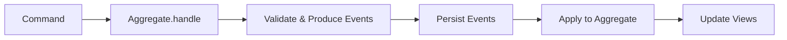
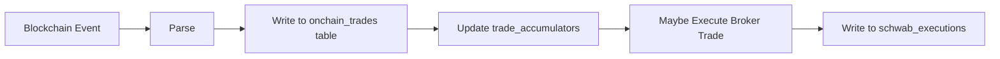
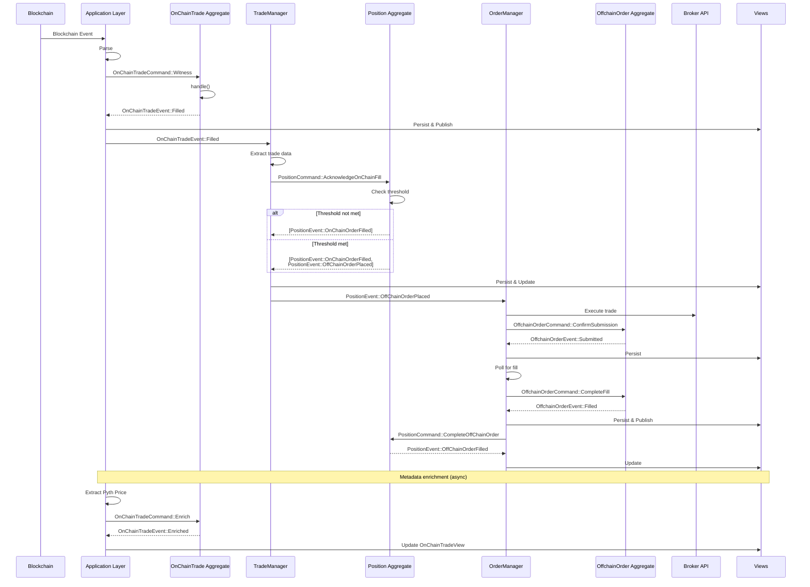

# **Arbitrage Bot Specification for Tokenized Equities (V1 MVP)**

## **Background**

Early-stage onchain tokenized equity markets typically suffer from poor price
discovery and limited liquidity. Without sufficient market makers, onchain
prices can diverge substantially from traditional equity market prices, creating
a poor user experience and limiting adoption.

## **Solution Overview**

This specification outlines a minimum viable product (MVP) arbitrage bot that
helps establish price discovery by exploiting discrepancies between onchain
tokenized equities and their traditional market counterparts.

The bot monitors Raindex Orders from a specific owner that continuously offer
tokenized equities at spreads around Pyth oracle prices. When a solver clears
any of these orders, the bot immediately executes an offsetting trade on a
supported brokerage (Charles Schwab or Alpaca Markets), hedging directional
exposure while capturing the spread differential.

The focus is on getting a functional system live quickly. There are known risks
that will be addressed in future iterations as total value locked (TVL) grows
and the system proves market fit.

## **Operational Process and Architecture**

### **System Components**

**Onchain Infrastructure:**

- Raindex orderbook with deployed Orders from specific owner using Pyth oracle
  feeds
  - Multiple orders continuously offer to buy/sell different tokenized equities
    at Pyth price ± spread
- Order vaults holding stablecoins and tokenized equities

**Offchain Infrastructure:**

- Brokerage account with API access (Charles Schwab or Alpaca Markets)
- Arbitrage bot monitoring and execution engine
- Basic terminal/logging interface for system overview

**Bridge Infrastructure:**

- st0x bridge for offchain ↔ onchain asset movement

### **Operational Flow**

**Normal Operation Cycle:**

1. Orders continuously offer to buy/sell tokenized equities at Pyth price ±
   spread
2. Bot monitors Raindex for clears involving any orders from the arbitrageur's
   owner address
3. Bot records onchain trades and accumulates net position changes per symbol
4. When accumulated net position reaches an absolute value of ≥1.0 share,
   execute offsetting trade for floor(abs(net_position)) shares on the selected
   brokerage, using the sign of the net position to determine side (positive =
   sell to reduce a long, negative = buy to cover a short), and continue
   tracking the remaining fractional share (net_position minus the executed
   floor) with its sign for future batching
5. Bot maintains running inventory of positions across both venues
6. Periodic rebalancing via st0x bridge to normalize inventory levels

**Note on Fractional Share Handling:**

- **Charles Schwab**: Does not support fractional shares via their API. Batching
  to whole shares is required (as described above).
- **Alpaca Markets**: Supports fractional share trading (minimum $1 worth). The
  current implementation uses the same batching logic for both brokers, but this
  may be reconfigured to allow immediate fractional execution when using Alpaca,
  reducing unhedged exposure.

Example (Offchain Batching):

- Onchain trades: 0.3 AAPL sold, 0.5 AAPL sold, 0.4 AAPL sold -> net 1.2 AAPL
  sold
- Bot executes: Buy 1 AAPL share on broker (floor of 1.2), continues tracking
  0.2 AAPL net exposure
- Continue accumulating fractional amount until next whole share threshold is
  reached

**Rebalancing Process (Manual for now):**

- Monitor inventory drift over time, executing st0x bridge transfers to
  rebalance equity positions on/offchain
- Move stablecoins/USD as needed to maintain adequate trading capital
- Maintain sufficient offchain equity positions to match potential onchain sales
  and vice versa

## **Bot Implementation Specification**

The arbitrage bot will be built in Rust to leverage its performance, safety, and
excellent async ecosystem for handling concurrent trading flows.

### **Event Monitoring**

**Raindex Event Monitor:**

- WebSocket or polling connection to Ethereum node
- Filter for events involving any orders from the arbitrageur's owner address
  (Clear and TakeOrder events)
- Parse events to extract: symbol, quantity, price, direction
- Generate unique identifiers using transaction hash and log index for trade
  tracking

**Event-Driven Async Architecture:**

- Each blockchain event spawns an independent async execution flow using Rust's
  async/await
- Multiple trade flows run concurrently without blocking each other
- Handles throughput mismatch: fast onchain events vs slower broker
  execution/confirmation
- No artificial concurrency limits - process events as fast as they arrive
- Tokio async runtime manages hundreds of concurrent trades efficiently on
  limited hardware
- Each flow: Parse Event -> Event Queue -> Deduplication Check -> Position
  Accumulation -> Broker Execution (when threshold reached) -> Record Result
- Failed flows retry independently without affecting other trades

### **Trade Execution**

**Broker API Integration:**

The bot supports multiple brokers through a unified trait interface:

**Charles Schwab:**

- OAuth 2.0 authentication flow with token refresh
- Connection pooling and retry logic for API calls with exponential backoff
- Rate limiting compliance and queue management
- Market order execution for immediate fills
- Order status tracking and confirmation with polling

**Alpaca Markets:**

- API key-based authentication (simpler than OAuth)
- Market order execution through Alpaca Trading API v2
- Order status polling and updates
- Support for both paper trading and live trading environments
- Position querying for inventory management
- Account balance monitoring for available capital

**Idempotency Controls:**

- Event queue table to track all events with unique (transaction_hash,
  log_index) keys prevents duplicate processing
- Check event queue before processing any event to prevent duplicates
- Onchain trades are recorded immediately upon event processing
- Position accumulation happens in dedicated accumulators table per symbol
- Broker executions track status ('PENDING', 'SUBMITTED', 'FILLED', 'FAILED')
  with broker type field for multi-broker support
- Complete audit trail maintained linking individual trades to batch executions
- Proper error handling and structured error logging

### **Trade Tracking and Reporting**

**SQLite Trade Database:**

The bot uses a multi-table SQLite database to track trades and manage state. Key
tables include: onchain trade records, broker execution tracking, position
accumulators for batching fractional shares, audit trail linking, OAuth token
storage, and event queue for idempotency. The complete database schema is
defined in `migrations/20250703115746_trades.sql`.

- Store each onchain trade with symbol, amount, direction, and price
- Track broker executions separately with whole share amounts, status, and
  broker type ('schwab', 'alpaca', 'dry_run')
- Accumulate fractional positions per symbol until execution thresholds are
  reached (required for Charles Schwab; used uniformly across all brokers in
  current implementation)
- Maintain complete audit trail linking onchain trades to broker executions
- Handle concurrent database writes safely with per-symbol locking

**Pyth Price Extraction:**

- Extracts exact oracle prices used during trade execution from transaction
  traces
- Uses `debug_traceTransaction` RPC method to analyze transaction execution
- Parses Pyth oracle contract calls to retrieve precise price data including
  price value, confidence interval, exponent, and publish timestamp
- Prices are stored in the `onchain_trades` table alongside trade records
- NULL price values indicate extraction failed (e.g., no Pyth call in trace, RPC
  errors)
- CLI command for testing: `cargo run --bin cli get-pyth-price <TX_HASH>`
- Trade processing continues normally even if price extraction fails

**Reporting and Analysis:**

- Calculate profit/loss for each trade pair using actual executed amounts
- Generate running totals and performance reports over time
- Track inventory positions across both venues
- Push aggregated metrics to external logging system using structured logging
- Identify unprofitable trades for strategy optimization
- Separate reporting process reads from SQLite database for analysis without
  impacting trading performance

### **Health Monitoring and Logging**

- System uptime and connectivity status using structured logging
- API rate limiting and error tracking with metrics collection
- Position drift alerts and rebalancing triggers
- Latency monitoring for trade execution timing
- Configuration management with environment variables and config files
- Proper error propagation and custom error types

### **Risk Management**

- Manual override capabilities for emergency situations with proper
  authentication
- Graceful shutdown handling to complete in-flight trades before stopping

### **CI/CD and Deployment**

**Containerization:**

- Docker containerization for consistent deployment with multi-stage builds
- Simple CI/CD pipeline for automated builds and deployments
- Health check endpoints for container orchestration
- Environment-based configuration injection
- Resource limits and restart policies for production deployment

## **System Risks**

The following risks are known for v1 but will not be addressed in the initial
implementation. Solutions will be developed in later iterations.

### **Offchain Risks**

- **Fractional Share Exposure**: Charles Schwab does not support fractional
  share trading, requiring offchain batching until net positions reach whole
  share amounts. This creates temporary unhedged exposure for fractional amounts
  that haven't reached the execution threshold. Note: Alpaca Markets supports
  fractional share trading (minimum $1 worth of shares), but we currently use
  the same batching logic for both brokers. This may be reconfigured in the
  future to allow immediate fractional execution when using Alpaca.
- **Missed Trade Execution**: The bot fails to execute offsetting trades on the
  selected brokerage when onchain trades occur, creating unhedged exposure. For
  example:
  - Bot downtime while onchain order remains active
  - Bot detects onchain trade but fails to execute offchain trade
  - Broker API failures or rate limiting during critical periods
- **After-Hours Trading Gap**: Pyth oracle may continue operating when
  traditional markets are closed, allowing onchain trades while broker markets
  are unavailable. Creates guaranteed daily exposure windows.

### **Onchain Risks**

- **Stale Pyth Oracle Data**: If the oracle becomes stale, the order won't trade
  onchain, resulting in missed arbitrage opportunities. However, this is
  preferable to the alternative scenario where trades execute onchain but the
  bot cannot make offsetting offchain trades.
- **Solver fails:** if the solver fails, again onchain trades won't happen but
  as above this is simply opportunity cost.

---

## **DDD/CQRS/ES Migration Proposal**

### **Background**

The current implementation provides some auditability through `onchain_trades`,
`schwab_executions`, and `trade_execution_links`. However, these tables are
mutable and don't form a complete event log:

**Current Limitations:**

- **Mutable state**: Tables can be updated/deleted, losing history of state
  transitions (e.g., `schwab_executions.status` transitions from PENDING ->
  SUBMITTED -> COMPLETED are lost, we only see final state)
- **Partial audit trail**: Know which trades linked to which executions, but not
  why batching decisions were made or when thresholds were crossed
- **Can't rebuild from history**: If `trade_accumulators.net_position` gets
  corrupted, can't reconstruct it from trades (trades are facts, but the
  accumulation logic isn't captured)
- **Schema evolution requires migrations**: Adding new metrics (e.g., PnL
  tracking, fill quality analysis) requires ALTER TABLE and backfilling
- **State machine in application code**: Position lifecycle rules (when to
  execute, how to batch) are scattered across functions - hard to test in
  isolation

**Event Sourcing Improvements:**

Events ARE immutable facts, but the current system only captures some facts
(trades executed, final execution state) while losing others (when thresholds
were crossed, status transitions, why batching decisions occurred). An event
store treats every significant occurrence as a fact:

- **Complete history**: Every state change is a fact with timestamp and sequence
- **Reproducible state**: Replay facts to rebuild any view, fixing corruption
- **Temporal queries**: "What was the position at any point in time?"
- **Zero-downtime projections**: Add new views by replaying existing events
- **Testable business logic**: Given-When-Then tests validate rules without
  database
- **Type-safe state machines**: Invalid transitions become compilation errors

We will migrate st0x.liquidity-a to DDD/CQRS/ES patterns for:

- **Auditability**: Complete audit trail of all system state changes
- **Debuggability**: Time-travel debugging by replaying events
- **Schema Evolution**: Easy to add new projections without migrations
- **Type Safety**: Make invalid states unrepresentable through ADTs
- **Testability**: Given-When-Then testing pattern for business logic
- **Reasoning**: Clear separation between facts (events) and derived data
  (views)

### **Migration Strategy Overview**

This migration will transform the current database from a CRUD-style schema to
an event-sourced architecture:

**Before**: Multiple mutable state tables with potential contradictions

**After**:

- **Event Store**: Immutable append-only log (single source of truth)
- **Snapshots**: Performance optimization for aggregate reconstruction
- **Views**: Materialized projections optimized for queries

**Grafana Dashboard Strategy**: The migration aims to minimize changes to
existing Grafana dashboards by using SQLite generated columns to expose the same
column names as current tables. This allows most queries to work with only table
name changes (e.g., `onchain_trades` -> `onchain_trade_view`). Additionally, we
can create specialized views that pre-compute complex metrics, simplifying
queries and improving performance.

### **Core Architecture**

#### **Event Sourcing Pattern**

All state changes are captured as immutable domain events. The event store is
the single source of truth. All other data (views, snapshots) is derived and can
be rebuilt at any time.

**Key Flow:**



#### **Database Schema**

##### **Event Store Tables** (Single Source of Truth)

```sql
-- Events table: stores all domain events
CREATE TABLE events (
    aggregate_type TEXT NOT NULL,      -- 'OnChainTrade', 'Position', 'OffchainOrder', etc.
    aggregate_id TEXT NOT NULL,        -- Unique identifier for aggregate instance
    sequence BIGINT NOT NULL,          -- Sequence number (starts at 1)
    event_type TEXT NOT NULL,          -- Event name (e.g., 'OnChainOrderFilled')
    event_version TEXT NOT NULL,       -- Event schema version (e.g., '1.0')
    payload JSON NOT NULL,             -- Event data as JSON
    metadata JSON NOT NULL,            -- Correlation IDs, timestamps, etc.
    PRIMARY KEY (aggregate_type, aggregate_id, sequence)
);

CREATE INDEX idx_events_type ON events(aggregate_type);
CREATE INDEX idx_events_aggregate ON events(aggregate_id);

-- Snapshots table: aggregate cache for performance
CREATE TABLE snapshots (
    aggregate_type TEXT NOT NULL,
    aggregate_id TEXT NOT NULL,
    last_sequence BIGINT NOT NULL,    -- Last event sequence in snapshot
    payload JSON NOT NULL,             -- Serialized aggregate state
    timestamp TEXT NOT NULL,
    PRIMARY KEY (aggregate_type, aggregate_id)
);
```

##### **View Tables** (Derived Read Models)

Views are materialized projections built from events, optimized for specific
query patterns. These views use SQLite generated columns to expose JSON fields
as regular columns, maintaining backward compatibility with existing Grafana
dashboards and queries.

```sql
-- Position view: current position state per symbol
-- Replaces: trade_accumulators table
CREATE TABLE position_view (
    view_id TEXT PRIMARY KEY,         -- symbol
    version BIGINT NOT NULL,          -- Last event sequence applied
    payload JSON NOT NULL,            -- Current position state

    -- Generated columns for backward compatibility with trade_accumulators
    symbol TEXT GENERATED ALWAYS AS (json_extract(payload, '$.symbol')) VIRTUAL,
    net_position REAL GENERATED ALWAYS AS (json_extract(payload, '$.net_position')) VIRTUAL,
    accumulated_long REAL GENERATED ALWAYS AS (json_extract(payload, '$.accumulated_long')) VIRTUAL,
    accumulated_short REAL GENERATED ALWAYS AS (json_extract(payload, '$.accumulated_short')) VIRTUAL,
    pending_execution_id TEXT GENERATED ALWAYS AS (json_extract(payload, '$.pending_execution_id')) VIRTUAL,
    last_updated TEXT GENERATED ALWAYS AS (json_extract(payload, '$.last_updated')) VIRTUAL
);

CREATE INDEX idx_position_view_symbol ON position_view(symbol);
CREATE INDEX idx_position_view_net_position ON position_view(net_position);
CREATE INDEX idx_position_view_last_updated ON position_view(last_updated);

-- Offchain trade view: all broker trade executions
-- Replaces: schwab_executions table
CREATE TABLE offchain_trade_view (
    view_id TEXT PRIMARY KEY,         -- execution_id
    version BIGINT NOT NULL,
    payload JSON NOT NULL,

    -- Generated columns for backward compatibility with schwab_executions
    id INTEGER GENERATED ALWAYS AS (CAST(json_extract(payload, '$.execution_id') AS INTEGER)) VIRTUAL,
    symbol TEXT GENERATED ALWAYS AS (json_extract(payload, '$.symbol')) VIRTUAL,
    shares INTEGER GENERATED ALWAYS AS (json_extract(payload, '$.shares')) VIRTUAL,
    direction TEXT GENERATED ALWAYS AS (json_extract(payload, '$.direction')) VIRTUAL,
    order_id TEXT GENERATED ALWAYS AS (json_extract(payload, '$.broker_order_id')) VIRTUAL,
    price_cents INTEGER GENERATED ALWAYS AS (json_extract(payload, '$.price_cents')) VIRTUAL,
    status TEXT GENERATED ALWAYS AS (json_extract(payload, '$.status')) VIRTUAL,
    executed_at TEXT GENERATED ALWAYS AS (json_extract(payload, '$.completed_at')) VIRTUAL
);

CREATE INDEX idx_offchain_trade_view_symbol ON offchain_trade_view(symbol);
CREATE INDEX idx_offchain_trade_view_status ON offchain_trade_view(status);

-- OnChain trade view: blockchain trade records
-- Replaces: onchain_trades table
CREATE TABLE onchain_trade_view (
    view_id TEXT PRIMARY KEY,         -- tx_hash:log_index
    version BIGINT NOT NULL,
    payload JSON NOT NULL,

    -- Generated columns for backward compatibility with onchain_trades
    id INTEGER GENERATED ALWAYS AS (CAST(json_extract(payload, '$.id') AS INTEGER)) VIRTUAL,
    tx_hash TEXT GENERATED ALWAYS AS (json_extract(payload, '$.tx_hash')) VIRTUAL,
    log_index INTEGER GENERATED ALWAYS AS (json_extract(payload, '$.log_index')) VIRTUAL,
    symbol TEXT GENERATED ALWAYS AS (json_extract(payload, '$.symbol')) VIRTUAL,
    amount REAL GENERATED ALWAYS AS (json_extract(payload, '$.amount')) VIRTUAL,
    direction TEXT GENERATED ALWAYS AS (json_extract(payload, '$.direction')) VIRTUAL,
    price_usdc REAL GENERATED ALWAYS AS (json_extract(payload, '$.price_usdc')) VIRTUAL,
    block_number INTEGER GENERATED ALWAYS AS (json_extract(payload, '$.block_number')) VIRTUAL,
    block_timestamp TEXT GENERATED ALWAYS AS (json_extract(payload, '$.block_timestamp')) VIRTUAL,
    gas_used INTEGER GENERATED ALWAYS AS (json_extract(payload, '$.gas_used')) VIRTUAL,
    pyth_price_value TEXT GENERATED ALWAYS AS (json_extract(payload, '$.pyth_price.value')) VIRTUAL,
    pyth_price_expo INTEGER GENERATED ALWAYS AS (json_extract(payload, '$.pyth_price.expo')) VIRTUAL,
    pyth_price_conf TEXT GENERATED ALWAYS AS (json_extract(payload, '$.pyth_price.conf')) VIRTUAL,
    created_at TEXT GENERATED ALWAYS AS (json_extract(payload, '$.recorded_at')) VIRTUAL
);

CREATE INDEX idx_onchain_trade_view_symbol ON onchain_trade_view(symbol);
CREATE INDEX idx_onchain_trade_view_block_number ON onchain_trade_view(block_number);
CREATE INDEX idx_onchain_trade_view_created_at ON onchain_trade_view(created_at);
CREATE INDEX idx_onchain_trade_view_direction ON onchain_trade_view(direction);

-- PnL metrics view: profit/loss calculations
-- Replaces: metrics_pnl table
CREATE TABLE metrics_pnl_view (
    view_id TEXT PRIMARY KEY,         -- unique metric id
    version BIGINT NOT NULL,
    payload JSON NOT NULL,

    -- Generated columns for backward compatibility with metrics_pnl
    id INTEGER GENERATED ALWAYS AS (CAST(json_extract(payload, '$.id') AS INTEGER)) VIRTUAL,
    symbol TEXT GENERATED ALWAYS AS (json_extract(payload, '$.symbol')) VIRTUAL,
    timestamp TEXT GENERATED ALWAYS AS (json_extract(payload, '$.timestamp')) VIRTUAL,
    trade_type TEXT GENERATED ALWAYS AS (json_extract(payload, '$.trade_type')) VIRTUAL,
    trade_id INTEGER GENERATED ALWAYS AS (json_extract(payload, '$.trade_id')) VIRTUAL,
    trade_direction TEXT GENERATED ALWAYS AS (json_extract(payload, '$.trade_direction')) VIRTUAL,
    quantity REAL GENERATED ALWAYS AS (json_extract(payload, '$.quantity')) VIRTUAL,
    price_per_share REAL GENERATED ALWAYS AS (json_extract(payload, '$.price_per_share')) VIRTUAL,
    realized_pnl REAL GENERATED ALWAYS AS (json_extract(payload, '$.realized_pnl')) VIRTUAL,
    cumulative_pnl REAL GENERATED ALWAYS AS (json_extract(payload, '$.cumulative_pnl')) VIRTUAL,
    net_position_after REAL GENERATED ALWAYS AS (json_extract(payload, '$.net_position_after')) VIRTUAL
);

CREATE INDEX idx_metrics_pnl_view_symbol ON metrics_pnl_view(symbol);
CREATE INDEX idx_metrics_pnl_view_timestamp ON metrics_pnl_view(timestamp);
CREATE INDEX idx_metrics_pnl_view_symbol_timestamp ON metrics_pnl_view(symbol, timestamp);

-- Schwab auth view: OAuth token storage for internal bot use only
-- Replaces: schwab_auth table
CREATE TABLE schwab_auth_view (
    view_id TEXT PRIMARY KEY,         -- Always 'schwab' (singleton)
    version BIGINT NOT NULL,
    payload JSON NOT NULL             -- Encrypted tokens
);
```

**Grafana Dashboard Migration:**

Most existing Grafana queries can migrate with only table name changes:

Consider this hypothetical query:

```sql
-- Old query (using onchain_trades table)
SELECT symbol, amount, price_usdc, created_at
FROM onchain_trades
WHERE symbol = 'AAPL' AND created_at > datetime('now', '-7 days');

-- New query (using onchain_trade_view table) - only table name changes
SELECT symbol, amount, price_usdc, created_at
FROM onchain_trade_view
WHERE symbol = 'AAPL' AND created_at > datetime('now', '-7 days');
```

Generated columns are indexed for query performance, ensuring dashboards
maintain their current performance characteristics.

**Opportunity for Dashboard Simplification:**

The event-sourced architecture allows us to create specialized views that
pre-compute complex metrics, replacing complex Grafana queries with simple
SELECTs.

For example, a dashboard showing buy and sell prices from both onchain and
offchain trades would need to UNION data from multiple tables and convert price
units:

```sql
-- Before: Complex query UNIONing onchain and offchain trades
SELECT
    created_at,
    direction,
    price,
    'ONCHAIN' as trade_type
FROM (
    -- Onchain trades with price in USDC
    SELECT
        created_at,
        direction,
        price_usdc as price
    FROM onchain_trades
    WHERE symbol = '${Symbol}'

    UNION ALL

    -- Offchain trades with price in cents, converted to dollars
    SELECT
        executed_at as created_at,
        direction,
        CAST(price_cents AS REAL) / 100.0 as price
    FROM schwab_executions
    WHERE symbol = '${Symbol}'
      AND status = 'FILLED'
)
ORDER BY created_at;

-- After: Pre-computed unified view with normalized prices
SELECT created_at, direction, price, trade_type
FROM unified_trade_view
WHERE symbol = '${Symbol}'
ORDER BY created_at;
```

Complex queries can be identified and replaced with optimized views, improving
both dashboard performance and maintainability.

### Architecture Decision: Position as Aggregate

In DDD, entities are objects defined by their identity and continuity rather
than their attributes - they have a lifecycle and change over time while
maintaining the same identity. Aggregates are entities that enforce business
rules and maintain consistency boundaries.

OnChain trades, offchain orders, and positions are all entities with distinct
lifecycles, so we model them as separate aggregates:

- **OnChainTrade**: Lifecycle = blockchain fill -> enriched with metadata.
  Immutable blockchain facts (reorgs not currently handled, see Future
  Consideration section).
- **OffchainOrder**: Lifecycle = placed -> submitted -> filled/failed. Broker
  order tracking.
- **Position**: Lifecycle = accumulates fills -> triggers hedging decisions.
  Uses configurable threshold (shares or dollar value) to determine when to
  place offsetting broker orders. Schwab uses shares threshold (1.0 minimum),
  Alpaca can use dollar threshold ($1.00 minimum).

This means blockchain fills are recorded in both OnChainTradeEvent::Filled
(audit trail) and PositionEvent::OnChainOrderFilled (position tracking), but
they serve different purposes in different bounded contexts.

### **Aggregate Design**

#### **OnChainTrade Aggregate**

**Purpose**: Represents a single filled order from the blockchain. Decouples
trade recording from position management, allowing metadata enrichment without
affecting position calculations.

**Aggregate ID**: `"{tx_hash}:{log_index}"` (e.g., "0x123...abc:5")

**States**:

```rust
#[derive(Debug, Clone, Serialize, Deserialize)]
enum OnChainTrade {
    Filled {
        symbol: Symbol,
        amount: Decimal,
        direction: Direction,
        price_usdc: Decimal,
        block_number: u64,
        block_timestamp: DateTime<Utc>,
        filled_at: DateTime<Utc>,
    },
    Enriched {
        symbol: Symbol,
        amount: Decimal,
        direction: Direction,
        price_usdc: Decimal,
        block_number: u64,
        block_timestamp: DateTime<Utc>,
        filled_at: DateTime<Utc>,
        gas_used: u64,
        pyth_price: PythPrice,
        enriched_at: DateTime<Utc>,
    },
}
```

**Commands**:

```rust
enum OnChainTradeCommand {
    Witness {
        symbol: Symbol,
        amount: Decimal,
        direction: Direction,
        price_usdc: Decimal,
        block_number: u64,
        block_timestamp: DateTime<Utc>,
    },
    Enrich {
        gas_used: u64,
        pyth_price: PythPrice,
    },
}
```

**Events**:

```rust
enum OnChainTradeEvent {
    Filled {
        symbol: Symbol,
        amount: Decimal,
        direction: Direction,
        price_usdc: Decimal,
        block_number: u64,
        block_timestamp: DateTime<Utc>,
        filled_at: DateTime<Utc>,
    },
    Enriched {
        gas_used: u64,
        pyth_price: PythPrice,
        enriched_at: DateTime<Utc>,
    },
}
```

**Business Rules** (enforced in `handle()`):

- Can only enrich once
- Cannot enrich before fill is witnessed

#### **Position Aggregate**

**Purpose**: Manages accumulated position for a single symbol, tracking
fractional shares and coordinating offchain hedging when thresholds are reached.

**Aggregate ID**: `symbol` (e.g., "AAPL")

**State**:

```rust
#[derive(Debug, Clone, Serialize, Deserialize)]
struct Position {
    symbol: Symbol,
    net_position: Decimal,
    accumulated_long: Decimal,
    accumulated_short: Decimal,
    pending_execution_id: Option<ExecutionId>,
    threshold: ExecutionThreshold,
    last_updated: Option<DateTime<Utc>>,
}

#[derive(Debug, Clone, Serialize, Deserialize)]
enum ExecutionThreshold {
    Shares(Decimal),      // Schwab: 1.0 shares minimum
    DollarValue(Decimal), // Alpaca: $1.00 minimum trade value
}
```

**Commands**:

```rust
enum PositionCommand {
    Initialize {
        threshold: ExecutionThreshold,
    },
    AcknowledgeOnChainFill {
        trade_id: TradeId,
        amount: Decimal,
        direction: Direction,
        price_usdc: Decimal,  // Needed for dollar threshold check
    },
    PlaceOffChainOrder {
        shares: u64,
        direction: Direction,
        broker: SupportedBroker,
    },
    CompleteOffChainOrder {
        execution_id: ExecutionId,
        broker_order_id: String,
        price_cents: i64,
    },
    FailOffChainOrder {
        execution_id: ExecutionId,
        error: String,
    },
    UpdateThreshold {
        threshold: ExecutionThreshold,
    },
}
```

**Events**:

```rust
enum PositionEvent {
    Initialized {
        threshold: ExecutionThreshold,
        initialized_at: DateTime<Utc>,
    },
    OnChainOrderFilled {
        trade_id: TradeId,
        amount: Decimal,
        direction: Direction,
        price_usdc: Decimal,
        new_net_position: Decimal,
        block_timestamp: DateTime<Utc>,
        seen_at: DateTime<Utc>,
    },
    OffChainOrderPlaced {
        execution_id: ExecutionId,
        shares: u64,
        direction: Direction,
        broker: SupportedBroker,
        trigger_reason: TriggerReason,  // Records why execution triggered
        placed_at: DateTime<Utc>,
    },
    OffChainOrderFilled {
        execution_id: ExecutionId,
        broker_order_id: String,
        price_cents: i64,
        new_net_position: Decimal,
        broker_timestamp: DateTime<Utc>,
        seen_at: DateTime<Utc>,
    },
    OffChainOrderFailed {
        execution_id: ExecutionId,
        error: String,
        failed_at: DateTime<Utc>,
    },
    ThresholdUpdated {
        old_threshold: ExecutionThreshold,
        new_threshold: ExecutionThreshold,
        updated_at: DateTime<Utc>,
    },
}

#[derive(Debug, Clone, Serialize, Deserialize)]
enum TriggerReason {
    SharesThreshold {
        net_position_shares: Decimal,
        threshold_shares: Decimal,
    },
    DollarThreshold {
        net_position_shares: Decimal,
        dollar_value: Decimal,
        price_usdc: Decimal,
        threshold_dollars: Decimal,
    },
}
```

**Business Rules** (enforced in `handle()`):

- Threshold must be configured before processing any fills (Initialize command)
- Can only place offchain order when threshold is met:
  - **Shares threshold**: `|net_position| >= threshold` (e.g., 1.0 shares for
    Schwab)
  - **Dollar threshold**: `|net_position * price_usdc| >= threshold` (e.g.,
    $1.00 for Alpaca)
- Direction of offchain order must be opposite to accumulated position (positive
  net = sell, negative net = buy)
- Cannot have multiple pending executions for same symbol
- OnChain fills are always applied (blockchain facts are immutable)
- Threshold can be updated at any time, emits ThresholdUpdated event for audit
  trail

#### **OffchainOrder Aggregate**

**Purpose**: Manages the lifecycle of a single broker order, tracking
submission, filling, and settlement.

**Aggregate ID**: `order_id` (UUID)

**States**:

```rust
#[derive(Debug, Clone, Serialize, Deserialize)]
enum OffchainOrder {
    NotPlaced,
    Pending {
        symbol: Symbol,
        shares: u64,
        direction: Direction,
        broker: SupportedBroker,
        placed_at: DateTime<Utc>,
    },
    Submitted {
        symbol: Symbol,
        shares: u64,
        direction: Direction,
        broker: SupportedBroker,
        broker_order_id: String,
        placed_at: DateTime<Utc>,
        submitted_at: DateTime<Utc>,
    },
    PartiallyFilled {
        symbol: Symbol,
        shares: u64,
        shares_filled: u64,
        direction: Direction,
        broker: SupportedBroker,
        broker_order_id: String,
        avg_price_cents: i64,
        placed_at: DateTime<Utc>,
        submitted_at: DateTime<Utc>,
        partially_filled_at: DateTime<Utc>,
    },
    Filled {
        symbol: Symbol,
        shares: u64,
        direction: Direction,
        broker: SupportedBroker,
        broker_order_id: String,
        price_cents: i64,
        placed_at: DateTime<Utc>,
        submitted_at: DateTime<Utc>,
        filled_at: DateTime<Utc>,
    },
    Failed {
        symbol: Symbol,
        shares: u64,
        direction: Direction,
        broker: SupportedBroker,
        error: String,
        placed_at: DateTime<Utc>,
        failed_at: DateTime<Utc>,
    },
}
```

**Commands**:

```rust
enum OffchainOrderCommand {
    Place {
        symbol: Symbol,
        shares: u64,
        direction: Direction,
        broker: SupportedBroker,
    },
    ConfirmSubmission {
        broker_order_id: String,
    },
    UpdatePartialFill {
        shares_filled: u64,
        avg_price_cents: i64,
    },
    CompleteFill {
        price_cents: i64,
    },
    MarkFailed {
        error: String,
    },
}
```

**Events**:

```rust
enum OffchainOrderEvent {
    Placed {
        symbol: Symbol,
        shares: u64,
        direction: Direction,
        broker: SupportedBroker,
        placed_at: DateTime<Utc>,
    },
    Submitted {
        broker_order_id: String,
        submitted_at: DateTime<Utc>,
    },
    PartiallyFilled {
        shares_filled: u64,
        avg_price_cents: i64,
        partially_filled_at: DateTime<Utc>,
    },
    Filled {
        price_cents: i64,
        filled_at: DateTime<Utc>,
    },
    Failed {
        error: String,
        failed_at: DateTime<Utc>,
    },
}
```

#### **SchwabAuth Aggregate**

**Purpose**: Manages OAuth tokens for Charles Schwab broker. Alpaca uses simple
API key/secret (configured via environment variables) and doesn't require
database storage.

**Aggregate ID**: `"schwab"` (singleton)

**States**:

```rust
enum SchwabAuth {
    NotAuthenticated,
    Authenticated {
        access_token: EncryptedToken,
        access_token_fetched_at: DateTime<Utc>,
        refresh_token: EncryptedToken,
        refresh_token_fetched_at: DateTime<Utc>,
    },
}
```

**Commands**:

```rust
enum SchwabAuthCommand {
    StoreTokens {
        access_token: String,
        refresh_token: String,
    },
    RefreshAccessToken {
        new_access_token: String,
    },
}
```

**Events**:

```rust
enum SchwabAuthEvent {
    TokensStored {
        access_token: EncryptedToken,
        access_token_fetched_at: DateTime<Utc>,
        refresh_token: EncryptedToken,
        refresh_token_fetched_at: DateTime<Utc>,
    },
    AccessTokenRefreshed {
        access_token: EncryptedToken,
        refreshed_at: DateTime<Utc>,
    },
}
```

### **View Design**

#### **Position View**

**Purpose**: Current position state for all symbols, optimized for querying by
symbol and position status.

**View State**:

```rust
enum PositionView {
    Unavailable,
    Position {
        symbol: Symbol,
        net_position: Decimal,
        accumulated_long: Decimal,
        accumulated_short: Decimal,
        pending_execution_id: Option<ExecutionId>,
        last_updated: DateTime<Utc>,
    },
}
```

**Projection Logic**: Updates on `PositionEvent::*`

#### **OffchainTradeView**

**Purpose**: All broker executions with filtering by status and symbol.

**View State**:

```rust
enum OffchainTradeView {
    Unavailable,
    Execution {
        execution_id: ExecutionId,
        symbol: Symbol,
        shares: u64,
        direction: Direction,
        broker: SupportedBroker,
        status: ExecutionStatus,
        broker_order_id: Option<String>,
        price_cents: Option<i64>,
        initiated_at: DateTime<Utc>,
        completed_at: Option<DateTime<Utc>>,
    },
}

enum ExecutionStatus {
    Pending,
    Submitted,
    Filled,
    Failed,
}
```

**Projection Logic**: Updates on `OffchainOrderEvent::*`, building view of
filled orders (which become trades)

#### **OnChainTradeView**

**Purpose**: Immutable record of all blockchain trades.

**View State**:

```rust
enum OnChainTradeView {
    Unavailable,
    Trade {
        tx_hash: TxHash,
        log_index: u64,
        symbol: Symbol,
        amount: Decimal,
        direction: Direction,
        price_usdc: Decimal,
        block_number: u64,
        block_timestamp: DateTime<Utc>,
        gas_used: Option<u64>,
        pyth_price: Option<PythPrice>,
        recorded_at: DateTime<Utc>,
    },
}
```

**Projection Logic**: Builds from `OnChainTradeEvent::Filled` and
`OnChainTradeEvent::Enriched`

#### **MetricsPnLView**

**Purpose**: Profit/loss calculations per symbol over time.

**View State**:

```rust
enum MetricsPnLView {
    Unavailable,
    Metrics {
        id: i64,
        symbol: Symbol,
        timestamp: DateTime<Utc>,
        venue: Venue,
        trade_id: i64,
        trade_direction: Direction,
        quantity: Decimal,
        price_per_share: Decimal,
        realized_pnl: Option<Decimal>,
        cumulative_pnl: Decimal,
        net_position_after: Decimal,
    },
}

enum Venue {
    OnChain,
    OffChain { broker: SupportedBroker },
}
```

**Projection Logic**: Calculates from both `OnChainTradeEvent::Filled` and
`PositionEvent::OffChainOrderFilled` events

### **Event Processing Flow**

#### **OnChain Event Processing**

**Current Flow** (CRUD):



**New Flow** (CQRS/ES with Managers):


