# SPEC.md

System specification for st0x liquidity. Covers architecture, behavior, and
design decisions at a level sufficient to understand the system without
prescribing exact commands or code. For terminology and naming conventions, see
[docs/domain.md](docs/domain.md).

Current supported offchain execution backends are `alpaca-broker-api` and
`dry-run`.

## Background

Early-stage onchain tokenized equity markets typically suffer from poor price
discovery and limited liquidity. Without sufficient market makers, onchain
prices can diverge substantially from traditional equity market prices, creating
a poor user experience and limiting adoption.

## Solution Overview

This specification outlines a minimum viable product (MVP) arbitrage bot that
helps establish price discovery by exploiting discrepancies between onchain
tokenized equities and their traditional market counterparts.

The bot monitors Raindex Orders from a specific owner that continuously offer
tokenized equities at spreads around Pyth oracle prices. When a solver clears
any of these orders, the bot immediately executes an offsetting trade on the
supported brokerage backend (Alpaca Broker API), hedging directional exposure
while capturing the spread differential.

The focus is on getting a functional system live quickly. There are known risks
that will be addressed in future iterations as total value locked (TVL) grows
and the system proves market fit.

## Operational Process and Architecture

### System Components

#### Onchain Infrastructure

- Raindex orderbook with deployed Orders from specific owner using Pyth oracle
  feeds
  - Multiple orders continuously offer to buy/sell different tokenized equities
    at Pyth price ± spread
- Order vaults holding stablecoins and tokenized equities

#### Offchain Infrastructure

- Brokerage account with API access (Alpaca Markets)
- Arbitrage bot monitoring and execution engine
- Basic terminal/logging interface for system overview

#### Bridge Infrastructure

- st0x bridge for offchain ↔ onchain asset movement

### Operational Flow

#### Normal Operation Cycle

1. Orders continuously offer to buy/sell tokenized equities at Pyth price ±
   spread
2. Bot monitors Raindex for clears involving any orders from the arbitrageur's
   owner address
3. Bot records onchain trades and accumulates net position changes per symbol
4. When accumulated net position reaches the configured execution threshold,
   execute the offsetting trade on the selected brokerage, using the sign of the
   net position to determine side (positive = sell to reduce a long, negative =
   buy to cover a short)
5. Bot maintains running inventory of positions across both venues
6. Periodic rebalancing via st0x bridge to normalize inventory levels

#### Note on Fractional Share Handling

- **Alpaca Broker API**: Supports fractional share trading. Production can use
  dollar-value execution thresholds to reduce unhedged exposure while still
  respecting buying-power constraints.
- **Dry run**: Supports fractional arithmetic for simulation and testing.
  Operators may still configure whole-share thresholds when that is useful for
  conservative modeling.

#### Rebalancing Process

##### Alpaca (Automated)

- **Inventory Monitoring**: InventoryView tracks total inventory across venues
  (onchain tokens + offchain shares, onchain USDC + offchain USDC)
- **Imbalance Detection**: When imbalance ratios exceed thresholds (>60% equity
  imbalance, >70% USDC imbalance), trigger automated rebalancing
- **Equity Rebalancing**:
  - Too many tokens onchain: Redeem tokens -> receive shares at Alpaca
  - Too many shares offchain: Mint tokens -> deposit to Raindex vault
- **USDC Rebalancing**:
  - Too much USDC onchain: Bridge via Circle CCTP (Base -> Ethereum) -> deposit
    to Alpaca
  - Too much USDC offchain: Withdraw from Alpaca -> bridge via Circle CCTP
    (Ethereum -> Base) -> deposit to orderbook vault
- **Complete Audit Trail**: All rebalancing operations tracked as events
  (CrossVenueEquityTransfer, CrossVenueCashTransfer)
- **Integration**: Uses Alpaca for share/USDC management, Circle CCTP for
  cross-chain USDC transfers

Automated rebalancing is Alpaca Broker API based.

## Bot Implementation Specification

The arbitrage bot will be built in Rust to leverage its performance, safety, and
excellent async ecosystem for handling concurrent trading flows.

### Event Monitoring

#### Raindex Event Monitor

- Continuous HTTP `eth_getLogs` polling over a single transport -- no WebSocket.
  Every `order_fill_poll_interval` seconds the monitor enqueues a backfill range
  covering the blocks since the persisted checkpoint, capped at
  `tip - required_confirmations`; the backfill worker fetches the `Clear` and
  `TakeOrder` logs for the arbitrageur's owner address and advances the
  checkpoint only on success.
- WebSocket `.watch()` filter polling and `eth_subscribe`/`subscribe_logs` are
  deliberately rejected: on a load-balanced RPC, filters live on a single
  backend node so most polls are round-robined to nodes returning `-32601`, and
  push subscriptions are sticky to one node and silently stall. HTTP polling
  with a persisted checkpoint and explicit, durable retries is the chosen
  ingestion path (aligned with the issuance bot).
- Parse events to extract: symbol, quantity, price, direction
- Generate unique identifiers using transaction hash and log index for trade
  tracking (idempotent ingestion -- overlapping ranges dedupe by
  `(tx_hash, log_index)`)

#### Orchestration

Orchestration is split into two layers:

- **Baton**: Reusable orchestration toolkit crate built on two foundations:
  **apalis** (persistent job queues, scheduled jobs, durable workflows) and
  **task-supervisor** (long-running streaming services with auto-reconnect and
  exponential backoff). Baton provides unified abstractions on top of both: the
  `Job` trait, common worker patterns, and the job taxonomy described below. Any
  service that needs structured concurrency depends on Baton.
- **Conductor**: Service-specific orchestration logic. Uses Baton to wire up the
  specific jobs, services, and startup sequence for the liquidity bot. Tightly
  coupled to the domain it orchestrates for obvious reasons.

All work flows through one of these patterns:

- **Finite jobs** (apalis): Serialized to SQLite, processed by workers in FIFO
  order. Durable across process restarts. Examples: trade accounting, vault
  discovery, rebalancing operations.
- **Long-running streaming services** (task-supervisor): Continuous async tasks
  that tick on a fixed interval (or maintain a connection) and restart with
  exponential backoff on failure. Transient per-tick errors are logged and
  swallowed; the supervisor restarts only on a panic. Example: the DEX order
  fill monitor, which polls `eth_getLogs` and enqueues backfill ranges.
- **Scheduled jobs** (apalis, future): Cron/interval-triggered work replacing
  manual polling loops. Examples: inventory polling, executor maintenance.
- **Lifecycle workflows** (apalis-workflow, future): Durable multi-step
  pipelines where each step is a checkpoint. Sequential or DAG-based.

The apalis Monitor and task-supervisor together provide unified lifecycle
management: restart policies, graceful shutdown, and event observability.

##### Startup Sequencing

Startup has explicit dependency phases with parallelism where possible:

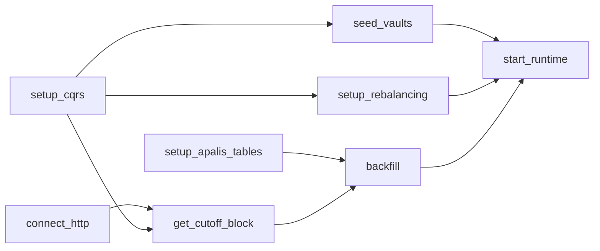
```mermaid
graph LR
    connect_http --> get_cutoff_block
    setup_cqrs --> get_cutoff_block
    setup_cqrs --> seed_vaults
    setup_cqrs --> setup_rebalancing
    setup_apalis_tables --> backfill
    get_cutoff_block --> backfill
    seed_vaults --> start_runtime
    setup_rebalancing --> start_runtime
    backfill --> start_runtime
```

The trade accounting worker starts only after the initial backfill completes,
guaranteeing historical events are processed in order. Because ingestion is a
checkpoint-driven `eth_getLogs` poll rather than a live subscription, no events
can be missed across downtime: the order fill monitor always resumes from the
persisted checkpoint and re-scans any gap.

Historical backfill resumes from a persisted database checkpoint. The configured
`deployment_block` is only the initial seed for the first startup or for an
empty checkpoint; after a successful backfill, the service records the last
processed block and the next startup begins at the following block. The
checkpoint is updated only after the full backfill range succeeds, so a partial
failure cannot skip unprocessed history.

Completed apalis jobs are operational queue records, not audit history. The
runtime periodically deletes terminal job rows and vacuums SQLite at the
configured `apalis_finished_job_cleanup_interval_secs` cadence so the durable
queue cannot grow without bound during normal operation or repeated restarts.
The cadence must be explicitly configured and non-zero.

Deployed systemd services must use bounded restart loops with a restart delay
long enough to avoid runaway RPC consumption. After the restart limit is hit,
the service stays stopped until an operator investigates.

##### Future: Lifecycle Workflows

Business processes with multiple steps will be modeled as durable workflows via
apalis-workflow. Each step is a checkpoint -- if the process crashes
mid-workflow, it resumes at the last completed step. This is particularly
valuable for the trade lifecycle where a crash between acknowledging an onchain
fill and placing the offchain hedge represents real financial exposure.

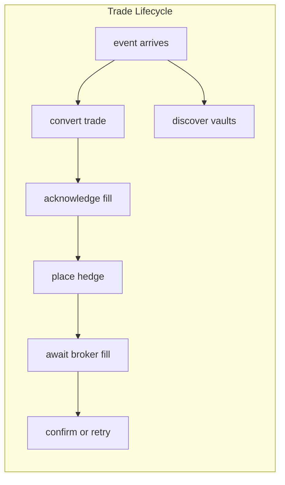
```mermaid
graph LR
    subgraph Trade Lifecycle
        event[event arrives] --> convert[convert trade]
        event --> discover[discover vaults]
        convert --> fill[acknowledge fill]
        fill --> hedge[place hedge]
        hedge --> await[await broker fill]
        await --> confirm[confirm or retry]
    end
```

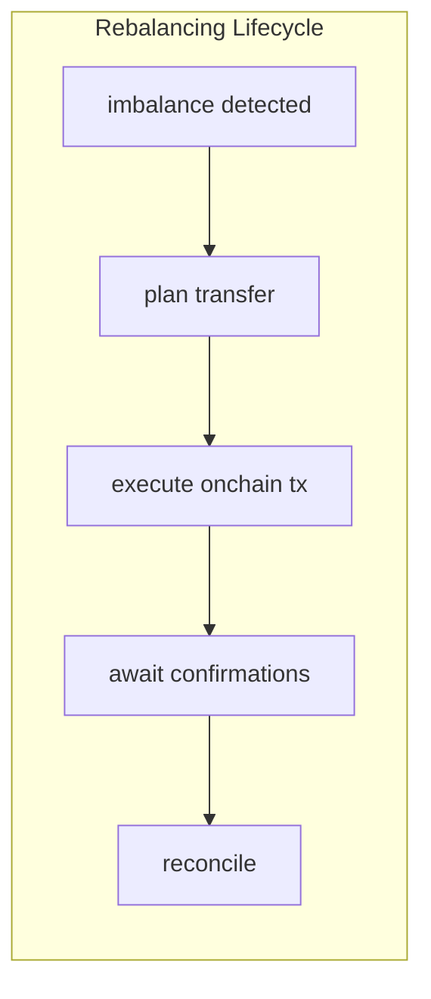
```mermaid
graph LR
    subgraph Rebalancing Lifecycle
        trigger[imbalance detected] --> plan[plan transfer]
        plan --> execute[execute onchain tx]
        execute --> await_conf[await confirmations]
        await_conf --> reconcile[reconcile]
    end
```

### Trade Execution

#### Broker API Integration

The bot supports multiple brokers through a unified trait interface:

##### Alpaca Broker API

- API key-based authentication
- Market order execution for automated hedging
- Manual CLI limit orders for operator intervention
- Manual Alpaca limit orders use day time-in-force only and can optionally be
  marked as extended-hours eligible when the asset supports it
- Order status polling and updates
- Support for both paper trading and live trading environments
- Position querying for inventory management
- Account balance monitoring for available capital

#### Idempotency Controls

- Event queue table to track all events with unique (transaction_hash,
  log_index) keys prevents duplicate processing
- Check event queue before processing any event to prevent duplicates
- Onchain trades are recorded immediately upon event processing
- Position accumulation happens in dedicated accumulators table per symbol
- Broker executions track status ('PENDING', 'SUBMITTED', 'FILLED', 'FAILED')
  with broker type field for multi-broker support
- Complete audit trail maintained linking individual trades to batch executions
- Proper error handling and structured error logging

### Trade Tracking and Reporting

#### SQLite Trade Database

The bot uses a multi-table SQLite database to track trades and manage state. Key
tables include: onchain trade records, broker execution tracking, position
accumulators for batching fractional shares, audit trail linking, and event
queue for idempotency. The complete database schema is defined in
`migrations/20250703115746_trades.sql`.

- Store each onchain trade with symbol, amount, direction, and price
- Track broker executions separately with whole share amounts, status, and
  broker type
- Accumulate positions per symbol until execution thresholds are reached
- Maintain complete audit trail linking onchain trades to broker executions
- Handle concurrent database writes safely with per-symbol locking

#### Pyth Price Extraction

- Extracts exact oracle prices used during trade execution from transaction
  traces
- Uses `debug_traceTransaction` RPC method to analyze transaction execution
- Parses Pyth oracle contract calls to retrieve precise price data including
  price value, confidence interval, exponent, and publish timestamp
- Prices are stored in the `onchain_trade_view` alongside trade records
- NULL price values indicate extraction failed (e.g., no Pyth call in trace, RPC
  errors)
- CLI command for testing: `cargo run --bin cli get-pyth-price <TX_HASH>`
- Trade processing continues normally even if price extraction fails

#### Reporting and Analysis

- Calculate profit/loss for each trade pair using actual executed amounts
- Generate running totals and performance reports over time
- Track inventory positions across both venues
- Push aggregated metrics to external logging system using structured logging
- Identify unprofitable trades for strategy optimization
- Separate reporting process reads from SQLite database for analysis without
  impacting trading performance

### Health Monitoring and Logging

- System uptime and connectivity status using structured logging
- API rate limiting and error tracking with metrics collection
- Position drift alerts and rebalancing triggers
- Latency monitoring for trade execution timing
- Configuration management with environment variables and config files
- Proper error propagation and custom error types

### Risk Management

- Manual override capabilities for emergency situations with proper
  authentication
- Graceful shutdown handling to complete in-flight trades before stopping
- Per-asset market enable/disable: individual equity markets can be disabled via
  the `enabled` flag in the equity config. Disabled assets accumulate position
  changes but do not trigger counter-trades or rebalancing operations. When
  re-enabled (`enabled = true`), the system resumes both executing accumulated
  counter-trade positions and evaluating rebalancing triggers for any resulting
  inventory imbalances (same semantics as market close/open behavior)

### Infrastructure and Deployment

This section specifies infrastructure, deployment, and secrets management.

Alternative approaches (Ansible, Kamal) were evaluated and documented in commit
`5ede2d47465d3621b351c73c9c1af33d20a7c879`.

#### Tools

- **Terraform**: Provisions DigitalOcean infrastructure (droplet, volume,
  reserved IP). Standard HCL, version pinned via flake.lock. Droplet boots
  Ubuntu; nixos-anywhere converts it to NixOS.

- **nixos-anywhere** + **disko**: One-time bootstrap that installs NixOS on the
  Ubuntu droplet over SSH. Uses kexec to boot a NixOS installer in RAM,
  partitions the disk via disko, and runs nixos-install with the flake's NixOS
  configuration. After bootstrap, deploy-rs manages all updates.

- **deploy-rs**: Deploys to NixOS hosts via SSH. Two activation types:
  `activate.nixos` for full system configuration (SSH, firewall, systemd units,
  Grafana, ragenix), `activate.custom` for standalone service binaries. Includes
  auto-rollback on failed deployments ("magic rollback" reverts if SSH is lost
  during activation).

- (r)**agenix**: Age-encrypted secrets for NixOS, using existing SSH keys. CLI
  encrypts secrets locally into `.age` files you commit to git. NixOS module
  decrypts at activation using the host's SSH key, mounting secrets to
  `/run/agenix/` (tmpfs - cleartext never hits disk or Nix store). No GPG, no
  separate secret distribution - secrets deploy with `nixos-rebuild` like any
  other config. Ragenix is a Rust drop-in for agenix but is less documented, so
  it's best to follow agenix documentation but use ragenix instead.

#### Architecture

Terraform provisions infrastructure (droplet, volume, reserved IP) with an
Ubuntu image. nixos-anywhere bootstraps NixOS on the droplet (one-time).
deploy-rs handles all subsequent system and application deployment over SSH.

_System configuration_ (deploy-rs `activate.nixos`):

- OS essentials: SSH, firewall, users
- Systemd unit definitions for application services (pointing to deploy-rs
  profile paths)
- Grafana as a NixOS native service
- ragenix integration for secret decryption
- Nix configuration (flakes, garbage collection)

_Per-service profiles_ (deploy-rs `activate.custom`, deployed independently):

The set of deployed profiles is declared as a registry in `services.nix`. Each
entry has a `kind` discriminating how it is activated and whether it has a
systemd unit:

- `st0x-hedge` (kind = `st0x`) - hedging bot binary. Full pipeline: decrypts
  agenix secret, installs plaintext config, runs `validate-config`, chowns data
  files, writes git-rev marker, touches readiness marker, restarts unit.
- `dashboard` (kind = `static`) - frontend assets served by nginx; the deploy
  step is `systemctl reload nginx` and there is no managed systemd unit.
- `datasette` (kind = `plain`) - read-only SQLite explorer over the hedge DB.
  Has a systemd unit but no secrets/config; activation just touches the
  readiness marker and restarts. Bound to `127.0.0.1`; access via SSH tunnel.

Activation order within `profilesOrder` is set explicitly by each entry's
`order` field, so adding a new service forces declaring its slot rather than
inheriting an alphabetical attribute order.

Each profile is independently deployable and rollback-able without affecting
others. Units use a `/run/st0x/<name>.ready` marker file gated by
`ConditionPathExists` so they only start after the per-service profile has
finished activation, never on a bare `nixos-rebuild switch`.

_Configuration management_:

- Plaintext config per `st0x`-kind service (`config/*.toml`) baked into Nix
  closure
- Encrypted secrets per `st0x`-kind service (`secret/*.toml.age`) decrypted at
  activation to `/run/agenix/`
- `st0x`-kind binaries use `--config` + `--secrets` flags; `plain`-kind units
  invoke their package binary with declared `args`

_Infrastructure_:

- Terraform (standard HCL) provisions droplet with Ubuntu image
- nixos-anywhere converts Ubuntu to NixOS (one-time bootstrap)
- Nix wraps Terraform for reproducible, version-pinned execution
- Terraform state encrypted with age and committed to git

#### Rollback

deploy-rs deploys each service to a nix profile. Each deployment creates a new
profile generation that can be rolled back to. deploy-rs uses legacy
(`nix-env`-style) profiles internally, not the new Nix CLI profiles. Old
generations are cleaned up by the NixOS garbage collector on a configured
schedule.

#### CI/CD Credential Management

| Secret Type | Storage               | When Used           | Example           |
| ----------- | --------------------- | ------------------- | ----------------- |
| Runtime     | ragenix (.age in git) | Decrypted at deploy | Alpaca API keys   |
| Build-time  | GitHub Secrets        | CI build/deploy     | DO token, SSH key |

Use GitHub Actions environment protection (require approval for production,
restrict to master branch).

#### SSH Key Management

All SSH keys centralized in `keys.nix` with role-based access:

- `roles.ssh` — keys authorized for root SSH (operator + CI)
- `roles.infra` — keys that can decrypt terraform state
- `roles.service` — keys that can decrypt service config secrets

`os.nix` imports `roles.ssh` for `authorizedKeys`. CI uses its key (stored as
`SSH_KEY` GitHub secret) for both deployment and terraform state decryption.

### Wallet Management

All onchain write operations use the `Wallet` trait abstraction from the
`st0x-evm` crate. Two wallet backends are available, gated by cargo features on
the `st0x-evm` crate and configured via the `[rebalancing.wallet]` TOML section
(`type = "turnkey"` or `type = "private-key"`):

- **Turnkey** (`turnkey` feature): Signs via Turnkey's AWS Nitro secure enclaves
  for low-latency production signing (50-100ms).
- **Raw private key** (`local-signer` feature): Signs locally with a raw private
  key. Also used in development and testing.

The main crate forwards these as `wallet-turnkey` and `wallet-private-key`
features. Domain logic is decoupled from the signing backend. See
[crates/evm/](crates/evm/) for implementation details.

## Crate Architecture

The codebase is organized into multiple Rust crates to achieve:

1. **Faster builds** - Cargo parallelizes across crates; unchanged crates skip
   rebuild entirely
2. **Stricter abstraction boundaries** - Crate visibility (`pub(crate)`)
   enforces domain isolation at compile-time
3. **Tighter dependency graph** - Dependencies explicit in Cargo.toml, no cycles
   allowed
4. **Reduced coupling** - Each crate defines a clear public API; internals stay
   hidden

### Core Capabilities

The system provides two top-level capabilities:

1. **Hedging** - Offsetting directional exposure by executing trades on
   brokerages
2. **Maintaining balance invariants** - Keeping inventory balanced across venues
   through transfers (tokenization, bridging, vault operations)

### Architecture Layers

```text
┌─────────────────────────────────────────────────────────────────────────┐
│                          INTEGRATIONS                                   │
│                 (external API wrappers, trait + impls)                  │
├─────────────────────────────────────────────────────────────────────────┤
│                                                                         │
│  st0x-execution      st0x-tokenization  st0x-bridge    st0x-raindex     │
│  ├─ Executor trait   ├─ Tokenizer trait ├─ Bridge trait├─ Raindex trait │
│  ├─ Alpaca wallet    │                  │              │                │
│  ├─ Pyth feeds       │                  │              │                │
│  │                   │                  │              │                │
│  │ features:         │ features:        │ features:    │ features:      │
│  │ ├─ alpaca-broker  │ └─ alpaca        │ └─ cctp      │ └─ rain        │
│  │ └─ mock           │                  │              │                │
│                                                                         │
│  st0x-evm                              st0x-wrapper                     │
│  ├─ Wallet trait                       └─ Wrap/unwrap (ERC-4626)        │
│  ├─ Provider/signer                                                     │
│  ├─ ABI bindings (IERC20, ...)                                          │
│  └─ Chain constants (USDC_*)                                            │
│                                                                         │
└─────────────────────────────────┬───────────────────────────────────────┘
                                  │
                                  ▼
┌─────────────────────────────────────────────────────────────────────────┐
│                        SHARED METADATA                                  │
├─────────────────────────────────────────────────────────────────────────┤
│                                                                         │
│  st0x-registry                                                          │
│  ├─ SymbolCache                                                         │
│  └─ VaultRegistry                                                       │
│                                                                         │
└─────────────────────────────────┬───────────────────────────────────────┘
                                  │
                                  ▼
┌─────────────────────────────────────────────────────────────────────────┐
│                          DOMAIN LOGIC                                   │
│                    (business rules, uses traits)                        │
├─────────────────────────────────────────────────────────────────────────┤
│                                                                         │
│  st0x-hedge                            st0x-rebalance                   │
│  ├─ Trade accounting                   ├─ Rebalancer                    │
│  ├─ Position tracking                  ├─ Trigger logic                 │
│  └─ CQRS aggregates                    ├─ Mint/Redeem managers          │
│                                         └─ CQRS aggregates              │
│  depends on: execution                 depends on: tokenization,        │
│                                                    bridge, raindex,     │
│                                                    wrapper              │
│                                                                         │
└──────────────────────────────────┬──────────────────────────────────────┘
                                   │
                                   ▼
┌─────────────────────────────────────────────────────────────────────────┐
│                           APPLICATION                                   │
├─────────────────────────────────────────────────────────────────────────┤
│                                                                         │
│  st0x-baton (orchestration toolkit, wraps apalis)                       │
│  ├─ Job trait, worker patterns, apalis helpers                          │
│                                                                         │
│  st0x-config (RESTRICTED: only st0x-server and st0x-cli may depend)     │
│  ├─ Ctx, BrokerCtx, Env (TOML loading and assembly)                     │
│  └─ setup_tracing                                                       │
│                                                                         │
│  st0x-server          st0x-dashboard         st0x-cli                   │
│  ├─ Bot binary        ├─ Admin UI backend    ├─ Operator binary         │
│  ├─ Conductor         ├─ Websocket events    ├─ Manual operations       │
│  ├─ Startup, Monitor  └─ Manual operations   └─ View rebuilds           │
│  └─ API endpoints                                                       │
│                                                                         │
│  All three are thin wrappers; domain logic lives in the layers above.   │
│                                                                         │
└─────────────────────────────────────────────────────────────────────────┘
```

### Crate Descriptions

**Integration Layer** (external API wrappers):

| Crate               | Purpose                                                                        | Feature Flags                     |
| ------------------- | ------------------------------------------------------------------------------ | --------------------------------- |
| `st0x-execution`    | Brokerage API integration for trade execution; Alpaca wallet ops; Pyth feeds   | `alpaca-broker`, `mock`           |
| `st0x-tokenization` | Tokenization API for minting/redeeming equity tokens                           | `alpaca`                          |
| `st0x-bridge`       | Cross-chain asset transfers                                                    | `cctp`                            |
| `st0x-raindex`      | Rain orderbook vault deposit/withdraw operations                               | `rain`                            |
| `st0x-evm`          | EVM chain interaction, wallet abstraction, ABI bindings, chain/token constants | `turnkey`, `local-signer`, `mock` |
| `st0x-wrapper`      | ERC-4626 wrap/unwrap operations and ratio math                                 |                                   |

Each integration crate defines a trait (e.g., `Executor`, `Tokenizer`, `Bridge`,
`Raindex`, `Wallet`, `Wrapper`) with one or more implementations selectable via
feature flags. This allows swapping implementations without changing domain
logic.

**Shared Metadata Layer** (caches consumed by domain and application crates):

| Crate           | Purpose                                                               |
| --------------- | --------------------------------------------------------------------- |
| `st0x-registry` | Symbol metadata cache and vault registry, sourced from chain + config |

`st0x-registry` is the only crate that both domain and application crates may
consume to resolve symbols and vault addresses. It does not contain business
rules; it caches reference data.

**Domain Logic Layer** (business rules):

| Crate            | Purpose                                                  | Dependencies                                                       |
| ---------------- | -------------------------------------------------------- | ------------------------------------------------------------------ |
| `st0x-hedge`     | Hedging logic: accumulator, position tracking, queue     | `st0x-execution`, `st0x-registry`                                  |
| `st0x-rebalance` | Balance maintenance: triggers, managers, CQRS aggregates | `st0x-tokenization`, `st0x-bridge`, `st0x-raindex`, `st0x-wrapper` |

Domain crates depend on integration traits, not concrete implementations. This
enables testing with mocks and future implementation swaps. **Domain crates must
be config-agnostic**: they accept narrow constructor arguments (`&dyn Wallet`,
`&dyn Executor`, vault addresses, RPC URLs, threshold values), never `Ctx` or
`BrokerCtx` from `st0x-config`.

**Application Layer** (binaries and wiring):

| Crate            | Purpose                                                                                                                                                                                                               |
| ---------------- | --------------------------------------------------------------------------------------------------------------------------------------------------------------------------------------------------------------------- |
| `st0x-config`    | TOML/secrets loading, `Ctx`/`BrokerCtx`/`Env` assembly, `setup_tracing`. **Restricted visibility: only `st0x-server` and `st0x-cli` may depend on it. No integration, shared, or domain crate may import it.**        |
| `st0x-server`    | Main bot binary, conductor, wires hedging + rebalancing, API endpoints                                                                                                                                                |
| `st0x-dashboard` | Admin dashboard backend, websocket events, manual operations                                                                                                                                                          |
| `st0x-cli`       | Operator binary; thin wrapper exposing manual operations (orders, equity/USDC transfers, vault deposit/withdraw, CCTP bridging, wrap/unwrap, Alpaca wallet ops, view rebuilds) over the integration and domain crates |

The binary crates wire the layers above into a runnable artifact: `st0x-server`
runs the bot, `st0x-dashboard` exposes the admin UI, `st0x-cli` exposes the same
domain capabilities to a human operator. A command added to the CLI corresponds
to a feature already implemented in an integration or domain crate -- the CLI
does not contain business rules.

### Feature Flag Strategy

Feature flags control which implementations are compiled:

```toml
# Production equities bot
[dependencies]
st0x-server = { features = ["all-wallets"] }

# Dry-run testing
st0x-server = { features = ["mock"] }

# Future: crypto + perps fork with different integrations
st0x-server = { features = ["perp-exchange", "other-bridge", "other-vault"] }
```

This enables:

- Compile-time selection of integrations (no unused code in binary)
- Easy addition of new implementations behind new feature flags
- Fork-friendly architecture for different asset classes

## System Risks

The following risks are known for v1 but will not be addressed in the initial
implementation. Solutions will be developed in later iterations.

### Offchain Risks

- **Threshold-Induced Exposure**: Any configured batching threshold can create
  temporary unhedged exposure while the bot waits to execute the next offchain
  hedge. Fractional support reduces this risk, but buying-power constraints,
  market conditions, and operator-selected thresholds can still delay execution.
- **Missed Trade Execution**: The bot fails to execute offsetting trades on the
  selected brokerage when onchain trades occur, creating unhedged exposure. For
  example:
  - Bot downtime while onchain order remains active
  - Bot detects onchain trade but fails to execute offchain trade
  - Broker API failures or rate limiting during critical periods
- **After-Hours Trading Gap**: Pyth oracle may continue operating when
  traditional markets are closed, allowing onchain trades while broker markets
  are unavailable. Creates guaranteed daily exposure windows.

### Onchain Risks

- **Stale Pyth Oracle Data**: If the oracle becomes stale, the order won't trade
  onchain, resulting in missed arbitrage opportunities. However, this is
  preferable to the alternative scenario where trades execute onchain but the
  bot cannot make offsetting offchain trades.
- **Solver fails:** if the solver fails, again onchain trades won't happen but
  as above this is simply opportunity cost.

---

## DDD/CQRS/ES Architecture

The system uses Domain-Driven Design with CQRS and Event Sourcing. Audit state
is derived from retained immutable event streams; compactable observational
state may use snapshots as the durable source for pre-compaction history.

- **Complete audit history**: Every retained state change is a fact with
  timestamp and sequence
- **Reproducible audit state**: Replay retained facts to rebuild any audit view
- **Temporal queries**: "What was the position at any point in time?"
- **Zero-downtime projections**: Add new views by replaying existing events
- **Testable business logic**: Given-When-Then tests validate rules without
  database
- **Type-safe state machines**: Invalid transitions become compilation errors

### Architecture

- **Event Store**: Immutable append-only log for retained event streams
- **Snapshots**: Performance optimization for aggregate reconstruction
- **Views**: Materialized projections optimized for queries

Financial audit aggregates retain every event indefinitely. Compaction is
allowed only by the compaction eligibility policy below.

#### Compaction Eligibility Policy

An aggregate may opt into event compaction only when all of these are true:

- The aggregate type is explicitly allowed by this spec.
- The aggregate records observational state fetched from external systems, not a
  financial operation initiated by the bot.
- Historical events older than the latest aggregate snapshot are not needed for
  audit, regulatory review, reconciliation, or projection rebuilds.
- The aggregate can be reconstructed from the `snapshots` table plus newer
  events, or it has a documented external/snapshot-aware rebuild path.
- Enabling compaction is reviewed in the PR that sets
  `COMPACTION_POLICY = CompactAfterSnapshot` for that aggregate.

Eligible aggregate types:

- `InventorySnapshot`: enabled for compaction.
- `VaultRegistry`: eligible only if a future PR also provides a snapshot-aware
  projection rebuild path.

All other aggregates retain events unless this section is updated first.

**Grafana Dashboard Strategy**: Views use SQLite generated columns to expose
JSON fields as queryable columns. Specialized views can pre-compute complex
metrics, simplifying dashboard queries.

### Core Architecture

#### Event Sourcing Pattern

All audit-relevant state changes are captured as immutable domain events. The
event store is the immutable append-only source of truth for retained event
streams. Views and snapshots are derived from retained event streams;
observational aggregates may use snapshots as the durable source for compacted
pre-snapshot history only when allowed by the compaction eligibility policy.

##### Key Flow

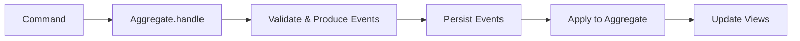
```mermaid
flowchart LR
    A[Command] --> B[Aggregate.handle]
    B --> C[Validate & Produce Events]
    C --> D[Persist Events]
    D --> E[Apply to Aggregate]
    E --> F[Update Views]
```

#### Database Schema

The source of truth for all table schemas is the `migrations/` directory.

**Event store** (managed by event-sorcery): `events`, `snapshots`.

**CQRS projection views**: `position_view`, `offchain_order_view`,
`onchain_trade_view`, `usdc_rebalance_view`, `vault_registry_view`,
`equity_redemption_view`. Some views use SQLite generated columns to expose JSON
fields as queryable columns for Grafana dashboards.

### Architecture Decision: Position as Aggregate

In DDD, entities are objects defined by their identity and continuity rather
than their attributes - they have a lifecycle and change over time while
maintaining the same identity. Aggregates are entities that enforce business
rules and maintain consistency boundaries.

OnChain trades, offchain orders, and positions are all entities with distinct
lifecycles, so we model them as separate aggregates:

- **OnChainTrade**: Lifecycle = blockchain fill -> enriched with metadata.
  Immutable blockchain facts (reorgs not currently handled, see Future
  Consideration section).
- **OffchainOrder**: Lifecycle = placed -> submitted -> filled/failed. Broker
  order tracking.
- **Position**: Lifecycle = accumulates fills -> triggers hedging decisions.
  Uses configurable threshold (shares or dollar value) to determine when to
  place offsetting broker orders.

This means blockchain fills are recorded in both OnChainTradeEvent::Filled
(audit trail) and PositionEvent::OnChainOrderFilled (position tracking), but
they serve different purposes in different bounded contexts.

### Aggregate Design

#### EventSourced Trait

Domain types implement the `EventSourced` trait, which provides a safer, more
ergonomic interface than a raw `Aggregate` trait:

```rust
#[async_trait]
trait EventSourced {
    type Id: Display + FromStr + Send + Sync;
    type Event: DomainEvent + Eq;
    type Command: Send + Sync;
    type Error: DomainError;
    type Services: Send + Sync;

    const AGGREGATE_TYPE: &'static str;
    const PROJECTION: Option<Table>;
    const SCHEMA_VERSION: u64;

    // Event-side: reconstruct state from event log
    fn originate(event: &Self::Event) -> Option<Self>;
    fn evolve(entity: &Self, event: &Self::Event)
        -> Result<Option<Self>, Self::Error>;

    // Command-side: process commands to produce events
    async fn initialize(
        command: Self::Command,
        services: &Self::Services,
    ) -> Result<Vec<Self::Event>, Self::Error>;
    async fn transition(
        &self,
        command: Self::Command,
        services: &Self::Services,
    ) -> Result<Vec<Self::Event>, Self::Error>;
}
```

##### Why This Exists

A raw `Aggregate` trait has sharp edges that cause production bugs:

- **Infallible `apply`**: Financial applications cannot panic on arithmetic
  overflow, but `Aggregate::apply` returns nothing
- **Stringly-typed IDs**: `store.execute("some-id", cmd)` takes `&str`, making
  it trivial to pass the wrong ID
- **No schema versioning**: Stale snapshots and views cause silent corruption
- **Flat command handling**: A single `handle` receives all commands regardless
  of lifecycle state

`EventSourced` fixes these by splitting command handling into `initialize` (no
`&self`, impossible to reference nonexistent state) and `transition` (receives
`&self` as the domain type, not `Lifecycle`). Event application is split into
`originate` (genesis events) and `evolve` (subsequent events with fallible
return).

##### Lifecycle Wrapper (Implementation Detail)

`Lifecycle<Entity>` bridges `EventSourced` to the persistence layer via a
blanket `Aggregate` impl. It is an implementation detail -- domain modules never
interact with `Lifecycle` directly:

```rust
enum Lifecycle<Entity: EventSourced> {
    Uninitialized,
    Live(Entity),
    Failed {
        error: LifecycleError<Entity>,
        last_valid_entity: Option<Box<Entity>>,
    },
}
```

- `Uninitialized` -> `Live`: via `originate`
- `Live` -> `Live`: via `evolve`
- Any -> `Failed`: on domain errors (no panics in financial apps)

The error type is derived from `EventSourced::Error`, not a separate type
parameter. Use `Never` (uninhabited type) for aggregates with infallible
operations.

##### Store (Type-Safe Command Dispatch)

`Store<Entity>` enforces typed IDs for command dispatch:

```rust
let positions: Store<Position> = /* built by StoreBuilder */;
positions.send(&symbol, PositionCommand::AcknowledgeFill { .. }).await?;
```

This prevents the class of bugs where string aggregate IDs are mixed up between
different entity types.

#### OnChainTrade Aggregate

**Purpose**: Represents a single filled order from the blockchain. Decouples
trade recording from position management, allowing metadata enrichment without
affecting position calculations.

**Aggregate ID**: `"{tx_hash}:{log_index}"` (e.g., "0x123...abc:5")

**Type**: `OnChainTrade` (implements `EventSourced` with `Error = Never`)

##### State

```rust
struct OnChainTrade {
    symbol: Symbol,
    amount: Decimal,
    direction: Direction,
    price_usdc: Decimal,
    block_number: u64,
    block_timestamp: DateTime<Utc>,
    filled_at: DateTime<Utc>,
    enrichment: Option<Enrichment>,
}

struct Enrichment {
    gas_used: u64,
    pyth_price: PythPrice,
    enriched_at: DateTime<Utc>,
}
```

##### Commands

```rust
enum OnChainTradeCommand {
    Witness {
        symbol: Symbol,
        amount: Decimal,
        direction: Direction,
        price_usdc: Decimal,
        block_number: u64,
        block_timestamp: DateTime<Utc>,
    },
    Enrich {
        gas_used: u64,
        pyth_price: PythPrice,
    },
}
```

##### Events

```rust
enum OnChainTradeEvent {
    Filled {
        symbol: Symbol,
        amount: Decimal,
        direction: Direction,
        price_usdc: Decimal,
        block_number: u64,
        block_timestamp: DateTime<Utc>,
        filled_at: DateTime<Utc>,
    },
    Enriched {
        gas_used: u64,
        pyth_price: PythPrice,
        enriched_at: DateTime<Utc>,
    },
}
```

**Business Rules** (enforced in `handle()`):

- Can only enrich once
- Cannot enrich before fill is witnessed

#### Position Aggregate

**Purpose**: Manages accumulated position for a single symbol, tracking
fractional shares and coordinating offchain hedging when thresholds are reached.

**Aggregate ID**: `symbol` (e.g., "AAPL")

**Type**: `Position` (implements `EventSourced` with `Error = ArithmeticError`)

##### State

```rust
struct Position {
    symbol: Symbol,
    net: FractionalShares,
    accumulated_long: FractionalShares,
    accumulated_short: FractionalShares,
    pending_execution_id: Option<ExecutionId>,
    threshold: ExecutionThreshold,
    last_price_usdc: Option<Float>,  // Last known USDC price per share; drives
                                     // dollar-threshold hedging. None until a
                                     // priced fill or manual adjustment sets it.
    last_updated: Option<DateTime<Utc>>,
}

enum ExecutionThreshold {
    Shares(FractionalShares),  // Whole-share style threshold
    DollarValue(Usdc),         // Dollar-value threshold
}
```

##### Commands

```rust
// Common types
struct TradeId {
    tx_hash: TxHash,
    log_index: u64,
}

enum PositionCommand {
    AcknowledgeOnChainFill {
        trade_id: TradeId,
        amount: FractionalShares,
        direction: Direction,
        price_usdc: Decimal,
        block_timestamp: DateTime<Utc>,
    },
    PlaceOffChainOrder {
        execution_id: ExecutionId,
        shares: FractionalShares,
        direction: Direction,
        broker: SupportedBroker,
        threshold: ExecutionThreshold,
    },
    CompleteOffChainOrder {
        execution_id: ExecutionId,
        shares_filled: FractionalShares,
        direction: Direction,
        broker_order_id: BrokerOrderId,
        price: Dollars,
        broker_timestamp: DateTime<Utc>,
    },
    FailOffChainOrder {
        execution_id: ExecutionId,
        error: String,
    },
    ManuallyAdjustPosition {
        symbol: Symbol,
        target_net: FractionalShares,
        reason: String,
        threshold: ExecutionThreshold,
        expected_net: Option<FractionalShares>,
        price_usdc: Option<Decimal>,
    },
}
```

##### Events

```rust
enum PositionEvent {
    OnChainOrderFilled {
        trade_id: TradeId,
        amount: FractionalShares,
        direction: Direction,
        price_usdc: Decimal,
        block_timestamp: DateTime<Utc>,
        seen_at: DateTime<Utc>,
    },
    OffChainOrderPlaced {
        execution_id: ExecutionId,
        shares: FractionalShares,
        direction: Direction,
        broker: SupportedBroker,
        trigger_reason: TriggerReason,
        placed_at: DateTime<Utc>,
    },
    OffChainOrderFilled {
        execution_id: ExecutionId,
        shares_filled: FractionalShares,
        direction: Direction,
        broker_order_id: BrokerOrderId,
        price: Dollars,
        broker_timestamp: DateTime<Utc>,
    },
    OffChainOrderFailed {
        execution_id: ExecutionId,
        broker_code: Option<BrokerErrorCode>,
        failed_at: DateTime<Utc>,
    },
    ManualPositionAdjusted {
        previous_net: FractionalShares,
        target_net: FractionalShares,
        reason: String,
        price_usdc: Option<Decimal>,
        adjusted_at: DateTime<Utc>,
    },
}

enum TriggerReason {
    SharesThreshold {
        net_position_shares: Decimal,
        threshold_shares: Decimal,
    },
    DollarThreshold {
        net_position_shares: Decimal,
        dollar_value: Decimal,
        price_usdc: Decimal,
        threshold_dollars: Decimal,
    },
}
```

**Business Rules** (enforced in `handle()`):

- `AcknowledgeOnChainFill` serves as the genesis event (initializes the
  aggregate on first fill)
- `ManuallyAdjustPosition` is an audited operator repair command that sets the
  absolute net exposure after manual trading or rebalancing outside the bot. It
  may initialize a missing position, including a zero target, using the
  configured execution threshold.
- Manual position adjustment is rejected while an offchain hedge order is
  pending; operators must fail or resolve the pending order first.
- Manual position adjustment changes only `net`, not accumulated long/short
  trading volume, because it corrects exposure rather than rewriting fill
  history.
- Manual position adjustment is optimistically concurrency-checked: when
  `expected_net` is supplied (the CLI always supplies the net it read), the
  command is rejected with `ManualAdjustmentStateChanged` if the live aggregate
  net no longer matches, so a concurrent onchain fill cannot be silently erased.
- A nonzero target under a dollar-value threshold requires a price: the operator
  must supply `price_usdc` (CLI `--price`) unless the position already has a
  known `last_price_usdc`. Otherwise the command is rejected with
  `ManualAdjustmentRequiresPrice`, preventing a repaired exposure that can never
  be valued and would therefore never hedge. The supplied price is persisted as
  `last_price_usdc`. A zero target needs no price.
- Can only place offchain order when threshold is met:
  - **Shares threshold**: `|net_position| >= threshold` (e.g., whole-share
    threshold)
  - **Dollar threshold**: `|net_position * price_usdc| >= threshold` (e.g.,
    $1.00 minimum trade value)
- Direction of offchain order must be opposite to accumulated position (positive
  net = sell, negative net = buy)
- Cannot have multiple pending executions for same symbol
- OnChain fills are always applied (blockchain facts are immutable)
- Threshold is passed as a parameter to commands that need it

#### OffchainOrder Aggregate

**Purpose**: Manages the lifecycle of a single broker order, tracking
submission, filling, and settlement.

**Aggregate ID**: `OffchainOrderId` (UUID)

**Type**: `OffchainOrder` (implements `EventSourced` with `Error = Never`)

##### States

```rust
enum OffchainOrder {
    Pending {
        symbol: Symbol,
        shares: FractionalShares,
        direction: Direction,
        broker: SupportedBroker,
        placed_at: DateTime<Utc>,
    },
    Submitted {
        symbol: Symbol,
        shares: FractionalShares,
        direction: Direction,
        broker: SupportedBroker,
        broker_order_id: BrokerOrderId,
        placed_at: DateTime<Utc>,
        submitted_at: DateTime<Utc>,
    },
    PartiallyFilled {
        symbol: Symbol,
        shares: FractionalShares,
        shares_filled: FractionalShares,
        direction: Direction,
        broker: SupportedBroker,
        broker_order_id: BrokerOrderId,
        avg_price: Dollars,
        placed_at: DateTime<Utc>,
        submitted_at: DateTime<Utc>,
        partially_filled_at: DateTime<Utc>,
    },
    Filled {
        symbol: Symbol,
        shares: FractionalShares,
        direction: Direction,
        broker: SupportedBroker,
        broker_order_id: BrokerOrderId,
        price: Dollars,
        placed_at: DateTime<Utc>,
        submitted_at: DateTime<Utc>,
        filled_at: DateTime<Utc>,
    },
    Failed {
        symbol: Symbol,
        shares: FractionalShares,
        direction: Direction,
        broker: SupportedBroker,
        error: String,
        placed_at: DateTime<Utc>,
        failed_at: DateTime<Utc>,
    },
}
```

##### Commands

```rust
enum OffchainOrderCommand {
    Place {
        symbol: Symbol,
        shares: FractionalShares,
        direction: Direction,
        broker: SupportedBroker,
    },
    ConfirmSubmission {
        broker_order_id: BrokerOrderId,
    },
    UpdatePartialFill {
        shares_filled: FractionalShares,
        avg_price: Dollars,
    },
    CompleteFill {
        price: Dollars,
    },
    MarkFailed {
        error: String,
    },
}
```

##### Events

```rust
enum OffchainOrderEvent {
    Placed {
        symbol: Symbol,
        shares: FractionalShares,
        direction: Direction,
        broker: SupportedBroker,
        placed_at: DateTime<Utc>,
    },
    Submitted {
        broker_order_id: BrokerOrderId,
        submitted_at: DateTime<Utc>,
    },
    PartiallyFilled {
        shares_filled: FractionalShares,
        avg_price: Dollars,
        partially_filled_at: DateTime<Utc>,
    },
    Filled {
        price: Dollars,
        filled_at: DateTime<Utc>,
    },
    Failed {
        broker_code: Option<BrokerErrorCode>,
        failed_at: DateTime<Utc>,
    },
}

struct BrokerErrorCode(String);
```

### Rebalancing Aggregates

**Note**: Automated rebalancing is Alpaca Broker API based.

#### Cross-Venue Asset Transfer Model

The system operates across two trading venues: **Alpaca** (offchain brokerage
for hedging) and **Raindex** (onchain orderbook for market making). Rebalancing
is fundamentally about transferring inventory between these venues. The transfer
steps differ by asset type and direction, but the core abstraction is the same:
move assets from one venue to the other.

##### Architecture: Three Layers

**Top layer -- Inventory management**: Decides _when_ and _how much_ to transfer
based on inventory imbalances. Tracks in-flight transfers. Does not know _how_
transfers work.

**Middle layer -- Cross-venue transfer trait**: Abstracts the _how_. Each
implementation is a complete directional transfer that accepts an amount and
succeeds or fails. The transfer steps (minting, bridging, vault operations) are
encapsulated behind this trait.

```rust
/// Marker types for the two trading venues.
struct MarketMakingVenue;
struct HedgingVenue;

/// Abstraction for transferring assets between venues.
///
/// Implementations encapsulate the full multi-step lifecycle (e.g. mint +
/// deposit, or withdraw + redeem). The inventory layer calls this without
/// knowing the steps involved.
#[async_trait]
trait CrossVenueTransfer<Source, Destination>: Send + Sync {
    /// The asset being transferred (e.g. equity shares, USDC).
    type Asset;
    type Error;

    async fn transfer(
        &self,
        asset: Self::Asset,
    ) -> Result<(), Self::Error>;
}
```

Four transfer directions exist:

| Source            | Destination       | Asset  | Implementation                                                 |
| ----------------- | ----------------- | ------ | -------------------------------------------------------------- |
| HedgingVenue      | MarketMakingVenue | Equity | Mint via Alpaca ITN, deposit to Raindex vault                  |
| MarketMakingVenue | HedgingVenue      | Equity | Withdraw from Raindex vault, redeem via Alpaca ITN             |
| HedgingVenue      | MarketMakingVenue | USDC   | Convert USD->USDC, withdraw, bridge via CCTP, deposit to vault |
| MarketMakingVenue | HedgingVenue      | USDC   | Withdraw from vault, bridge via CCTP, deposit USDC to Alpaca   |

**Bottom layer -- Lifecycle aggregates**: Event-sourced entities that track
multi-step transfer progress. These are implementation details of their
respective `CrossVenueTransfer` impls, not top-level domain concepts. The
transfer impl sends commands to its lifecycle aggregate, which handles crash
recovery by persisting state transitions as events.

##### Transfer Implementations

Two structs implement all four transfer directions:

- **`CrossVenueEquityTransfer`**: Implements
  `CrossVenueTransfer<HedgingVenue, MarketMakingVenue>` (mint direction) and
  `CrossVenueTransfer<MarketMakingVenue, HedgingVenue>` (redemption direction).
  Holds stores for both equity lifecycle aggregates plus `Raindex` and
  `Tokenizer` service traits.

- **`CrossVenueCashTransfer`**: Implements both USDC directions. Holds a store
  for the `UsdcRebalance` lifecycle aggregate plus `Bridge`, `AlpacaFunding`,
  and onchain provider dependencies.

Each transfer:

1. Creates a lifecycle aggregate instance (UUID) for crash recovery
2. Sends commands that invoke domain service methods as side effects
3. Returns when the lifecycle reaches a terminal state

The lifecycle aggregates (TokenizedEquityMint, EquityRedemption, UsdcRebalance)
are implementation details of their respective transfer structs. External code
interacts only through `CrossVenueTransfer::transfer()`.

##### Rebalancer

The `Rebalancer` receives `TriggeredOperation`s and dispatches to the
appropriate `CrossVenueTransfer` impl. It holds `Arc<dyn CrossVenueTransfer>`
for each of the four directions and calls `transfer()` on the right one.

Three lifecycle aggregates handle the transfer workflows.

#### TokenizedEquityMint Aggregate

**Purpose**: Transfers equity inventory from the hedging venue (Alpaca) to the
market making venue (Raindex) by tokenizing shares and depositing them to a
vault for liquidity provision.

**Aggregate ID**: IssuerRequestId (our internal tracking ID)

**Services**:
`EquityTransferServices { raindex: Arc<dyn Raindex>, tokenizer:
Arc<dyn Tokenizer>, wrapper: Arc<dyn Wrapper> }`
-- shared with `EquityRedemption`.

##### State Flow

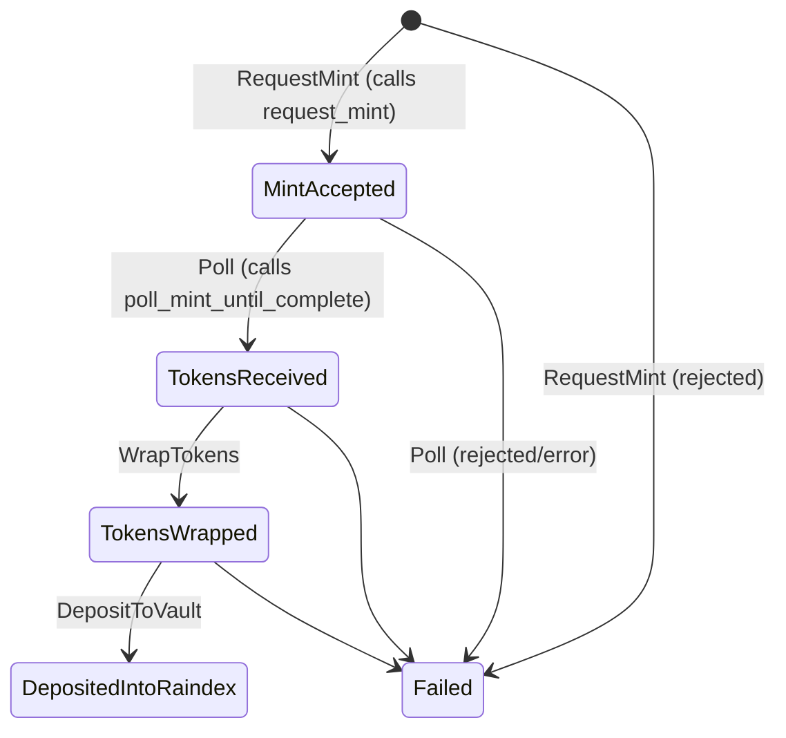
```mermaid
stateDiagram-v2
    [*] --> MintAccepted: RequestMint (calls request_mint)
    [*] --> Failed: RequestMint (rejected)
    MintAccepted --> TokensReceived: Poll (calls poll_mint_until_complete)
    MintAccepted --> Failed: Poll (rejected/error)
    TokensReceived --> TokensWrapped: WrapTokens
    TokensReceived --> Failed
    TokensWrapped --> DepositedIntoRaindex: DepositToVault
    TokensWrapped --> Failed
```

`RequestMint` is the initialize command -- it calls `request_mint()` on the
tokenizer service and emits `MintRequested` + `MintAccepted` atomically. If the
tokenizer rejects the request, it emits `MintRequested` + `MintRejected`.

`Poll` is a separate transition command that calls `poll_mint_until_complete()`
on the tokenizer service. This split ensures that the
`MintRequested`/`MintAccepted` events are persisted before the potentially
long-running poll begins.

Alpaca mints unwrapped tokens. Before depositing to Raindex, we wrap them into
ERC-4626 vault shares using the Wrapper service.

##### States

Terminal states store audit-critical fields not available from earlier events:

```rust
enum TokenizedEquityMint {
    MintRequested { symbol, quantity, wallet, requested_at },
    MintAccepted { /* + issuer_request_id, tokenization_request_id */ },
    TokensReceived { /* + token_tx_hash, receipt_id, shares_minted */ },
    TokensWrapped { /* + wrap_tx_hash, wrapped_shares */ },
    DepositedIntoRaindex { symbol, quantity, issuer_request_id,
        tokenization_request_id, token_tx_hash, wrap_tx_hash,
        vault_deposit_tx_hash, deposited_at },
    Failed { symbol, quantity, reason, requested_at, failed_at },
}
```

##### Commands

```rust
enum TokenizedEquityMintCommand {
    /// Initialize: calls tokenizer.request_mint(), emits
    /// MintRequested + MintAccepted (or MintRejected on rejection).
    RequestMint { issuer_request_id, symbol, quantity, wallet },
    /// Transition: calls tokenizer.poll_mint_until_complete(),
    /// emits TokensReceived (or MintAcceptanceFailed).
    Poll,
    WrapTokens { wrap_tx_hash, wrapped_shares },
    DepositToVault { vault_deposit_tx_hash },
}
```

##### Events

Each event captures data relevant to that state transition:

```rust
enum TokenizedEquityMintEvent {
    MintRequested { symbol, quantity, wallet, requested_at },

    MintAccepted { issuer_request_id, tokenization_request_id, accepted_at },
    MintAcceptanceFailed { reason, failed_at },

    TokensReceived { tx_hash, receipt_id, shares_minted, received_at },

    TokensWrapped { wrap_tx_hash, wrapped_shares, wrapped_at },
    WrappingFailed { reason, failed_at },

    DepositedIntoRaindex { vault_deposit_tx_hash, deposited_at },
    RaindexDepositFailed { reason, failed_at },

    MintRejected { reason, rejected_at },
}
```

##### Business Rules

- `RequestMint` only from uninitialized state; calls `request_mint()` on the
  tokenizer service to submit the request and get acceptance
- `Poll` only from MintAccepted state; calls `poll_mint_until_complete()` on the
  tokenizer service until tokens arrive or failure
- `WrapTokens` only from TokensReceived state; wraps unwrapped tokens into
  ERC-4626 shares
- `DepositToVault` only from TokensWrapped state
- DepositedIntoRaindex and Failed are terminal states

#### EquityRedemption Aggregate

**Purpose**: Transfers equity inventory from the market making venue (Raindex)
to the hedging venue (Alpaca) by withdrawing tokens from vault, sending them for
redemption, and receiving shares at Alpaca.

**Aggregate ID**: UUID for each transfer request

**Services**:
`EquityTransferServices { raindex: Arc<dyn Raindex>, tokenizer:
Arc<dyn Tokenizer>, wrapper: Arc<dyn Wrapper> }`
-- shared with `TokenizedEquityMint`.

##### State Flow

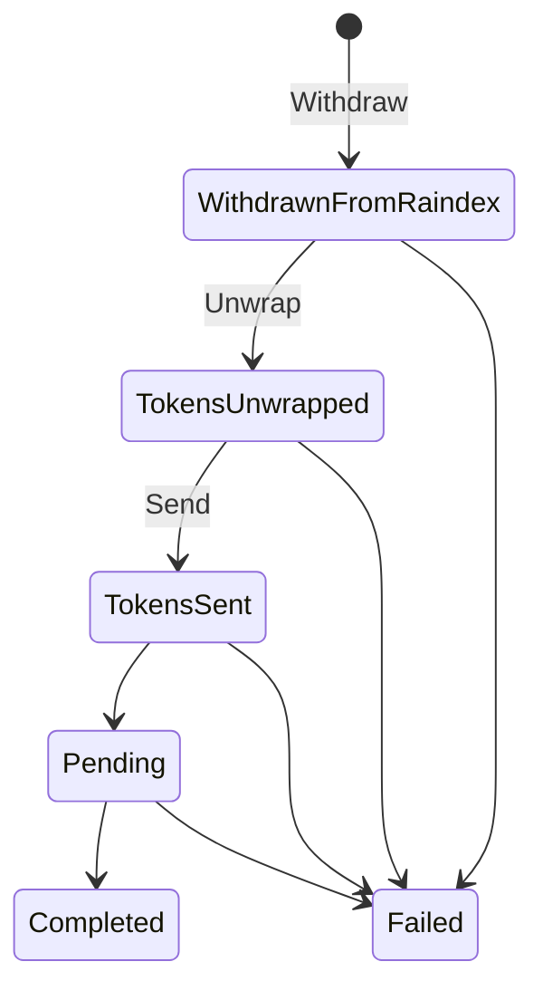
```mermaid
stateDiagram-v2
    [*] --> WithdrawnFromRaindex: Withdraw
    WithdrawnFromRaindex --> TokensUnwrapped: Unwrap
    WithdrawnFromRaindex --> Failed
    TokensUnwrapped --> TokensSent: Send
    TokensUnwrapped --> Failed
    TokensSent --> Pending
    TokensSent --> Failed
    Pending --> Completed
    Pending --> Failed
```

- `Withdraw` command withdraws wrapped tokens from Raindex vault to wallet
- `WithdrawnFromRaindex` tracks wrapped tokens that left the vault but aren't
  yet unwrapped
- `Unwrap` command converts ERC-4626 wrapped tokens to unwrapped tokens
- `TokensUnwrapped` tracks unwrapped tokens ready to send
- `Send` command sends unwrapped tokens to Alpaca and polls until terminal
- `TokensSent` tracks tokens that have been sent to Alpaca's redemption wallet
- `Pending` indicates Alpaca detected the transfer
- `Completed` and `Failed` are terminal states

##### States

```rust
enum EquityRedemption {
    WithdrawnFromRaindex {
        symbol: Symbol,
        quantity: Decimal,
        token: Address,
        amount: U256,
        raindex_withdraw_tx: TxHash,
        withdrawn_at: DateTime<Utc>,
    },
    TokensUnwrapped {
        symbol: Symbol,
        quantity: Decimal,
        token: Address,
        raindex_withdraw_tx: TxHash,
        unwrap_tx_hash: TxHash,
        unwrapped_amount: U256,
        withdrawn_at: DateTime<Utc>,
        unwrapped_at: DateTime<Utc>,
    },
    TokensSent {
        symbol: Symbol,
        quantity: Decimal,
        token: Address,
        raindex_withdraw_tx: TxHash,
        unwrap_tx_hash: Option<TxHash>,
        redemption_wallet: Address,
        redemption_tx: TxHash,
        sent_at: DateTime<Utc>,
    },
    Pending {
        symbol: Symbol,
        quantity: Decimal,
        redemption_tx: TxHash,
        tokenization_request_id: TokenizationRequestId,
        sent_at: DateTime<Utc>,
        detected_at: DateTime<Utc>,
    },
    Completed {
        symbol: Symbol,
        quantity: Decimal,
        redemption_tx: TxHash,
        tokenization_request_id: TokenizationRequestId,
        completed_at: DateTime<Utc>,
    },
    Failed {
        symbol: Symbol,
        quantity: Decimal,
        raindex_withdraw_tx: Option<TxHash>,
        redemption_tx: Option<TxHash>,
        tokenization_request_id: Option<TokenizationRequestId>,
        failed_at: DateTime<Utc>,
    },
}
```

##### Commands

```rust
enum EquityRedemptionCommand {
    // Withdraws wrapped tokens from Raindex vault to wallet
    Redeem {
        symbol: Symbol,
        quantity: Decimal,
        token: Address,
        amount: U256,
    },
    // Unwraps ERC-4626 wrapped tokens after Raindex withdrawal
    UnwrapTokens,
    // Sends unwrapped tokens to Alpaca's redemption wallet
    SendTokens,
    // Alpaca detected the token transfer
    Detect { tokenization_request_id: TokenizationRequestId },
    // Detection polling failed or timed out
    FailDetection { failure: DetectionFailure },
    // Redemption completed successfully
    Complete,
    // Alpaca rejected the redemption
    RejectRedemption { reason: String },
}
```

##### Events

```rust
enum EquityRedemptionEvent {
    WithdrawnFromRaindex {
        symbol: Symbol,
        quantity: Decimal,
        token: Address,
        amount: U256,
        raindex_withdraw_tx: TxHash,
        withdrawn_at: DateTime<Utc>,
    },

    // Unwrap failures are signaled via EquityRedemptionError::UnwrapFailed
    // (no event emitted), keeping the aggregate in WithdrawnFromRaindex for retry.
    TokensUnwrapped {
        unwrap_tx_hash: TxHash,
        unwrapped_amount: U256,
        unwrapped_at: DateTime<Utc>,
    },

    TokensSent {
        redemption_wallet: Address,
        redemption_tx: TxHash,
        sent_at: DateTime<Utc>,
    },
    TransferFailed {
        tx_hash: Option<TxHash>,
        failed_at: DateTime<Utc>,
    },

    Detected {
        tokenization_request_id: TokenizationRequestId,
        detected_at: DateTime<Utc>,
    },
    DetectionFailed {
        failure: DetectionFailure,
        failed_at: DateTime<Utc>,
    },

    Completed {
        completed_at: DateTime<Utc>,
    },
    RedemptionRejected {
        rejected_at: DateTime<Utc>,
    },
}

enum DetectionFailure { Timeout, ApiError { status_code: Option<u16> } }
```

##### Aggregate Services

The aggregate uses domain service traits directly as its Services:

```rust
struct EquityTransferServices {
    raindex: Arc<dyn Raindex>,
    tokenizer: Arc<dyn Tokenizer>,
    wrapper: Arc<dyn Wrapper>,
}
```

Both equity transfer aggregates share the same services type. Commands invoke
`Raindex` methods for vault operations, `Tokenizer` methods for tokenization and
redemption polling, and `Wrapper` methods for ERC-4626 wrapping/unwrapping.

##### Business Rules

- `Withdraw` only from uninitialized state; emits `WithdrawnFromRaindex`
- `Redeem` only from `WithdrawnFromRaindex` state; polls Alpaca until terminal
- If send fails after withdraw, aggregate stays in `WithdrawnFromRaindex`
  (tokens in wallet, not stranded)
- Completed and Failed are terminal states

#### UsdcRebalance Aggregate

**Purpose**: Manages bidirectional USDC movements between the hedging venue
(Alpaca) and the market making venue (Raindex) via Circle CCTP bridge.

**Aggregate ID**: Random UUID generated when rebalancing is initiated

Implements `EventSourced` with `Error = Never`. The enum contains only business
states; the uninitialized state is handled by the event-sorcery `Store`.

##### Supporting Types

```rust
#[derive(Debug, Clone, Serialize, Deserialize)]
enum RebalanceDirection {
    AlpacaToBase,
    BaseToAlpaca,
}

#[derive(Debug, Clone, Serialize, Deserialize)]
struct AlpacaTransferId(String);

#[derive(Debug, Clone, Serialize, Deserialize)]
enum TransferRef {
    AlpacaId(AlpacaTransferId),
    OnchainTx(TxHash),
}

// Typed (not opaque-string) reason an operator reconciled a stranded post-burn
// rebalance, recorded on `OperatorReconciled` / `Reconciled` for the audit trail.
#[derive(Debug, Clone, Copy, Serialize, Deserialize, PartialEq, Eq)]
enum ReconcileReason {
    // The minted USDC was moved to its destination manually.
    FundsMovedManually,
    // The deposit was credited at the destination outside the bot's view.
    DepositCreditedOffline,
}
```

**States**:

```rust
enum UsdcRebalance {
    // Conversion phase (USD/USDC trading on Alpaca)
    Converting {
        direction: RebalanceDirection,
        amount: Usdc,
        order_id: Uuid,
        initiated_at: DateTime<Utc>,
    },
    ConversionComplete {
        direction: RebalanceDirection,
        amount: Usdc,
        initiated_at: DateTime<Utc>,
        converted_at: DateTime<Utc>,
    },
    ConversionFailed {
        direction: RebalanceDirection,
        amount: Usdc,
        order_id: Uuid,
        reason: String,
        initiated_at: DateTime<Utc>,
        failed_at: DateTime<Utc>,
    },

    // Withdrawal phase
    Withdrawing {
        direction: RebalanceDirection,
        amount: Usdc,
        withdrawal_ref: TransferRef,
        initiated_at: DateTime<Utc>,
    },
    WithdrawalComplete {
        direction: RebalanceDirection,
        amount: Usdc,
        initiated_at: DateTime<Utc>,
        confirmed_at: DateTime<Utc>,
    },
    WithdrawalFailed {
        direction: RebalanceDirection,
        amount: Usdc,
        withdrawal_ref: TransferRef,
        reason: String,
        initiated_at: DateTime<Utc>,
        failed_at: DateTime<Utc>,
    },

    // Bridging phase (CCTP cross-chain transfer)
    Bridging {
        direction: RebalanceDirection,
        amount: Usdc,
        burn_tx_hash: TxHash,
        initiated_at: DateTime<Utc>,
        burned_at: DateTime<Utc>,
    },
    // Non-terminal: a Circle attestation poll timed out. The transfer stays
    // retryable (re-polled by a delayed job) until `retry_deadline_at`, after
    // which it is marked BridgingFailed for operator reconciliation.
    AwaitingAttestation {
        direction: RebalanceDirection,
        amount: Usdc,
        burn_tx_hash: TxHash,
        initiated_at: DateTime<Utc>,
        timed_out_at: DateTime<Utc>,
        retry_deadline_at: DateTime<Utc>,
    },
    Attested {
        direction: RebalanceDirection,
        amount: Usdc,
        burn_tx_hash: TxHash,
        cctp_nonce: B256,
        attestation: Vec<u8>,
        // Full CCTP message envelope, persisted so a resume reconstructs the
        // AttestationResponse and mints without re-polling Circle. None for
        // transfers whose BridgeAttestationReceived predates this field.
        message: Option<Vec<u8>>,
        mint_scan_from_block: u64,
        initiated_at: DateTime<Utc>,
        attested_at: DateTime<Utc>,
    },
    Bridged {
        direction: RebalanceDirection,
        amount: Usdc,
        amount_received: Usdc,
        fee_collected: Usdc,
        burn_tx_hash: TxHash,
        mint_tx_hash: TxHash,
        initiated_at: DateTime<Utc>,
        minted_at: DateTime<Utc>,
    },
    BridgingFailed {
        direction: RebalanceDirection,
        amount: Usdc,
        burn_tx_hash: Option<TxHash>,
        cctp_nonce: Option<B256>,
        reason: String,
        initiated_at: DateTime<Utc>,
        failed_at: DateTime<Utc>,
    },

    // Deposit phase
    DepositInitiated {
        direction: RebalanceDirection,
        amount: Usdc,
        burn_tx_hash: TxHash,
        mint_tx_hash: TxHash,
        deposit_ref: TransferRef,
        initiated_at: DateTime<Utc>,
        deposit_initiated_at: DateTime<Utc>,
    },
    DepositConfirmed {
        direction: RebalanceDirection,
        amount: Usdc,
        burn_tx_hash: TxHash,
        mint_tx_hash: TxHash,
        initiated_at: DateTime<Utc>,
        deposit_confirmed_at: DateTime<Utc>,
    },
    DepositFailed {
        direction: RebalanceDirection,
        amount: Usdc,
        burn_tx_hash: TxHash,
        mint_tx_hash: TxHash,
        deposit_ref: Option<TransferRef>,
        reason: String,
        initiated_at: DateTime<Utc>,
        failed_at: DateTime<Utc>,
    },

    // Guard-clearing terminal: an operator reconciled a stranded post-burn
    // failure out-of-band. Retains `amount` and `initiated_at` so the
    // projection still reports the real transfer rather than a zero-value one
    // starting at `reconciled_at`.
    Reconciled {
        direction: RebalanceDirection,
        amount: Usdc,
        reason: ReconcileReason,
        initiated_at: DateTime<Utc>,
        reconciled_at: DateTime<Utc>,
    },
}
```

##### Crash-safe resume

Resuming a transfer after a crash must never re-execute an irreversible on-chain
action that already succeeded. Each phase records its intent (and the relevant
chain head) before the action, so resume can scan the chain to adopt an
already-submitted action instead of re-issuing it:

- `WithdrawalSubmitting` / `BridgingSubmitting`: scan the source chain for an
  already-submitted withdrawal / burn (`find_recent_withdrawal` /
  `find_recent_burn`) from the captured head and adopt it rather than
  withdrawing / burning twice.
- `Attested`: the CCTP mint is irreversible -- re-calling `receiveMessage`
  reverts on the already-used nonce, which would otherwise turn a successfully
  minted transfer into a terminal `BridgingFailed`. Resume must scan the
  destination chain for the already-submitted mint (`find_recent_mint`, matching
  the `MintAndWithdraw` event) and adopt it -- recording `ConfirmBridging` with
  the existing mint tx, amount, and fee -- before attempting a fresh mint. The
  destination chain head is captured when the attestation is recorded so the
  scan is bounded.

##### Commands

```rust
enum UsdcRebalanceCommand {
    // Conversion commands (AlpacaToBase: pre-withdrawal, BaseToAlpaca: post-deposit)
    InitiateConversion {
        direction: RebalanceDirection,
        amount: Usdc,
        order_id: Uuid,
    },
    ConfirmConversion,
    FailConversion { reason: String },
    // Post-deposit conversion for BaseToAlpaca direction only
    InitiatePostDepositConversion { order_id: Uuid },

    // Withdrawal commands
    Initiate {
        direction: RebalanceDirection,
        amount: Usdc,
        withdrawal: TransferRef,
    },
    ConfirmWithdrawal,
    FailWithdrawal { reason: String },

    // Bridging commands
    InitiateBridging { burn_tx: TxHash },
    // Records that attestation polling timed out, moving Bridging ->
    // AwaitingAttestation with the deadline beyond which retries stop.
    TimeoutAttestation { retry_deadline_at: DateTime<Utc> },
    ReceiveAttestation { attestation: Vec<u8>, cctp_nonce: B256, message: Vec<u8>, mint_scan_from_block: u64 },
    ConfirmBridging { mint_tx: TxHash, amount_received: Usdc, fee_collected: Usdc },
    FailBridging { reason: String },

    // Deposit commands
    InitiateDeposit { deposit: TransferRef },
    ConfirmDeposit,
    FailDeposit { reason: String },

    // Reconcile a stranded post-burn failure to the terminal `Reconciled`
    // state, clearing the rebalancing guard rather than re-driving the failed
    // leg. Valid only from a post-burn terminal failure (see Business Rules).
    ReconcileStuckRebalance { reason: ReconcileReason },
}
```

##### Events

```rust
enum UsdcRebalanceEvent {
    // Conversion events
    ConversionInitiated {
        direction: RebalanceDirection,
        amount: Usdc,
        order_id: Uuid,
        initiated_at: DateTime<Utc>,
    },
    // direction: Required for incremental dispatch terminal detection
    // (reactors only receive newly committed events, not full history)
    ConversionConfirmed { direction: RebalanceDirection, converted_at: DateTime<Utc> },
    ConversionFailed { alpaca_order_id: Option<AlpacaOrderId>, failed_at: DateTime<Utc> },

    // Withdrawal events
    Initiated {
        direction: RebalanceDirection,
        amount: Usdc,
        withdrawal_ref: TransferRef,
        initiated_at: DateTime<Utc>,
    },
    WithdrawalConfirmed { confirmed_at: DateTime<Utc> },
    WithdrawalFailed { terminal_status: WithdrawalTerminalStatus, failed_at: DateTime<Utc> },

    // Bridging events (cctp_nonce comes from attestation, not burn tx)
    BridgingInitiated { burn_tx_hash: TxHash, burned_at: DateTime<Utc> },
    AttestationTimedOut {
        burn_tx_hash: TxHash,
        retry_deadline_at: DateTime<Utc>,
        timed_out_at: DateTime<Utc>,
    },
    BridgeAttestationReceived {
        attestation: Vec<u8>,
        cctp_nonce: B256,
        // Full CCTP message envelope, persisted so an Attested resume
        // reconstructs the AttestationResponse and mints without re-polling
        // Circle. Option: None for events serialized before this field existed
        // (those resume via the legacy re-poll fallback).
        message: Option<Vec<u8>>,
        mint_scan_from_block: u64,
        attested_at: DateTime<Utc>,
    },
    Bridged {
        mint_tx_hash: TxHash,
        amount_received: Usdc,
        fee_collected: Usdc,
        minted_at: DateTime<Utc>,
    },
    BridgingFailed {
        burn_tx_hash: Option<TxHash>,
        cctp_nonce: Option<B256>,
        stage: BridgeStage,
        failed_tx_hash: Option<TxHash>,
        failed_at: DateTime<Utc>,
    },
    DepositInitiated {
        deposit_ref: TransferRef,
        deposit_initiated_at: DateTime<Utc>,
    },
    DepositConfirmed {
        deposit_confirmed_at: DateTime<Utc>,
    },
    DepositFailed {
        deposit_ref: Option<TransferRef>,
        failed_tx_hash: Option<TxHash>,
        failed_at: DateTime<Utc>,
    },
    // Operator reconciled a stranded post-burn failure. Carries `direction` so
    // the reactor derives the source venue without in-memory tracking (which
    // may be absent after a restart), plus `amount` and `initiated_at` so the
    // projection preserves the real post-burn transfer instead of a zero-value
    // one starting at reconciliation time.
    OperatorReconciled {
        direction: RebalanceDirection,
        amount: Usdc,
        reason: ReconcileReason,
        initiated_at: DateTime<Utc>,
        reconciled_at: DateTime<Utc>,
    },
}

enum WithdrawalTerminalStatus { Canceled, Rejected, Returned }
enum BridgeStage { Burn, Attestation, Mint }
```

##### Business Rules

- Direction determines source and destination (AlpacaToBase: Ethereum mainnet ->
  Base, BaseToAlpaca: Base -> Ethereum mainnet)
- **USDC/USD Conversion**:
  - AlpacaToBase requires USD-to-USDC conversion BEFORE withdrawal (trading uses
    USD buying power, but CCTP bridge operates on USDC in Alpaca's crypto
    wallet)
  - BaseToAlpaca requires USDC-to-USD conversion AFTER deposit (USDC arrives in
    crypto wallet, must convert to USD buying power for trading)
  - Conversion uses USDC/USD crypto trading pair on Alpaca (market orders)
  - Crypto trading is available 24/7 on Alpaca (no market hours restrictions)
  - Market orders are near-instant but NOT guaranteed to fill immediately
  - Slippage: ~17bps observed in live tests (reduces effective USD received)
  - Partial fills: The system polls until the order is fully filled. Market
    orders for USDC/USD are expected to fill completely due to high liquidity.
    If an order enters a terminal failed state before full fill, the conversion
    fails and requires manual intervention.
  - Minimum withdrawal threshold ($51) accounts for slippage to ensure $50
    minimum is met after conversion
  - ConversionFailed is a terminal state (requires manual intervention)
  - ConversionComplete is terminal for BaseToAlpaca direction
- Alpaca withdrawals/deposits are asynchronous: initiate with API call (get
  transfer_id), poll status until COMPLETE
- Onchain transactions are asynchronous: submit tx (get tx_hash), wait for block
  inclusion and confirmation
- Source withdrawal must be confirmed before bridge burn
- Bridge burn transaction must be confirmed to extract CCTP nonce from event
  logs
- Attestation must be retrieved by polling Circle's REST API (~13 sec finality,
  no websocket option available)
- **Retryable attestation timeout**: an attestation poll timeout is recoverable,
  not a hard failure. `Bridging` moves to `AwaitingAttestation` (via
  `TimeoutAttestation`) and a delayed job re-polls until the attestation arrives
  or `retry_deadline_at` passes (`attestation_retry_deadline_secs`, a required
  config field, default 24h). On deadline elapse the transfer is marked
  `BridgingFailed` for operator reconciliation. The deadline is a soft bound:
  checked between polls, so it can overshoot by up to one poll window plus the
  redrive delay. Structural failures detected _after_ a `complete` attestation
  is fetched (e.g. an all-zero placeholder nonce) fail the bridge immediately.
  Failures _within_ the poll loop (HTTP errors, a still-`pending` or malformed
  `complete` response) are retried and, once the per-poll attempts exhaust,
  surface as the same retryable timeout -- so a malformed response is bounded by
  the deadline rather than failing fast. (Failing fast on a definitively
  malformed `complete` response is a tracked follow-up.)
- **Attested resume reconstructs the mint offline (no Circle re-poll)**: the
  mint needs the full CCTP message envelope, which `BridgeAttestationReceived`
  persists (the `message` field) alongside the attestation. Resuming from
  `Attested` reconstructs the `AttestationResponse` from the stored envelope and
  attestation -- re-deriving and cross-checking the nonce against the recorded
  `cctp_nonce` -- and mints with no Circle call. A reconstruction failure
  (corrupt envelope, placeholder nonce, or nonce mismatch) marks
  `BridgingFailed` for operator reconciliation, since the USDC is already
  burned. Transfers whose `BridgeAttestationReceived` predates the `message`
  field carry `None` and fall back to re-polling Circle: the attestation is
  permanently retrievable, so a timeout there retries until success rather than
  failing (bounding it would strand recoverable funds). The
  `attestation_retry_deadline` bounds only the `AwaitingAttestation` wait (where
  the attestation may never arrive).
- Bridge mint transaction requires valid attestation
- Bridge mint transaction must be confirmed before destination deposit
- A `receiveMessage()` revert because the CCTP nonce was already used is
  idempotent success only when destination-chain logs confirm all of the
  following: (1) a `MessageReceived` event for that nonce exists whose source
  domain and message body match the attested message; (2) the transaction that
  emitted that `MessageReceived` also emitted `MintAndWithdraw`. Transaction
  success is implicit since reverted transactions emit no logs. Any source
  domain or message body mismatch, or absence of the expected `MintAndWithdraw`,
  means the revert remains a bridge mint failure
- Destination deposit must be confirmed to complete rebalancing (for
  AlpacaToBase) or before post-deposit conversion (for BaseToAlpaca)
- Can mark failed from any non-terminal state
- Each rebalancing has unique UUID allowing multiple parallel operations
- **Operator reconciliation** (`ReconcileStuckRebalance` -> `OperatorReconciled`
  -> `Reconciled`): valid ONLY from a post-burn terminal failure that strands
  the rebalancing guard with no other exit -- `DepositFailed`, a post-burn
  `BridgingFailed` (a `burn_tx_hash` or `cctp_nonce` is recorded), or a
  `BaseToAlpaca` `ConversionFailed` (the post-deposit USDC->USD leg). Every
  other state is rejected: an in-progress transfer must be resumed, and a
  pre-burn failure already reconciles to source on its own. `Reconciled` is a
  clearing terminal -- it carries **post-burn semantics**, meaning the reactor
  zeroes source-venue inflight WITHOUT crediting `available` (the USDC was
  already burned via CCTP, so the funds genuinely left the source venue; this is
  NOT a cancel, which would wrongly credit `available`). See "Operator
  reconciliation of a stranded post-burn failure" under Failure Handling.

##### Integration Points

- **Alpaca API**: Withdraw/deposit USDC
- **Circle CCTP (Ethereum mainnet)**: TokenMessenger contract at
  0x28b5a0e9C621a5BadaA536219b3a228C8168cf5d
- **Circle CCTP (Base)**: Same TokenMessenger contract address
- **CCTP Domain IDs**: Ethereum = 0, Base = 6
- **Circle Attestation API**: Poll for attestation using CCTP nonce
- **Rain OrderBook**: deposit2()/withdraw2() for vault operations

##### CCTP Flow (using V2 Fast Transfer)

Alpaca to Base:

1. **Convert USD to USDC**: Place market sell order on USDC/USD pair (buy USDC)
2. Poll Alpaca until conversion order is filled
3. Initiate USDC withdrawal from Alpaca (get transfer_id)
4. Poll Alpaca API until withdrawal status is COMPLETE
5. Query Circle's `/v2/burn/USDC/fees` API for current fast transfer fee
6. Submit depositForBurn() tx on Ethereum TokenMessenger (domain 0 -> domain 6)
   with minFinalityThreshold=1000 and calculated maxFee for fast transfer
7. Wait for burn tx confirmation and extract CCTP nonce from event logs
8. Poll Circle attestation service for signature using CCTP nonce (~20 seconds
   for fast transfer)
9. Submit receiveMessage() tx on Base MessageTransmitter with attestation
10. Wait for mint tx confirmation (~8 seconds on Base)
11. Submit deposit tx to Rain orderbook vault on Base
12. Wait for deposit tx confirmation

Base to Alpaca:

1. Submit withdraw tx from Rain orderbook vault on Base
2. Wait for withdraw tx confirmation
3. Query Circle's `/v2/burn/USDC/fees` API for current fast transfer fee
4. Submit depositForBurn() tx on Base TokenMessenger (domain 6 -> domain 0) with
   minFinalityThreshold=1000 and calculated maxFee for fast transfer
5. Wait for burn tx confirmation and extract CCTP nonce from event logs
6. Poll Circle attestation service for signature using CCTP nonce (~8 seconds
   for fast transfer)
7. Submit receiveMessage() tx on Ethereum MessageTransmitter with attestation
   (mints USDC to the bot's own Ethereum wallet)
8. Wait for mint tx confirmation (~20 seconds on Ethereum)
9. Send the minted USDC from the bot wallet to Alpaca's deposit address (see
   "BaseToAlpaca deposit send"; fresh sends directly, resume adopts an existing
   send)
10. Poll Alpaca API by the send tx until deposit status is COMPLETE
11. **Convert USDC to USD**: Place market sell order on USDC/USD pair (sell
    USDC)
12. Poll Alpaca until conversion order is filled

###### Fast Transfer Benefits

- **Timing**: ~20-30 seconds for CCTP bridge portion vs 13-19 minutes standard
  transfer (50-80x faster)
- **Cost**: 1 basis point (0.01%) fee per transfer
- **Total rebalancing time**: Dominated by Alpaca deposit/withdrawal (~minutes)
  rather than bridge time

#### Wrapped Equity Recovery

**Purpose**: Automatically return wrapped equity tokens (wtSTOCK) found in the
bot wallet on Base to a venue that participates in market making, without
operator intervention. Wallet wtSTOCK arises whenever the normal transfer flow
fails to deliver to its destination -- a `TokenizedEquityMint` stalled after
wrapping but before depositing into Raindex, an `EquityRedemption` stalled after
withdrawing from Raindex but before unwrapping, or tokens arrived at the wallet
without any matching in-flight transfer (external deposit, prior-process crash
after compaction).

The mechanism has three components:

1. **Detection** — the inventory polling job already reads ERC-20 balances on
   the bot wallet. When it observes a non-zero wtSTOCK balance it emits
   `InventorySnapshotEvent::BaseWalletWrappedEquity { balances }`; the
   rebalancing reactor consumes that event and enqueues one
   `WrappedEquityRecoveryJob { symbol }` per symbol with a positive balance.
2. **Dispatch** — the recovery job inspects `InventoryView` and chooses one of
   three paths based on whether an active mint or redemption owns the symbol's
   in-flight slot.
3. **Audit** — a `WrappedEquityRecovery` aggregate records every recovery
   attempt, the dispatch decision, the side-effecting steps for the orphan path,
   and the terminal outcome.

##### Recovery Paths

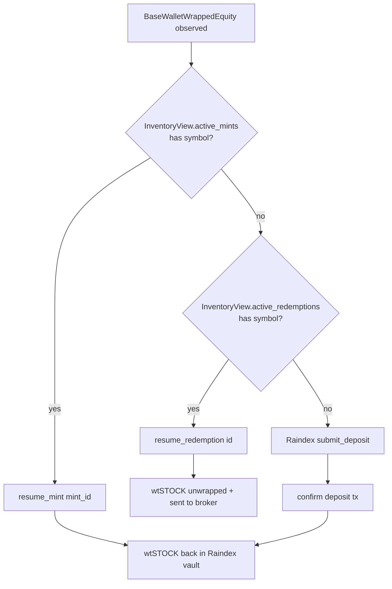
```mermaid
flowchart TD
    Detect[BaseWalletWrappedEquity observed]
    Detect --> CheckMint{InventoryView.active_mints<br/>has symbol?}
    CheckMint -- yes --> ResumeMint[resume_mint mint_id]
    CheckMint -- no --> CheckRedemption{InventoryView.active_redemptions<br/>has symbol?}
    CheckRedemption -- yes --> ResumeRedemption[resume_redemption id]
    CheckRedemption -- no --> Orphan[Raindex submit_deposit]
    ResumeMint --> Done[wtSTOCK back in Raindex vault]
    ResumeRedemption --> Done2[wtSTOCK unwrapped + sent to broker]
    Orphan --> Confirm[confirm deposit tx]
    Confirm --> Done
```

- **Active mint** -- the wtSTOCK belongs to a `TokenizedEquityMint` that reached
  `TokensWrapped` but never deposited. The dispatcher loads the aggregate via
  the ID stored in `InventoryView.active_mints[symbol]` and calls
  `CrossVenueEquityTransfer::resume_mint`; the existing mint flow drives it to
  `DepositedIntoRaindex`.
- **Active redemption** -- the wtSTOCK belongs to an `EquityRedemption` that
  reached `WithdrawnFromRaindex` but never unwrapped. The dispatcher loads it
  via `InventoryView.active_redemptions[symbol]` and calls `resume_redemption`;
  the redemption flow continues through unwrap and send.
- **Orphan deposit** -- no aggregate owns the symbol's in-flight slot, so the
  wallet wtSTOCK is unused liquidity. The market-making venue is the closest
  place to redeploy it (no broker round-trip), so the dispatcher resolves the
  wrapped-token address via `Wrapper::lookup_derivative`, looks up the Raindex
  vault, submits a deposit, and waits for confirmation.

A symbol can only be in one in-flight transfer at a time; an `InventoryView`
that reports both an active mint and an active redemption for the same symbol is
a corrupt-state signal. The dispatcher refuses to choose between them: it emits
`FailRecovery` with a reason that names both aggregate IDs and surfaces the
conflict to the operator instead of silently picking one path.

##### Concurrency

The job claims the same `equity_in_progress` guard the normal rebalancing
trigger uses. If another task is already driving the symbol's transfer the
recovery job logs at debug and exits without writing an aggregate; the next
polling tick re-evaluates. This keeps recovery dispatch from racing the
mint/redemption tasks already driven by apalis.

##### Idempotency

Each polled `BaseWalletWrappedEquity` snapshot triggers a fresh
`WrappedEquityRecoveryJob`. If the previous recovery already drained the wallet
the next job sees an empty balance and exits without writing an aggregate. If
the previous recovery is still running the `equity_in_progress` guard ensures
the new job exits.

##### WrappedEquityRecovery Aggregate

The audit trail AND the actor for recovery side effects. Persists one aggregate
instance per detection-and-dispatch attempt -- multiple recoveries for the same
symbol are independent aggregates, keyed by `WrappedEquityRecoveryId(Uuid)`.

`Services = WrappedEquityRecoveryServices { raindex: Arc<dyn Raindex>,
wrapper: Arc<dyn Wrapper>, transfer: Arc<CrossVenueEquityTransfer> }`
-- each command handler that needs an external side effect (orphan deposit
submit/confirm, mint resume, redemption resume) calls the corresponding service
inside the handler and emits the resulting event only on success. This mirrors
`TokenizedEquityMint` and `EquityRedemption` (both use `EquityTransferServices`
the same way) and keeps the audit trail tight: no event is recorded for a side
effect that didn't actually happen.

The job's responsibility is purely orchestration -- read `InventoryView`, pick a
dispatch path, and send the command sequence: `Detect`, then exactly one of
`DispatchToMint`, `DispatchToRedemption`, or
`SubmitOrphanDeposit +
ConfirmOrphanDeposit`. The dispatch-success and
orphan-deposit states are themselves terminal, so no separate completion command
is needed. The job does not call services directly.

The underlying `TokenizedEquityMint` / `EquityRedemption` aggregate continues to
own the active-transfer paths' physical work and its own event stream; this
aggregate records the dispatch decision (after `resume_*` returns Ok) and, for
the orphan path, captures the resulting tx hash.

###### State Flow

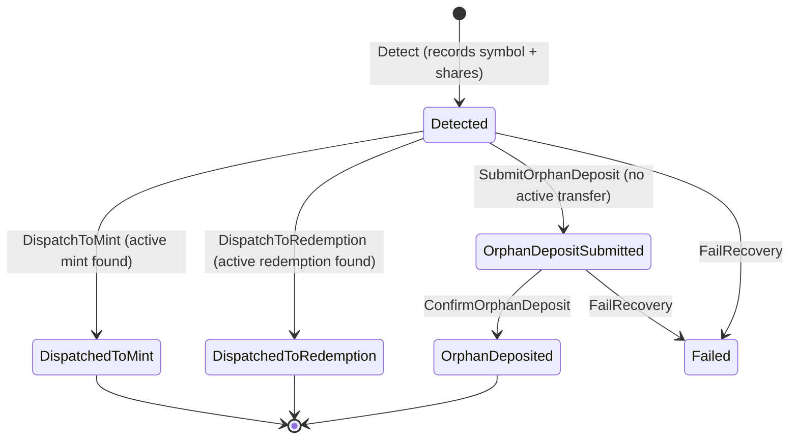
```mermaid
stateDiagram-v2
    [*] --> Detected: Detect (records symbol + shares)
    Detected --> DispatchedToMint: DispatchToMint (active mint found)
    Detected --> DispatchedToRedemption: DispatchToRedemption (active redemption found)
    Detected --> OrphanDepositSubmitted: SubmitOrphanDeposit (no active transfer)
    OrphanDepositSubmitted --> OrphanDeposited: ConfirmOrphanDeposit
    DispatchedToMint --> [*]
    DispatchedToRedemption --> [*]
    OrphanDeposited --> [*]
    Detected --> Failed: FailRecovery
    OrphanDepositSubmitted --> Failed: FailRecovery
```

The dispatch-success states (`DispatchedToMint`, `DispatchedToRedemption`,
`OrphanDeposited`) are themselves terminal -- they already encode which path
succeeded and with which `mint_id` / `redemption_id` / `tx_hash`. No separate
`Completed` state is needed.

- `Detect` is the initialization command and records the trigger (symbol,
  wrapped share quantity, detected_at). The job sends it as soon as it observes
  a non-zero balance for the symbol. No services are invoked.
- `DispatchToMint { mint_id }` / `DispatchToRedemption { redemption_id }`: the
  handler calls `services.transfer.resume_mint(mint_id)` (or
  `resume_redemption`) and emits the corresponding `DispatchedTo*` event only
  after `resume_*` returns Ok. The audit trail for the actual deposit/unwrap
  lives on the underlying mint/redemption aggregate's event stream; this
  aggregate records the dispatch decision. The resulting state is
  terminal-success for the path.
- `SubmitOrphanDeposit` (no params): the handler resolves the wrapped-token
  address via `services.wrapper.lookup_derivative(symbol)`, looks up the Raindex
  vault, calls `services.raindex.submit_deposit(...)`, and emits
  `OrphanDepositSubmitted { vault_deposit_tx_hash }` with the returned hash. The
  event is emitted iff the deposit was actually submitted on-chain. Records the
  tx hash so a process crash between submit and confirm resumes from the
  persisted hash on retry.
- `ConfirmOrphanDeposit` (no params): the handler reads `vault_deposit_tx_hash`
  from the current `OrphanDepositSubmitted` state, calls
  `services.raindex.confirm_tx(tx_hash)`, and emits `OrphanDeposited` with the
  same hash. Requires the configured number of confirmations. The resulting
  state is terminal-success.
- `FailRecovery { reason }`: explicit failure from any non-terminal state.
  Records the reason for downstream investigation. Service-call failures inside
  the dispatch handlers also emit `RecoveryFailed` (consistent with
  `TokenizedEquityMint`'s `MintAcceptanceFailed` pattern) so failures remain
  first-class events.

###### States

```rust
enum WrappedEquityRecovery {
    Detected { symbol, shares, detected_at },
    DispatchedToMint { symbol, shares, detected_at, mint_id, dispatched_at },        // terminal
    DispatchedToRedemption {                                                          // terminal
        symbol, shares, detected_at, redemption_id, dispatched_at,
    },
    OrphanDepositSubmitted {
        symbol, shares, detected_at, vault_deposit_tx_hash, submitted_at,
    },
    OrphanDeposited {                                                                 // terminal
        symbol, shares, detected_at, vault_deposit_tx_hash, submitted_at, deposited_at,
    },
    Failed { symbol, shares, reason, failed_at },                                     // terminal
}
```

###### Commands

```rust
enum WrappedEquityRecoveryCommand {
    Detect { symbol, shares },
    DispatchToMint { mint_id },                // services.transfer.resume_mint
    DispatchToRedemption { redemption_id },    // services.transfer.resume_redemption
    SubmitOrphanDeposit,                       // services.{wrapper,raindex}.*
    ConfirmOrphanDeposit,                      // services.raindex.confirm_tx
    FailRecovery { reason },
}
```

###### Events

```rust
enum WrappedEquityRecoveryEvent {
    Detected { symbol, shares, detected_at },
    DispatchedToMint { mint_id, dispatched_at },
    DispatchedToRedemption { redemption_id, dispatched_at },
    OrphanDepositSubmitted { vault_deposit_tx_hash, submitted_at },
    OrphanDeposited { vault_deposit_tx_hash, deposited_at },
    RecoveryFailed { reason, failed_at },
}
```

###### Business Rules

- `Detect` only initializes; subsequent `Detect` commands on a live aggregate
  are rejected.
- `DispatchToMint` / `DispatchToRedemption` / `SubmitOrphanDeposit` are only
  valid from `Detected` and are mutually exclusive -- at most one is dispatched
  per recovery.
- `ConfirmOrphanDeposit` is only valid from `OrphanDepositSubmitted` and only
  succeeds after the confirmation count required by the onchain config.
- All dispatch handlers run their side effect inside the command handler so the
  success event is emitted iff the side effect actually completed. Service
  failures are recorded as `RecoveryFailed`.
- `DispatchedToMint`, `DispatchedToRedemption`, `OrphanDeposited`, and `Failed`
  are terminal states.

###### Job-level Idempotency

The recovery job carries its `WrappedEquityRecoveryId` in the apalis payload
(generated by the reactor when pushing). On retry, apalis re-runs `perform` with
the same payload, so the job re-targets the same aggregate; the framework
reloads its current state and the next command in the sequence picks up where
the prior attempt stopped (e.g., if `SubmitOrphanDeposit` succeeded but
`ConfirmOrphanDeposit` crashed before persisting, the retry skips submit and
goes straight to confirm).

This is at-least-once for side effects: a crash between `submit_deposit`
returning and the `OrphanDepositSubmitted` event persisting will still re-submit
on retry. The aggregate-level guarantee is that no terminal event is recorded
for a side effect that didn't actually succeed.

#### Unwrapped Equity Recovery

**Purpose**: Automatically return unwrapped equity tokens (tSTOCK) found in the
bot wallet on Base to a venue that participates in market making, without
operator intervention. Wallet tSTOCK arises whenever the normal transfer flow
fails to deliver the wrapped form to its destination -- a `TokenizedEquityMint`
stalled after `TokensReceived` but before wrapping, an `EquityRedemption`
stalled after `TokensUnwrapped` but before sending to the broker, or tokens
arrived at the wallet without any matching in-flight transfer (external deposit,
prior-process crash, or false-positive `TransactionDropped` from a laggy RPC
backend that left the bot believing a wrap attempt failed).

The mechanism mirrors [Wrapped Equity Recovery](#wrapped-equity-recovery):
detection from the inventory poll, dispatch by `InventoryView`, audit via a
dedicated aggregate. It differs in two places:

- **Orphan path also wraps**. Wrapped recovery deposits the existing wtSTOCK
  straight into the Raindex vault. Unwrapped recovery first wraps the tSTOCK
  into the ERC-4626 vault share, then deposits into Raindex -- two on-chain
  steps the aggregate must persist independently so a crash between them can
  resume from the wrap tx hash without double-wrapping.
- **Active redemption path sends to broker**. A redemption that stalled at
  `TokensUnwrapped` has already withdrawn from Raindex and unwrapped; the
  remaining work is the off-chain transfer to the Alpaca redemption wallet.

##### Recovery Paths

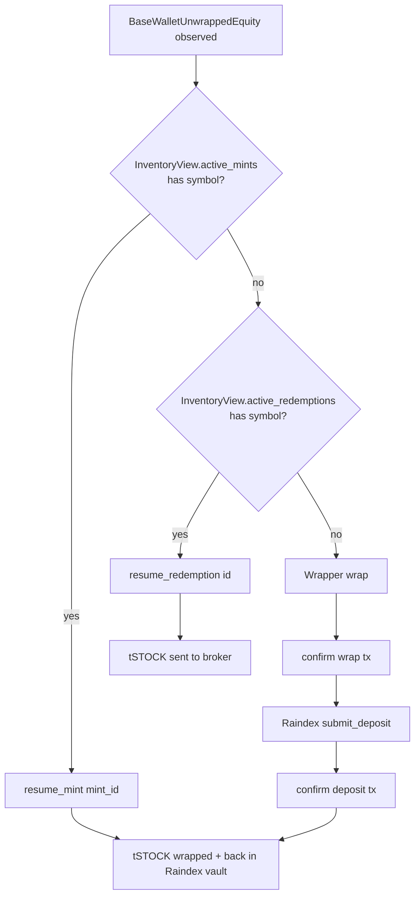
```mermaid
flowchart TD
    Detect[BaseWalletUnwrappedEquity observed]
    Detect --> CheckMint{InventoryView.active_mints<br/>has symbol?}
    CheckMint -- yes --> ResumeMint[resume_mint mint_id]
    CheckMint -- no --> CheckRedemption{InventoryView.active_redemptions<br/>has symbol?}
    CheckRedemption -- yes --> ResumeRedemption[resume_redemption id]
    CheckRedemption -- no --> OrphanWrap[Wrapper wrap]
    ResumeMint --> Done[tSTOCK wrapped + back in Raindex vault]
    ResumeRedemption --> Done2[tSTOCK sent to broker]
    OrphanWrap --> ConfirmWrap[confirm wrap tx]
    ConfirmWrap --> OrphanDeposit[Raindex submit_deposit]
    OrphanDeposit --> ConfirmDeposit[confirm deposit tx]
    ConfirmDeposit --> Done
```

- **Active mint** -- the tSTOCK belongs to a `TokenizedEquityMint` that reached
  `TokensReceived` but never wrapped. The dispatcher loads the aggregate via the
  ID stored in `InventoryView.active_mints[symbol]` and calls
  `CrossVenueEquityTransfer::resume_mint`; the existing mint flow drives it
  through wrap and deposit to `DepositedIntoRaindex`.
- **Active redemption** -- the tSTOCK belongs to an `EquityRedemption` that
  reached `TokensUnwrapped` but never sent. The dispatcher loads it via
  `InventoryView.active_redemptions[symbol]` and calls `resume_redemption`; the
  redemption flow finishes the broker-side transfer.
- **Orphan deposit** -- no aggregate owns the symbol's in-flight slot, so the
  wallet tSTOCK is unused liquidity. The market-making venue is the closest
  redeploy target, so the dispatcher resolves the token + wrapper-vault pair via
  `Wrapper::lookup_underlying` / `lookup_derivative`, wraps the tokens, waits
  for the wrap receipt, submits a Raindex deposit, and waits for the deposit
  receipt.

A symbol can only be in one in-flight transfer at a time; an `InventoryView`
that reports both an active mint and an active redemption for the same symbol is
a corrupt-state signal. The dispatcher refuses to choose between them: it emits
`FailRecovery` with a reason that names both aggregate IDs and surfaces the
conflict to the operator instead of silently picking one path.

##### Concurrency

The job claims the same `equity_in_progress` guard the normal rebalancing
trigger uses, exactly like
[`WrappedEquityRecovery`](#wrappedequityrecovery-aggregate).

##### Idempotency

Each polled `BaseWalletUnwrappedEquity` snapshot triggers a fresh
`UnwrappedEquityRecoveryJob`. If the previous recovery already wrapped and
deposited the tokens, the next job sees an empty unwrapped balance and exits
without writing an aggregate. The `equity_in_progress` guard prevents
overlapping runs against the same symbol.

##### UnwrappedEquityRecovery Aggregate

The audit trail AND the actor for recovery side effects, keyed by
`UnwrappedEquityRecoveryId(Uuid)`. Each detection-and-dispatch attempt is its
own aggregate instance.

`Services = UnwrappedEquityRecoveryServices { raindex: Arc<dyn Raindex>,
wrapper: Arc<dyn Wrapper>, transfer: Arc<CrossVenueEquityTransfer>,
wallet: Address }`
-- differs from `WrappedEquityRecoveryServices` by the added `wallet: Address`,
the bot wallet on Base that is both the wrap receiver and the address the orphan
deposit pulls wrapped tokens from.

The job's responsibility is purely orchestration -- read `InventoryView`, pick a
dispatch path, and send the command sequence: `Detect`, then exactly one of
`DispatchToMint`, `DispatchToRedemption`, or
`SubmitOrphanWrap + ConfirmOrphanWrap + SubmitOrphanDeposit +
ConfirmOrphanDeposit`.
The dispatch-success states are terminal.

###### State Flow

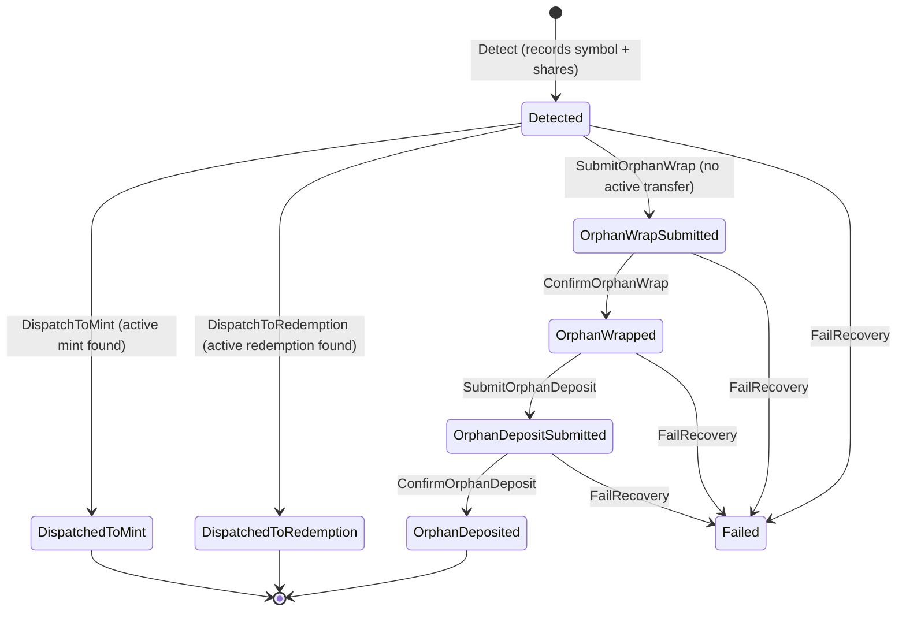
```mermaid
stateDiagram-v2
    [*] --> Detected: Detect (records symbol + shares)
    Detected --> DispatchedToMint: DispatchToMint (active mint found)
    Detected --> DispatchedToRedemption: DispatchToRedemption (active redemption found)
    Detected --> OrphanWrapSubmitted: SubmitOrphanWrap (no active transfer)
    OrphanWrapSubmitted --> OrphanWrapped: ConfirmOrphanWrap
    OrphanWrapped --> OrphanDepositSubmitted: SubmitOrphanDeposit
    OrphanDepositSubmitted --> OrphanDeposited: ConfirmOrphanDeposit
    DispatchedToMint --> [*]
    DispatchedToRedemption --> [*]
    OrphanDeposited --> [*]
    Detected --> Failed: FailRecovery
    OrphanWrapSubmitted --> Failed: FailRecovery
    OrphanWrapped --> Failed: FailRecovery
    OrphanDepositSubmitted --> Failed: FailRecovery
```

###### States

```rust
enum UnwrappedEquityRecovery {
    Detected { symbol, shares, detected_at },
    DispatchedToMint { symbol, shares, detected_at, mint_id, dispatched_at },          // terminal
    DispatchedToRedemption {                                                           // terminal
        symbol, shares, detected_at, redemption_id, dispatched_at,
    },
    OrphanWrapSubmitted { symbol, shares, detected_at, wrap_tx_hash, submitted_at },
    OrphanWrapped { symbol, shares, detected_at, wrap_tx_hash, wrapped_at },
    OrphanDepositSubmitted {
        symbol, shares, detected_at, wrap_tx_hash, vault_deposit_tx_hash, submitted_at,
    },
    OrphanDeposited {                                                                  // terminal
        symbol, shares, detected_at, vault_deposit_tx_hash, deposited_at,
    },
    Failed { symbol, shares, reason, failed_at },                                      // terminal
}
```

###### Commands

```rust
enum UnwrappedEquityRecoveryCommand {
    Detect { symbol, shares },
    DispatchToMint { mint_id },                // services.transfer.resume_mint
    DispatchToRedemption { redemption_id },    // services.transfer.resume_redemption
    SubmitOrphanWrap,                          // services.wrapper.submit_wrap
    ConfirmOrphanWrap,                         // services.wrapper.confirm_wrap
    SubmitOrphanDeposit,                       // services.raindex.submit_deposit
    ConfirmOrphanDeposit,                      // services.raindex.confirm_tx
    FailRecovery { reason },
}
```

###### Events

```rust
enum UnwrappedEquityRecoveryEvent {
    Detected { symbol, shares, detected_at },
    DispatchedToMint { mint_id, dispatched_at },
    DispatchedToRedemption { redemption_id, dispatched_at },
    OrphanWrapSubmitted { wrap_tx_hash, submitted_at },
    OrphanWrapped { wrap_tx_hash, wrapped_at },
    OrphanDepositSubmitted { vault_deposit_tx_hash, submitted_at },
    OrphanDeposited { vault_deposit_tx_hash, deposited_at },
    RecoveryFailed { reason, failed_at },
}
```

###### Business Rules

- `Detect` only initializes; subsequent `Detect` commands on a live aggregate
  are rejected.
- `DispatchToMint` / `DispatchToRedemption` / `SubmitOrphanWrap` are only valid
  from `Detected` and are mutually exclusive -- at most one is dispatched per
  recovery.
- The orphan path's four commands must be sent in order; each is only valid from
  its predecessor's terminal-for-step state.
- `ConfirmOrphanWrap` and `ConfirmOrphanDeposit` only succeed after the
  configured confirmation count, mirroring the wrapped recovery's
  `confirm_deposit` semantics.
- All dispatch handlers run their side effect inside the command handler so the
  success event is emitted iff the side effect actually completed.
- Terminal states: `DispatchedToMint`, `DispatchedToRedemption`,
  `OrphanDeposited`, `Failed`.

###### Job-level Idempotency

Same model as `WrappedEquityRecoveryJob`: the apalis payload carries the
`UnwrappedEquityRecoveryId` so retries re-target the same aggregate and resume
from the next non-terminal command. There is no `client_order_id` or nonce-based
replay-protection at the wrapper layer -- `submit_wrap` takes only
`(wrapped_token, underlying_amount, wallet)`, and wrapping is an on-chain
ERC-4626 deposit, not a broker call. The crash-window guard is the aggregate
state machine instead: a retry that finds `OrphanWrapSubmitted` already
persisted resumes at `ConfirmOrphanWrap` rather than re-wrapping. The one
un-guarded window is a wrap that lands on-chain but crashes before
`OrphanWrapSubmitted` persists -- the aggregate is still `Detected`, so the
retry re-submits. Funds are not lost: the surplus wtSTOCK is swept by the
wrapped recovery path, though the original aggregate may terminate in `Failed`.

#### Rebalancing Triggers

##### Inventory Tracking

The system tracks two separate inventory categories:

1. **Per-Symbol Equity Inventory**: Each tokenized equity (AAPL, MSFT, etc.) has
   independent inventory tracked across venues
   - Onchain: Tokens in Rain orderbook vaults (Base)
   - Offchain: Shares in Alpaca account
   - Example: AAPL might be 80% onchain while MSFT is 30% onchain

2. **Global USDC Inventory**: Total USDC across both venues
   - Onchain: USDC in Rain orderbook vaults (Base)
   - Offchain: USDC in Alpaca account
   - Single global ratio (not per-symbol)

##### Imbalance Detection

InventoryView calculates imbalances after each position or rebalancing event by
checking per-symbol equity ratios and global USDC ratio against configured
thresholds. When deviation exceeds the threshold and minimum amounts are met, it
emits imbalance detection events.

**Rebalancing Parameters** (configurable per environment):

- **Equity per symbol**:
  - Target ratio: 0.5 (aim for 50% onchain, 50% offchain)
  - Deviation threshold: 0.2 (trigger when ratio deviates by +/-0.2 from target)
  - Example: Triggers at <0.3 (mint) or >0.7 (redeem)
  - Minimum rebalancing amount: e.g., $1000 equivalent to avoid tiny operations
- **USDC global**:
  - Target ratio: 0.5 (aim for 50% onchain, 50% offchain)
  - Deviation threshold: 0.3 (trigger when ratio deviates by +/-0.3 from target)
  - Example: Triggers at <0.2 (bridge to Base) or >0.8 (bridge to Alpaca)
  - Minimum rebalancing amount: e.g., $5000 to avoid frequent small transfers

##### Trigger Events

When thresholds crossed AND minimum amounts met, InventoryView emits:

- `EquityImbalanceDetected { symbol, direction: Mint/Redeem, quantity,
  estimated_value_usd }`
- `UsdcImbalanceDetected { direction: AlpacaToBase/BaseToAlpaca, amount }`

**Rebalancer** (stateless) listens to these events and executes appropriate
commands on TokenizedEquityMint, EquityRedemption, or UsdcRebalance aggregates.

##### Example Scenarios

1. **Heavy onchain trading in AAPL**: Sold lots of AAPL tokens onchain, now 85%
   of AAPL inventory is offchain shares
   - Trigger: Mint AAPL (shares -> tokens) to rebalance back toward 50/50

2. **Depleted onchain USDC**: Bought lots of tokens with USDC, now only 15% of
   USDC is onchain
   - Trigger: Bridge USDC from Alpaca to Base to replenish trading capital

3. **Mixed symbol imbalances**: AAPL 80% onchain, MSFT 25% onchain
   - Trigger: Redeem AAPL (tokens -> shares) AND Mint MSFT (shares -> tokens)
   - Each symbol rebalances independently

#### Coordination with Position Aggregate

**Position Aggregate** tracks net exposure from arbitrage trading but does NOT
know about cross-venue inventory.

**InventoryView** listens to:

- `PositionEvent::OnChainOrderFilled` - Updates available balances (trading
  activity)
- `PositionEvent::OffChainOrderFilled` - Updates available balances (trading
  activity)
- `TokenizedEquityMintEvent::MintAccepted` - Moves shares to inflight (leaving
  Alpaca)
- `TokenizedEquityMintEvent::TokensReceived` - Moves from inflight to Raindex
  available
- `TokenizedEquityMintEvent::TokensWrapped` - No balance change (conversion
  between wrapped/unwrapped forms)
- `TokenizedEquityMintEvent::WrappingFailed` - No balance change (tokens await
  retry)
- `TokenizedEquityMintEvent::DepositedIntoRaindex` - No balance change
  (completes transfer to Raindex, already counted at TokensReceived)
- `TokenizedEquityMintEvent::RaindexDepositFailed` - No balance change (tokens
  await retry or manual recovery)
- `TokenizedEquityMintEvent::MintRejected` - No balance change (rejected before
  shares left Alpaca)
- `TokenizedEquityMintEvent::MintAcceptanceFailed` - Reconciles inflight back to
  Alpaca available
- `EquityRedemptionEvent::WithdrawnFromRaindex` - Moves tokens to inflight
  (leaving Raindex vault)
- `EquityRedemptionEvent::TokensUnwrapped` - No balance change (conversion
  between wrapped/unwrapped forms)
- `EquityRedemptionEvent::TransferFailed` - Cancels inflight back to Raindex
  available (tokens never left our wallet)
- `EquityRedemptionEvent::TokensSent` - Tokens sent to Alpaca (still inflight)
- `EquityRedemptionEvent::Completed` - Moves from inflight to Alpaca available
- `EquityRedemptionEvent::DetectionFailed` - Terminal: tokens may be stranded
  mid-redemption (sent to the issuance bot's redemption wallet but not yet
  settled back as broker shares; manual recovery). Inflight is not held
  indefinitely -- the redemption is dropped from active ownership, so
  inflight-equity polls stop counting its still-pending provider request as
  bot-owned and the inflight clears, letting rebalancing resume; the
  transfer-timeout path also clears inflight explicitly
- `EquityRedemptionEvent::RedemptionRejected` - Terminal: token disposition
  uncertain after rejection. Inflight is released the same way as
  `DetectionFailed` (ownership dropped so polls stop counting the stranded
  request and rebalancing resumes), while operators resolve the actual asset
  location manually
- Failed equity transfer detail views surface the stranded quantity when the
  terminal failure happened after equity left the bot's normal available
  balance. Operators can run a targeted re-check command for a specific failed
  mint or redemption aggregate; if the tokenization provider now reports the
  request completed, the aggregate records recovery events and transitions to
  the same success terminal as the normal flow. Pending, rejected, or missing
  provider requests leave the aggregate unchanged. Recovery runs in-process via
  the bot's REST API (`POST /transfers/recheck/<kind>/<id>`) so the recovery
  event dispatches through the inventory reactor (applying the same inventory
  effect as the successful flow) under the shared resume lock. Mint recovery
  applies only to acceptance-stage failures (tokens never received); a mint that
  failed after receiving tokens is reported as not recoverable so recovery never
  re-wraps tokens that already moved.
- `UsdcRebalanceEvent::WithdrawalConfirmed` - Moves USDC to inflight (leaving
  source)
- `UsdcRebalanceEvent::DepositConfirmed` - Terminal success for AlpacaToBase;
  moves from inflight to destination available
- `UsdcRebalanceEvent::ConversionConfirmed` - Terminal success for BaseToAlpaca;
  moves from inflight to destination available
- `UsdcRebalanceEvent::WithdrawalFailed`, pre-burn `BridgingFailed`, and
  AlpacaToBase `ConversionFailed` (the pre-withdrawal USD->USDC leg) -
  Reconciles inflight back to source available, because the failure happened
  before the CCTP burn so the funds are still on the source venue
- Post-burn `UsdcRebalanceEvent::BridgingFailed`, `DepositFailed`, and
  BaseToAlpaca `ConversionFailed` (the post-deposit USDC->USD leg) - Keeps
  source inflight and the USDC rebalancing guard active because the funds were
  burned (and, for the deposit/conversion failures, already minted) by CCTP and
  are not available on the source venue. The same applies to any transfer that
  times out at or after the burn
- `InventorySnapshotEvent::OnchainEquity` - Onchain equity balances fetched from
  vaults
- `InventorySnapshotEvent::OnchainCash` - Onchain USDC balance fetched from
  vault
- `InventorySnapshotEvent::OffchainEquity` - Offchain equity positions fetched
  from broker
- `InventorySnapshotEvent::OffchainCash` - Offchain cash balance fetched from
  broker
- `InventorySnapshotEvent::InflightEquity` - Bot-owned pending tokenization
  requests polled from Alpaca; sets inflight at Hedging (mints) and MarketMaking
  (redemptions)
  - **Ownership**: determined by active rebalancing aggregate IDs --
    `issuer_request_id` / `tokenization_request_id` for mints,
    `tokenization_request_id` / `redemption_tx` for redemptions -- not by
    destination wallet alone
  - **Pre-detection redemptions**: redemptions that sent tokens before Alpaca
    assigned a `tokenization_request_id` are owned via `redemption_tx` until
    detection records the provider ID
  - **External requests**: unknown pending requests targeting the bot wallet are
    logged for operators but do not count as inflight or block rebalancing
  - **Available balances**: unchanged -- set by separate available-balance
    snapshots

##### Separation of concerns

- Position: Tracks trading-induced position changes
- CrossVenueEquityTransfer: Tracks rebalancing-induced equity movements (mint
  and redemption)
- CrossVenueCashTransfer: Tracks rebalancing-induced USDC movements
- InventoryView: Combines all events to calculate total inventory
- InventorySnapshot: Records fetched balances from onchain vaults and offchain
  broker

##### Inventory Reconciliation

The system's internal accounting is built from events it knows about (trades,
mints, redemptions, USDC rebalances). But inventory can be affected by actions
outside the system - manual deposits, withdrawals, or trades on either venue.
Until those external changes are observed and fed back as events, the internal
accounting drifts from reality.

The reconciliation system closes this gap by periodically fetching actual
balances and emitting them as events the system can react to:

- **VaultRegistry** (CQRS aggregate): Auto-discovers Raindex vaults from
  ClearV3/TakeOrderV3 trade events. Tracks multiple equity vaults per token
  address and multiple USDC vaults per orderbook/owner pair. Inventory polling
  sums balances across all vaults for each asset.
- **InventorySnapshot** (CQRS aggregate): Records point-in-time snapshots of
  actual balances fetched from onchain vaults and the offchain broker.
- **InventoryPollingService**: Periodically polls actual balances from both
  venues, emitting InventorySnapshot events. InventoryView reacts to these
  events to update tracked inventory. Offchain equity polling normalizes active
  configured equities omitted by the broker positions response to explicit zero
  balances, and ignores broker-only symbols that are not configured as active
  assets.
- **Polling runs on a 60-second interval** during market hours as a background
  conductor task. Onchain polling uses the `vaultBalance2` contract call;
  offchain polling uses the `Executor::get_inventory()` trait method.

### InventoryView

`InventoryView` aggregates inventory across onchain and offchain venues and
detects imbalances that trigger rebalancing. It is the central projection that
monitors total system inventory.

Each asset type (equities per symbol, USDC) is tracked via a generic
`Inventory<T>` containing `Option<VenueBalance<T>>` per venue. The `Option`
distinguishes "not yet polled" from "polled with zero balance" — imbalance
detection requires both venues to have been initialized by snapshot events.

When `InventoryView` applies an equity snapshot (`OnchainEquity` for the
MarketMaking venue, `OffchainEquity` for the Hedging venue), it treats the
snapshot as the complete picture of that venue: any symbol already tracked at
the venue but absent from the snapshot is zeroed at that venue, subject to the
same staleness guards (snapshot watermark, inflight transfers, last
rebalancing). This keeps the live view consistent with the fully-replaced
persisted snapshot rather than retaining a stale balance. It relies on both
pollers emitting complete venue snapshots: offchain polling seeds an explicit
zero for every configured symbol (above), and onchain polling emits a balance
for every discovered vault in the monotonic vault registry.

`InventoryView` listens to trading events (onchain/offchain fills),
`TokenizedEquityMintEvent`, `EquityRedemptionEvent`, `UsdcRebalanceEvent`, and
`InventorySnapshotEvent` to maintain venue balances. Inflight tracking ensures
assets in transit (minting, redeeming, bridging) are accounted for.

Imbalance detection compares each asset's onchain ratio against a configurable
`ImbalanceThreshold` (target ratio + deviation). Rebalancing is only triggered
when no inflight operations exist for the asset. Trigger events are emitted to
`Rebalancer` for execution.

#### Failure Handling and Reconciliation

**Automatic Reconciliation**: When rebalancing operations fail before assets
leave the recoverable source side, the projection logic reconciles inflight
balances back to the source venue's available balance. Failures after an
irreversible handoff (for example, a CCTP burn) stay inflight until settlement
or manual operator recovery.

**Durable rebalancing guard**: The single-rebalance guard that blocks a new USDC
rebalance while one is unsettled is reconstructed from persisted `UsdcRebalance`
event state on startup, so a restart between a post-burn failure and settlement
cannot re-open the re-burn window. Any aggregate not in a clearable-terminal
state (success, or a pre-burn failure that reconciles to source) re-asserts the
guard at boot and blocks new USDC rebalancing until it settles or an operator
recovers it. USDC bridges are not auto-resumed on restart, so the guard is held
until manual recovery.

**Operator reconciliation of a stranded post-burn failure**: A USDC rebalance
that fails after the CCTP burn holds the rebalancing guard, blocking further
USDC rebalancing. Because the burned/minted USDC was handled out-of-band, this
is reconciled rather than re-driven: the `reconcile-usdc-transfer` CLI command
sends `ReconcileStuckRebalance`, which emits `OperatorReconciled` and drives the
aggregate to a new clearing terminal state, `Reconciled`. The reactor then
clears the in-progress guard, removes tracking, and reconciles source-venue
inflight with **post-burn semantics** -- it zeroes the source-venue inflight
WITHOUT crediting `available`, because the funds already left the source venue
(it is NOT a cancel, which would wrongly credit available). The command is valid
ONLY from a post-burn terminal failure that strands the guard: `DepositFailed`
(the CCTP mint landed but the destination deposit failed), a post-burn
`BridgingFailed` (a `burn_tx_hash` or `cctp_nonce` is recorded), or a
`BaseToAlpaca` `ConversionFailed` (the post-deposit USDC->USD leg). Every other
state is rejected -- an in-progress transfer must be resumed, and a pre-burn
failure already reconciles to source on its own. Because `Reconciled` is a
clearable terminal, a restart does not re-latch the guard, and automatic USDC
rebalancing resumes.

##### Manual Reconciliation Required

Some failure scenarios may leave assets in states requiring manual intervention:

1. **Redemption sent but Alpaca never recognizes**:
   - Tokens successfully sent to redemption wallet (TokensSent)
   - Alpaca API never shows the redemption request
   - Tokens are neither in our orderbook vault nor credited to Alpaca
   - **Resolution**: Contact Alpaca support with tx_hash to manually credit
     shares

2. **CCTP bridge stuck**:
   - USDC burned on source chain (BridgingInitiated)
   - Attestation retrieval fails or mint transaction repeatedly fails
   - USDC is neither on source nor destination chain
   - Attestation poll _timeouts_ are retried automatically until
     `attestation_retry_deadline_secs`; manual reconciliation is only needed
     after the deadline elapses (BridgingFailed) or on a hard mint failure
   - **Resolution**: Retry attestation fetching or mint transaction with
     extended timeout

3. **Mint accepted but tokens never arrive**:
   - Shares taken from Alpaca (MintAccepted)
   - Issuer/bridge never completes the mint
   - Shares gone but tokens not received
   - **Resolution**: Contact issuer/bridge provider to complete or reverse
     transaction

**Future Enhancement**: Add a `ReconciliationAggregate` to track manual
interventions as first-class events:

```rust
enum ReconciliationCommand {
    ReportStuckRedemption { redeem_id: Uuid, recovery_plan: String },
    ResolveStuckRedemption { redeem_id: Uuid, resolution: Resolution },
    // Similar commands for mint and USDC rebalancing
}

enum Resolution {
    ManuallyCompleted { supporting_evidence: String },
    ManuallyCancelled { refund_tx: Option<TxHash> },
}
```

This would provide complete audit trail for all manual interventions and allow
proper tracking of asset movements that required manual resolution.

### Event Processing Flow

#### OnChain Event Processing

**Current Flow** (apalis-orchestrated with CQRS/ES):

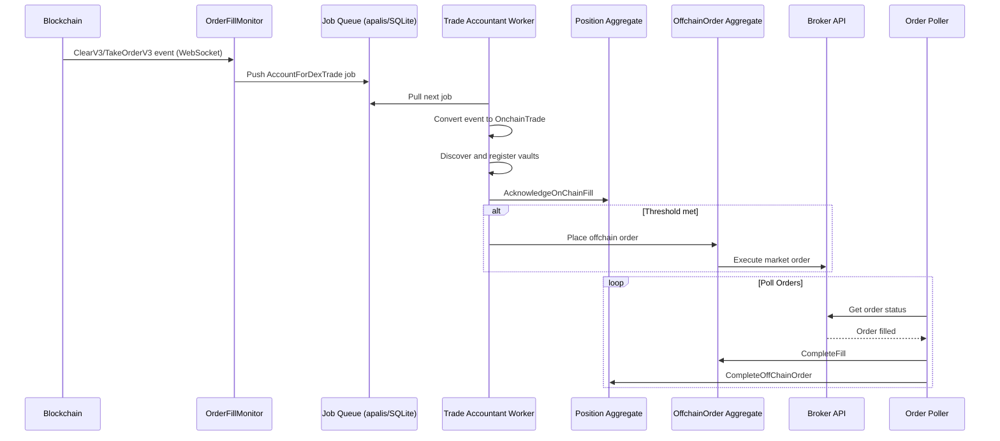
```mermaid
sequenceDiagram
    participant BC as Blockchain
    participant OFM as OrderFillMonitor
    participant Q as Job Queue (apalis/SQLite)
    participant W as Trade Accountant Worker
    participant P as Position Aggregate
    participant OO as OffchainOrder Aggregate
    participant Broker as Broker API
    participant OP as Order Poller

    BC->>OFM: ClearV3/TakeOrderV3 event (WebSocket)
    OFM->>Q: Push AccountForDexTrade job

    W->>Q: Pull next job
    W->>W: Convert event to OnchainTrade
    W->>W: Discover and register vaults
    W->>P: AcknowledgeOnChainFill
    alt Threshold met
        W->>OO: Place offchain order
        OO->>Broker: Execute market order
    end

    loop Poll Orders
        OP->>Broker: Get order status
        Broker-->>OP: Order filled
        OP->>OO: CompleteFill
        OP->>P: CompleteOffChainOrder
    end
```

On startup, backfill pushes historical events after the persisted backfill
checkpoint as `AccountForDexTrade` jobs into the same queue. The worker starts
after backfill completes, so historical jobs are enqueued before live events are
processed. Successful backfill advances the checkpoint to the cutoff block.

**Target Flow** (lifecycle workflows, future):

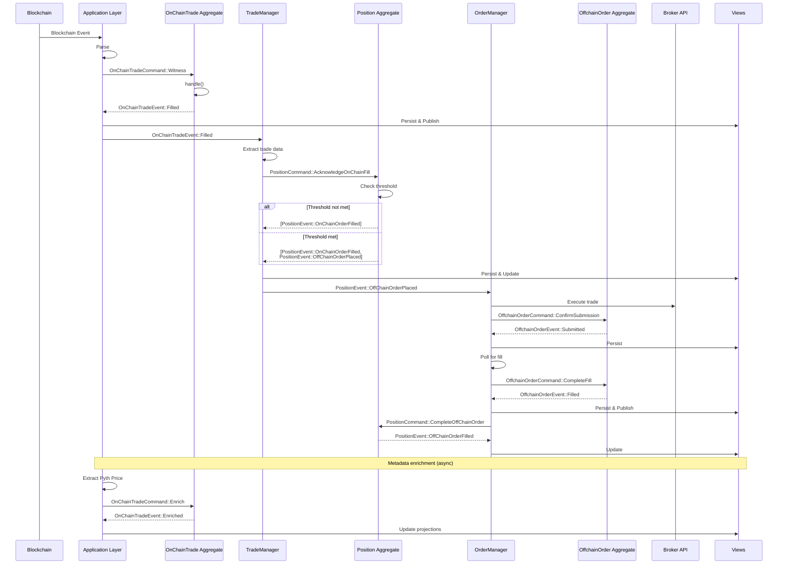
```mermaid
sequenceDiagram
    participant BC as Blockchain
    participant App as Application Layer
    participant OT as OnChainTrade Aggregate
    participant TM as TradeManager
    participant P as Position Aggregate
    participant OM as OrderManager
    participant OO as OffchainOrder Aggregate
    participant Broker as Broker API
    participant Views as Views

    BC->>App: Blockchain Event
    App->>App: Parse
    App->>OT: OnChainTradeCommand::Witness
    OT->>OT: handle()
    OT-->>App: OnChainTradeEvent::Filled
    App->>Views: Persist & Publish

    App->>TM: OnChainTradeEvent::Filled
    TM->>TM: Extract trade data
    TM->>P: PositionCommand::AcknowledgeOnChainFill
    P->>P: Check threshold
    alt Threshold not met
        P-->>TM: [PositionEvent::OnChainOrderFilled]
    else Threshold met
        P-->>TM: [PositionEvent::OnChainOrderFilled,<br/>PositionEvent::OffChainOrderPlaced]
    end
    TM->>Views: Persist & Update

    TM->>OM: PositionEvent::OffChainOrderPlaced
    OM->>Broker: Execute trade
    OM->>OO: OffchainOrderCommand::ConfirmSubmission
    OO-->>OM: OffchainOrderEvent::Submitted
    OM->>Views: Persist
    OM->>OM: Poll for fill
    OM->>OO: OffchainOrderCommand::CompleteFill
    OO-->>OM: OffchainOrderEvent::Filled
    OM->>Views: Persist & Publish

    OM->>P: PositionCommand::CompleteOffChainOrder
    P-->>OM: PositionEvent::OffChainOrderFilled
    OM->>Views: Update

    Note over App,Views: Metadata enrichment (async)
    App->>App: Extract Pyth Price
    App->>OT: OnChainTradeCommand::Enrich
    OT-->>App: OnChainTradeEvent::Enriched
    App->>Views: Update projections
```

#### Orchestration Job Taxonomy

All work managed by the Conductor falls into one of these categories:

**Finite jobs** (one-shot, durable, processed from SQLite queue):

| Job                      | Description                                                               |
| ------------------------ | ------------------------------------------------------------------------- |
| `AccountForDexTrade`     | Convert raindex event, discover vaults, acknowledge fill, place hedge     |
| `DiscoverVaultsForTrade` | Extract and register vault info from trade event (no ordering constraint) |
| `EnrichTrade`            | Add pyth pricing and gas metadata to OnChainTrade aggregate               |
| Backfill                 | Fetch historical events, push as `AccountForDexTrade` jobs                |
| Seed vault registry      | Populate known vaults from config at startup                              |
| Rebalancing operation    | Execute a cross-venue asset transfer (mint/redeem/bridge)                 |

**Long-running services** (streaming, restart on failure):

| Service             | Description                                               |
| ------------------- | --------------------------------------------------------- |
| Order fill monitor  | WS subscription to ClearV3/TakeOrderV3, pushes trade jobs |
| Rebalancing trigger | Detects inventory imbalances, pushes rebalancing jobs     |

**Scheduled jobs** (periodic, future — currently long-running with sleep loops):

| Job                  | Interval | Description                                          |
| -------------------- | -------- | ---------------------------------------------------- |
| Inventory poll       | ~30s     | Poll vault + broker balances, broadcast to dashboard |
| Order status poll    | ~10s     | Poll broker for pending order fills                  |
| Position check       | ~60s     | Reconcile accumulated positions (safety net)         |
| Executor maintenance | ~15m     | Refresh broker metadata, check asset availability    |

**Lifecycle workflows** (stepped, durable, future):

| Workflow           | Steps                                                                                  |
| ------------------ | -------------------------------------------------------------------------------------- |
| Trade lifecycle    | convert -> discover_vaults -> acknowledge_fill -> place_hedge -> await_fill -> confirm |
| Equity rebalancing | plan_transfer -> execute_onchain -> await_confirmations -> reconcile                   |
| USDC rebalancing   | plan_bridge -> execute_bridge -> await_confirmations -> reconcile                      |

#### Manager Pattern

The current implementation uses a flat job model where `AccountForDexTrade`
performs the full trade pipeline in a single `perform()` call. As the system
evolves toward lifecycle workflows, the pipeline steps will become discrete
workflow steps coordinated by apalis-workflow, with each step as a durable
checkpoint.

#### Future Consideration: Reorg Handling

**Note**: Reorg handling is not implemented currently, but the event-sourced
architecture will make it significantly easier to add in the future.

Blockchain reorganizations occur before block finalization. When we eventually
implement reorg handling, the event-sourced architecture will make it
significantly easier than the current CRUD approach.

##### Why Event Sourcing Helps

Simply append a reorg event that reverses the position change. The event would
be: PositionCommand::RecordReorg with tx_hash, log_index, symbol, amount,
direction, reorg_depth. The resulting PositionEvent::Reorged would reverse the
original trade's position impact. Views would update automatically. The
`onchain_trade_view` could mark trades as `reorged: true` without deleting them.

##### Benefits (when implemented)

- Append-only: no cascading updates across tables
- Complete audit trail: preserves both original trade and reorg event
- Testable: Given-When-Then testing for reorg scenarios
- Recoverable: fix bugs and replay events to correct state
- Explicit: reorgs are first-class domain events, not special cases

This demonstrates how the event-sourced architecture provides a cleaner
foundation for future enhancements.

### Testing Strategy

#### Aggregate Testing

Use `TestHarness` for BDD-style command testing and `replay` for reconstructing
state from events. Both operate at the `EventSourced` level, hiding
`Lifecycle`/`Aggregate` internals:

```rust
#[tokio::test]
async fn test_position_accumulates_fills() {
    let events = TestHarness::<Position>::with(())
        .given(vec![
            PositionEvent::Initialized { /* ... */ },
            PositionEvent::OnChainOrderFilled { /* ... */ },
        ])
        .when(PositionCommand::AcknowledgeOnChainFill { /* ... */ })
        .await
        .then_expect_events(&[
            PositionEvent::OnChainOrderFilled { /* ... */ },
        ]);
}
```

#### State Reconstruction Testing

Use `replay` to reconstruct entity state from a sequence of events:

```rust
#[test]
fn test_replay_builds_position_state() {
    let position = replay::<Position>(vec![
        PositionEvent::Initialized { /* ... */ },
        PositionEvent::OnChainOrderFilled { /* ... */ },
    ])
    .unwrap()
    .expect("should produce a live position");

    assert_eq!(position.net, FractionalShares::new(dec!(1.5)));
}
```

#### Integration Testing

```rust
#[tokio::test]
async fn test_full_flow_blockchain_to_broker() {
    // Setup test pool and CQRS instances
    // Execute commands across aggregates
    // Verify events persisted and views updated
}
```

### Code Organization

Aggregates use flat file structure by default. Submodules are only introduced
when natural business logic boundaries emerge (e.g., `alpaca_broker_api/` splits
auth, client, order, and positions because broker integration has distinct
business concerns).

```text
Cargo.toml                        - Workspace definition (st0x-hedge + crates/execution)
src/                              - Main st0x-hedge library crate
  lib.rs                          - Library exports, CQRS setup
  bin/
    server.rs                     - Main arbitrage bot server
    cli.rs                        - CLI for manual operations
  position.rs                     - Position aggregate
  onchain_trade.rs                - OnChainTrade aggregate
  offchain_order.rs               - OffchainOrder aggregate
  tokenized_equity_mint.rs        - TokenizedEquityMint aggregate
  equity_redemption.rs            - EquityRedemption aggregate
  usdc_rebalance.rs               - UsdcRebalance aggregate
  vault_registry.rs               - VaultRegistry aggregate
  shares.rs                       - FractionalShares newtype and arithmetic
  threshold.rs                    - Execution threshold and Usdc/Dollars newtypes
  config.rs                       - Application configuration
  api.rs                          - REST API endpoints
  tokenization.rs                 - Tokenizer trait and Alpaca tokenization
  trading/                        - Trade accounting jobs and inclusion metadata
  onchain/                        - Blockchain event processing, Raindex service
  offchain/                       - Off-chain order execution and polling
  conductor/                      - Orchestration layer (apalis Monitor, jobs, startup)
  inventory/                      - Cross-venue inventory tracking and imbalance detection
  rebalancing/                    - Cross-venue transfer orchestration and triggers
  symbol/                         - Token symbol caching and locking
  alpaca_wallet/                  - Alpaca cryptocurrency wallet and CCTP bridge
  dashboard/                      - Admin dashboard event streaming
  cli/                            - CLI subcommands
crates/
  bridge/                         - Circle CCTP bridge abstraction
  dto/                            - TypeScript binding generation for dashboard
  event-sorcery/                  - CQRS/ES framework (EventSourced, Store, Reactor, Projection)
  execution/                      - Trade execution library (Executor trait, Alpaca, mock)
```

---

## Admin Dashboard

### Overview

A web-based admin dashboard for monitoring and controlling the liquidity bot
from a single interface. The dashboard consolidates system health, trading
activity, P&L metrics, and operational controls without duplicating
functionality already available in Grafana.

### Technology Stack

- **Framework**: SvelteKit with Svelte 5 (runes, snippets)
- **UI Components**: shadcn-svelte
- **Charts**: TradingView Lightweight Charts for financial visualizations
- **Data Fetching**: TanStack Query v6 (svelte-query with runes support)
- **Grafana**: Embedded iframes for detailed metrics dashboards
- **Build Tool**: Vite
- **Language**: TypeScript

### TypeScript Patterns

#### Tagged Unions for Domain Modeling

Following the same ADT philosophy used in the Rust backend, the dashboard uses
discriminated unions (tagged unions) for type-safe domain modeling:

```typescript
// Domain types
type Position =
  | { status: "empty"; symbol: string }
  | {
    status: "active";
    symbol: string;
    net: number;
    pendingExecutionId?: string;
  };

// API errors
type ApiError =
  | { tag: "network"; message: string }
  | { tag: "unauthorized" }
  | { tag: "not_found"; resource: string }
  | { tag: "server"; status: number; message: string };

// Result type
type Result<T, E> =
  | { ok: true; value: T }
  | { ok: false; error: E };
```

#### Custom FP Helpers Module

A small `lib/fp.ts` module provides utility functions for working with Result
types and tagged unions:

- `ok<T>(value: T)` / `err<E>(error: E)` - Result constructors
- `match(union, handlers)` - Exhaustive pattern matching
- `pipe(value, ...fns)` - Left-to-right function composition
- `map`, `flatMap`, `mapErr` - Result transformations

No external dependencies - keeps bundle small and avoids library lock-in.

#### Alternatives Considered

- **Effect**: Full-featured FP library with structured concurrency, dependency
  injection, and comprehensive error handling. Rejected as overkill for a
  dashboard - adds ~50kb+ and significant conceptual overhead. Would shine for
  complex async orchestration but this is mostly "fetch and display".

- **neverthrow**: Lightweight Result/ResultAsync library (~2kb). Considered for
  typed error handling but adds friction with TanStack Query (expects throwing
  promises). Hand-rolled Result type provides 80% of the benefit with zero
  dependencies.

- **Plain fetch + Svelte stores**: Simplest approach but requires manual
  caching, retry logic, and background refetch. TanStack Query handles this
  better.

#### State Management

- **Server state**: TanStack Query v6 as reactive cache, populated via WebSocket
- **Local UI state**: Svelte 5 `$state` and `$derived` runes

#### WebSocket-First Data Flow

All read data flows through a single WebSocket connection:

1. Client connects to `WS /api/ws`
2. Server sends full initial state as first message (positions, trades, P&L,
   circuit breaker state)
3. Server streams incremental updates as events occur

##### Benefits

- Single connection to manage
- No race condition between HTTP fetch and WebSocket updates
- Server controls exactly what state the client starts with
- HTTP endpoints only needed for mutations (circuit breaker)

##### Message Types

Message types (`ServerMessage`, `InitialState`, etc.) are defined in the
`st0x-dto` crate (`crates/dto/src/lib.rs`) and auto-generated as TypeScript
types via `ts-rs`. The DTO crate is the source of truth for all wire formats.

##### TanStack Query Integration

WebSocket messages populate the TanStack Query cache. Each `ServerMessage`
variant maps to one or more query keys (e.g., `["trades"]`, `["inventory"]`,
`["transfers", "active"]`). The `initial` message seeds all caches on
connection; subsequent messages update individual caches incrementally.

### Core Features

#### Grafana Dashboard Embedding

Embed existing Grafana dashboards directly in the admin UI:

- Configure Grafana for anonymous viewer access (already supported)
- Embed dashboards via iframe with time range synchronization
- Dashboard selector for switching between different views (overview, trades,
  P&L)
- Fallback UI when Grafana is unavailable

No need to rebuild Grafana's visualization capabilities - leverage existing
dashboards.

#### HyperDX Health Status

Display service health from HyperDX:

- Fetch health metrics via HyperDX API
- Display health status badge in dashboard header
- Show recent alerts and error counts
- Link to full HyperDX dashboard for detailed investigation

```typescript
// HyperDX API integration
const response = await fetch("https://api.hyperdx.io/api/v1/alerts", {
  headers: { Authorization: `Bearer ${HYPERDX_API_KEY}` },
});
```

#### Circuit Breaker

Emergency control to halt all trading activity:

- Prominent toggle in dashboard header (always visible)
- Confirmation dialog before triggering
- Displays current status: active/tripped with timestamp and reason
- When tripped: bot stops placing new hedge orders
- Existing positions preserved (no forced liquidation)
- Manual reset required to resume trading

##### Implementation

- New database table or flag to track circuit breaker state
- Bot checks flag before placing any broker orders
- API endpoints for trigger/reset/status

```text
GET  /api/circuit-breaker/status
POST /api/circuit-breaker/trigger  { reason: string }
POST /api/circuit-breaker/reset
```

### Dashboard Layout

Single-page dashboard with live-updating panels, each expandable to full-screen.
It presents the current Alpaca-backed runtime rather than switching between
multiple broker-specific contexts.

#### Header Bar

- Circuit breaker status toggle
- WebSocket connection status

#### Panels

1. **Performance Metrics**: Key metrics (AUM, P&L, volume, trade count, Sharpe,
   Sortino, max drawdown, hedge lag, uptime) with timeframe selector (1h, 1d,
   1w, 1m, all-time).

2. **Inventory**: Per-symbol equity holdings and cash balances across venues,
   with available/inflight breakdowns. It also shows wallet-observed inventory
   outside the venues: Ethereum/Base wallet USDC and Base wallet unwrapped
   (`tSTOCK`) vs wrapped (`wtSTOCK`) equity tokens. Includes an "Inventory
   Transfers" section showing active and recent transfer operations with status.

3. **Spreads**: Last realized spreads per asset (buy/sell prices, Pyth
   reference, spread bps) and per-symbol price charts over time.

4. **Trade History**: Recent trades filterable by venue (onchain/offchain/both).

5. **Live Events**: Real-time domain event stream (aggregate type, ID, sequence,
   event type, timestamp). Starts empty, populates via WebSocket.

### Architecture

#### Separate Frontend Package

Dashboard lives in `dashboard/` directory at repository root:

```text
dashboard/
├── src/
│   ├── lib/
│   │   ├── components/     # Panel components, UI primitives
│   │   ├── api/            # API client and types
│   │   ├── fp.ts           # Result type, match, pipe utilities
│   │   └── websocket.svelte.ts
│   ├── routes/
│   │   ├── +layout.svelte  # App shell with header bar
│   │   └── +page.svelte    # Main dashboard (all panels)
│   └── app.html
├── static/
├── package.json
├── svelte.config.js
├── tsconfig.json
└── vite.config.ts
```

#### Backend API Extensions

Extend existing Rocket server (`src/api.rs`):

##### WebSocket (all read data)

```text
WS /api/ws
```

Sends initial state on connect, then streams updates. See WebSocket-First Data
Flow section above.

##### Mutations (HTTP, require API key)

```text
POST /api/circuit-breaker/trigger  { reason: string }
POST /api/circuit-breaker/reset
```

#### Authentication

Public read access with authenticated actions:

- **Read endpoints** (positions, trades, P&L, status): No authentication
  required
- **Action endpoints** (circuit breaker trigger/reset): Require API key
- API key sent in `Authorization` header, validated against `DASHBOARD_API_KEY`
  environment variable
- Future: Proper user authentication system with role-based access

#### Deployment

Dashboard is built as a Nix derivation (`st0x-dashboard`) that produces static
assets. Nginx on the NixOS host serves these files and reverse-proxies API
requests to the backend.

### Non-Goals (MVP)

- User authentication system (API key is sufficient for actions)
- Position entry from dashboard (read-only + circuit breaker only)
- Multi-tenant support

### Nice to Have

- Mobile-responsive design (not mobile-first, but usable on mobile - modern
  stack makes this low effort)

## Operational Alerting

The bot raises out-of-band alerts for conditions an operator must react to
quickly. Alerting is **optional**: when its configuration is absent the bot runs
normally with no alert channel and the alert monitors are not spawned.

### Gas balance monitoring

The bot pays gas in native ETH for every on-chain transaction (vault ops, CCTP
bridging, token wrapping, hedge rebalancing). If the market-maker wallet runs
dry, those transactions silently stop succeeding. To surface this before it
halts operations, a supervised **gas monitor** watches the wallet's native-ETH
balance.

**Scope.** The monitor watches the order-owner wallet (derived from the
`[wallet]` address) on the orderbook chain — Base in production — using the same
RPC provider the bot already uses for fill polling and contract reads.
Monitoring the Ethereum-mainnet wallet is a follow-up; it would require wiring
the mainnet provider into the conductor.

**Behavior.**

- Every `poll_interval` seconds the monitor reads the wallet's native balance.
- When the balance drops **below** `low_balance_threshold` (a decimal-ETH amount
  parsed to wei at startup — a malformed value fails fast), it raises an alert:
  a structured `error!` log (target `gas`) carrying the wallet, chain, current
  balance and threshold, plus a Telegram notification.
- **De-duplication.** The monitor alerts once on the transition into the low
  state, then re-alerts at most once per `realert_interval` while the balance
  stays low. It never notifies on every poll.
- **Recovery.** When the balance returns to at or above the threshold, the
  monitor emits a single `info!` log and recovery notification, then resets.
- A transient RPC read failure is logged and swallowed (it does not advance the
  de-dup state and does not raise an alert); the supervised task keeps polling.
- **Restart behavior.** The de-dup state is held in memory and resets on
  restart. If the bot restarts while the balance is low, the first poll after
  restart treats the unknown -> low transition as a new threshold crossing and
  alerts immediately, regardless of how recently an alert was sent before the
  restart. Frequent restarts during a prolonged low-balance condition can
  therefore produce alerts more often than `realert_interval` alone would
  suggest.

### Telegram channel

Alerts are delivered to Telegram via the Bot API `sendMessage` endpoint. The
non-secret `[alerts]` config supplies the destination `chat_id`, the
thresholds/intervals, and an optional `message_thread_id`; the encrypted secrets
supply the bot `bot_token`. When `message_thread_id` is set, alerts post into
that forum topic (for topic-enabled supergroups); when omitted they go to the
chat's default topic. When either half (config or secret) is present without the
other, startup fails fast rather than running with a half-configured alert
channel. A notification delivery failure is logged but never crashes the
monitor.

### BaseToAlpaca deposit send

The CCTP mint on the BaseToAlpaca leg sets `mintRecipient` to the bot's own
market-maker wallet on Ethereum, so the minted USDC lands in the bot wallet --
NOT at an Alpaca deposit address. Alpaca credits a deposit only when USDC is
transferred to the per-account deposit address it issues. The deposit leg
therefore performs an explicit fund-moving send:

1. **Fetch the deposit address.** `get_wallet_address(USDC, ethereum)` returns
   Alpaca's per-account Ethereum USDC deposit address.
2. **Send (crash-safe, split fresh vs resume like the CCTP burn).** The fresh
   path (right after this execution minted) sends the ERC20 transfer of the
   received amount from the bot wallet to the deposit address DIRECTLY -- no
   pre-send scan, no finality wait -- since no prior send can exist. The
   resume-from-`Bridged` path (a crash may have left a prior send) first scans
   Ethereum for an already-submitted USDC
   `Transfer(from = bot wallet, to = deposit address, value = amount received)`
   at or after the mint tx's block (the scan lower bound: the deposit send lands
   at or after the mint, so no earlier transfer can be this deposit's). If such
   a transfer exists, it is ADOPTED (no second send); otherwise it sends. A scan
   failure (an RPC error, or an inconclusive finality-gated scan) returns an
   error and sends NOTHING -- never a blind re-send -- so a transient fault
   cannot double-spend.
3. **Record the send.** The send tx (not the mint tx) is recorded as the deposit
   reference via `InitiateDeposit`, advancing the aggregate to
   `DepositInitiated`.
4. **Poll by the send tx.** Alpaca is polled for the deposit identified by the
   send tx until it is credited, then `ConfirmDeposit` is emitted and the
   USDC-to-USD conversion runs.

The resume-path scan is what makes resuming from `Bridged` safe: a crash between
a fresh direct send and `InitiateDeposit` re-enters the leg from `Bridged`,
where the scan finds the already-submitted transfer and adopts it instead of
forwarding the minted USDC twice. Once `InitiateDeposit` is recorded, resume
re-polls by the recorded send tx without sending again.
