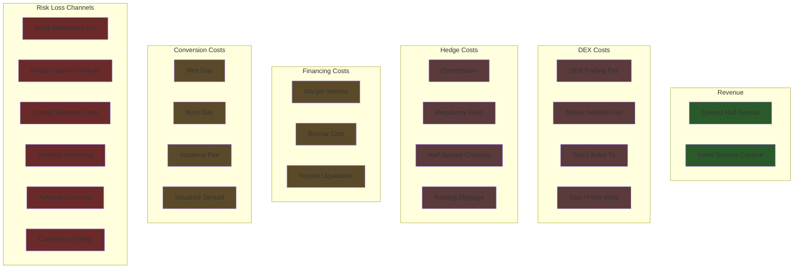

# St0x Market Making - Single Source of Truth (DRAFT)

**Recommendations:**

- Vertically integrate solver and MM bot. Otherwise conflicts of interest may
  arise and transparency and trust with LPs is going to become messy.
- Evaluation of Pyth oracle latency vs Hedge Venue feed. Hypothesis: Hedge Venue
  better suited after cost.
  - Need to check Hedge Venue price discovery under volatility/pressure vs Pyth
    NBBO
  - Also need to evaluate cost of writing state vs using Pyth oracle state in
    orders
  - Then decide if cost outpace latency cost of using stale Pyth prices

**Assumptions in this doc:**

- Vertically integrated solver and MM bot

---

## Execution Flow

```mermaid
sequenceDiagram
    participant UV as Upstream Venue
    participant HV as Hedge Venue
    participant Sys as Our System
    participant Chain as On-Chain
    participant Taker

    rect rgb(40, 40, 60)
    note over UV, Sys: Price Formation
    UV->>HV: 1. Upstream venue moves
    HV->>HV: 2. Updates quote
    HV->>Sys: 3. Feed reaches our system
    Sys->>Chain: 4. Reference state updated
    end

    rect rgb(40, 60, 40)
    note over Taker, Chain: Intent & Solving
    Taker->>Chain: 5. Taker broadcasts intent
    Chain->>Sys: 6. Intent reaches solver
    note over Sys: 7. Solver evaluates:<br/>- reference price<br/>- volatility state<br/>- inventory state<br/>- hedge availability
    Sys->>Sys: 8. Decides whether to solve
    Sys->>Sys: 9. Constructs transaction
    Sys->>Chain: 10. Submitted to RPC
    Chain->>Chain: 11. Mempool propagation
    Chain->>Chain: 12. Block inclusion
    Chain->>Chain: 13. Contract revalidates<br/>against reference state
    Chain->>Chain: 14. Trade executes on-chain
    end

    rect rgb(60, 40, 40)
    note over Sys, HV: Hedge Execution
    Chain->>Sys: 15. Detects execution
    Sys->>HV: 16. Hedge submitted
    HV->>HV: 17. Routed to execution venue
    HV->>HV: 18. Hedge fills
    HV->>Sys: 19. Position updated
    end

    rect rgb(60, 50, 30)
    note over Sys, Chain: Inventory & Conversion
    Sys->>Sys: 20. Inventory state updated
    Sys->>Sys: 21. Conversion threshold checked
    Sys->>Chain: 22. Mint/burn submitted<br/>if needed
    Chain->>Sys: 23. Conversion confirmed
    Sys->>Sys: 24. Dual ledgers reconciled
    end
```

---

## Latencies with Immediate Economic Impact

### Price Formation & Feed

```mermaid
graph LR
    subgraph "A: Current (Pyth Hermes)"
        PP[Pyth Publishers] -->|publisher latency| PA[Pyth Aggregation]
        PA -->|aggregation latency| H[Hermes API]
        H -->|dissemination + RTT| S1[Our System]
        S1 -->|processing latency| S1
        S1 -->|"write cadence (~0-300s staleness)"| BC1[Base Chain]
    end

    style PP fill:#4a4a6a
    style PA fill:#4a4a6a
    style H fill:#4a4a6a
    style S1 fill:#3a5a3a
    style BC1 fill:#5a3a3a
```

```mermaid
graph LR
    subgraph "B: Future (Hedge Venue Direct)"
        DV[Deep Venue] -->|price discovery| HV[Hedge Venue]
        HV -->|"quote update + dissemination + RTT"| S2[Our System]
        S2 -->|processing latency| S2
        S2 -->|block time| BC2[Base Chain]
    end

    style DV fill:#4a4a6a
    style HV fill:#4a4a6a
    style S2 fill:#3a5a3a
    style BC2 fill:#5a3a3a
```

### On-Chain (Price data writes, trade tx, mint/burn tx)

- Mempool propagation latency
- Block inclusion latency (Base ~2s)

### Hedge Execution

- On-chain execution detection latency
- DEX execution -> hedge submission latency
- Hedge API submission latency
- Hedge Venue broker routing latency
- Order queue latency at hedge venue
- Hedge partial-fill aggregation latency
- Hedge Venue account state update latency

### Inventory & Conversion

- Off-chain issuance settlement latency
- Conversion reconciliation latency

### Systemic / Failure

- Gas congestion latency

---

## Latencies with Potential Latent Economic Impact

This section tracks latencies that may have an impact in the future just so the
doc is as complete as possible.

### On-Chain

- Finality latency

### Intent & Solver (Strictly dependent on solver competition)

```mermaid
graph TD
    TI[Taker Intent] -->|propagation latency| ID[Intent Detection]
    ID -->|detection latency<br/>relevant if solver competition| SD[Solver Decision]
    SD -->|computation latency<br/>relevant if duration > block time| TC[Tx Construction<br/>& Signing]
    TC -->|RPC submission latency| SUB[Submitted]

    style TI fill:#4a4a6a
    style ID fill:#4a4a6a
    style SD fill:#5a4a2a
    style TC fill:#5a4a2a
    style SUB fill:#3a5a3a
```

### Inventory & Conversion

- Inventory imbalance detection latency
- Mint/burn transaction submission latency

### Systemic / Failure

- Broker rate-limit throttling latency (avoidable with careful engineering)
- Feed disconnect detection latency
- Monitoring / alerting latency

---

## Costs with Immediate Economic Impact

### Spread & Surplus

- Quoted half-spread mispricing cost
- Intent surplus capture (positive term)

### DEX (trading and data)

- DEX trading fee
- Solver network fee
- Gas cost per solve transaction
- Reference price write gas cost

### Hedge Venue (Hedge trading)

- Hedge Venue commission (if any)
- Hedge Venue regulatory fees
- Hedge half-spread crossing cost
- Hedge routing slippage cost

### Financing

- Margin interest cost
- Borrow cost (if shorting)
- Forced liquidation / margin call cost

### Inventory Conversion

- Mint gas cost
- Burn gas cost
- Hedge Venue issuance fee
- Hedge Venue issuance spread/haircut

### Risk Loss Channels

- Reference feed staleness loss
- Hedge latency markout loss
- Hedge Venue spread widening loss
- Volatility regime mispricing loss
- Tail-event adverse selection loss
- Conversion timing loss

---

## Costs with Latent or Potential Future Economic Impact

This section tracks costs that may have an impact in the future.

### Hedge Venue

- Market impact cost (assuming our volumes will be << top of book liquidity at
  hedge venue)

### Spread & Surplus

- Surplus leakage due to competition

### Operational

- Infrastructure hosting cost
- Feed redundancy cost
- Monitoring cost
- Compliance/account restriction cost

---

## Solver Decision Model

```mermaid
flowchart TD
    Intent[Intent Detected] --> CheckRef{Reference price<br/>fresh?}
    CheckRef -->|Stale| Reject1[Reject: stale feed]
    CheckRef -->|Fresh| CheckVol{Volatility<br/>regime?}
    CheckVol -->|High| WideSpread[Widen spread<br/>threshold]
    CheckVol -->|Normal| NormalSpread[Normal spread]
    WideSpread --> CheckInv{Inventory<br/>within limits?}
    NormalSpread --> CheckInv
    CheckInv -->|Exceeded| Reject2[Reject: inventory risk]
    CheckInv -->|OK| CheckHedge{Hedge venue<br/>available?}
    CheckHedge -->|Down/Throttled| Reject3[Reject: no hedge]
    CheckHedge -->|Available| CheckProfit{Spread ><br/>costs?}
    CheckProfit -->|No| Reject4[Reject: unprofitable]
    CheckProfit -->|Yes| Solve[Construct & Submit Tx]

    style Intent fill:#4a4a6a
    style Solve fill:#2a5a2a
    style Reject1 fill:#5a2a2a
    style Reject2 fill:#5a2a2a
    style Reject3 fill:#5a2a2a
    style Reject4 fill:#5a2a2a
```

---

## Price Feed Comparison: Pyth vs Hedge Venue Direct

```mermaid
graph TD
    subgraph "Path A: Pyth Hermes (Current)"
        A1[Market Move] --> A2[Pyth Publishers]
        A2 --> A3[Pyth Aggregation]
        A3 --> A4[Hermes API]
        A4 --> A5[Our System]
        A5 --> A6["Write On-Chain<br/>(~5 min cadence)"]
    end

    subgraph "Path B: Hedge Venue Direct (Future)"
        B1[Market Move] --> B2[Hedge Venue<br/>Quote Update]
        B2 --> B3[Our System]
        B3 --> B4[Write On-Chain]
    end

    subgraph "Trade-offs"
        T1["A: More hops, staleness window<br/>but existing infrastructure"]
        T2["B: Fewer hops, fresher prices<br/>but write cost + build cost"]
    end

    style A1 fill:#4a4a6a
    style A6 fill:#5a3a3a
    style B1 fill:#4a4a6a
    style B4 fill:#3a5a3a
    style T1 fill:#3a3a3a
    style T2 fill:#3a3a3a
```

---

## System Architecture Overview

```mermaid
graph TB
    subgraph "External"
        UV[Upstream Venues]
        HV[Hedge Venue<br/>Alpaca / Schwab]
        Pyth[Pyth Network]
        Base[Base L2]
    end

    subgraph "Our System"
        PF[Price Feed<br/>Processor]
        Solver[Solver /<br/>MM Engine]
        HE[Hedge<br/>Executor]
        IM[Inventory<br/>Manager]
        Raindex[Raindex<br/>Order Manager]
    end

    UV --> Pyth
    UV --> HV
    Pyth --> PF
    HV --> PF
    PF --> Solver
    PF --> Raindex

    Base --> Solver
    Solver --> Base
    Raindex --> Base

    Solver --> HE
    HE --> HV

    Base --> IM
    HV --> IM
    IM -->|mint/burn| Base

    style UV fill:#4a4a6a
    style HV fill:#4a4a6a
    style Pyth fill:#4a4a6a
    style Base fill:#4a4a6a
    style PF fill:#3a5a3a
    style Solver fill:#3a5a3a
    style HE fill:#3a5a3a
    style IM fill:#3a5a3a
    style Raindex fill:#3a5a3a
```

