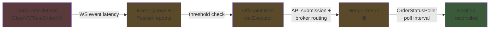

# St0x Market Making - Single Source of Truth (DRAFT)

**Recommendations:**

- Vertically integrate solver and MM bot. Otherwise conflicts of interest may
  arise and transparency and trust with LPs is going to become messy.
- Evaluation of Pyth oracle latency vs Hedge Venue feed. Hypothesis: Hedge Venue
  better suited after cost.
  - Need to check Hedge Venue price discovery under volatility/pressure vs Pyth
    NBBO
  - Also need to evaluate cost of writing state vs using Pyth oracle state in
    orders
  - Then decide if cost outpace latency cost of using stale Pyth prices

**Assumptions in this doc:**

- Vertically integrated solver and MM bot

---

## Execution Flow

Steps 5-14 describe the solver path. Currently the solver is a separate service;
the recommendation is to vertically integrate it with the MM bot (Conductor).
Steps 15-24 are what st0x.liquidity handles today.

```mermaid
sequenceDiagram
    participant UV as Upstream Venue
    participant HV as Hedge Venue<br/>(Alpaca / Schwab)
    participant Solver as Solver<br/>(currently separate)
    participant OB as Raindex OrderBook<br/>(Base)
    participant Conductor as Conductor<br/>(st0x.liquidity)
    participant Taker

    rect rgb(40, 40, 60)
    note over UV, Solver: Price Formation
    UV->>HV: 1. Upstream venue moves
    HV->>HV: 2. Updates quote
    HV->>Solver: 3. Feed reaches solver
    Solver->>OB: 4. Signed context with<br/>reference price provided<br/>to order expressions
    end

    rect rgb(40, 60, 40)
    note over Taker, OB: Intent & Solving
    Taker->>OB: 5. Taker broadcasts intent
    OB->>Solver: 6. Intent reaches solver
    note over Solver: 7. Evaluates:<br/>- reference price<br/>- volatility state<br/>- inventory state<br/>- hedge availability
    Solver->>Solver: 8. Decides whether to solve
    Solver->>Solver: 9. Constructs clear/take tx<br/>with signed context
    Solver->>OB: 10. Submitted to RPC
    OB->>OB: 11. Mempool propagation
    OB->>OB: 12. Block inclusion (~2s)
    OB->>OB: 13. Order expression evaluates<br/>IO ratio & max output<br/>using signed context
    OB->>OB: 14. Vault balances updated<br/>(ClearV3 / TakeOrderV3)
    end

    rect rgb(60, 40, 40)
    note over Conductor, HV: Hedge Execution (st0x.liquidity)
    OB->>Conductor: 15. Conductor detects<br/>ClearV3/TakeOrderV3 via WS
    Conductor->>Conductor: 16. Event queued, Position<br/>aggregate updated
    Conductor->>Conductor: 17. Accumulator checks<br/>execution threshold
    Conductor->>HV: 18. OffchainOrder submitted<br/>via Executor trait
    HV->>HV: 19. Routed to execution venue
    HV->>HV: 20. Hedge fills
    HV->>Conductor: 21. OrderStatusPoller<br/>detects fill
    end

    rect rgb(60, 50, 30)
    note over Conductor, OB: Inventory & Rebalancing
    Conductor->>Conductor: 22. InventoryView updated<br/>cross-venue balances
    Conductor->>Conductor: 23. RebalancingTrigger<br/>checks imbalance thresholds
    Conductor->>OB: 24. Tokenizer mint/redeem<br/>or CCTP bridge<br/>or vault deposit/withdraw
    OB->>Conductor: 25. Conversion confirmed
    Conductor->>Conductor: 26. Dual ledgers reconciled
    end
```

---

## Latencies with Immediate Economic Impact

### Price Formation & Feed

**A: Current - Pyth Hermes**

```mermaid
graph LR
    PP[Pyth Publishers] -->|publisher latency| PA[Pyth Aggregation]
    PA -->|aggregation latency| H[Hermes API]
    H -->|dissemination + RTT| OE["Order Expressions (read Pyth on-chain)<br/>~0-300s staleness from 5 min write cadence"]

    style PP fill:#4a4a6a
    style PA fill:#4a4a6a
    style H fill:#4a4a6a
    style OE fill:#5a3a3a
```

**B: Future - Solver Signed Context**

```mermaid
graph LR
    DV[Deep Venue] -->|price discovery| HV[Hedge Venue API]
    HV -->|quote update + RTT| SLV[Solver]
    SLV -->|signed context in solve tx| OE2["Order Expressions (verify + use price)"]

    style DV fill:#4a4a6a
    style HV fill:#4a4a6a
    style SLV fill:#3a5a3a
    style OE2 fill:#3a5a3a
```

### On-Chain (Price data writes, trade tx, mint/burn tx)

- Mempool propagation latency
- Block inclusion latency (Base ~2s)

### Hedge Execution

- On-chain execution detection latency (WS subscription)
- DEX execution -> hedge submission latency (event queue + threshold check)
- Hedge API submission latency (Executor trait -> Alpaca/Schwab)
- Hedge Venue broker routing latency
- Order queue latency at hedge venue
- Hedge partial-fill aggregation latency (OrderStatusPoller)
- Hedge Venue account state update latency

### Inventory & Conversion

- Off-chain issuance settlement latency
- Conversion reconciliation latency

### Systemic / Failure

- Gas congestion latency

---

## Latencies with Potential Latent Economic Impact

This section tracks latencies that may have an impact in the future just so the
doc is as complete as possible.

### On-Chain

- Finality latency

### Intent & Solver (Strictly dependent on solver competition)

### Inventory & Conversion

- Inventory imbalance detection latency (InventoryView polling interval)
- Mint/burn transaction submission latency (Tokenizer -> Alpaca Broker API)

### Systemic / Failure

- Broker rate-limit throttling latency (avoidable with careful engineering)
- Feed disconnect detection latency
- Monitoring / alerting latency

---

## Costs with Immediate Economic Impact

### Spread & Surplus

- Quoted half-spread mispricing cost
- Intent surplus capture (positive term)

### DEX (trading and data)

- DEX trading fee
- Solver network fee
- Gas cost per solve transaction
- Reference price write gas cost

### Hedge Venue (Hedge trading)

- Hedge Venue commission (if any)
- Hedge Venue regulatory fees
- Hedge half-spread crossing cost
- Hedge routing slippage cost

### Financing

- Margin interest cost
- Borrow cost (if shorting)
- Forced liquidation / margin call cost

### Inventory Conversion

- Mint gas cost
- Burn gas cost
- Hedge Venue issuance fee
- Hedge Venue issuance spread/haircut

### Risk Loss Channels

- Reference feed staleness loss
- Hedge latency markout loss
- Hedge Venue spread widening loss
- Volatility regime mispricing loss
- Tail-event adverse selection loss
- Conversion timing loss

---

## Costs with Latent or Potential Future Economic Impact

This section tracks costs that may have an impact in the future.

### Hedge Venue

- Market impact cost (assuming our volumes will be << top of book liquidity at
  hedge venue)

### Spread & Surplus

- Surplus leakage due to competition

### Operational

- Infrastructure hosting cost
- Feed redundancy cost
- Monitoring cost
- Compliance/account restriction cost

---

## Solver Decision Model

This is the future vertically-integrated solver's decision logic. Currently the
solver is separate; Conductor only reacts to events after solving has occurred.

```mermaid
flowchart TD
    Intent[Intent Detected] --> CheckRef{Reference price<br/>fresh?}
    CheckRef -->|Stale| Reject1[Reject: stale feed]
    CheckRef -->|Fresh| CheckVol{Volatility<br/>regime?}
    CheckVol -->|High| WideSpread[Widen spread<br/>threshold]
    CheckVol -->|Normal| NormalSpread[Normal spread]
    WideSpread --> CheckInv{Inventory<br/>within limits?}
    NormalSpread --> CheckInv
    CheckInv -->|Exceeded| Reject2[Reject: inventory risk]
    CheckInv -->|OK| CheckHedge{Hedge venue<br/>available?}
    CheckHedge -->|Down/Throttled| Reject3[Reject: no hedge]
    CheckHedge -->|Available| CheckProfit{Spread ><br/>costs?}
    CheckProfit -->|No| Reject4[Reject: unprofitable]
    CheckProfit -->|Yes| Solve["Construct solve tx<br/>with signed context"]

    style Intent fill:#4a4a6a
    style Solve fill:#2a5a2a
    style Reject1 fill:#5a2a2a
    style Reject2 fill:#5a2a2a
    style Reject3 fill:#5a2a2a
    style Reject4 fill:#5a2a2a
```

---

## Price Feed Comparison: Pyth vs Solver Signed Context

**Path A** has more hops and a staleness window but uses existing Pyth
infrastructure. **Path B** has fewer hops with per-tx fresh prices but requires
solver complexity and write cost.

Both paths are shown in the Price Formation diagrams above.

---

## System Architecture

Two diagrams: the hedge pipeline (core trade flow) and the rebalancing pipeline.

**Hedge Pipeline** (event -> position -> broker order -> fill)

```mermaid
graph LR
    OB["Raindex OrderBook"] -->|ClearV3 / TakeOrderV3| EVT[Event Monitor]
    EVT --> EQ[Event Queue]
    EQ --> POS[Position Aggregate]
    POS -->|threshold reached| OOP["OffchainOrder (Executor)"]
    OOP --> HV["Hedge Venue (Alpaca / Schwab)"]
    HV -->|fill status| OSP[OrderStatusPoller]
    OSP --> POS

    style OB fill:#5a4a2a
    style EVT fill:#3a5a3a
    style EQ fill:#3a5a3a
    style POS fill:#3a5a3a
    style OOP fill:#3a5a3a
    style HV fill:#4a4a6a
    style OSP fill:#3a5a3a
```

**Rebalancing Pipeline** (inventory monitoring -> mint/redeem/bridge)

```mermaid
graph LR
    HV["Hedge Venue"] --> INV[InventoryView]
    OB["Raindex OrderBook"] --> INV
    INV --> REB[RebalancingTrigger]
    REB -->|equity| TOK["Tokenizer (mint/redeem)"]
    REB -->|vaults| RDX["RaindexService (deposit/withdraw)"]
    REB -->|USDC| CCTP[Circle CCTP Bridge]
    TOK --> HV
    RDX --> OB

    style HV fill:#4a4a6a
    style OB fill:#5a4a2a
    style INV fill:#3a5a3a
    style REB fill:#3a5a3a
    style TOK fill:#3a5a3a
    style RDX fill:#3a5a3a
    style CCTP fill:#4a4a6a
```

**Price Formation** (upstream -> solver -> on-chain order expressions)

```mermaid
graph LR
    UV[Upstream Venues] --> HV["Hedge Venue"]
    UV --> Pyth[Pyth Network]
    HV --> SLV["Solver (currently separate)"]
    SLV -->|signed context| OB["Raindex OrderBook"]
    Pyth -->|oracle feed| OB

    style UV fill:#4a4a6a
    style HV fill:#4a4a6a
    style Pyth fill:#4a4a6a
    style SLV fill:#4a4a6a
    style OB fill:#5a4a2a
```

