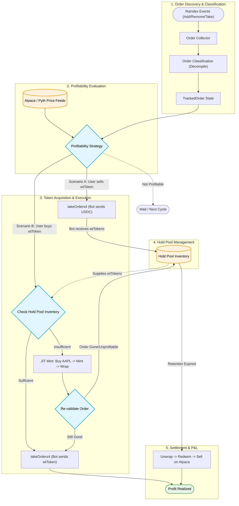

# Order Taker Bot - Spec Draft

## Status: DRAFT - For Discussion

## Background

The current liquidity bot (`st0x.liquidity`) operates as a hedger and
rebalancer: it monitors orders that have been deployed on Raindex (by external
tooling or manual setup), listens for fill events (`ClearV3`, `TakeOrderV3`),
then hedges the resulting directional exposure on a brokerage. It also
rebalances inventory across venues to keep capital deployed. This model requires
the operator to have orders and liquidity already deployed in Raindex vaults
before users can trade.

The order taker bot inverts this model. Instead of placing orders and waiting,
it monitors orders placed by _other_ users on Raindex. When a user's limit order
offers tokenized equity at a price that's profitable relative to the brokerage
price, the bot takes the order -- but first it must acquire the tokens needed to
fill the order. The bot uses the same Alpaca tokenization API already integrated
in this codebase (via the `Tokenizer` trait and `AlpacaTokenizationService`) to
mint or redeem tokenized equities as part of its execution flow.

### Value Proposition

- **Users**: Can place limit orders for tokenized equities and get fills at
  competitive prices without waiting for a market maker to provide liquidity
- **Operator**: Captures arbitrage spread between onchain limit order prices and
  brokerage prices with minimal capital at risk (just gas + brokerage margin +
  tokenization costs)
- **Market**: Improves price discovery by connecting onchain limit orders to
  offchain liquidity

## Solution Overview

A bot that:

1. Monitors `AddOrderV3` events on Raindex to discover new limit orders
2. Decompiles Rainlang bytecode to classify orders into supported types
   (fixed-price constants or Pyth oracle-based pricing)
3. Evaluates profitability by comparing the order's price against the current
   brokerage price (Alpaca), including tokenization costs
4. Acquires the necessary tokens via Alpaca's tokenization API (mint or redeem)
5. Takes profitable orders by calling `takeOrders4` on the orderbook contract
6. Tracks `RemoveOrderV3` and `TakeOrderV3` events to detect removed orders and
   partial fills by other takers

### System Overview



## Tokenization Integration

The taker bot reuses the tokenization infrastructure already in this codebase,
originally built for the rebalancer. No external issuance service is needed.

### Existing Infrastructure

The following components are already implemented and can be reused directly:

- **`Tokenizer` trait** (`src/tokenization.rs`): Abstraction for mint and
  redemption operations with methods for `request_mint`,
  `poll_mint_until_complete`, `send_for_redemption`, `poll_for_redemption`, and
  `poll_redemption_until_complete`
- **`AlpacaTokenizationService`** (`src/tokenization/alpaca.rs`): Calls Alpaca's
  tokenization API directly (`POST /v1/accounts/{id}/tokenization/mint`), polls
  for completion, and handles redemptions by sending tokens to a designated
  redemption wallet
- **`TokenizedEquityMint` aggregate** (`src/tokenized_equity_mint.rs`): CQRS
  state machine tracking the full mint lifecycle:
  `MintRequested -> MintAccepted -> TokensReceived -> TokensWrapped -> DepositedIntoRaindex`
- **`EquityRedemption` aggregate** (`src/equity_redemption.rs`): CQRS state
  machine for the reverse:
  `Redeem -> WithdrawnFromRaindex -> TokensUnwrapped -> TokensSent -> Pending -> Completed`
- **`CrossVenueEquityTransfer`** (`src/rebalancing/equity/mod.rs`): Orchestrates
  the full mint flow (request mint -> poll -> wrap ERC-4626 -> deposit to vault)
  and redeem flow (withdraw from vault -> unwrap -> send to Alpaca)
- **`Wrapper` trait** (`src/wrapper.rs`): Abstraction for ERC-4626 wrap and
  unwrap operations. `to_wrapped` converts tTokens to wtTokens (depositing into
  the ERC-4626 vault), `to_underlying` does the reverse (withdrawing from the
  vault). Both are onchain transactions that incur gas costs.
- **`MockTokenizer`** (`src/tokenization/mock.rs`): Test double with
  configurable outcomes for all operations

**API requirement**: The taker bot requires Alpaca Broker API access (not just
Trading API) because it uses both the `Executor` trait for share trading and the
`Tokenizer` trait for mint/redeem operations. Tokenization is only available
through account-level Broker API access.

### What the Taker Needs Differently

The rebalancer's flows include Raindex vault deposit/withdrawal steps that the
taker doesn't need:

**Important**: All tokenized equities on Raindex are the ERC-4626 wrapped
versions (`wtAAPL`, not `tAAPL`). See [domain.md](domain.md) -- Raindex events
use `TokenizedSymbol<WrappedTokenizedShares>`. This means the taker must wrap
tokens after minting and unwrap tokens before redeeming, but skips the Raindex
vault deposit/withdrawal since `takeOrders4` operates directly on wallet
balances.

| Step                     | Rebalancer Mint                       | Taker Mint                      |
| ------------------------ | ------------------------------------- | ------------------------------- |
| Buy shares on Alpaca     | N/A (already held)                    | Yes (Executor trait)            |
| Request mint via Alpaca  | `Tokenizer::request_mint`             | Same                            |
| Poll until complete      | `Tokenizer::poll_mint_until_complete` | Same                            |
| Wrap into ERC-4626       | `Wrapper::to_wrapped`                 | Same                            |
| Deposit to Raindex vault | `Raindex::deposit`                    | **Not needed**                  |
| Use tokens               | Tokens sit in vault for orders        | wtTokens used for `takeOrders4` |

| Step                        | Rebalancer Redeem                           | Taker Redeem         |
| --------------------------- | ------------------------------------------- | -------------------- |
| Withdraw from Raindex vault | `Raindex::withdraw`                         | **Not needed**       |
| Unwrap ERC-4626             | `Wrapper::to_underlying`                    | Same                 |
| Send to redemption wallet   | `Tokenizer::send_for_redemption`            | Same                 |
| Poll for detection          | `Tokenizer::poll_for_redemption`            | Same                 |
| Poll until complete         | `Tokenizer::poll_redemption_until_complete` | Same                 |
| Sell shares on Alpaca       | N/A (shares remain at Alpaca)               | Yes (Executor trait) |

The taker needs **simpler aggregates** (or a simpler orchestrator) that skip the
vault deposit/withdrawal steps. The `Tokenizer` and `Wrapper` traits are reused
as-is. The taker also needs the `Executor` trait from `st0x-execution` to
buy/sell shares on Alpaca as part of its flow (the rebalancer doesn't trade on
the brokerage).

**Why no vault deposit/withdrawal?** The rebalancer deposits tokens into Raindex
vaults because it's a market maker -- tokens sit in vaults backing its own
orders. The taker never places orders; it takes others' orders via
`takeOrders4`, which pulls tokens directly from the taker's wallet via ERC20
`transferFrom`. The bot only needs wrapped tokens in its wallet and an approval
for the orderbook contract to spend them. This means the hold pool is simply
"wrapped tokens in the bot's wallet" with metadata tracking retention windows --
no onchain deposit/withdrawal step needed to make them available or reclaim
them.

### How Alpaca Tokenization Works

Alpaca's tokenization API handles the actual minting/redemption:

**Minting** (real shares -> onchain tokens):

1. Bot calls `POST /v1/accounts/{id}/tokenization/mint` with symbol, quantity,
   destination wallet
2. Alpaca journals shares internally and initiates onchain transfer
3. Bot polls until request reaches terminal state (`completed` or `rejected`)
4. On `completed`: tokens arrive in the bot's wallet, `tx_hash` is available

**Redemption** (onchain tokens -> real shares):

1. Bot sends tokens to Alpaca's designated redemption wallet (ERC20 transfer)
2. Alpaca detects the transfer and creates a redemption request
3. Bot polls until Alpaca confirms the redemption
4. On completion: shares are available in the bot's Alpaca account

**Latency consideration**: The Alpaca tokenization flow is not instant. The full
mint can take seconds to minutes depending on Alpaca's processing time. This
latency is the central constraint that shapes the taker bot's execution
strategy.

## Token Flow Directions

The bot must handle two distinct scenarios, each with different capital
requirements and execution flows:

### Scenario A: User Sells Tokenized Equity

The user has wtAAPL and wants USDC. Their order: outputs wtAAPL, inputs USDC.

```
1. Bot provides USDC -> receives wtAAPL from order
2. Bot places wtAAPL in hold pool (available for Scenario B reuse)
3. If retention expires without reuse:
   a. Unwrap wtAAPL -> tAAPL (Wrapper::to_underlying)
   b. Send tAAPL to Alpaca redemption wallet (Tokenizer::send_for_redemption)
   c. Alpaca detects transfer, journals shares to bot's account
   d. Sell AAPL shares on Alpaca (Executor::place_order)
```

**Capital needed**: USDC to pay for the take. Bot ends up with USD from selling
AAPL minus the USDC spent, netting the spread.

**Timing**: The take happens first (instant onchain), then the bot decides what
to do with the received wtAAPL:

- **Hold pool path** (preferred): Place wtAAPL in the hold pool. If a Scenario B
  order appears within the retention window, reuse the tokens directly -- no
  mint needed, faster execution, lower cost. This makes the hold pool
  bidirectional: it absorbs tokens from both orphaned mints (Scenario B) and
  Scenario A takes.
- **Immediate redeem path** (fallback): If the hold pool is at capacity or the
  symbol isn't expected to have Scenario B demand, unwrap and redeem
  immediately.

Either way, the bot has temporary exposure to AAPL price movement until the
tokens are redeemed and shares sold, but this window is bounded by the retention
policy.

### Scenario B: User Buys Tokenized Equity

The user has USDC and wants wtAAPL. Their order: outputs USDC, inputs wtAAPL.

```
1. Bot buys AAPL shares on Alpaca (Executor::place_order)
2. Bot requests mint via Alpaca (Tokenizer::request_mint)
3. Alpaca tokenizes shares, bot polls until tAAPL arrives in wallet
4. Bot wraps tAAPL -> wtAAPL (Wrapper::to_wrapped)
5. Bot takes the order: provides wtAAPL -> receives USDC
```

**Capital needed**: USD/buying power at Alpaca to purchase shares, then wtAAPL
to pay for the take. Bot ends up with USDC from the order minus the cost of
purchasing AAPL, netting the spread.

**Timing**: This is the harder case. The bot must mint tokens **before** it can
take the order, and minting is not instant. During the mint delay, the order
could be taken by someone else or removed. This is the primary latency risk.

### Execution Strategy: Just-In-Time Minting

For the MVP, the bot uses **just-in-time (JIT) minting**: it only initiates a
mint when it identifies a profitable order that requires tokens it doesn't
currently hold.

**JIT flow for Scenario B:**

1. Profitable order detected requiring wtAAPL
2. Bot checks wallet: do we already hold sufficient wtAAPL?
3. If not: buy AAPL on Alpaca, request mint via `Tokenizer::request_mint`
4. Poll until complete via `Tokenizer::poll_mint_until_complete`
5. Wrap tAAPL -> wtAAPL via `Wrapper::to_wrapped`
6. Re-check order: still available? Still profitable at current prices?
7. If yes: take the order
8. If no: tokens go into the **hold pool** (see below)

**Future optimization: Pre-mint buffer.** Maintaining a configurable inventory
of pre-minted tokens per symbol would eliminate the mint latency for Scenario B,
allowing the bot to take orders immediately. This trades capital efficiency
(idle tokens) for execution speed. Worth implementing once order flow justifies
the capital commitment.

## Token Hold Pool

The hold pool absorbs wrapped tokens from two sources: orphaned mints (Scenario
B target order became unavailable) and Scenario A takes (wtTokens received from
a successful take, held for potential Scenario B reuse). Either way, the tokens
need a disposition strategy.

### Time-Based Hold Policy

Wrapped tokens that cannot be immediately used are placed in a **hold pool**
with a configurable retention window. The hold pool stores `wtTokens` (wrapped
ERC-4626 shares) since that's the form needed for `takeOrders4` and received
from takes:

```
Sources into the hold pool:
  - Scenario B: minted + wrapped, but target order unavailable
  - Scenario A: wtTokens received from a take

          ┌──────────────────────────────────┐
          |           Hold Pool              |
          |  (wtTokens in bot's wallet)      |
          └───────────────┬──────────────────┘
                          |
           ┌──────────────┤
           |              |
   Within retention   Window expired
   window                 |
           |        Unwrap + redeem:
   Available for    unwrap -> send to
   profitable       Alpaca -> sell shares
   orders
           |
   Order found? Take it.
```

**Configuration**: See `[hold_pool]` in the Configuration section below.

**Behavior:**

- Tokens in the hold pool are available for any profitable order, not just the
  original target
- The profitability strategy checks hold pool inventory before initiating new
  mints
- When the retention window expires without a fill, the bot unwraps the tokens
  via `Wrapper::to_underlying`, redeems via `Tokenizer::send_for_redemption`,
  and sells the resulting shares on Alpaca
- If the hold pool approaches its value cap, the bot may redeem older positions
  early to free up capital

**Cap enforcement**: The pool's USDC value is computed using the same Alpaca
price feed used for profitability evaluation. The cap is checked before adding
new tokens to the pool (during Scenario A settlement or Scenario B orphaned mint
routing). If adding tokens would exceed `max_pool_value_usdc`, the bot skips the
hold pool and proceeds directly to immediate redemption (unwrap + redeem +
sell). The per-symbol cap (`max_per_symbol`) is checked independently using
share quantities.

**Cost consideration**: A round-trip (mint + redeem without a fill) incurs gas
costs for both the mint and redeem transactions, plus any Alpaca fees. The
retention window should be long enough to give tokens a reasonable chance of
being used, but short enough to avoid excessive capital lockup and price drift
risk.

## Architecture

### Relationship to the Liquidity Bot

**Recommendation: Separate binary, shared crates.**

The order taker bot has a fundamentally different event loop from the liquidity
bot:

| Concern             | Liquidity Bot                            | Order Taker Bot                                           |
| ------------------- | ---------------------------------------- | --------------------------------------------------------- |
| **Event source**    | ClearV3 / TakeOrderV3 (our orders taken) | AddOrderV3 / RemoveOrderV3 / TakeOrderV3 (others' orders) |
| **Role**            | Passive (waits for fills)                | Active (initiates takes)                                  |
| **Onchain writes**  | Deposit/withdraw to vaults               | `takeOrders4` calls                                       |
| **Capital needs**   | Pre-funded vaults                        | Gas + tokenization costs + brokerage margin               |
| **Latency profile** | Event-driven (reacts to fills)           | Opportunity-driven (races to take before gone)            |
| **Risk model**      | Spread capture on own orders             | Arb capture on others' orders                             |
| **Tokenization**    | Uses existing tokens in vaults           | Mints/redeems tokens per trade via Alpaca API             |

They share:

- Brokerage execution (`st0x-execution` crate)
- Alpaca tokenization (`Tokenizer` trait, `AlpacaTokenizationService`)
- EVM interaction patterns
- Onchain types and bindings

### Pipeline Architecture

```
┌─────────────────────┐   ┌──────────────────────┐
│  Order Collector     │   │  Price Collector      │
│  (AddOrderV3,        │   │  (Alpaca price feed)  │
│   RemoveOrderV3,     │   │                       │
│   TakeOrderV3)       │   │                       │
└──────────┬──────────┘   └──────────┬────────────┘
           │                         │
           └────────────┬────────────┘
                        │
             ┌──────────▼──────────┐
             │  Profitability       │
             │  Strategy            │
             │  (compare prices,    │
             │   include all costs, │
             │   check hold pool)   │
             └──────────┬──────────┘
                        │
             ┌──────────▼──────────┐
             │  Token Acquisition  │
             │  (check hold pool,  │
             │   or mint via       │
             │   Alpaca API)       │
             └──────────┬──────────┘
                        │ tokens ready
             ┌──────────▼──────────┐
             │  Onchain Executor   │
             │  (takeOrders4 call) │
             └──────────┬──────────┘
                        │
             ┌──────────▼──────────┐
             │  Settlement         │
             │  (Scenario A: hold  │
             │   pool or redeem)   │
             │  (Scenario B: done, │
             │   already hedged)   │
             └─────────────────────┘
```

### Components

#### 1. Order Collector

Subscribes to `AddOrderV3`, `RemoveOrderV3`, and `TakeOrderV3` events on the
Raindex orderbook.

Note: The existing liquidity bot also monitors `ClearV3` events, which represent
clears of the operator's own orders. The taker bot does not subscribe to
`ClearV3` because it only cares about discovering and tracking third-party
orders, not reacting to fills of its own.

**AddOrderV3 event** (from `IOrderBookV6`):

- Contains the full `OrderV4` struct: owner, evaluable (interpreter, store,
  bytecode), validInputs, validOutputs, nonce
- The `evaluable.bytecode` contains the Rainlang program that determines the
  order's IO ratio and max output

**RemoveOrderV3 event**:

- Signals an order has been withdrawn and should no longer be tracked

**TakeOrderV3 event**:

- Signals that someone (possibly us, possibly another taker) filled part or all
  of an order. Used to update remaining available output for tracked orders.
  Without this, the bot would attempt to take orders that have already been
  fully consumed.

**Token address mapping**: The bot needs to map configured equity symbols to
onchain ERC20 contract addresses. This mapping is configured per-symbol:

```toml
[[equity_tokens]]
symbol = "AAPL"
wrapped_address = "0x..."   # wtAAPL ERC-4626 vault contract
unwrapped_address = "0x..." # tAAPL ERC20 contract

[[equity_tokens]]
symbol = "TSLA"
wrapped_address = "0x..."
unwrapped_address = "0x..."
```

The USDC contract address is also required:

```toml
[evm]
usdc_address = "0x..."
```

These addresses are used to: (1) filter `AddOrderV3` events for supported token
pairs, (2) set ERC20 approvals, (3) build `takeOrders4` call parameters, and (4)
identify which scenario applies (USDC input vs output).

**Filtering**:

- Exclude orders from the configured `excluded_owner` address (those are handled
  by the liquidity bot)
- Only process orders involving tokens we support: match `validInputs` /
  `validOutputs` token addresses against configured USDC + wtToken addresses
- Only process orders with supported Rainlang patterns (see "Order
  Classification"): fixed-price constants or Pyth oracle pricing

**State management**:

- Maintains an in-memory order book of active orders
- Keyed by order hash (keccak256 of ABI-encoded OrderV4)
- Entries added on AddOrderV3, updated on TakeOrderV3 (reduced available
  output), removed on RemoveOrderV3
- Persisted to SQLite for crash recovery

#### 2. Order Classification

This is the critical filtering step. Raindex orders can have arbitrary Rainlang
bytecode that computes IO ratios dynamically (e.g., based on oracle prices,
time, or complex conditions). The order taker bot needs to understand what an
order's bytecode does to determine whether it can profitably take it.

**Approach: Rainlang decompilation**

Rain bytecode is designed to be decompilable back into Rainlang. The bot
decompiles the bytecode from `AddOrderV3` events and pattern-matches the
resulting Rainlang expression to classify orders into supported types:

**Supported order types:**

1. **Fixed-price orders**: The Rainlang expression is just literal constants
   (e.g., `_: 185e18;` for the IO ratio). The price is known at order creation
   time and never changes. These are traditional limit orders -- simplest to
   evaluate since profitability is a straightforward comparison against the
   current brokerage price.

2. **Pyth oracle orders**: The Rainlang expression reads a Pyth price feed to
   compute the IO ratio. These are orders priced relative to an oracle -- common
   for users who want to trade at "market price +/- X%". The bot can evaluate
   these by reading the same Pyth feed and comparing against the brokerage
   price, though the price may change between evaluation and take submission.

**Unsupported (skip):**

- Orders with storage reads, time-dependent logic, complex conditional
  expressions, or opcodes the bot doesn't recognize. These have unpredictable
  pricing behavior and are not safe to target.

**Why decompilation over quoting:** The previous approach considered using the
orderbook's `quote2` function multiple times to infer whether an order is
fixed-price. Decompilation is strictly better -- it definitively identifies what
the expression does rather than guessing from observed behavior, and it
generalizes to recognizing other known patterns like Pyth oracle reads. Rain's
existing tooling handles the decompilation, so no custom bytecode parser is
needed.

#### 3. Profitability Strategy

For each tracked order, continuously evaluate whether taking it is profitable.

**IO ratio semantics**: In Raindex, a Rainlang expression evaluates to two
values: `max_output` and `io_ratio`. The `io_ratio` is defined from the _order
owner's_ perspective as **input tokens per output token** -- how many input
tokens the owner demands for each output token they give. When we take the
order, our perspective is inverted -- their output is our input, their input is
our output.

- **Scenario A** (user sells wtAAPL for USDC): The order's output token is
  wtAAPL, input token is USDC. The `io_ratio` = USDC per wtAAPL (the price the
  owner demands). From our perspective: we send USDC (their input) and receive
  wtAAPL (their output). Our effective buy price in USDC per wtAAPL =
  `io_ratio`.
- **Scenario B** (user buys wtAAPL with USDC): The order's output token is USDC,
  input token is wtAAPL. The `io_ratio` = wtAAPL per USDC (from the owner's
  view). From our perspective: we send wtAAPL (their input) and receive USDC
  (their output). Our effective sell price in USDC per wtAAPL = `1 / io_ratio`.

**Profitability per scenario**:

```
market_price = current Alpaca price for the underlying equity (USDC per share)

Scenario A (we buy wtAAPL cheap, sell AAPL at market):
  our_buy_price = io_ratio   (USDC per wtAAPL)
  gross_profit  = market_price - our_buy_price
  Profitable when: market_price > our_buy_price + total_costs + min_margin

Scenario B (we buy AAPL at market, sell wtAAPL at order price):
  our_sell_price = 1 / io_ratio   (USDC per wtAAPL)
  gross_profit   = our_sell_price - market_price
  Profitable when: our_sell_price > market_price + total_costs + min_margin
```

**Cost accounting**:

- Gas cost for `takeOrders4` transaction
- Gas cost for ERC-4626 wrap (`Wrapper::to_wrapped`) or unwrap
  (`Wrapper::to_underlying`) operations
- Brokerage execution costs (commission, slippage estimate)
- Tokenization costs: gas for ERC20 transfer to redemption wallet (Scenario A)
  or Alpaca mint fees (Scenario B)
- Alpaca tokenization delay (opportunity cost / price drift risk)
- **Gas estimation**: On Base, transaction costs have two components: L2
  execution gas and L1 data availability fees. The bot estimates gas using
  `eth_estimateGas` for the L2 component and queries the L1 fee oracle for the
  data fee. Both are converted to USDC terms using the current ETH/USDC price
  (from the same Alpaca or onchain price source). The `max_gas_price_gwei`
  config acts as a circuit breaker -- if the L2 gas price exceeds this ceiling,
  the bot skips the opportunity regardless of profitability.
- If tokens already in hold pool: no tokenization or wrap/unwrap cost, only take
  gas (hold pool stores wtTokens, the exact form needed for `takeOrders4`)

**Profitability threshold**:

- `spread > total_costs + minimum_profit_margin`
- Configurable minimum profit margin per symbol
- Must account for price movement during the mint-then-take window (Scenario B)
  or the take-then-redeem window (Scenario A)

**ERC-4626 vault ratio** (post-MVP): Raindex orders are priced in wtTokens, but
the bot's cost basis is in AAPL shares (1:1 with tTokens). The vault ratio
starts at 1:1 and only increases as dividends are distributed into the vault, so
the deviation is small (typically <1% per quarter). For MVP this can be safely
ignored. Eventually, accurate profitability calculation should query the vault's
exchange rate via `convertToAssets()` and compute the effective price as
`order_price / vault_ratio`.

**Continuous re-evaluation**: Orders are not evaluated once and discarded. Every
tracked `Active` order is re-evaluated on each `evaluation_interval_secs` cycle.
An order that isn't profitable now may become profitable later (brokerage price
moves, gas drops, hold pool acquires tokens that eliminate mint costs).
Conversely, a previously profitable order may become unprofitable. The
profitability strategy runs against the full set of active orders on every tick,
not just newly discovered ones. A failed `TakeAttempt` (e.g., JIT mint failure,
simulation failure) does not remove the order from tracking -- the underlying
`TrackedOrder` stays `Active` and will be re-evaluated on the next cycle.

**Execution decision**:

- Calculate optimal take amount (up to the order's `remaining_output`)
- Check hold pool inventory first (avoids minting if tokens available)
- Consider available capital (USDC balance, brokerage buying power)
- Consider position limits and risk parameters
- For Scenario B (requires minting): factor in the probability that the order
  will still be available after the mint completes

#### 4. Token Acquisition

Before taking an order, the bot must have the required tokens in its wallet.

**For Scenario A** (user sells wtAAPL, bot provides USDC):

- Check USDC wallet balance
- If insufficient: this is a capital constraint, skip the order

**For Scenario B** (user buys wtAAPL, bot provides wtAAPL):

1. Check hold pool for available wtAAPL inventory
2. If sufficient: proceed directly to take
3. If insufficient: initiate JIT mint: a. Buy AAPL shares on Alpaca via
   `Executor::place_order` b. Request mint via `Tokenizer::request_mint` c. Poll
   via `Tokenizer::poll_mint_until_complete` d. Wrap tAAPL -> wtAAPL via
   `Wrapper::to_wrapped`
4. Re-validate the order before submitting the take (see below)

**Re-validation** (applies to Scenario B after JIT minting):

During the mint window (which can take seconds to minutes), the target order's
state may have changed. Before submitting `takeOrders4`, the bot must verify:

- **Availability**: Check the in-memory order book (updated by `TakeOrderV3` and
  `RemoveOrderV3` events streaming in during the mint). If the order has been
  removed or its `remaining_output` has dropped below our target amount, abort
  the take and route tokens to the hold pool.
- **Profitability**: Re-fetch the current Alpaca price and recalculate
  profitability with the actual cost basis (shares were already bought, so use
  the actual fill price from Alpaca, not the estimated price from initial
  evaluation). The order may have become unprofitable if the brokerage price
  moved.
- **Simulation**: Call `simulate_take_orders` (dry-run against the orderbook
  contract) as a final pre-flight check. This catches edge cases like the
  order's Rainlang expression evaluating differently than expected (e.g., Pyth
  oracle price shifted, or the expression has time-dependent behavior we didn't
  detect).

If any check fails, tokens go to the hold pool rather than being wasted on a
failing or unprofitable take.

**Failure handling**:

- If mint succeeds but order is gone: tokens enter hold pool
- If mint fails (Alpaca rejects, polling times out): no tokens minted, shares
  remain at Alpaca, bot can sell them or hold for next opportunity
- If Alpaca share purchase fails (insufficient buying power, market closed):
  abort the opportunity

#### 5. Onchain Executor

Submits `takeOrders4` transactions to the Raindex orderbook:

**Transaction construction**:

- Build `TakeOrdersConfigV5` using the existing rain.orderbook SDK:
  - `orders`: array of `TakeOrderConfigV4` (order + IO indices + signed context)
  - `minimumIO` / `maximumIO` / `maximumIORatio`: slippage protection
  - `IOIsInput`: whether the IO bounds apply to input or output
- Existing SDK code in `lib/rain.orderbook/crates/common/src/take_orders/`
  provides most of this infrastructure

**Pre-flight checks** (existing in SDK):

- `check_taker_balance_and_allowance`: verify sufficient token balance and
  approval
- `simulate_take_orders`: simulate the take to verify it succeeds
- `find_failing_order_index`: identify which order in a batch would fail

**Capital management**:

- Need USDC (or tokenized equity) available in the bot's wallet to pay for takes
- Approve orderbook contract for token spending
- Track capital usage across concurrent take attempts to avoid over-commitment

#### 6. Settlement

After a successful take, the bot must close the loop:

**Scenario A settlement** (bot received wtAAPL, gave USDC):

- **If hold pool has capacity**: place wtAAPL in hold pool for potential
  Scenario B reuse. Profit is deferred until tokens are eventually used or
  redeemed.
- **If redeeming immediately**:
  1. Unwrap wtAAPL -> tAAPL via `Wrapper::to_underlying`
  2. Send tAAPL to Alpaca redemption wallet via `Tokenizer::send_for_redemption`
  3. Poll for detection via `Tokenizer::poll_for_redemption`
  4. Poll until complete via `Tokenizer::poll_redemption_until_complete`
  5. Sell AAPL shares on Alpaca via `Executor::place_order`
  6. Net profit: AAPL sale proceeds - USDC spent on take - gas - fees

**Scenario B settlement** (bot gave wtAAPL, received USDC):

1. Already hedged: AAPL shares were bought on Alpaca before minting
2. Net profit: USDC received from take - actual AAPL fill price on Alpaca -
   gas - tokenization costs. Note: the actual Alpaca fill price may differ from
   the estimate used during profitability evaluation (due to slippage or price
   movement between evaluation and fill). The re-validation step uses the actual
   fill price to confirm the take is still profitable before submitting.

### P&L Tracking

Neither the liquidity bot nor the taker bot currently has P&L tracking. The
taker bot should be the first to implement it, since its profit model is
explicit and per-take (unlike the hedging bot's implicit spread capture).

**Per-take P&L**: Each completed take attempt has a calculable profit:

- **Scenario B** (immediate):
  `USDC received from take - AAPL purchase cost on
  Alpaca - gas costs (take tx + wrap tx) - tokenization costs`.
  All values are known at `TakeConfirmed` time because the Alpaca fill happened
  before the take.
- **Scenario A** (deferred): Profit is only realized when the received wtTokens
  are eventually disposed of -- either used for a Scenario B take (profit
  attributed to that take) or redeemed and sold on Alpaca. The realized P&L is:
  `AAPL sale proceeds on Alpaca - USDC spent on original take - gas costs
  (take tx + unwrap tx + redemption tx) - tokenization costs`.
  This can be days after the original take if tokens sit in the hold pool. When
  hold pool tokens are consumed for a Scenario B take, the Scenario A cost basis
  (USDC spent to acquire the tokens) becomes the input cost for the Scenario B
  P&L calculation. A single `ProfitRealized` event is emitted for the Scenario B
  take, with profit computed as `USDC received - original USDC cost basis` (from
  the FIFO hold pool entry). No separate P&L event is emitted for the Scenario A
  leg.

**Cost basis tracking**: The hold pool must track cost basis per entry (the USDC
spent to acquire those tokens, whether via a Scenario A take or a Scenario B
orphaned mint). When hold pool tokens are used for a subsequent take, the profit
calculation uses the original cost basis, not the current market price. FIFO
ordering determines which cost basis applies when multiple entries exist for the
same symbol.

**P&L events**: `ProfitRealized` is emitted on the aggregate where profit
becomes deterministic:

- **Scenario B (immediate)**: Emitted on the `TakeAttempt` aggregate at
  `Confirmed` time -- all costs and revenue are known.
- **Scenario A -> hold pool -> Scenario B reuse**: Emitted on the consuming
  Scenario B `TakeAttempt`. The original Scenario A `TakeAttempt` never emits
  `ProfitRealized` -- its cost basis flows through the `HoldPoolEntry` into the
  consuming take's P&L calculation.
- **Scenario A -> hold pool -> redemption (no reuse)**: Emitted on the
  `HoldPoolEntry` aggregate at `Redeemed` time, after shares are sold on Alpaca.
  Profit = `Alpaca sale proceeds - original cost basis - redemption costs`.

Event fields:
`ProfitRealized { gross_profit, total_costs, net_profit,
cost_breakdown, realized_at }`.
`cost_breakdown` captures individual cost components (gas, brokerage fees,
tokenization) for operational analysis.

**P&L projection**: A read-side projection aggregates realized P&L:

- Per-symbol cumulative P&L
- Per-scenario breakdown (Scenario A vs B)
- Total realized P&L across all symbols
- Unrealized exposure (tokens in hold pool valued at current market price minus
  cost basis)

**Reporter**: A separate read-only process (similar to the one described in
`domain.md` for the liquidity bot but never built) that queries the P&L
projection and outputs metrics. This can be a simple CLI command or a polling
service. Deferred to Phase 4 -- the P&L events and projection come first, the
reporting UI comes later.

### Operational Concerns

#### Startup and Recovery

**Initial funding**: The bot requires USDC in its onchain wallet (for Scenario A
takes) and buying power at Alpaca (for Scenario B share purchases). These are
manual operational prerequisites -- the bot does not manage its own funding.

**ERC20 approvals**: On startup, the bot sets `type(uint256).max` approvals for
the orderbook contract to spend USDC and each configured wtToken from its
wallet. This is a one-time operation per token -- the bot checks current
allowance via `allowance()` and only submits an `approve()` transaction if the
current allowance is below a threshold (e.g., `type(uint256).max / 2`). This
avoids per-take approval transactions and their associated gas costs. These
approvals cover all tokens at the approved address regardless of when they were
acquired (minted, wrapped, or received from takes), since ERC20 approvals
operate on the contract level, not on specific balances.

**Historical order backfill**: When the bot starts (or restarts after downtime),
it must catch up on `AddOrderV3`, `RemoveOrderV3`, and `TakeOrderV3` events
emitted while it was offline. The bot scans from the last processed block
(persisted in SQLite) or from `deployment_block` on first run, rebuilding the
active order book (with correct remaining outputs) before entering the live
event stream.

**Crash recovery and idempotency**: The CQRS aggregates (`TakeAttempt`,
`HoldPoolEntry`) track the state of in-progress operations. On restart, the bot
loads incomplete aggregates and resumes from their last persisted state:

- `TakeAttempt` in `Acquiring` state: check if Alpaca share purchase or mint
  completed while offline, resume from the appropriate step
- `TakeAttempt` in `Submitted` state: check tx hash status onchain (confirmed or
  failed)
- `HoldPoolEntry` in `Held` state with expired retention: trigger redemption
- `HoldPoolEntry` in `Redeeming` state: check if redemption completed at Alpaca

Each `AddOrderV3` event is idempotent -- discovering an already-tracked order
hash is a no-op. Take attempts use generated UUIDs as aggregate IDs, but UUID
uniqueness alone does not prevent duplicate attempts on the same opportunity
after a crash. Before initiating a new `TakeAttempt`, the bot must query for
existing non-terminal attempts (`Acquiring`, `Ready`, or `Submitted`) targeting
the same `order_hash`. If one exists, skip and resume it instead. This check is
recoverable from CQRS state on restart.

#### Pyth Oracle Order Profitability

Pyth oracle orders require a different profitability evaluation than fixed-price
orders:

- **Fixed-price**: IO ratio is constant. Profitability = simple comparison
  against current brokerage price. The spread doesn't change unless the
  brokerage price moves.
- **Pyth oracle**: IO ratio depends on the oracle feed at evaluation time. The
  bot reads the same Pyth feed to compute the current IO ratio, then compares
  against the brokerage price. The spread can change between evaluation and take
  submission because the oracle price updates independently.

For Pyth oracle orders, the profitability window may be narrower and more
volatile. The bot should use tighter re-evaluation intervals and account for
potential oracle price movement in the cost model. For Scenario B (JIT minting),
Pyth orders are higher risk since the oracle price can shift unfavorably during
the mint latency window.

#### Concurrency Model

The bot processes multiple profitable orders concurrently. Each take attempt
runs as an independent async task (spawned via `tokio::spawn`), similar to the
liquidity bot's per-event task pattern.

**Capital reservation**: Before spawning a take attempt, the profitability
strategy must reserve the required capital (USDC for Scenario A, buying power
for Scenario B) from a shared capital tracker. This prevents two concurrent
attempts from over-committing the same USDC balance or buying power. If the
attempt fails or is aborted, the reservation is released.

**Hold pool coordination**: Hold pool inventory checks and claims must be
atomic. When two concurrent take attempts both need wtAAPL from the hold pool,
the first to claim the inventory wins; the second must fall back to JIT minting
or abort. The `HoldPoolEntry` aggregate's `UseForTake` command provides this
atomicity through CQRS event sequencing.

**Mint deduplication**: If two profitable orders for the same symbol are
discovered near-simultaneously and both require JIT minting, the bot should
avoid initiating two separate Alpaca share purchases and mints. The capital
reservation step naturally limits this (buying power reserved for the first
attempt isn't available for the second), but the strategy should also check for
in-progress mints for the same symbol before initiating a new one.

## Event Flow

### Happy Path: Scenario A (User Sells wtAAPL)

```
1. AddOrderV3 emitted: user offers wtAAPL for USDC
2. Bot detects, decompiles Rainlang -> fixed-price, profitable
3. Bot checks USDC balance: sufficient
4. Bot takes order: sends USDC, receives wtAAPL
5. Hold pool has capacity: wtAAPL enters hold pool
6. Later: either used for a Scenario B take, or retention expires:
   a. Bot unwraps wtAAPL -> tAAPL
   b. Bot sends tAAPL to Alpaca redemption wallet
   c. Alpaca processes redemption, shares arrive in bot's account
   d. Bot sells AAPL on Alpaca
7. Profit captured
```

### Happy Path: Scenario B (User Buys wtAAPL)

```
1. AddOrderV3 emitted: user offers USDC for wtAAPL
2. Bot detects, decompiles Rainlang -> fixed-price, profitable
3. Bot checks hold pool: no wtAAPL available
4. Bot buys AAPL on Alpaca
5. Bot requests mint via Tokenizer::request_mint
6. Bot polls until complete, tAAPL arrives in wallet
7. Bot wraps tAAPL -> wtAAPL
8. Bot re-validates order: still available, still profitable
9. Bot takes order: sends wtAAPL, receives USDC
10. Profit captured (USDC received - AAPL cost - fees)
```

### Scenario B: Order Lost During Mint

```
1. AddOrderV3 emitted: user offers USDC for wtAAPL
2. Bot detects, decompiles Rainlang -> profitable
3. Bot buys AAPL on Alpaca, requests mint
4. Mint completes, bot has tAAPL, wraps to wtAAPL
5. Bot re-validates: order was removed or taken by someone else
6. wtAAPL enters hold pool with retention timer
7. Within retention window: wtAAPL available for next profitable order
8. If retention expires without fill: bot unwraps wtAAPL -> tAAPL,
   redeems via Alpaca, sells AAPL on Alpaca (may incur small loss
   from round-trip costs)
```

### Order Lifecycle

```
AddOrderV3 --> Track order --> Evaluate profitability
                    |                    |
                    |         ┌──────────┴──────────┐
                    |         |                     |
                    |    Scenario A             Scenario B
                    |    (bot has USDC)         (bot needs tokens)
                    |         |                     |
                    |         |              Check hold pool
                    |         |              or mint via Alpaca
                    |         |                     |
                    |         └──────────┬──────────┘
                    |                    |
                    |              Take order
                    |                    |
                    |              ┌─────┴─────┐
                    |              |           |
                    |         Settle A    Settle B
                    |         (hold pool  (already
                    |          or redeem)  hedged)
                    |
              RemoveOrderV3 -----> Stop tracking
              TakeOrderV3 -------> Update remaining output
                                   (stop tracking if exhausted)
```

## Configuration

```toml
database_url = "sqlite://taker.db"

[evm]
# Raindex orderbook contract address
orderbook = "0x..."
# USDC contract address on Base
usdc_address = "0x..."
# Block to start scanning for historical events on first run. On subsequent
# runs, the bot resumes from the last processed block persisted in SQLite.
deployment_block = 1
# Address of the liquidity bot's order owner. Orders from this address are
# ignored since they are managed by the hedging bot, not the taker.
excluded_owner = "0x..."

# Token address mapping -- one entry per supported equity
[[equity_tokens]]
symbol = "AAPL"
wrapped_address = "0x..."   # wtAAPL (ERC-4626 vault contract)
unwrapped_address = "0x..." # tAAPL (ERC20)

[[equity_tokens]]
symbol = "TSLA"
wrapped_address = "0x..."
unwrapped_address = "0x..."

[order_taker]
# Minimum profit margin after all costs (in basis points)
min_profit_margin_bps = 50  # 0.5%

# Maximum position size per symbol (in shares)
max_position_per_symbol = 100.0

# Maximum total capital at risk (in USDC)
max_total_exposure_usdc = 50000

# Gas price ceiling (in gwei) -- don't take if gas is too high
max_gas_price_gwei = 10

# Polling interval for re-evaluating tracked orders (seconds)
evaluation_interval_secs = 10

[tokenization]
# Alpaca account ID for tokenization operations
alpaca_account_id = "..."

# Bot's wallet address (receives minted tokens)
wallet_address = "0x..."

# Alpaca redemption wallet (tokens sent here to redeem)
redemption_wallet = "0x..."

[hold_pool]
# How long to hold minted tokens before redeeming (seconds)
retention_window_secs = 3600  # 1 hour

# Maximum value to hold in the pool across all symbols (USDC equivalent).
# Enforcing this cap requires querying current market prices per symbol to
# value holdings in USDC terms.
max_pool_value_usdc = 10000

# Per-symbol cap (in shares)
max_per_symbol = 50.0
```

Secrets (encrypted TOML, separate from plaintext config per project convention):

```toml
[evm]
ws_rpc_url = "wss://..."
private_key = "0x..."   # or Fireblocks credentials

[alpaca]
# Single set of Broker API credentials used for both share trading (Executor)
# and tokenization (Tokenizer). Broker API access is required.
api_key = "..."
api_secret = "..."
```

## Data Model (CQRS Aggregates)

Following the existing codebase pattern (see `OffchainOrder`,
`TokenizedEquityMint`, `EquityRedemption`), each domain concept is modeled as an
event-sourced aggregate with states, commands, and events.

### TrackedOrder Aggregate

Tracks a discovered Raindex order through its lifecycle. Aggregate ID = order
hash (keccak256 of ABI-encoded OrderV4).

**States:**

```text
Active -> Exhausted
  |
  v
Removed
```

- `Active` -- order discovered, available for taking. Holds: order data, owner,
  input/output tokens, order type (fixed-price IO ratio or Pyth feed ID), max
  output, remaining output, discovered block/timestamp. Partial fills (from
  `TakeOrderV3` events) reduce `remaining_output` while staying in `Active` --
  there's no separate "partially filled" state since the order remains
  available.
- `Exhausted` -- order's available output has been fully consumed (by our takes
  and/or other takers' fills). Terminal for our purposes, though the order still
  exists onchain. (If the order owner deposits more tokens into their vault, the
  order's effective capacity increases without emitting a new `AddOrderV3`
  event. The bot's `remaining_output` tracking may undercount in this case. This
  is handled gracefully: the `takeOrders4` simulation will succeed for amounts
  up to the actual vault balance, and any discrepancy between tracked and actual
  capacity resolves in the bot's favor -- it can take more than expected, not
  less.) The bot does not attempt to revive `Exhausted` orders -- this is an
  acceptable MVP trade-off. If the order owner re-funds their vault
  significantly, the order will appear undervalued in simulation but the bot
  won't proactively seek it out. A future enhancement could periodically re-scan
  exhausted orders.
- `Removed` -- order removed by owner (RemoveOrderV3 event). Terminal.

**Commands:**

- `Discover { order_data, owner, input_token, output_token, order_type, max_output, block }`
  -- initializes from AddOrderV3 event
- `RecordFill { tx_hash, amount_in, amount_out, is_ours }` -- records a fill
  (our take or another taker's fill from TakeOrderV3 events), reducing remaining
  output. Transitions to `Exhausted` when remaining output reaches zero.
- `MarkRemoved` -- order was removed (RemoveOrderV3)

**Events:**

- `OrderDiscovered { ... }` -- all discovery fields
- `OrderFilled { tx_hash, amount_in, amount_out, is_ours, remaining_output, filled_at }`
- `OrderExhausted { exhausted_at }` -- emitted when remaining output reaches
  zero
- `OrderRemoved { removed_at }`

### TakeAttempt Aggregate

Tracks a single attempt to take an order, including token acquisition and
onchain submission. Aggregate ID = generated UUID.

**States:**

```text
Acquiring -> Ready -> Submitted -> Confirmed
    |                     |
    v                     v
  Failed               Failed
```

- `Acquiring` -- acquiring tokens needed for the take (checking hold pool,
  minting, wrapping). Holds: target order hash, symbol, direction (Scenario A or
  B), amounts.
- `Ready` -- tokens acquired, ready to submit onchain. Holds: token source (hold
  pool entry ID or new mint).
- `Submitted` -- `takeOrders4` tx submitted, awaiting confirmation. Holds: tx
  hash.
- `Confirmed` -- take confirmed onchain. Terminal. Holds: confirmed amounts.
- `Failed` -- any step failed. Terminal. Holds: failure reason, stage where it
  failed.

**Commands:**

- `Initiate { order_hash, symbol, direction, amount_in, amount_out, expected_profit }`
  -- start a take attempt
- `TokensAcquired { source }` -- tokens ready (from hold pool or fresh
  mint+wrap)
- `Submit { tx_hash }` -- onchain tx submitted
- `Confirm { confirmed_amount_in, confirmed_amount_out }` -- tx confirmed
- `Fail { reason, stage }` -- any stage failed, with the stage indicating where
  (acquiring, submitting, confirming)

**Events:**

- `TakeInitiated { order_hash, symbol, direction, amount_in, amount_out, expected_profit, initiated_at }`
- `TokensAcquired { source, acquired_at }`
- `TakeSubmitted { tx_hash, submitted_at }`
- `TakeConfirmed { confirmed_amount_in, confirmed_amount_out, confirmed_at }`
- `TakeFailed { reason, stage, failed_at }`
- `ProfitRealized { gross_profit, total_costs, net_profit, cost_breakdown, realized_at }`

### HoldPoolEntry Aggregate

Tracks wrapped tokens held in the bot's wallet awaiting a profitable order.
Aggregate ID = generated UUID.

**States:**

```text
Held -> Used
  |
  v
Redeeming -> Redeemed
```

- `Held` -- wrapped tokens sitting in wallet, available for takes. Holds:
  symbol, wtToken amount, source (mint tx hash or take tx hash indicating how
  the tokens were acquired), expiry timestamp.
- `Used` -- tokens consumed by a take attempt. Terminal. Holds: take attempt ID.
- `Redeeming` -- retention window expired, unwrap + redemption in progress.
- `Redeemed` -- tokens unwrapped, sent to Alpaca, shares sold. Terminal.

**Commands:**

- `Hold { symbol, amount, source, expires_at, cost_basis_usdc }` -- place
  wrapped tokens in hold pool. Source is either a mint tx hash (Scenario B
  orphan) or a take tx hash (Scenario A received tokens).
- `UseForTake { take_attempt_id }` -- consume tokens for a take
- `StartRedemption` -- begin unwrap + redeem flow (retention expired)
- `CompleteRedemption { redeem_tx_hash }` -- redemption finished

**Events:**

- `TokensHeld { symbol, amount, source, expires_at, cost_basis_usdc, held_at }`
- `TokensUsed { take_attempt_id, used_at }`
- `RedemptionStarted { started_at }`
- `TokensRedeemed { redeem_tx_hash, redeemed_at }`
- `ProfitRealized { gross_profit, total_costs, net_profit, cost_breakdown, realized_at }`

### Projections

Read-side projections (query processors) built from the event streams:

- **Active Orders View** -- in-memory map of all `Active` tracked orders,
  rebuilt from events on startup. Used by the profitability strategy to evaluate
  opportunities.
- **Hold Pool Inventory View** -- current wtToken balances per symbol from
  `Held` entries. Checked before initiating new mints.
- **Capital Exposure View** -- total outstanding exposure across all active take
  attempts and hold pool entries. Used to enforce position limits.
- **P&L View** -- per-symbol and aggregate realized P&L from `ProfitRealized`
  events, plus unrealized exposure from hold pool entries valued at market price
  minus cost basis.

## Open Questions

1. ~~**Separate binary vs feature flag**~~: **Resolved** -- separate binary
   (`st0x-taker`). Cleaner separation of concerns and independent deployment.

2. **Concurrent takes and mints**: The Concurrency Model section above describes
   the approach (capital reservation, hold pool coordination, mint
   deduplication). Remaining open: exact implementation of the capital tracker
   (in-memory with mutex? CQRS aggregate?) and whether mint deduplication should
   share tokens across waiting take attempts.

3. ~~**MEV protection**~~: **Resolved** -- not applicable. Base uses a
   centralized sequencer with FCFS ordering; there is no public mempool for
   front-running or sandwich attacks. The competitive risk is other takers
   submitting `takeOrders4` faster, which is a latency concern addressed by the
   JIT minting and hold pool design.

4. **Interaction with liquidity bot**: If both bots run simultaneously:
   - ~~The liquidity bot's orders should be excluded (filter by owner)~~
     **Resolved** -- implemented via `excluded_owner` config field
   - Do they share the same Alpaca account?
   - Shared position tracking or independent?

5. **Market hours constraint**: Alpaca share purchases and tokenization only
   work during market hours (or extended hours if configured). Orders placed
   outside market hours cannot trigger Scenario B (JIT mint) until the market
   opens. Should the bot queue these opportunities or ignore them?

6. **Partial fills**: Should the bot take partial amounts of large orders to
   manage risk, or always attempt the full order?

7. **Hold pool pricing risk**: Tokens in the hold pool are exposed to price
   drift. If the underlying equity drops significantly during the retention
   window, the bot may redeem at a loss. Should the hold pool have a stop-loss
   mechanism that triggers early redemption on adverse price moves?

8. **USDC rebalancing across venues**: The bot needs USDC onchain (for Scenario
   A takes) and buying power at Alpaca (for Scenario B share purchases).
   Currently these are described as manual operational prerequisites. Over time,
   Scenario A takes drain onchain USDC (spent to take orders) while Scenario B
   generates it (received from takes). The reverse happens at Alpaca: Scenario A
   settlement sells shares and generates USD, while Scenario B buys shares and
   consumes buying power. Without automated rebalancing, one side will
   eventually run dry. `st0x.liquidity` already has USDC rebalancing
   infrastructure (`UsdcToMarketMaking`, `UsdcToHedging`) -- should the taker
   bot reuse this, or is manual top-up sufficient for MVP? **MVP approach**:
   Manual top-up is sufficient for Phases 1-3. Automated USDC rebalancing
   (leveraging the existing `st0x.liquidity` infrastructure) is planned for
   Phase 5 (Integration).

## Future Considerations

### Reserved Takes (Rain Protocol Change)

The central risk in Scenario B is that the target order disappears during the
mint latency window. A protocol-level solution would be a **two-phase take**
mechanism on the Raindex orderbook:

1. **Reserve**: Bot sends USDC to the orderbook, locked against a specific order
   for a time-bounded window. The order cannot be taken by anyone else during
   this window.
2. **Fulfill**: Bot sends the required tokens (e.g., wtAAPL) within the
   deadline. The take executes and the locked USDC is returned.
3. **Timeout**: If the bot fails to fulfill, the reservation expires. The locked
   USDC is either returned to the bot (soft reservation) or partially/fully
   forfeited to the order owner (hard reservation).

**Why forfeiture matters**: Without a penalty, the reservation is a free option
-- the bot locks the order owner's liquidity at no cost and can walk away if the
price moves unfavorably. Hard reservations (with forfeiture) make the economics
fair: the bot pays for the optionality, and the order owner is compensated for
the lockup period.

**This requires changes to the Rain orderbook contract** (new functions like
`reserveTake` / `fulfillTake`, reservation state tracking, timeout handling) and
is outside the scope of this bot. For MVP, the hold pool and JIT minting handle
this risk acceptably -- the worst case is orphaned tokens in the hold pool
waiting for the next opportunity.

## Implementation Phases

### Phase 1: MVP - Monitor and Alert

- Subscribe to AddOrderV3/RemoveOrderV3/TakeOrderV3 events
- Filter for supported token pairs using configured token addresses
- Decompile Rainlang bytecode and classify orders (fixed-price, Pyth oracle)
- Calculate profitability including all costs (gas, wrap/unwrap, tokenization)
- Log profitable opportunities (no execution)
- Validate profitability calculations against manual checks

### Phase 2: Execution - Scenario A Only

- Implement takeOrders4 submission for orders where bot provides USDC
- After taking: immediate unwrap + redeem via `Tokenizer`, sell shares on Alpaca
  (hold pool reuse deferred to Phase 3 when Scenario B creates demand for it)
- Capital management and position limits
- SQLite persistence for tracked orders and take attempts

### Phase 3: Execution - Scenario B with JIT Minting

- Implement JIT mint flow: buy on Alpaca -> `Tokenizer::request_mint` -> poll ->
  `Wrapper::to_wrapped` -> take
- Order re-validation after mint completes
- Bidirectional hold pool: orphaned mints (Scenario B) and received tokens
  (Scenario A) both feed into the pool for cross-scenario reuse
- Time-based redemption of expired hold pool entries

### Phase 4: Optimization

- Support additional Rainlang patterns beyond fixed-price and Pyth oracle
- Pre-mint buffer for frequently traded symbols
- Multi-order batching (take multiple orders in one tx)
- Gas optimization and priority fee management
- Hold pool stop-loss mechanism

### Phase 5: Integration

- Shared infrastructure with liquidity bot (if beneficial)
- Unified position tracking across both bots
- Combined rebalancing for cross-bot inventory management
- Dashboard integration for monitoring both bots
- Consider adopting the [Artemis](https://github.com/paradigmxyz/artemis)
  Collector -> Strategy -> Executor pattern when merging both bots under one
  pipeline. Both bots share collectors (onchain events) and executors (Alpaca,
  onchain txs) but have different strategies -- a natural fit for Artemis's
  composable architecture

## Development Methodology

### Test-Driven Development

Each work plan issue below includes a "Tests (written first)" subsection. The
workflow for each issue is:

1. Write the tests described in the subsection (they will fail)
2. Implement until all tests pass
3. Run `cargo nextest run --workspace` to verify no regressions

### Code Organization

- **`crates/taker/`**: New workspace crate for the taker bot library
- **`src/bin/taker.rs`** (or similar): Binary entry point
- **`crates/e2e-tests/`**: Taker e2e tests as a new `[[test]]` binary alongside
  existing hedging and rebalancing binaries

### E2E Test Infrastructure Reuse

The taker bot reuses the existing `TestInfra` harness from `crates/e2e-tests/`.
The hedging bot and taker bot have an inverted relationship to the orderbook:

- **Hedging e2e**: test creates + takes an order (external activity), bot reacts
  to `TakeOrderV3` by hedging on the broker
- **Taker e2e**: test creates an order (user activity via `setup_order()`), bot
  discovers `AddOrderV3` and takes it, then settles via tokenization

Reused directly:

- `TestInfra::start()` -- Anvil + OrderBook + USDC + equity vaults + all mocks
- `BaseChain::setup_order()` -- creates orders for the bot to discover
- `AlpacaBrokerMock` -- broker for settlement (sell shares in Scenario A, buy in
  Scenario B)
- `AlpacaTokenizationMock` -- mint/redeem with real onchain token transfers
- `BaseChain` accounts: `owner` plays "the user" placing orders; `taker` account
  (pre-funded with ETH + USDC) is used by the bot
- `connect_db()`, `poll_for_events()`, `StoredEvent` -- poll for CQRS events

New taker-specific utilities in `tests/taker/utils.rs`:

- `build_taker_ctx()` -- constructs taker config from TestInfra components
- `spawn_taker_bot()` -- launches taker main loop as background task
- `poll_for_take_attempt()` -- waits for TakeAttempt CQRS confirmation
- `assert_taker_flow()` -- master assertion for TrackedOrder + TakeAttempt +
  settlement events + broker state + onchain balances

New test binary in `crates/e2e-tests/Cargo.toml`:

```toml
[[test]]
name = "taker"
path = "tests/taker/mod.rs"
```

### Prerequisite: Shared Types Extraction

Before the taker crate can be created, extract shared types into a workspace
crate that both `st0x-hedge` and the taker depend on:

- `Tokenizer` trait + `AlpacaTokenizationService`
- `Wrapper` trait + `WrapperService`
- `IOrderBookV6` bindings, `USDC_BASE`, `DeployableERC20`
- `TokenizedSymbol`, `TokenizationForm`, `EquityTokenAddresses`
- Verification: all existing `cargo nextest run --workspace` tests still pass

## Work Plan (GitHub Issues)

Once this spec is approved, create the following GitHub issue structure. Parent
epic links to all sub-issues. Use label `taker-bot` to group them.

### Epic: Order Taker Bot

Tracking issue that references all sub-issues below. Body links to this spec and
lists all sub-issues as a task list.

### Step 0: Shared Infrastructure

**0. Extract shared workspace crate** `enhancement`

- Extract from `st0x-hedge` into a shared crate (e.g., `crates/shared/` or
  `crates/onchain/`):
  - `Tokenizer` trait and `AlpacaTokenizationService`
  - `Wrapper` trait and `WrapperService`
  - `IOrderBookV6` bindings (`AddOrderV3`, `RemoveOrderV3`, `TakeOrderV3`,
    `TakeOrdersConfigV5`, `OrderV4`)
  - `USDC_BASE` constant and `DeployableERC20`
  - `TokenizedSymbol<Form>`, `TokenizationForm` trait,
    `OneToOneTokenizedShares`, `WrappedTokenizedShares`
  - `EquityTokenAddresses`, `Usdc`, `TradeDetails`
- Both `st0x-hedge` and the new taker crate depend on this shared crate
- No behavioral changes -- pure extraction refactor

Tests (written first):

- Existing `cargo nextest run --workspace` must pass unchanged after extraction
- No new tests needed -- this is a move, not new behavior

### Phase 1: Monitor & Alert

**1. Project scaffold and configuration** `enhancement`

- Separate binary (`st0x-taker`)
- Config file parsing (`[evm]`, `[order_taker]`, `[tokenization]`,
  `[hold_pool]`)
- Database setup (SQLite, migrations)
- ERC20 approval management on startup
- Depends on: #0 (shared crate extraction)

Tests (written first):

- Unit: config parsing roundtrip (TOML -> TakerCtx -> validate)
- Unit: ERC20 approval check logic (already approved vs needs approval)
- E2E: taker binary starts, connects to Anvil, runs migrations, shuts down
  cleanly

**2. Order Collector** `enhancement`

- Subscribe to `AddOrderV3` / `RemoveOrderV3` / `TakeOrderV3` events on Raindex
  orderbook
- In-memory order book keyed by order hash, tracking remaining output
- Filter out own orders by `excluded_owner` address
- Filter for supported token pairs by matching token addresses against
  configured USDC + wtToken addresses
- Historical backfill from `deployment_block` or last processed block
- SQLite persistence for crash recovery
- `TrackedOrder` CQRS aggregate (Active / Exhausted / Removed states, with
  partial fill tracking via `remaining_output`)

Tests (written first):

- Unit: `TrackedOrder` aggregate -- `OrderDiscovered` command creates Active
  state
- Unit: `TrackedOrder` aggregate -- `OrderRemoved` transitions Active -> Removed
- Unit: `TrackedOrder` aggregate -- `RecordFill` command reduces
  `remaining_output`, emits `OrderFilled` event
- Unit: filter logic -- own orders rejected, unsupported token pairs rejected
- Integration (Anvil): subscribe to `AddOrderV3`/`RemoveOrderV3`, verify events
  parsed into `TrackedOrder` commands
- E2E: `setup_order()` on BaseChain, bot discovers it, `TrackedOrder` aggregate
  reaches Active state in DB

**3. Order Classification** `enhancement`

- Rainlang bytecode decompilation (using Rain tooling)
- Pattern matching: fixed-price constants, Pyth oracle reads
- Reject unsupported patterns (storage reads, time-dependent, complex
  conditionals)
- Depends on: #2 (Order Collector -- classification operates on collected
  orders)

Tests (written first):

- Unit: decompile fixed-price expression -> classified as FixedPrice with
  correct price
- Unit: decompile Pyth oracle expression -> classified as PythOracle with feed
  ID
- Unit: unsupported patterns (storage reads, time-dependent) -> Unsupported
- Integration (Anvil): compile expression via Deployer, decompile, verify
  roundtrip classification matches input

**4. Profitability Strategy** `enhancement`

- Alpaca price feed integration (current market price per symbol)
- Cost accounting: gas, wrap/unwrap gas, brokerage fees, tokenization costs
- Profit threshold evaluation (`min_profit_margin_bps`)
- Optimal take amount calculation
- Hold pool inventory check (tokens already available skip mint costs)
- Capital constraint checks (USDC balance, buying power, position limits)
- Pyth oracle order evaluation (read same feed, tighter re-evaluation)
- Log profitable opportunities (no execution yet -- validation step)
- Depends on: #2 (Order Collector), #3 (Classification)

Tests (written first):

- Unit: profitable order (onchain price > broker price + all costs) -> Take
- Unit: unprofitable order (spread < costs) -> Skip
- Unit: hold pool has inventory -> skip mint costs in calculation
- Unit: capital constraints (insufficient USDC or buying power) -> Skip
- Unit: Pyth oracle price evaluation with feed mock
- E2E: `setup_order()` with known price, broker mock returns lower price, bot
  logs opportunity as profitable (no execution yet)

**Phase 1 E2E milestone: "bot discovers and evaluates orders"** --
`setup_order()` creates a profitable order, bot discovers it via `AddOrderV3`,
classifies it, evaluates profitability, logs it. Assert: `TrackedOrder` in
Active state with classification and profitability assessment in DB. No onchain
execution.

### Phase 2: Scenario A Execution

**5. Onchain Executor (takeOrders4)** `enhancement`

- Build `TakeOrdersConfigV5` using Rain orderbook SDK
- Pre-flight checks: `check_taker_balance_and_allowance`, `simulate_take_orders`
- Transaction submission with confirmation waiting
- `TakeAttempt` CQRS aggregate (Acquiring -> Ready -> Submitted -> Confirmed /
  Failed)
- Depends on: #2 (Order Collector), #4 (Profitability Strategy)

Tests (written first):

- Unit: `TakeAttempt` aggregate state machine -- Acquiring -> Ready -> Submitted
  -> Confirmed, and failure transitions
- Unit: `TakeOrdersConfigV5` building from classified order data
- Integration (Anvil): call `takeOrders4` with pre-built config, verify
  `TakeOrderV3` event emitted and balances change
- E2E: bot discovers profitable order, takes it onchain, `TakeAttempt` reaches
  Confirmed in DB

**6. Scenario A Settlement + P&L Tracking** `enhancement`

- After taking: unwrap wtAAPL -> tAAPL (`Wrapper::to_underlying`)
- Send tAAPL to Alpaca redemption wallet (`Tokenizer::send_for_redemption`)
- Poll until redemption complete
- Sell AAPL shares on Alpaca (`Executor::place_order`)
- P&L tracking: emit `ProfitRealized` event with gross profit, net profit, and
  cost breakdown (gas, brokerage fees, tokenization costs)
- Cost basis tracking on hold pool entries for deferred Scenario A profit
- P&L View projection: per-symbol and aggregate realized P&L
- Depends on: #5 (Onchain Executor)

Tests (written first):

- Unit: settlement state machine -- unwrap -> redeem -> sell sequence
- Unit: `ProfitRealized` event emitted with correct net profit after Scenario A
  settlement (sale proceeds - USDC spent - gas - fees)
- Unit: P&L View projection aggregates per-symbol and total realized P&L from
  multiple `ProfitRealized` events
- Unit: hold pool cost basis tracked correctly -- tokens from Scenario A take
  carry the USDC cost basis, used for profit calculation when later consumed or
  redeemed
- Integration: `Wrapper::to_underlying` on Anvil with TestVault
- E2E (Scenario A full flow): `setup_order()` where user sells wtAAPL for USDC,
  bot takes (spends USDC, receives wtAAPL), then unwraps + redeems + sells on
  broker. Assert: broker has AAPL sell order filled, tokenization has completed
  redemption, bot's USDC decreased, bot holds no equity tokens, `ProfitRealized`
  event emitted with correct profit

**7. Capital Management** `enhancement`

- Track total exposure across active take attempts
- Position limits per symbol (`max_position_per_symbol`)
- Total capital at risk ceiling (`max_total_exposure_usdc`)
- Gas price ceiling (`max_gas_price_gwei`)
- `Capital Exposure View` projection
- Depends on: #5 (Onchain Executor)

Tests (written first):

- Unit: exposure tracking -- adding/removing active take attempts updates total
- Unit: position limit enforcement -- rejects when per-symbol limit exceeded
- Unit: total exposure ceiling -- rejects when total USDC at risk exceeded
- Unit: gas price ceiling -- rejects when gas too high
- E2E: two profitable orders but position limit allows only one take, verify
  second order skipped

**Phase 2 E2E milestone: "Scenario A full flow"** -- described in Issue #6
above. Bot takes an order where the user sells wtAAPL for USDC, settles via
unwrap + redeem + sell on broker. Validates the complete Scenario A pipeline.

### Phase 3: Scenario B + Hold Pool

**8. JIT Minting Flow** `enhancement`

- Buy AAPL on Alpaca (`Executor::place_order`)
- Request mint (`Tokenizer::request_mint`)
- Poll until complete (`Tokenizer::poll_mint_until_complete`)
- Wrap tAAPL -> wtAAPL (`Wrapper::to_wrapped`)
- Re-validate order: still available? Still profitable at current prices?
- If order gone: tokens -> hold pool
- Depends on: #5 (Onchain Executor), #6 (Settlement patterns)

Tests (written first):

- Unit: JIT state machine -- buy -> mint -> poll -> wrap -> re-validate -> take
- Unit: re-validation after mint -- order gone -> tokens to hold pool
- Integration: full mint flow on Anvil (tokenization mock mints real tokens,
  wrapper wraps them)
- E2E (Scenario B full flow): `setup_order()` where user buys wtAAPL with USDC,
  bot buys AAPL on broker, mints tAAPL via tokenization mock, wraps to wtAAPL,
  takes order (receives USDC). Assert: broker has AAPL buy order filled,
  tokenization has completed mint, bot's USDC increased, `ProfitRealized` event
  emitted with correct net profit (USDC received - Alpaca fill price - gas -
  tokenization costs)

**9. Bidirectional Hold Pool** `enhancement`

- `HoldPoolEntry` CQRS aggregate (Held / Used / Redeeming / Redeemed states)
- Accept tokens from two sources: orphaned mints (Scenario B) and received
  tokens (Scenario A)
- `Hold Pool Inventory View` projection (wtToken balances per symbol)
- Profitability strategy checks inventory before initiating mints
- Configuration: `retention_window_secs`, `max_pool_value_usdc`,
  `max_per_symbol`
- Depends on: #8 (JIT Minting)

Tests (written first):

- Unit: `HoldPoolEntry` aggregate -- Held / Used / Redeeming / Redeemed states
- Unit: inventory query returns correct per-symbol balances
- Unit: profitability skips mint cost when hold pool has inventory
- E2E (cross-scenario reuse): Scenario A take produces wtAAPL -> enters hold
  pool -> subsequent Scenario B skips mint and uses pool inventory. OR: Scenario
  B orphaned mint -> hold pool -> subsequent Scenario A skips unwrap

**10. Hold Pool Redemption** `enhancement`

- Time-based expiry: unwrap + redeem when retention window expires
- Redemption flow: unwrap -> send to Alpaca -> sell shares
- Early redemption when pool approaches value cap
- Crash recovery: resume in-progress redemptions on restart
- Depends on: #9 (Hold Pool)

Tests (written first):

- Unit: time-based expiry triggers redemption flow
- Unit: early redemption when pool approaches value cap
- E2E (hold pool expiry): orphaned mint enters hold pool, wait for retention
  window, verify unwrap + redeem + sell executes automatically

**Phase 3 E2E milestones:**

- "Scenario B full flow" -- described in Issue #8 above
- "Bidirectional hold pool reuse" -- described in Issue #9 above
- "Hold pool expiry and redemption" -- described in Issue #10 above

### Open Questions (Discussion Issues)

These should be created as `question`-labeled issues and resolved before the
phase that depends on them.

~~**11. Separate binary vs feature flag**~~ `resolved`

- **Decision**: Separate binary (`st0x-taker`)

**12. Concurrent takes and capital allocation** `question`

- How to handle multiple profitable orders discovered simultaneously?
- Capital allocation strategy to avoid over-commitment
- Mint coordination: don't initiate duplicate mints for same symbol

~~**13. MEV protection strategy**~~ `resolved`

- **Not applicable**: Base uses FCFS sequencer ordering with no public mempool.
  Competition is purely latency-based, not MEV-based.

**14. Interaction with liquidity bot** `question`

- Shared Alpaca account?
- Shared position tracking or independent?
- Filter by owner already covers order separation

**15. Market hours constraint** `question`

- Scenario B requires Alpaca share purchases -- only possible during market
  hours
- Queue opportunities for market open, or ignore until then?

**16. Partial fills** `question`

- Take partial amounts of large orders to manage risk?
- Or always attempt full order?

**17. Hold pool pricing risk** `question`

- Stop-loss mechanism for adverse price moves during retention window?
- How much price drift risk is acceptable?

### Dependency Graph

```
Step 0:    #0 (shared crate extraction)

Phase 1:   #0 ──► #1 (scaffold)
           #0, #1 ──► #2 (collector needs shared types + DB)
           #2 ──► #3 (classification operates on collected orders)
           #2, #3 ──► #4 (profitability requires classified orders)

Phase 2:   #2, #4 ──► #5 (onchain executor)
           #5 ──► #6 (settlement)
           #5 ──► #7 (capital management)

Phase 3:   #5, #6 ──► #8 (JIT minting)
           #8 ──► #9 (hold pool)
           #9 ──► #10 (hold pool redemption)
```

### Phase 4 & 5 (Future)

Not broken into issues yet — scope depends on learnings from Phases 1-3. Create
issues when these phases are prioritized.

## References

- `src/tokenization.rs` / `src/tokenization/alpaca.rs` - `Tokenizer` trait and
  `AlpacaTokenizationService` implementation
- `src/wrapper.rs` - `Wrapper` trait for ERC-4626 wrap/unwrap operations
- `src/tokenized_equity_mint.rs` - Mint aggregate (CQRS state machine)
- `src/equity_redemption.rs` - Redemption aggregate (CQRS state machine)
- `src/rebalancing/equity/mod.rs` - `CrossVenueEquityTransfer` orchestrator
- [Artemis MEV Framework](https://github.com/paradigmxyz/artemis) - Collector ->
  Strategy -> Executor pipeline architecture
- Rain OrderBook SDK: `lib/rain.orderbook/crates/common/src/take_orders/` -
  existing take order infrastructure
- IOrderBookV6 interface: AddOrderV3, RemoveOrderV3, TakeOrderV3,
  TakeOrdersConfigV5, OrderV4 types
